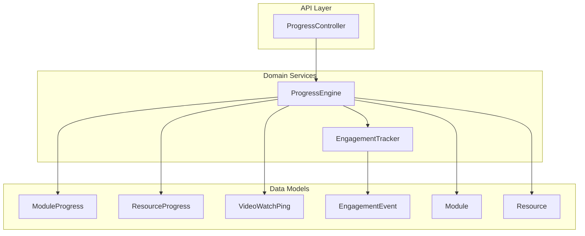
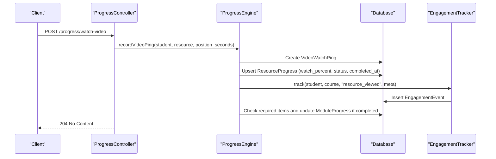
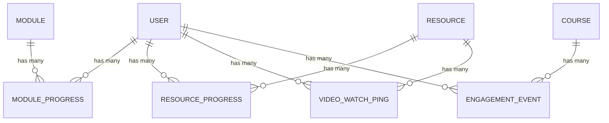
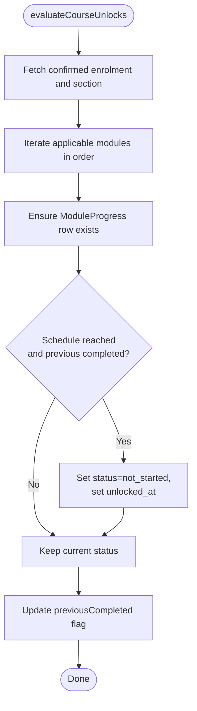
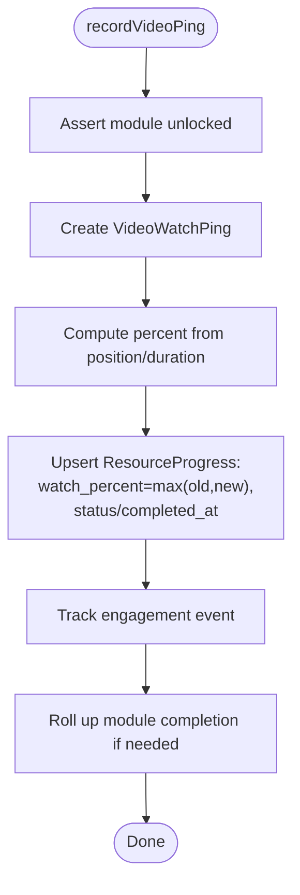
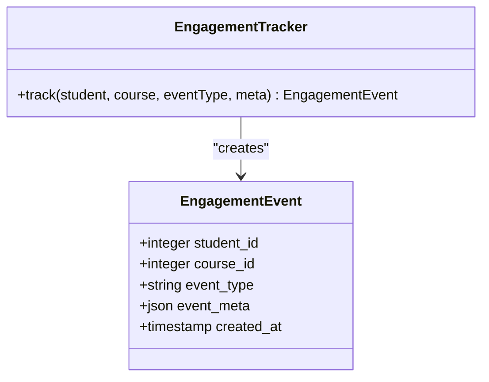
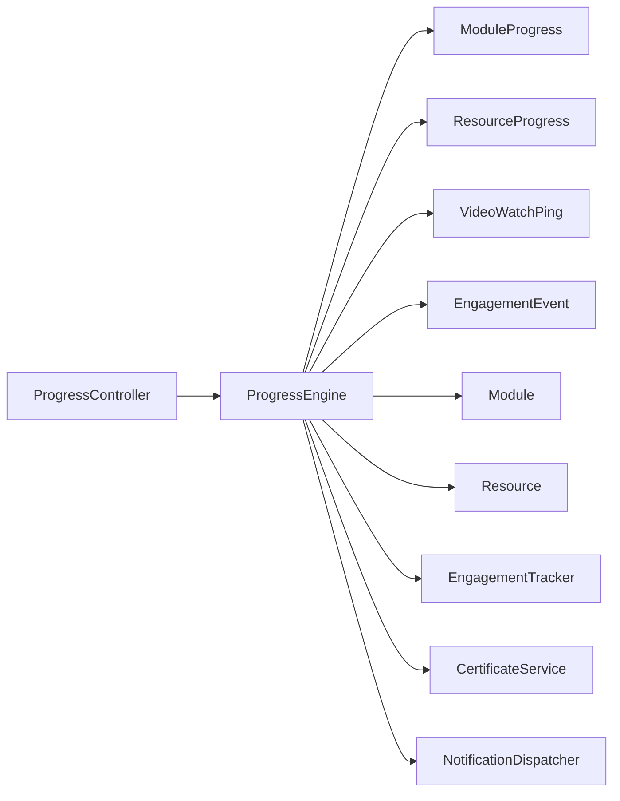

# Progress Tracking

<cite>
**Referenced Files in This Document**
- [ProgressEngine.php](file://app/Services/Progress/ProgressEngine.php)
- [ModuleProgress.php](file://app/Models/ModuleProgress.php)
- [ResourceProgress.php](file://app/Models/ResourceProgress.php)
- [VideoWatchPing.php](file://app/Models/VideoWatchPing.php)
- [EngagementEvent.php](file://app/Models/EngagementEvent.php)
- [Module.php](file://app/Models/Module.php)
- [Resource.php](file://app/Models/Resource.php)
- [ModuleProgressStatus.php](file://app/Enums/ModuleProgressStatus.php)
- [ResourceProgressStatus.php](file://app/Enums/ResourceProgressStatus.php)
- [ModuleItemType.php](file://app/Enums/ModuleItemType.php)
- [ProgressController.php](file://app/Http/Controllers/Api/V1/ProgressController.php)
- [EngagementTracker.php](file://app/Services/Analytics/EngagementTracker.php)
- [2024_01_01_000153_create_module_progress_table.php](file://database/migrations/2024_01_01_000153_create_module_progress_table.php)
- [2024_01_01_000151_create_resource_progress_table.php](file://database/migrations/2024_01_01_000151_create_resource_progress_table.php)
- [2024_01_01_000152_create_video_watch_pings_table.php](file://database/migrations/2024_01_01_000152_create_video_watch_pings_table.php)
- [2024_01_01_000190_create_engagement_events_table.php](file://database/migrations/2024_01_01_000190_create_engagement_events_table.php)
</cite>

## Table of Contents
1. [Introduction](#introduction)
2. [Project Structure](#project-structure)
3. [Core Components](#core-components)
4. [Architecture Overview](#architecture-overview)
5. [Detailed Component Analysis](#detailed-component-analysis)
6. [Dependency Analysis](#dependency-analysis)
7. [Performance Considerations](#performance-considerations)
8. [Troubleshooting Guide](#troubleshooting-guide)
9. [Conclusion](#conclusion)

## Introduction
This document explains the data model and logic behind student progress tracking in the system. It covers module progress, resource progress, video watch pings, and engagement events. It also details how completion percentages are calculated, how time-based tracking is recorded, and how engagement metrics relate to learning activities such as resources, assignments, evaluations, and live sessions.

## Project Structure
The progress tracking system centers on a small set of models and services:
- Models store per-student progress for modules and resources, video watch pings, and engagement events.
- The ProgressEngine computes unlocks and completion rollups based on resource signals and assessment outcomes.
- The ProgressController exposes API endpoints that delegate to the engine for writes and reads.
- Migrations define the database schema for progress tables and indexes.

**Diagram sources**
- [ProgressController.php](file://app/Http/Controllers/Api/V1/ProgressController.php)
- [ProgressEngine.php](file://app/Services/Progress/ProgressEngine.php)
- [EngagementTracker.php](file://app/Services/Analytics/EngagementTracker.php)
- [ModuleProgress.php](file://app/Models/ModuleProgress.php)
- [ResourceProgress.php](file://app/Models/ResourceProgress.php)
- [VideoWatchPing.php](file://app/Models/VideoWatchPing.php)
- [EngagementEvent.php](file://app/Models/EngagementEvent.php)
- [Module.php](file://app/Models/Module.php)
- [Resource.php](file://app/Models/Resource.php)

**Section sources**
- [ProgressController.php](file://app/Http/Controllers/Api/V1/ProgressController.php)
- [ProgressEngine.php](file://app/Services/Progress/ProgressEngine.php)
- [EngagementTracker.php](file://app/Services/Analytics/EngagementTracker.php)

## Core Components
- ModuleProgress: Tracks per-student status for each module (locked, not_started, in_progress, completed) with timestamps for unlock and completion.
- ResourceProgress: Tracks per-student status for each resource, including watch percentage for videos, mark-as-read/opened timestamps, and completion timestamp.
- VideoWatchPing: Records periodic position updates while watching a video; used to compute watch percentage.
- EngagementEvent: Stores course-scoped engagement events (e.g., resource_viewed) with metadata for analytics.

Key behaviors:
- Unlocking: A module becomes not_started when its schedule is reached and the previous applicable module is completed.
- Completion: A module completes when all required items are complete; then the next module may unlock.
- Resource completion rules vary by type (video watch threshold, mark-as-read/opened, attendance).

**Section sources**
- [ModuleProgress.php](file://app/Models/ModuleProgress.php)
- [ResourceProgress.php](file://app/Models/ResourceProgress.php)
- [VideoWatchPing.php](file://app/Models/VideoWatchPing.php)
- [EngagementEvent.php](file://app/Models/EngagementEvent.php)
- [ProgressEngine.php](file://app/Services/Progress/ProgressEngine.php)

## Architecture Overview
The system enforces a single source of truth for progress state via the ProgressEngine. Controllers accept requests and delegate to the engine, which updates models and triggers rollups and analytics.

**Diagram sources**
- [ProgressController.php](file://app/Http/Controllers/Api/V1/ProgressController.php)
- [ProgressEngine.php](file://app/Services/Progress/ProgressEngine.php)
- [EngagementTracker.php](file://app/Services/Analytics/EngagementTracker.php)
- [VideoWatchPing.php](file://app/Models/VideoWatchPing.php)
- [ResourceProgress.php](file://app/Models/ResourceProgress.php)
- [EngagementEvent.php](file://app/Models/EngagementEvent.php)

## Detailed Component Analysis

### Data Model Relationships

**Diagram sources**
- [ModuleProgress.php](file://app/Models/ModuleProgress.php)
- [ResourceProgress.php](file://app/Models/ResourceProgress.php)
- [VideoWatchPing.php](file://app/Models/VideoWatchPing.php)
- [EngagementEvent.php](file://app/Models/EngagementEvent.php)
- [Module.php](file://app/Models/Module.php)
- [Resource.php](file://app/Models/Resource.php)

**Section sources**
- [ModuleProgress.php](file://app/Models/ModuleProgress.php)
- [ResourceProgress.php](file://app/Models/ResourceProgress.php)
- [VideoWatchPing.php](file://app/Models/VideoWatchPing.php)
- [EngagementEvent.php](file://app/Models/EngagementEvent.php)

### Module Progress
- Purpose: Track per-student module lifecycle and completion.
- Fields: student_id, module_id, status, unlocked_at, completed_at.
- Statuses: locked, not_started, in_progress, completed.
- Behavior:
  - evaluateCourseUnlocks ensures schedule and predecessor completion before unlocking.
  - rollupModuleCompletion marks a module completed when all required items are done and may unlock subsequent modules.
  - Applicable modules consider group membership and ordering.

**Diagram sources**
- [ProgressEngine.php](file://app/Services/Progress/ProgressEngine.php)
- [ModuleProgress.php](file://app/Models/ModuleProgress.php)
- [Module.php](file://app/Models/Module.php)

**Section sources**
- [ProgressEngine.php](file://app/Services/Progress/ProgressEngine.php)
- [ModuleProgress.php](file://app/Models/ModuleProgress.php)
- [Module.php](file://app/Models/Module.php)

### Resource Progress and Video Watch Pings
- ResourceProgress:
  - Tracks per-student resource consumption with status, watch_percent (for videos), marked_read_at, opened_at, and completed_at.
  - Completion depends on resource type:
    - Video: watch_percent >= 90%
    - Document/Reading/SCORM: marked_read_at present
    - ExternalLink/DownloadableFile: opened_at present
    - LiveSession: attendance attended = true
- VideoWatchPing:
  - Records position_seconds at intervals during playback.
  - Used to compute watch_percent against the resource’s duration.

**Diagram sources**
- [ProgressEngine.php](file://app/Services/Progress/ProgressEngine.php)
- [VideoWatchPing.php](file://app/Models/VideoWatchPing.php)
- [ResourceProgress.php](file://app/Models/ResourceProgress.php)

**Section sources**
- [ProgressEngine.php](file://app/Services/Progress/ProgressEngine.php)
- [VideoWatchPing.php](file://app/Models/VideoWatchPing.php)
- [ResourceProgress.php](file://app/Models/ResourceProgress.php)

### Engagement Events
- Purpose: Record course-scoped user interactions for analytics dashboards.
- Fields: student_id, course_id, event_type, event_meta, created_at.
- Usage: Triggered when resources are viewed or assessments are submitted/attempted.

**Diagram sources**
- [EngagementEvent.php](file://app/Models/EngagementEvent.php)
- [EngagementTracker.php](file://app/Services/Analytics/EngagementTracker.php)

**Section sources**
- [EngagementEvent.php](file://app/Models/EngagementEvent.php)
- [EngagementTracker.php](file://app/Services/Analytics/EngagementTracker.php)

### API Entry Points
- GET /progress/course/{course}: Evaluates unlocks and returns per-module progress for the authenticated student.
- GET /progress/dashboard: Returns per-enrolment course-level status, percent_complete, modules, and certificate info.
- POST /progress/resources/{resource}/watch-video: Records video ping and updates progress.
- POST /progress/resources/{resource}/mark-read: Marks document/reading/SCORM as read.
- POST /progress/resources/{resource}/mark-opened: Marks external link/downloadable file as opened.
- POST /progress/resources/{resource}/mark-attendance: Records live session attendance.

All write endpoints delegate to ProgressEngine methods to ensure consistent state transitions and rollups.

**Section sources**
- [ProgressController.php](file://app/Http/Controllers/Api/V1/ProgressController.php)
- [ProgressEngine.php](file://app/Services/Progress/ProgressEngine.php)

## Dependency Analysis
- ProgressController depends on ProgressEngine for all progress-related business logic.
- ProgressEngine depends on:
  - Models: ModuleProgress, ResourceProgress, VideoWatchPing, EngagementEvent, Module, Resource, plus assessment and attendance models.
  - Services: EngagementTracker for analytics, CertificateService for issuing certificates, NotificationDispatcher for unlock notifications.
- Enums define strict states for module and resource progress and item types.

**Diagram sources**
- [ProgressController.php](file://app/Http/Controllers/Api/V1/ProgressController.php)
- [ProgressEngine.php](file://app/Services/Progress/ProgressEngine.php)
- [EngagementTracker.php](file://app/Services/Analytics/EngagementTracker.php)

**Section sources**
- [ProgressEngine.php](file://app/Services/Progress/ProgressEngine.php)
- [ModuleProgressStatus.php](file://app/Enums/ModuleProgressStatus.php)
- [ResourceProgressStatus.php](file://app/Enums/ResourceProgressStatus.php)
- [ModuleItemType.php](file://app/Enums/ModuleItemType.php)

## Performance Considerations
- Use unique constraints on progress rows to avoid duplicates and reduce contention.
- Indexes on foreign keys and composite filters (student/resource, course/event_type) support efficient queries.
- Batch operations:
  - evaluateCourseUnlocks iterates applicable modules once per course view; keep it idempotent and minimal.
  - Video pings should be throttled client-side to avoid excessive writes; server stores only latest watch_percent.
- Avoid N+1 queries when computing dashboard metrics; eager-load relationships where possible.

[No sources needed since this section provides general guidance]

## Troubleshooting Guide
Common issues and checks:
- Module remains locked:
  - Verify schedule conditions (scheduled_start_at or section start_date + unlock_offset_days) and that the previous applicable module is completed.
  - Confirm the student belongs to any required module groups.
- Resource not completing:
  - For videos, ensure watch_percent reaches the required threshold and that duration is set.
  - For documents/readings/SCORM, confirm mark-as-read was recorded.
  - For external links/downloadable files, confirm opened_at is set.
  - For live sessions, verify attendance is marked attended.
- Analytics missing:
  - Ensure engagement events are being tracked through the tracker after resource actions.
- Dashboard percentages:
  - Percent complete is derived from completed vs total applicable modules; check applicable module filtering and statuses.

**Section sources**
- [ProgressEngine.php](file://app/Services/Progress/ProgressEngine.php)
- [ProgressController.php](file://app/Http/Controllers/Api/V1/ProgressController.php)

## Conclusion
The progress tracking system centralizes state management in the ProgressEngine, ensuring consistent unlocking and completion across modules and resources. Student progress is captured via dedicated models for modules, resources, video pings, and engagement events. Completion thresholds and time-based scheduling drive module progression, while engagement events feed analytics. The design supports extensibility for new resource types and assessment mechanisms while maintaining clear boundaries between API, service, and data layers.