# Supporting Entities

<cite>
**Referenced Files in This Document**
- [Certificate.php](file://app/Models/Certificate.php)
- [Notification.php](file://app/Models/Notification.php)
- [AuditLog.php](file://app/Models/AuditLog.php)
- [Order.php](file://app/Models/Order.php)
- [PaymentSubmission.php](file://app/Models/PaymentSubmission.php)
- [CertificateService.php](file://app/Services/Certification/CertificateService.php)
- [NotificationDispatcher.php](file://app/Services/Notifications/NotificationDispatcher.php)
- [AuditLogger.php](file://app/Services/Audit/AuditLogger.php)
- [PaymentSubmissionService.php](file://app/Services/Payments/PaymentSubmissionService.php)
- [2024_01_01_000160_create_certificates_table.php](file://database/migrations/2024_01_01_000160_create_certificates_table.php)
- [2024_01_01_000180_create_notifications_table.php](file://database/migrations/2024_01_01_000180_create_notifications_table.php)
- [2024_01_01_000191_create_audit_logs_table.php](file://database/migrations/2024_01_01_000191_create_audit_logs_table.php)
- [2024_01_01_000070_create_orders_table.php](file://database/migrations/2024_01_01_000070_create_orders_table.php)
- [2026_07_22_140000_create_payment_submissions_table.php](file://database/migrations/2026_07_22_140000_create_payment_submissions_table.php)
- [CertificateController.php](file://app/Http/Controllers/Api/V1/CertificateController.php)
</cite>

## Table of Contents
1. Introduction
2. Project Structure
3. Core Components
4. Architecture Overview
5. Detailed Component Analysis
6. Dependency Analysis
7. Performance Considerations
8. Troubleshooting Guide
9. Data Retention and Compliance
10. Conclusion

## Introduction
This document describes the data models and supporting systems for certificates, notifications, audit logs, orders, and payment submissions in ResNet Academy. It explains how certificates are generated and verified, how notifications are delivered, how audit trails are maintained, and how financial transactions are tracked. It also outlines data retention considerations and compliance implications for these components.

## Project Structure
The supporting entities span Eloquent models, services, controllers, and database migrations:
- Models define persistent schemas and relationships for certificates, notifications, audit logs, orders, and payment submissions.
- Services encapsulate business logic for issuing certificates, dispatching notifications, logging audits, and processing payments.
- Controllers expose API endpoints for certificate listing and verification.
- Migrations define table structures, constraints, and indexes.

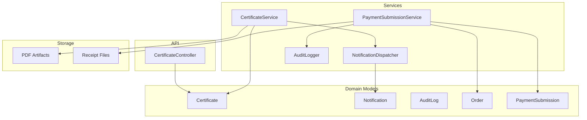

**Diagram sources**
- [Certificate.php:12-45](file://app/Models/Certificate.php#L12-L45)
- [Notification.php:13-44](file://app/Models/Notification.php#L13-L44)
- [AuditLog.php:12-37](file://app/Models/AuditLog.php#L12-L37)
- [Order.php:16-100](file://app/Models/Order.php#L16-L100)
- [PaymentSubmission.php:13-49](file://app/Models/PaymentSubmission.php#L13-L49)
- [CertificateService.php:19-46](file://app/Services/Certification/CertificateService.php#L19-L46)
- [NotificationDispatcher.php:25-205](file://app/Services/Notifications/NotificationDispatcher.php#L25-L205)
- [AuditLogger.php:13-28](file://app/Services/Audit/AuditLogger.php#L13-L28)
- [PaymentSubmissionService.php:20-109](file://app/Services/Payments/PaymentSubmissionService.php#L20-L109)
- [CertificateController.php:14-47](file://app/Http/Controllers/Api/V1/CertificateController.php#L14-L47)

**Section sources**
- [Certificate.php:12-45](file://app/Models/Certificate.php#L12-L45)
- [Notification.php:13-44](file://app/Models/Notification.php#L13-L44)
- [AuditLog.php:12-37](file://app/Models/AuditLog.php#L12-L37)
- [Order.php:16-100](file://app/Models/Order.php#L16-L100)
- [PaymentSubmission.php:13-49](file://app/Models/PaymentSubmission.php#L13-L49)
- [CertificateService.php:19-46](file://app/Services/Certification/CertificateService.php#L19-L46)
- [NotificationDispatcher.php:25-205](file://app/Services/Notifications/NotificationDispatcher.php#L25-L205)
- [AuditLogger.php:13-28](file://app/Services/Audit/AuditLogger.php#L13-L28)
- [PaymentSubmissionService.php:20-109](file://app/Services/Payments/PaymentSubmissionService.php#L20-L109)
- [CertificateController.php:14-47](file://app/Http/Controllers/Api/V1/CertificateController.php#L14-L47)

## Core Components
- Certificate: Represents a completed course credential with unique number and issuance timestamp; linked to student and course.
- Notification: Stores in-app messages with channel, type, title, body, related entity references, read status, and sent time.
- AuditLog: Immutable record of sensitive actions including actor, action name, target entity, and metadata.
- Order: Financial order for a course enrollment with amount, currency, status, payment method, provider reference, and paid timestamp.
- PaymentSubmission: Student-submitted proof of payment with amount, receipt storage path, status, and review details.

Key behaviors:
- Certificate generation is idempotent per student+course and triggers asynchronous PDF creation and an in-app notification.
- Notifications are created via a single dispatcher that centralizes write paths.
- Audit logs are written through a centralized logger for consistent tracking.
- Orders derive their status from cumulative payments; payment submissions are reviewed by admins and audited.

**Section sources**
- [Certificate.php:12-45](file://app/Models/Certificate.php#L12-L45)
- [Notification.php:13-44](file://app/Models/Notification.php#L13-L44)
- [AuditLog.php:12-37](file://app/Models/AuditLog.php#L12-L37)
- [Order.php:16-100](file://app/Models/Order.php#L16-L100)
- [PaymentSubmission.php:13-49](file://app/Models/PaymentSubmission.php#L13-L49)
- [CertificateService.php:19-46](file://app/Services/Certification/CertificateService.php#L19-L46)
- [NotificationDispatcher.php:25-205](file://app/Services/Notifications/NotificationDispatcher.php#L25-L205)
- [AuditLogger.php:13-28](file://app/Services/Audit/AuditLogger.php#L13-L28)
- [PaymentSubmissionService.php:20-109](file://app/Services/Payments/PaymentSubmissionService.php#L20-L109)

## Architecture Overview
The supporting systems follow clear separation of concerns:
- Controllers handle HTTP requests and authorization.
- Services implement domain rules and orchestrate side effects (jobs, storage, notifications).
- Models define data shapes and relationships.
- Migrations enforce schema integrity and indexing.

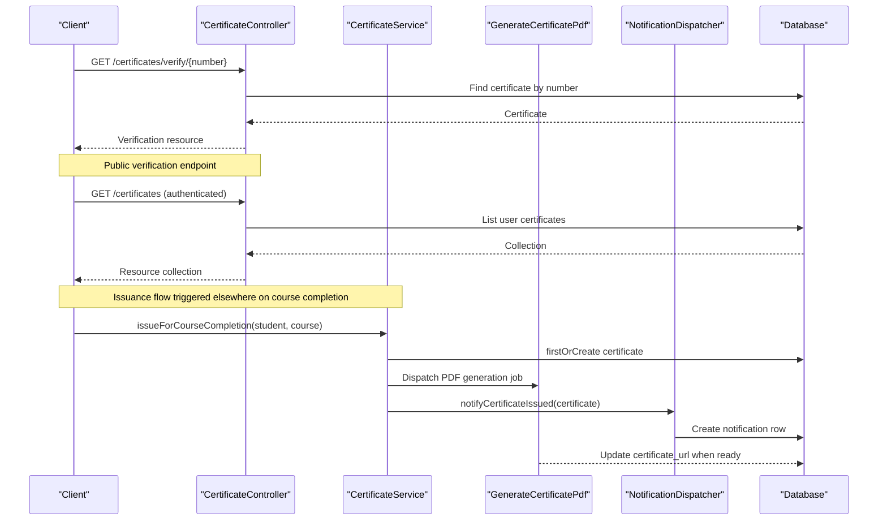

**Diagram sources**
- [CertificateController.php:16-47](file://app/Http/Controllers/Api/V1/CertificateController.php#L16-L47)
- [CertificateService.php:23-46](file://app/Services/Certification/CertificateService.php#L23-L46)
- [NotificationDispatcher.php:66-76](file://app/Services/Notifications/NotificationDispatcher.php#L66-L76)

## Detailed Component Analysis

### Certificates
- Data model: Links student and course, stores unique certificate number, optional URL, and issuance timestamp. Unique constraints ensure one certificate per student-course pair and globally unique numbers.
- Generation: Idempotent creation via firstOrCreate; if newly created, dispatches an async PDF generation job and sends an in-app notification.
- Verification: Public endpoint allows anyone to verify a certificate by its number without authentication.

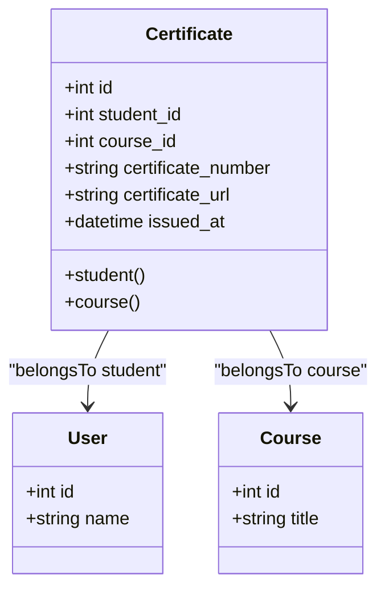

**Diagram sources**
- [Certificate.php:12-45](file://app/Models/Certificate.php#L12-L45)

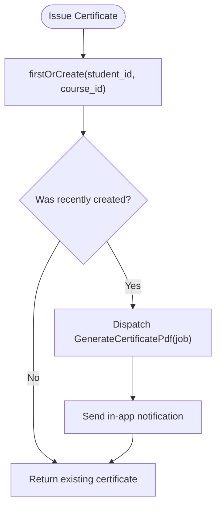

**Diagram sources**
- [CertificateService.php:23-46](file://app/Services/Certification/CertificateService.php#L23-L46)

**Section sources**
- [Certificate.php:12-45](file://app/Models/Certificate.php#L12-L45)
- [CertificateService.php:23-46](file://app/Services/Certification/CertificateService.php#L23-L46)
- [CertificateController.php:16-47](file://app/Http/Controllers/Api/V1/CertificateController.php#L16-L47)
- [2024_01_01_000160_create_certificates_table.php:11-23](file://database/migrations/2024_01_01_000160_create_certificates_table.php#L11-L23)

### Notifications
- Data model: Stores recipient, channel, type, title, body, related entity references, read flag, and sent timestamp. Indexes optimize queries by user and read status.
- Delivery: Centralized dispatcher writes in-app notifications and provides methods for various events (course updates, certificate issuance, messages, tickets, forum activity, grades, module unlocks, at-risk reminders).

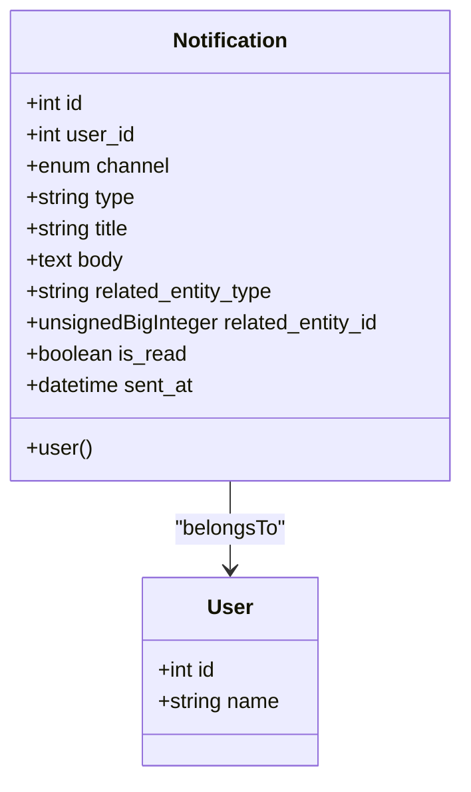

**Diagram sources**
- [Notification.php:13-44](file://app/Models/Notification.php#L13-L44)

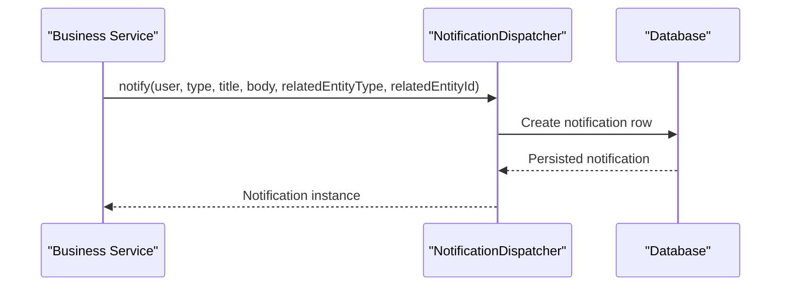

**Diagram sources**
- [NotificationDispatcher.php:27-39](file://app/Services/Notifications/NotificationDispatcher.php#L27-L39)

**Section sources**
- [Notification.php:13-44](file://app/Models/Notification.php#L13-L44)
- [NotificationDispatcher.php:25-205](file://app/Services/Notifications/NotificationDispatcher.php#L25-L205)
- [2024_01_01_000180_create_notifications_table.php:11-26](file://database/migrations/2024_01_01_000180_create_notifications_table.php#L11-L26)

### Audit Logs
- Data model: Records actor (nullable for system actions), action name, target entity type/id, and JSON metadata. Indexed for efficient lookups by entity.
- Logging: Single write path ensures consistency across sensitive mutations such as payment confirmations/rejections.

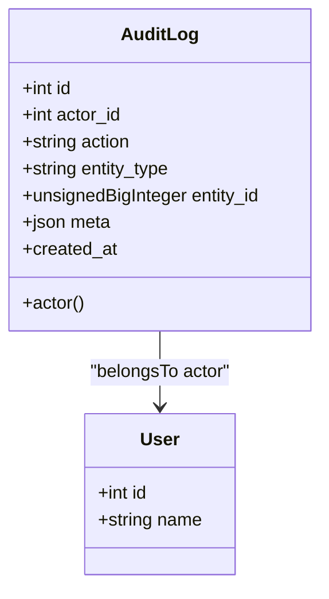

**Diagram sources**
- [AuditLog.php:12-37](file://app/Models/AuditLog.php#L12-L37)

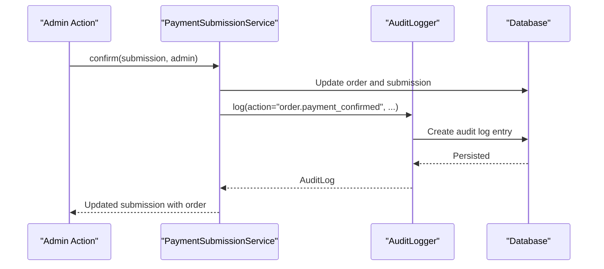

**Diagram sources**
- [PaymentSubmissionService.php:56-86](file://app/Services/Payments/PaymentSubmissionService.php#L56-L86)
- [AuditLogger.php:18-27](file://app/Services/Audit/AuditLogger.php#L18-L27)

**Section sources**
- [AuditLog.php:12-37](file://app/Models/AuditLog.php#L12-L37)
- [AuditLogger.php:13-28](file://app/Services/Audit/AuditLogger.php#L13-L28)
- [2024_01_01_000191_create_audit_logs_table.php:11-23](file://database/migrations/2024_01_01_000191_create_audit_logs_table.php#L11-L23)

### Orders and Payment Submissions
- Order: Tracks course purchase intent and fulfillment with amount, currency, status, payment method, external provider reference, and paid timestamp. Status is derived from cumulative payments.
- PaymentSubmission: Captures student-provided payment evidence with amount, receipt file path, status, and review details. Enforces one pending submission per order.

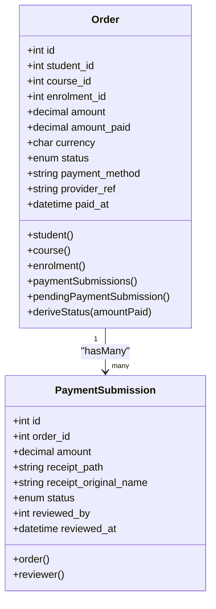

**Diagram sources**
- [Order.php:16-100](file://app/Models/Order.php#L16-L100)
- [PaymentSubmission.php:13-49](file://app/Models/PaymentSubmission.php#L13-L49)

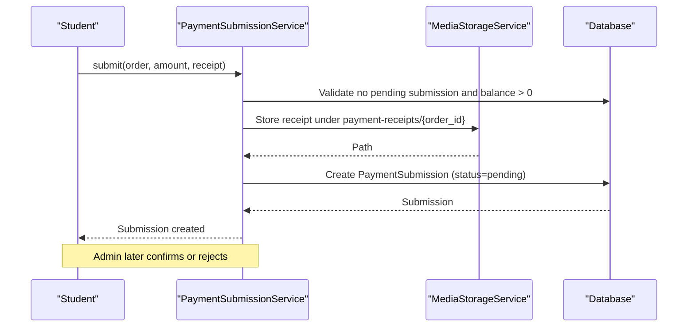

**Diagram sources**
- [PaymentSubmissionService.php:27-54](file://app/Services/Payments/PaymentSubmissionService.php#L27-L54)

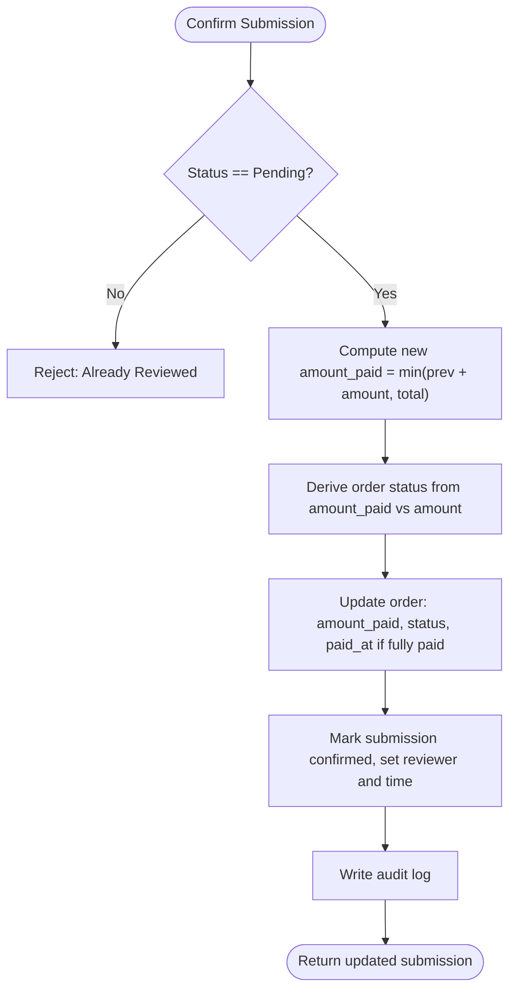

**Diagram sources**
- [PaymentSubmissionService.php:56-86](file://app/Services/Payments/PaymentSubmissionService.php#L56-L86)
- [Order.php:87-99](file://app/Models/Order.php#L87-L99)

**Section sources**
- [Order.php:16-100](file://app/Models/Order.php#L16-L100)
- [PaymentSubmission.php:13-49](file://app/Models/PaymentSubmission.php#L13-L49)
- [PaymentSubmissionService.php:20-109](file://app/Services/Payments/PaymentSubmissionService.php#L20-L109)
- [2024_01_01_000070_create_orders_table.php:11-27](file://database/migrations/2024_01_01_000070_create_orders_table.php#L11-L27)
- [2026_07_22_140000_create_payment_submissions_table.php:11-23](file://database/migrations/2026_07_22_140000_create_payment_submissions_table.php#L11-L23)

## Dependency Analysis
- CertificateService depends on NotificationDispatcher and a job queue for PDF generation.
- NotificationDispatcher writes to the notifications table and may fan out to multiple users based on course enrollments.
- PaymentSubmissionService depends on MediaStorageService for receipts and AuditLogger for immutable records.
- Order derives status from cumulative payments; PaymentSubmission ties back to Order and can be reviewed by Users.

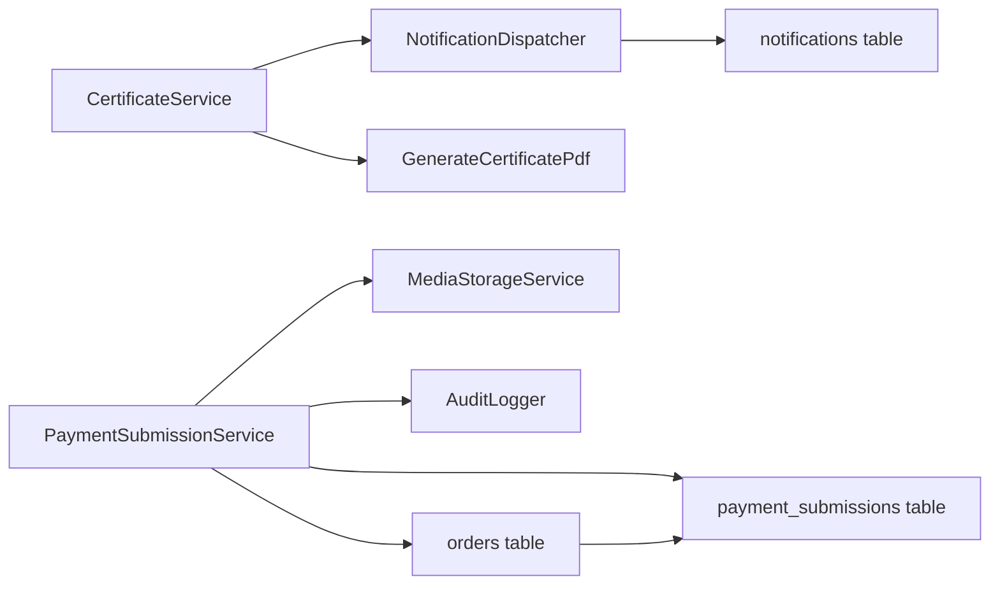

**Diagram sources**
- [CertificateService.php:23-46](file://app/Services/Certification/CertificateService.php#L23-L46)
- [NotificationDispatcher.php:25-205](file://app/Services/Notifications/NotificationDispatcher.php#L25-L205)
- [PaymentSubmissionService.php:20-109](file://app/Services/Payments/PaymentSubmissionService.php#L20-L109)
- [AuditLogger.php:13-28](file://app/Services/Audit/AuditLogger.php#L13-L28)

**Section sources**
- [CertificateService.php:23-46](file://app/Services/Certification/CertificateService.php#L23-L46)
- [NotificationDispatcher.php:25-205](file://app/Services/Notifications/NotificationDispatcher.php#L25-L205)
- [PaymentSubmissionService.php:20-109](file://app/Services/Payments/PaymentSubmissionService.php#L20-L109)
- [AuditLogger.php:13-28](file://app/Services/Audit/AuditLogger.php#L13-L28)

## Performance Considerations
- Use indexes on frequently queried columns:
  - notifications.user_id and is_read for inbox queries.
  - audit_logs.entity_type and entity_id for entity-centric histories.
  - orders.student_id and course_id for reporting and filtering.
- Keep certificate issuance synchronous for idempotency; offload PDF rendering to background jobs to avoid request latency.
- Avoid redundant notifications by using centralized dispatcher methods.
- For large cohorts, batch operations where possible (e.g., notifying all enrolled students) and consider queueing heavy workloads.

[No sources needed since this section provides general guidance]

## Troubleshooting Guide
Common issues and resolutions:
- Duplicate payment submission attempts: The service prevents multiple pending submissions per order; return a validation error if attempted.
- Overpayment attempts: Validation enforces that submitted amounts do not exceed remaining balance.
- Already reviewed submissions: Confirm and reject operations guard against non-pending states.
- Missing audit trail: Ensure all sensitive mutations go through the centralized audit logger to maintain consistent records.
- Certificate not verifiable: Verify that certificate_number is unique and persisted; public verification requires the exact number.

Operational checks:
- Confirm database constraints are applied (unique keys, foreign keys).
- Verify queues are running for background jobs like PDF generation.
- Inspect notifications table for missing entries after events.
- Review audit_logs for discrepancies in order state changes.

**Section sources**
- [PaymentSubmissionService.php:27-54](file://app/Services/Payments/PaymentSubmissionService.php#L27-L54)
- [PaymentSubmissionService.php:56-86](file://app/Services/Payments/PaymentSubmissionService.php#L56-L86)
- [PaymentSubmissionService.php:88-107](file://app/Services/Payments/PaymentSubmissionService.php#L88-L107)
- [CertificateController.php:34-47](file://app/Http/Controllers/Api/V1/CertificateController.php#L34-L47)
- [2024_01_01_000160_create_certificates_table.php:11-23](file://database/migrations/2024_01_01_000160_create_certificates_table.php#L11-L23)

## Data Retention and Compliance
Retention policies and compliance considerations:
- Certificates:
  - Retain indefinitely for alumni verification and historical records.
  - Protect certificate_url and any personal data in resources behind appropriate access controls.
  - Ensure certificate_number uniqueness and immutability once issued.
- Notifications:
  - Implement lifecycle management to archive or purge old in-app notifications while preserving recent history for user experience.
  - Respect user preferences and consent for channels beyond in-app (email, SMS, push) when extended.
- Audit Logs:
  - Retain indefinitely or per regulatory requirements; they are critical for compliance and incident response.
  - Restrict access to audit logs to authorized roles; protect sensitive metadata.
- Orders and Payment Submissions:
  - Retain financial records per accounting and tax regulations; include receipts and review artifacts.
  - Securely store receipt files and restrict access; sanitize filenames and validate uploads.
  - Maintain immutable audit trails for all payment state transitions.
- Privacy and Security:
  - Minimize personal data exposure in public endpoints (e.g., verification returns only necessary fields).
  - Enforce authorization checks for private endpoints and administrative actions.
  - Encrypt sensitive data at rest and in transit where applicable.

[No sources needed since this section provides general guidance]

## Conclusion
ResNet Academy’s supporting entities provide a robust foundation for credentials, communication, compliance, and financial tracking. Certificates are issued reliably with asynchronous PDF generation and immediate in-app notifications. Notifications are centralized for consistency and scalability. Audit logs ensure traceability for sensitive operations. Orders and payment submissions enforce business rules, secure storage, and comprehensive auditing. Adhering to the recommended retention and compliance practices will help maintain trust, legal adherence, and operational reliability.

[No sources needed since this section summarizes without analyzing specific files]