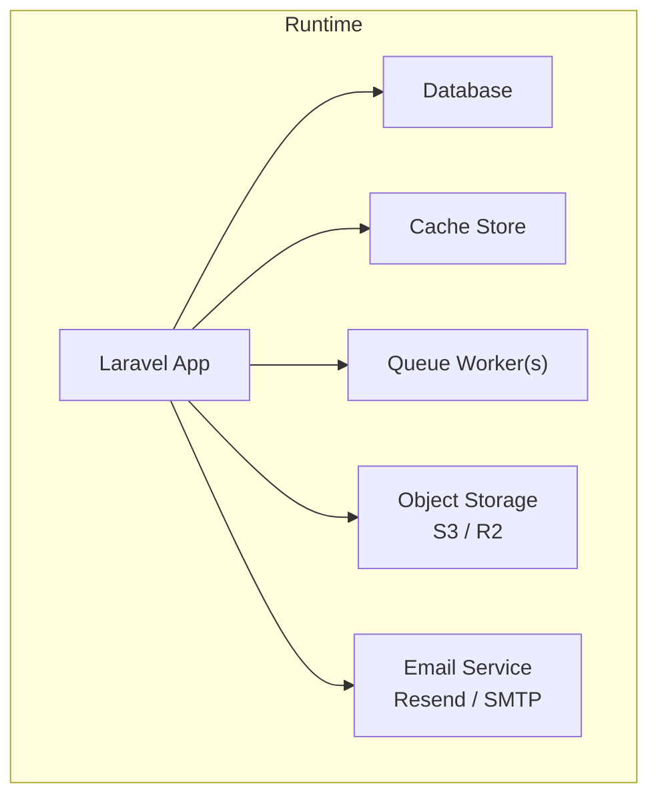
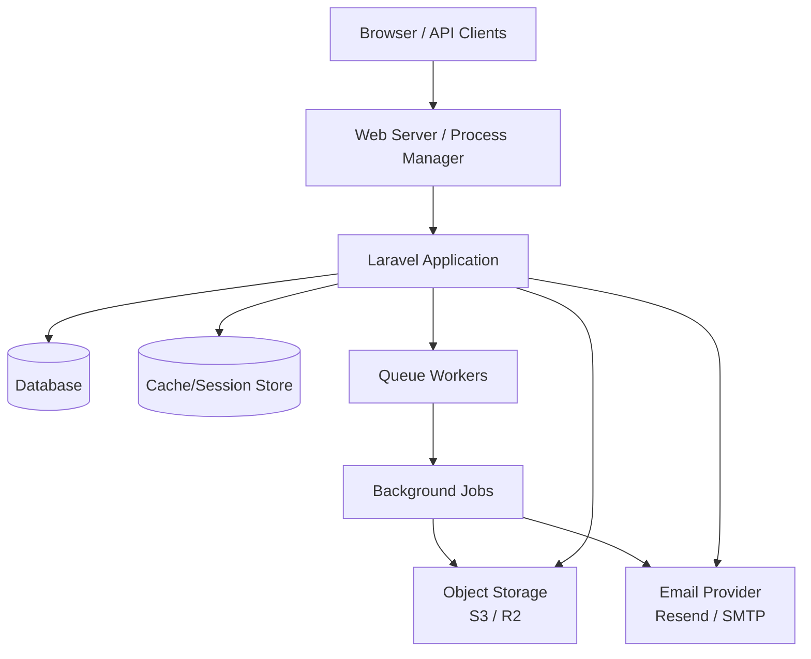
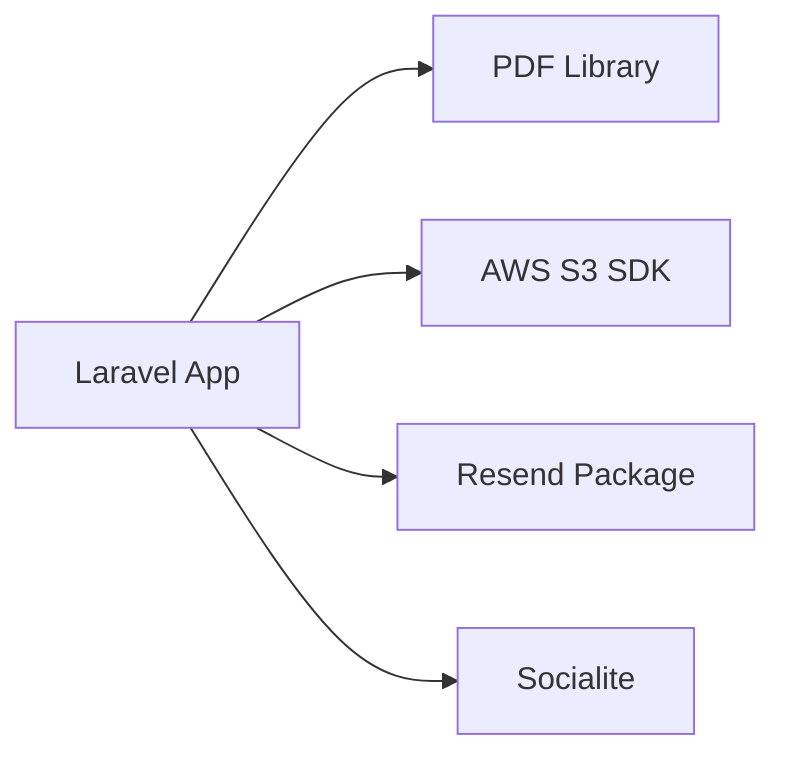

# Deployment & DevOps

<cite>
**Referenced Files in This Document**
- [app.php](file://config/app.php)
- [database.php](file://config/database.php)
- [filesystems.php](file://config/filesystems.php)
- [mail.php](file://config/mail.php)
- [queue.php](file://config/queue.php)
- [logging.php](file://config/logging.php)
- [session.php](file://config/session.php)
- [cache.php](file://config/cache.php)
- [services.php](file://config/services.php)
- [composer.json](file://composer.json)
- [.env.example](file://.env.example)
</cite>

## Table of Contents
1. [Introduction](#introduction)
2. [Project Structure](#project-structure)
3. [Core Components](#core-components)
4. [Architecture Overview](#architecture-overview)
5. [Detailed Component Analysis](#detailed-component-analysis)
6. [Dependency Analysis](#dependency-analysis)
7. [Performance Considerations](#performance-considerations)
8. [Troubleshooting Guide](#troubleshooting-guide)
9. [Conclusion](#conclusion)
10. [Appendices](#appendices)

## Introduction
This document provides comprehensive deployment and DevOps guidance for the ResNet Academy LMS. It covers environment configuration, production deployment strategies, CI/CD pipeline setup, monitoring approaches, server requirements, database setup, file storage (AWS S3 and Cloudflare R2), email service integration (Resend), queue processing, backup strategies, log management, performance monitoring, containerization, cloud deployment, and maintenance procedures. The guidance is grounded in the application’s configuration files and dependencies to ensure accurate, actionable instructions.

## Project Structure
The application follows a standard Laravel structure with a separate frontend build. Key deployment-relevant areas include:
- Configuration under config/ for app behavior, database, caching, sessions, queues, logging, filesystems, mail, and third-party services.
- Environment variables defined via .env.example.
- Composer-managed PHP dependencies and scripts for setup and development.
- Frontend assets built into a static distribution consumed by the web server.

[No sources needed since this diagram shows conceptual workflow, not actual code structure]

**Section sources**
- [composer.json:45-76](file://composer.json#L45-L76)
- [.env.example:1-89](file://.env.example#L1-L89)

## Core Components
- Application runtime and environment: name, URL, debug mode, timezone, locale, encryption key, maintenance driver.
- Database connections: SQLite, MySQL/MariaDB, PostgreSQL, SQL Server; Redis connections for cache and queue.
- Filesystem disks: local public/private, AWS S3, Cloudflare R2 (S3-compatible).
- Email: multiple mailers including Resend and SMTP; global from address.
- Queues: default connection and backends (database, redis, SQS, beanstalkd); job batching and failed jobs handling.
- Logging: channels (single, daily, stderr, syslog, papertrail, slack) and levels.
- Sessions and cache: drivers and stores configurable via environment.

**Section sources**
- [app.php:15-137](file://config/app.php#L15-L137)
- [database.php:20-182](file://config/database.php#L20-L182)
- [filesystems.php:16-88](file://config/filesystems.php#L16-L88)
- [mail.php:17-116](file://config/mail.php#L17-L116)
- [queue.php:16-127](file://config/queue.php#L16-L127)
- [logging.php:21-130](file://config/logging.php#L21-L130)
- [session.php:21-215](file://config/session.php#L21-L215)
- [cache.php:18-116](file://config/cache.php#L18-L116)
- [services.php:17-42](file://config/services.php#L17-L42)

## Architecture Overview
The LMS runs as a stateless PHP application behind a web server or process manager. It persists data to a relational database, uses an object store for media, sends emails via a transactional provider, and offloads background work to queues. Caching and sessions can be backed by Redis or the database.

[No sources needed since this diagram shows conceptual workflow, not actual code structure]

## Detailed Component Analysis

### Environment Configuration
- Application identity and runtime: name, environment, debug flag, base URL, frontend URL, timezone, locale, encryption key, previous keys, maintenance driver/store.
- Session settings: driver, lifetime, encryption, path/domain, secure/http_only/same_site/partitioned cookie flags.
- Cache defaults and stores: database/file/memcached/redis/dynamodb/octane/failover; prefixing strategy.
- Services integrations: Resend API key, Google OAuth client details.

Operational notes:
- Ensure APP_KEY is set and rotated carefully using APP_PREVIOUS_KEYS during rotation.
- Set APP_ENV=production and APP_DEBUG=false in production.
- Configure SESSION_* according to your session backend (database vs redis).
- Use consistent CACHE_STORE and REDIS_* if leveraging Redis for cache/sessions.

**Section sources**
- [app.php:15-137](file://config/app.php#L15-L137)
- [session.php:21-215](file://config/session.php#L21-L215)
- [cache.php:18-116](file://config/cache.php#L18-L116)
- [services.php:17-42](file://config/services.php#L17-L42)
- [.env.example:1-89](file://.env.example#L1-L89)

### Database Setup and Scaling
- Supported drivers: sqlite, mysql/mariadb, pgsql, sqlsrv.
- Connection options include SSL CA for MySQL, charset/collation, strict mode, search_path for Postgres.
- Redis configured for both default and cache connections with retry/backoff tuning.

Production recommendations:
- Use managed MySQL/MariaDB or PostgreSQL with SSL enabled where supported.
- Enable foreign key constraints and appropriate collations.
- For high concurrency, consider Redis-backed cache and sessions.
- Back up databases regularly and test restores.

**Section sources**
- [database.php:20-182](file://config/database.php#L20-L182)
- [.env.example:23-48](file://.env.example#L23-L48)

### File Storage Configuration (AWS S3 and Cloudflare R2)
- Default disk selection and local public/private roots.
- S3 disk with key/secret/region/bucket/url/endpoint/path-style endpoint toggles.
- R2 disk with S3-compatible settings, region auto, and explicit note that videos are hosted separately on Bunny Stream.

Production recommendations:
- Prefer object storage for uploads, certificates, receipts, and attachments.
- Use signed URLs or CDN domains for public access.
- Ensure IAM policies restrict bucket access to required actions only.
- Keep Bunny Stream credentials separate for video hosting.

**Section sources**
- [filesystems.php:16-88](file://config/filesystems.php#L16-L88)
- [.env.example:59-78](file://.env.example#L59-L78)

### Email Service Integration (Resend and SMTP)
- Default mailer selectable; supports resend, smtp, ses, postmark, sendmail, log, array, failover, roundrobin.
- Global from address and name derived from environment.
- Resend integration via services configuration.

Production recommendations:
- Use Resend for transactional email in production; configure RESEND_API_KEY.
- For SMTP, set scheme/host/port/credentials and consider TLS.
- Use failover/roundrobin patterns for resilience if sending via multiple providers.

**Section sources**
- [mail.php:17-116](file://config/mail.php#L17-L116)
- [services.php:17-42](file://config/services.php#L17-L42)
- [.env.example:50-81](file://.env.example#L50-L81)

### Queue Processing
- Default queue connection and backends: sync, database, redis, sqs, beanstalkd, deferred, background, failover.
- Job batching table and failed jobs storage.

Production recommendations:
- Use Redis or SQS for scalable background processing.
- Run one or more queue workers per instance; tune retry_after and timeouts based on job durations.
- Monitor failed jobs and implement alerting.

**Section sources**
- [queue.php:16-127](file://config/queue.php#L16-L127)

### Logging and Monitoring
- Default channel stack; single/daily/stderr/syslog/papertrail/slack channels.
- Configurable log level and deprecations channel.

Production recommendations:
- Use daily rotation with retention policy or stream logs to centralized systems (stderr for containers, syslog/Papertrail).
- Route critical errors to Slack or PagerDuty via webhook integrations.
- Correlate request IDs across logs and metrics.

**Section sources**
- [logging.php:21-130](file://config/logging.php#L21-L130)

### Containerization and Runtime
- PHP version requirement and framework version pinned in composer.
- Scripts for setup, dev, testing, and asset publishing.

Container guidance:
- Base image: PHP 8.2+ with required extensions (PDO MySQL/PostgreSQL, Redis, OpenSSL, etc.).
- Install Composer dependencies, generate APP_KEY, run migrations, publish assets, and start the web server/process manager.
- Expose necessary ports and mount persistent volumes for storage/logs.
- Run queue workers as separate processes within the container or sidecar.

**Section sources**
- [composer.json:8-18](file://composer.json#L8-L18)
- [composer.json:45-76](file://composer.json#L45-L76)

### CI/CD Pipeline Setup
Recommended stages:
- Build frontend assets and install PHP dependencies.
- Run static analysis and tests.
- Build Docker image and push to registry.
- Deploy to staging, run smoke tests, then promote to production.
- Migrate database and clear caches on deploy.

Operational hooks:
- Use composer scripts for setup and asset publishing.
- Ensure environment-specific secrets are injected at deploy time.
- Rollback strategy: keep previous image tag and revert migrations safely.

**Section sources**
- [composer.json:45-76](file://composer.json#L45-L76)

### Backup Strategies
- Database backups: schedule automated snapshots and retain per retention policy; verify restore procedures.
- Object storage: enable versioning and lifecycle rules; replicate across regions if needed.
- Logs: centralize and retain per compliance needs.
- Secrets: rotate keys and store securely in secret managers.

[No sources needed since this section provides general guidance]

### Performance Monitoring
- Metrics: request latency, error rates, queue depth, job throughput, DB query times, cache hit ratios.
- Observability: structured logs, distributed tracing, APM integration.
- Alerts: thresholds for error spikes, queue backlog, failed jobs, and resource saturation.

[No sources needed since this section provides general guidance]

### Scaling Considerations
- Horizontal scaling: run multiple application instances behind a load balancer; ensure statelessness.
- Database scaling: read replicas, connection pooling, query optimization.
- Cache/Session: use Redis for shared state across instances.
- Queues: scale workers independently; choose high-throughput backends like Redis/SQS.
- Storage: leverage object storage and CDN for static/media delivery.

[No sources needed since this section provides general guidance]

## Dependency Analysis
The application depends on external services and libraries that influence deployment:
- PHP runtime and Laravel framework.
- PDF generation library for certificates.
- AWS S3 SDK for object storage.
- Resend Laravel package for email.
- Socialite for OAuth.

**Diagram sources**
- [composer.json:8-18](file://composer.json#L8-L18)

**Section sources**
- [composer.json:8-18](file://composer.json#L8-L18)

## Performance Considerations
- Optimize database queries and add indexes where necessary.
- Use Redis for cache and sessions to reduce DB load.
- Offload heavy tasks to queues with appropriate concurrency.
- Serve static assets via CDN; compress responses.
- Tune PHP OPcache and worker processes.

[No sources needed since this section provides general guidance]

## Troubleshooting Guide
Common issues and checks:
- Missing APP_KEY: regenerate and ensure it is present in environment.
- Database connectivity: validate host, port, credentials, and SSL settings.
- File uploads failing: confirm object storage credentials and bucket permissions; verify storage link for local disk.
- Emails not sending: check mailer selection and provider credentials; inspect logs.
- Queue jobs stuck: review queue backend connectivity, retry_after, and failed jobs table.
- High memory usage: optimize jobs, increase worker limits, and monitor memory.

**Section sources**
- [app.php:100-119](file://config/app.php#L100-L119)
- [database.php:47-100](file://config/database.php#L47-L100)
- [filesystems.php:50-88](file://config/filesystems.php#L50-L88)
- [mail.php:17-116](file://config/mail.php#L17-L116)
- [queue.php:32-127](file://config/queue.php#L32-L127)
- [logging.php:53-130](file://config/logging.php#L53-L130)

## Conclusion
By aligning deployment practices with the application’s configuration and dependencies, you can achieve a reliable, scalable, and maintainable ResNet Academy LMS. Focus on secure environment management, robust backups, observability, and horizontal scaling. Validate each component in staging before production rollout and automate deployments through CI/CD pipelines.

[No sources needed since this section summarizes without analyzing specific files]

## Appendices

### Production Deployment Checklist
- Set APP_ENV=production, APP_DEBUG=false, and strong APP_KEY.
- Configure database with SSL and proper credentials.
- Select object storage (S3/R2) and set credentials; ensure bucket policies.
- Configure email provider (Resend or SMTP) and from address.
- Choose queue backend (Redis/SQS) and run workers.
- Set cache/session backend (Redis recommended).
- Configure logging to daily or centralized system; set log levels.
- Create storage symlinks if using local disk; otherwise rely on object storage.
- Run migrations and seeders as part of deploy pipeline.
- Verify health endpoints and perform smoke tests.

**Section sources**
- [app.php:15-137](file://config/app.php#L15-L137)
- [database.php:20-182](file://config/database.php#L20-L182)
- [filesystems.php:16-88](file://config/filesystems.php#L16-L88)
- [mail.php:17-116](file://config/mail.php#L17-L116)
- [queue.php:16-127](file://config/queue.php#L16-L127)
- [logging.php:21-130](file://config/logging.php#L21-L130)
- [composer.json:45-76](file://composer.json#L45-L76)

### Environment Variables Reference
Key variables to manage in your secret store:
- APP_NAME, APP_ENV, APP_KEY, APP_DEBUG, APP_URL, FRONTEND_URL
- DB_* and REDIS_* for database and cache/session
- FILESYSTEM_DISK, AWS_*, R2_* for storage
- MAIL_* and RESEND_API_KEY for email
- BUNNY_STREAM_* for video hosting
- GOOGLE_* for OAuth

**Section sources**
- [.env.example:1-89](file://.env.example#L1-L89)

### Maintenance Procedures
- Rotate APP_KEY using APP_PREVIOUS_KEYS to avoid decrypt failures.
- Schedule regular backups for database and object storage.
- Rotate email and OAuth credentials periodically.
- Update dependencies and apply security patches via CI/CD.
- Monitor queue failures and database performance; adjust scaling accordingly.

**Section sources**
- [app.php:100-119](file://config/app.php#L100-L119)
- [composer.json:45-76](file://composer.json#L45-L76)