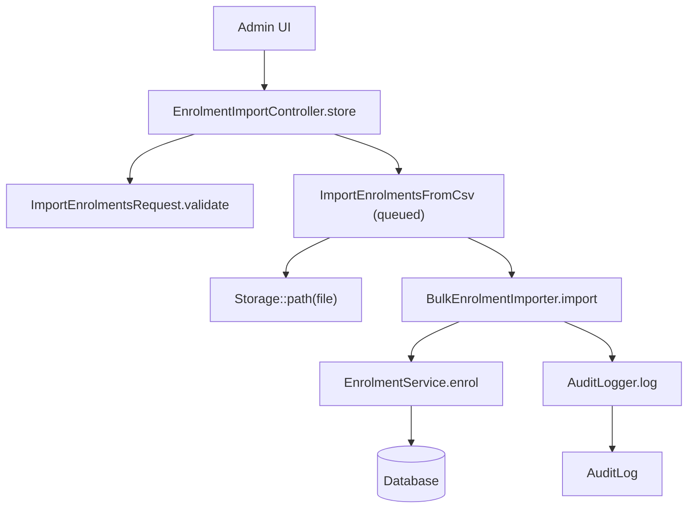
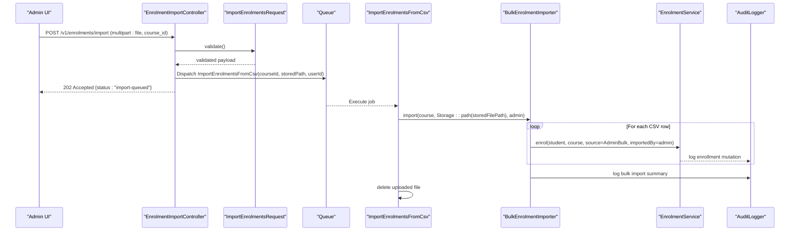
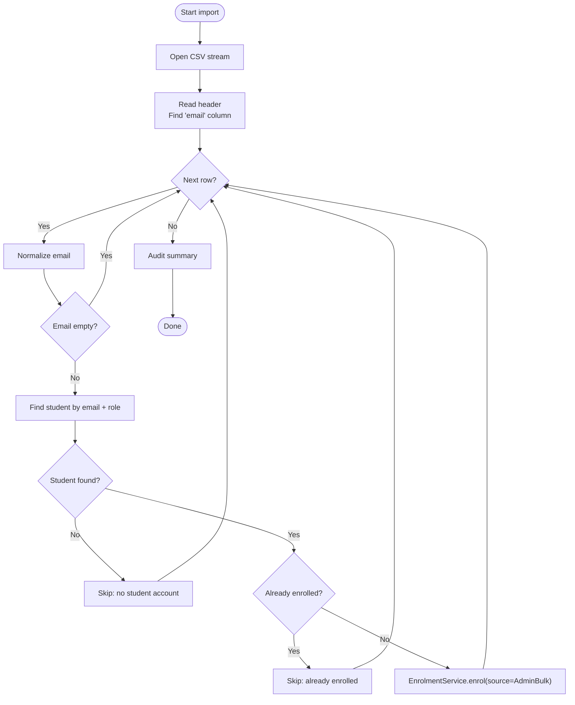
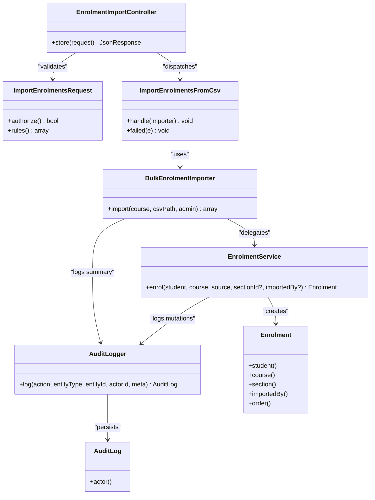

# Bulk Enrollment Import

<cite>
**Referenced Files in This Document**
- [EnrolmentImportController.php](file://app/Http/Controllers/Api/V1/EnrolmentImportController.php)
- [ImportEnrolmentsRequest.php](file://app/Http/Requests/Api/V1/ImportEnrolmentsRequest.php)
- [ImportEnrolmentsFromCsv.php](file://app/Jobs/ImportEnrolmentsFromCsv.php)
- [BulkEnrolmentImporter.php](file://app/Services/Enrolment/BulkEnrolmentImporter.php)
- [EnrolmentService.php](file://app/Services/Enrolment/EnrolmentService.php)
- [Enrolment.php](file://app/Models/Enrolment.php)
- [AuditLogger.php](file://app/Services/Audit/AuditLogger.php)
- [AuditLog.php](file://app/Models/AuditLog.php)
- [EnrolmentSource.php](file://app/Enums/EnrolmentSource.php)
- [api.php](file://routes/api.php)
</cite>

## Table of Contents
1. Introduction
2. Project Structure
3. Core Components
4. Architecture Overview
5. Detailed Component Analysis
6. Dependency Analysis
7. Performance Considerations
8. Troubleshooting Guide
9. Conclusion

## Introduction
This document explains the bulk enrollment import system that allows administrators to enroll multiple students into a course via CSV upload. It covers the service architecture, CSV processing and validation rules, queued job processing, error handling, audit logging, and integration points. It also outlines performance characteristics, batch behavior, and recovery patterns.

## Project Structure
The bulk import feature spans several layers:
- API layer: accepts file uploads and validates input
- Queue layer: processes imports asynchronously
- Service layer: parses CSV, enforces business rules, and performs enrollments
- Data layer: persists enrollments and audit logs

**Diagram sources**
- [EnrolmentImportController.php:18-29](file://app/Http/Controllers/Api/V1/EnrolmentImportController.php#L18-L29)
- [ImportEnrolmentsRequest.php:13-23](file://app/Http/Requests/Api/V1/ImportEnrolmentsRequest.php#L13-L23)
- [ImportEnrolmentsFromCsv.php:27-49](file://app/Jobs/ImportEnrolmentsFromCsv.php#L27-L49)
- [BulkEnrolmentImporter.php:29-84](file://app/Services/Enrolment/BulkEnrolmentImporter.php#L29-L84)
- [EnrolmentService.php:44-147](file://app/Services/Enrolment/EnrolmentService.php#L44-L147)
- [AuditLogger.php:18-27](file://app/Services/Audit/AuditLogger.php#L18-L27)

**Section sources**
- [EnrolmentImportController.php:18-29](file://app/Http/Controllers/Api/V1/EnrolmentImportController.php#L18-L29)
- [ImportEnrolmentsRequest.php:13-23](file://app/Http/Requests/Api/V1/ImportEnrolmentsRequest.php#L13-L23)
- [ImportEnrolmentsFromCsv.php:27-49](file://app/Jobs/ImportEnrolmentsFromCsv.php#L27-L49)
- [BulkEnrolmentImporter.php:29-84](file://app/Services/Enrolment/BulkEnrolmentImporter.php#L29-L84)
- [EnrolmentService.php:44-147](file://app/Services/Enrolment/EnrolmentService.php#L44-L147)
- [AuditLogger.php:18-27](file://app/Services/Audit/AuditLogger.php#L18-L27)

## Core Components
- EnrolmentImportController: Accepts multipart form with a CSV file and a course_id, stores the file, and dispatches a background job. Returns an immediate 202 Accepted response.
- ImportEnrolmentsRequest: Authorizes access using a policy on Enrolment and validates course_id existence and file constraints (CSV/TXT, max size).
- ImportEnrolmentsFromCsv: Background job that resolves Course and admin User, invokes the importer, and deletes the uploaded file after processing. Logs failures.
- BulkEnrolmentImporter: Streams the CSV row-by-row, normalizes emails, finds student users by email with role Student, skips duplicates or missing accounts, and delegates actual enrollment to EnrolmentService. Audits the overall import summary.
- EnrolmentService: Creates enrollments within a database transaction, handles section capacity and waitlisting, creates orders for confirmed enrollments, queues confirmation emails, updates progress unlocks, and audits each enrollment mutation.
- AuditLogger and AuditLog: Centralized audit logging for sensitive mutations and bulk import summaries.

**Section sources**
- [EnrolmentImportController.php:18-29](file://app/Http/Controllers/Api/V1/EnrolmentImportController.php#L18-L29)
- [ImportEnrolmentsRequest.php:13-23](file://app/Http/Requests/Api/V1/ImportEnrolmentsRequest.php#L13-L23)
- [ImportEnrolmentsFromCsv.php:27-49](file://app/Jobs/ImportEnrolmentsFromCsv.php#L27-L49)
- [BulkEnrolmentImporter.php:29-84](file://app/Services/Enrolment/BulkEnrolmentImporter.php#L29-L84)
- [EnrolmentService.php:44-147](file://app/Services/Enrolment/EnrolmentService.php#L44-L147)
- [AuditLogger.php:18-27](file://app/Services/Audit/AuditLogger.php#L18-L27)
- [AuditLog.php:19-29](file://app/Models/AuditLog.php#L19-L29)

## Architecture Overview
The system uses a request-queue-service pattern to ensure responsiveness and reliability when importing large rosters.

**Diagram sources**
- [EnrolmentImportController.php:18-29](file://app/Http/Controllers/Api/V1/EnrolmentImportController.php#L18-L29)
- [ImportEnrolmentsRequest.php:13-23](file://app/Http/Requests/Api/V1/ImportEnrolmentsRequest.php#L13-L23)
- [ImportEnrolmentsFromCsv.php:27-49](file://app/Jobs/ImportEnrolmentsFromCsv.php#L27-L49)
- [BulkEnrolmentImporter.php:29-84](file://app/Services/Enrolment/BulkEnrolmentImporter.php#L29-L84)
- [EnrolmentService.php:44-147](file://app/Services/Enrolment/EnrolmentService.php#L44-L147)
- [AuditLogger.php:18-27](file://app/Services/Audit/AuditLogger.php#L18-L27)

## Detailed Component Analysis

### API Endpoint and Authorization
- Route: POST /v1/enrolments/import under authenticated group
- Input: multipart/form-data with fields:
  - file: CSV or TXT, max 5 MB
  - course_id: integer, must exist in courses table
- Authorization: requires permission to import Enrolment
- Behavior: stores file, dispatches job, returns 202 Accepted

**Section sources**
- [api.php:94-97](file://routes/api.php#L94-L97)
- [EnrolmentImportController.php:18-29](file://app/Http/Controllers/Api/V1/EnrolmentImportController.php#L18-L29)
- [ImportEnrolmentsRequest.php:13-23](file://app/Http/Requests/Api/V1/ImportEnrolmentsRequest.php#L13-L23)

### Queued Job Processing
- Job parameters: courseId, storedFilePath, importedByUserId
- Execution: loads Course and admin User, calls importer with absolute storage path, then deletes the uploaded file
- Failure handling: logs error context including course_id and exception message
- Idempotency: safe to retry because importer skips already enrolled students

**Section sources**
- [ImportEnrolmentsFromCsv.php:27-49](file://app/Jobs/ImportEnrolmentsFromCsv.php#L27-L49)

### CSV Processing and Validation Rules
- File format: CSV with at least one column named “email” (case-insensitive header mapping; defaults to first column if not found)
- Row processing:
  - Trim and lowercase email
  - Skip empty rows
  - Look up user by email with role Student
  - Skip if no student account exists
  - Skip if already enrolled in the target course
  - Otherwise, enroll via EnrolmentService with source AdminBulk
- Output: returns counts of imported and skipped entries with reasons

**Diagram sources**
- [BulkEnrolmentImporter.php:29-84](file://app/Services/Enrolment/BulkEnrolmentImporter.php#L29-L84)

**Section sources**
- [BulkEnrolmentImporter.php:29-84](file://app/Services/Enrolment/BulkEnrolmentImporter.php#L29-L84)

### Enrollment Business Logic
- Transactional enrollment creation with optional section assignment
- Section capacity checks:
  - If section is Draft or Closed, enrollment is rejected
  - If capacity reached, enrollment created as Waitlisted
- Self-paced duplicate protection enforced per course
- Confirmed enrollments:
  - Create order with pending status
  - Queue delayed confirmation email based on course delay setting
  - Evaluate course unlocks via ProgressEngine
  - Audit logged
- Waitlisted enrollments are audited separately

**Section sources**
- [EnrolmentService.php:44-147](file://app/Services/Enrolment/EnrolmentService.php#L44-L147)
- [Enrolment.php:22-40](file://app/Models/Enrolment.php#L22-L40)
- [EnrolmentSource.php:7-11](file://app/Enums/EnrolmentSource.php#L7-L11)

### Audit Logging
- Bulk import summary logged with action enrolment.bulk_import, entity course, actor admin, and metadata including imported count and list of skipped reasons
- Each enrollment mutation logged through EnrolmentService with appropriate actions and metadata

**Section sources**
- [BulkEnrolmentImporter.php:76-82](file://app/Services/Enrolment/BulkEnrolmentImporter.php#L76-L82)
- [EnrolmentService.php:122-143](file://app/Services/Enrolment/EnrolmentService.php#L122-L143)
- [AuditLogger.php:18-27](file://app/Services/Audit/AuditLogger.php#L18-L27)
- [AuditLog.php:19-29](file://app/Models/AuditLog.php#L19-L29)

### Data Models and Relationships
- Enrolment model includes student, course, section, imported_by relationships and casts for status/source/datetime fields
- AuditLog model centralizes actor, action, entity_type, entity_id, and meta

**Section sources**
- [Enrolment.php:42-74](file://app/Models/Enrolment.php#L42-L74)
- [AuditLog.php:19-37](file://app/Models/AuditLog.php#L19-L37)

## Dependency Analysis

**Diagram sources**
- [EnrolmentImportController.php:18-29](file://app/Http/Controllers/Api/V1/EnrolmentImportController.php#L18-L29)
- [ImportEnrolmentsRequest.php:13-23](file://app/Http/Requests/Api/V1/ImportEnrolmentsRequest.php#L13-L23)
- [ImportEnrolmentsFromCsv.php:27-49](file://app/Jobs/ImportEnrolmentsFromCsv.php#L27-L49)
- [BulkEnrolmentImporter.php:29-84](file://app/Services/Enrolment/BulkEnrolmentImporter.php#L29-L84)
- [EnrolmentService.php:44-147](file://app/Services/Enrolment/EnrolmentService.php#L44-L147)
- [AuditLogger.php:18-27](file://app/Services/Audit/AuditLogger.php#L18-L27)
- [Enrolment.php:42-74](file://app/Models/Enrolment.php#L42-L74)
- [AuditLog.php:19-37](file://app/Models/AuditLog.php#L19-L37)

**Section sources**
- [EnrolmentImportController.php:18-29](file://app/Http/Controllers/Api/V1/EnrolmentImportController.php#L18-L29)
- [ImportEnrolmentsRequest.php:13-23](file://app/Http/Requests/Api/V1/ImportEnrolmentsRequest.php#L13-L23)
- [ImportEnrolmentsFromCsv.php:27-49](file://app/Jobs/ImportEnrolmentsFromCsv.php#L27-L49)
- [BulkEnrolmentImporter.php:29-84](file://app/Services/Enrolment/BulkEnrolmentImporter.php#L29-L84)
- [EnrolmentService.php:44-147](file://app/Services/Enrolment/EnrolmentService.php#L44-L147)
- [AuditLogger.php:18-27](file://app/Services/Audit/AuditLogger.php#L18-L27)
- [Enrolment.php:42-74](file://app/Models/Enrolment.php#L42-L74)
- [AuditLog.php:19-37](file://app/Models/AuditLog.php#L19-L37)

## Performance Considerations
- Streaming CSV: The importer reads the CSV row-by-row using a file handle, minimizing memory usage regardless of file size.
- Single pass processing: Each row is processed once with minimal lookups (user by email, enrollment existence check).
- Transactional enrollments: Each enrollment is wrapped in a transaction to maintain consistency.
- No explicit batching window: The importer does not chunk rows into batches; it processes sequentially. For very large files, consider chunking in future iterations to limit transaction sizes and improve throughput.
- File size limit: The request validator enforces a maximum file size of 5 MB.
- Queue isolation: Heavy work runs off the request path via the queue, preventing timeouts and keeping the API responsive.
- Email normalization: Lowercasing and trimming reduces false negatives due to case/whitespace differences.

[No sources needed since this section provides general guidance]

## Troubleshooting Guide
Common issues and where they are handled:
- Invalid or missing file/course_id: Caught by request validation; returns standard validation errors.
- File too large: Rejected by validator (max 5 MB).
- Missing student account: Skipped with reason recorded in audit metadata.
- Already enrolled: Skipped to avoid duplicates; recorded in audit metadata.
- Section closed or draft: Enrollment rejected by service rules when applicable.
- Job failure: Logged with course_id and error details; job retries are limited to one attempt.
- Storage issues: If the stored file cannot be opened, importer throws a runtime exception; job failure handler will log the error.

Recommended diagnostics:
- Check audit logs for the bulk import action to see imported counts and skip reasons.
- Inspect job logs for any exceptions during import.
- Verify that the storage disk has sufficient space and permissions.

**Section sources**
- [ImportEnrolmentsRequest.php:13-23](file://app/Http/Requests/Api/V1/ImportEnrolmentsRequest.php#L13-L23)
- [BulkEnrolmentImporter.php:34-68](file://app/Services/Enrolment/BulkEnrolmentImporter.php#L34-L68)
- [EnrolmentService.php:58-92](file://app/Services/Enrolment/EnrolmentService.php#L58-L92)
- [ImportEnrolmentsFromCsv.php:43-49](file://app/Jobs/ImportEnrolmentsFromCsv.php#L43-L49)
- [AuditLogger.php:18-27](file://app/Services/Audit/AuditLogger.php#L18-L27)

## Conclusion
The bulk enrollment import system provides a robust, auditable, and queue-backed mechanism for administrators to enroll many students efficiently. It emphasizes idempotency, data validation, and clear separation of concerns across API, queue, service, and data layers. Audit logging ensures traceability for both individual enrollments and overall import summaries. Future enhancements could include configurable batch sizes, richer progress reporting, and more granular error reporting back to the frontend.