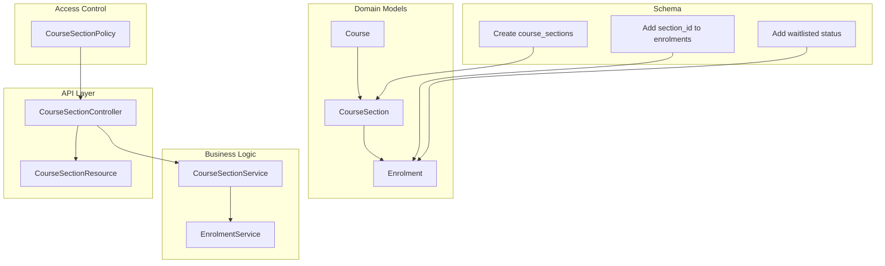
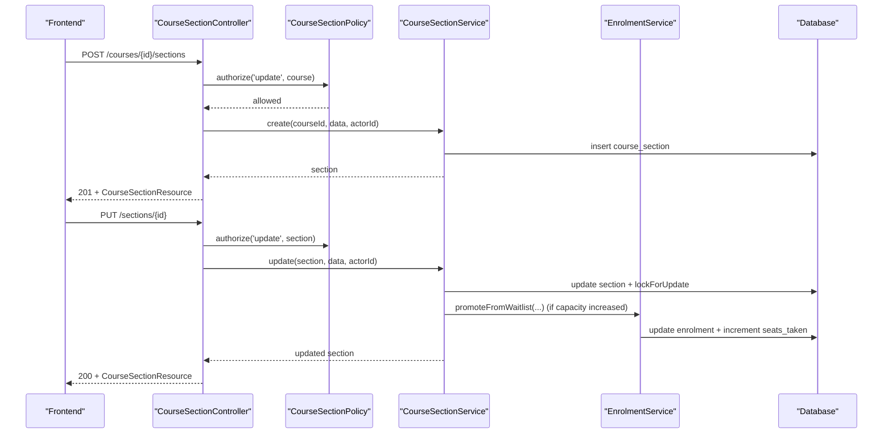
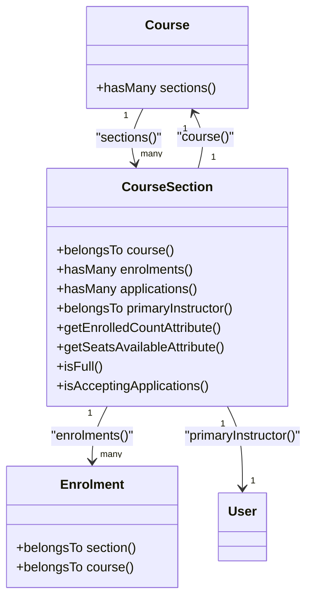
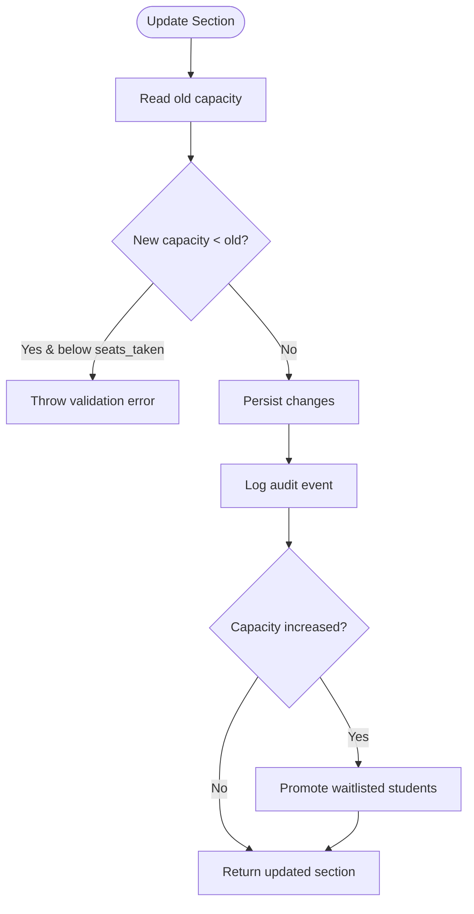
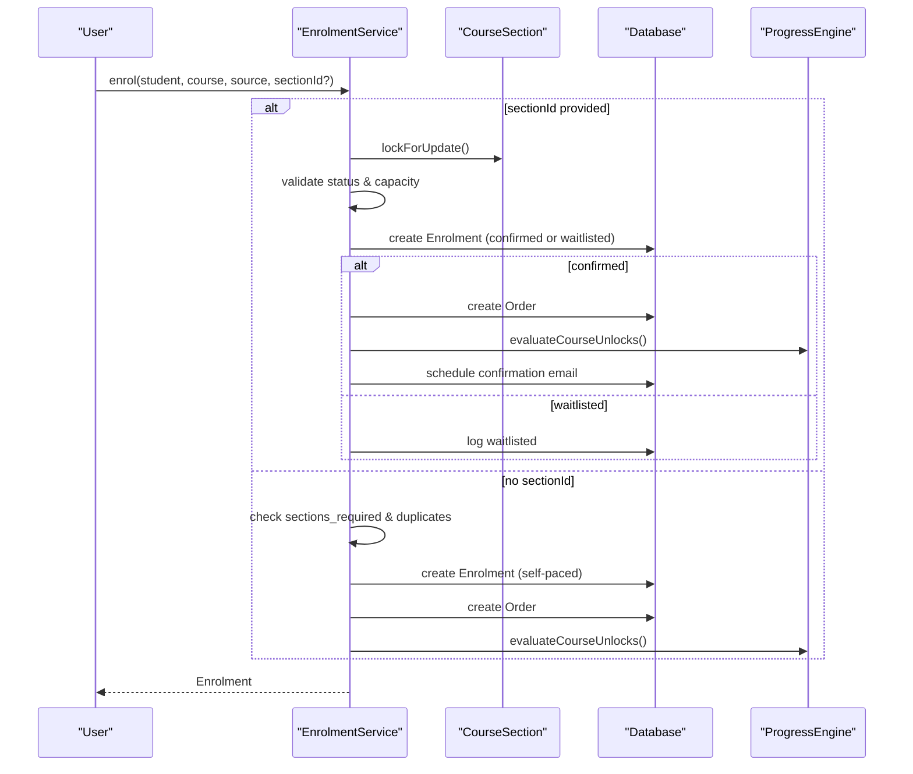
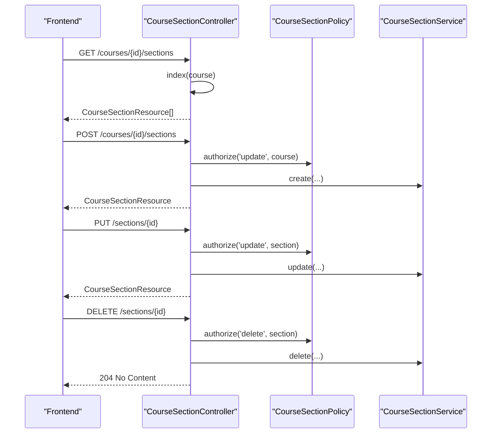
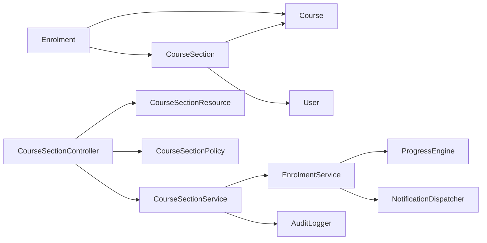

# Cohort Management

<cite>
**Referenced Files in This Document**
- [CourseSection.php](file://app/Models/CourseSection.php)
- [Enrolment.php](file://app/Models/Enrolment.php)
- [Course.php](file://app/Models/Course.php)
- [CourseSectionService.php](file://app/Services/Enrolment/CourseSectionService.php)
- [EnrolmentService.php](file://app/Services/Enrolment/EnrolmentService.php)
- [CourseSectionController.php](file://app/Http/Controllers/Api/V1/CourseSectionController.php)
- [CourseSectionResource.php](file://app/Http/Resources/CourseSectionResource.php)
- [CourseSectionPolicy.php](file://app/Policies/CourseSectionPolicy.php)
- [CourseSectionStatus.php](file://app/Enums/CourseSectionStatus.php)
- [EnrolmentStatus.php](file://app/Enums/EnrolmentStatus.php)
- [2026_08_10_010000_create_course_sections_table.php](file://database/migrations/2026_08_10_010000_create_course_sections_table.php)
- [2026_08_10_040000_add_section_id_to_enrolments_table.php](file://database/migrations/2026_08_10_040000_add_section_id_to_enrolments_table.php)
- [2026_08_10_050000_add_waitlisted_to_enrolments_status_enum.php](file://database/migrations/2026_08_10_050000_add_waitlisted_to_enrolments_status_enum.php)
</cite>

## Table of Contents
1. Introduction
2. Project Structure
3. Core Components
4. Architecture Overview
5. Detailed Component Analysis
6. Dependency Analysis
7. Performance Considerations
8. Troubleshooting Guide
9. Conclusion

## Introduction
This document explains cohort management for course-based learning programs. It focuses on the CourseSection model and its relationships with courses and enrollments, the CourseSectionService implementation for cohort creation, capacity management, and enrollment controls, and the frontend section management interface for create, edit, and delete operations. It also covers cohort-specific features such as waitlists, enrollment policies, and progress tracking integration.

## Project Structure
Cohort management is implemented across models, services, controllers, resources, policies, enums, and database migrations:
- Models define entities and relationships (CourseSection, Enrolment, Course).
- Services encapsulate business logic (CourseSectionService, EnrolmentService).
- Controller exposes API endpoints for managing sections.
- Resource formats responses for the frontend.
- Policy enforces authorization rules.
- Enums standardize statuses.
- Migrations define schema changes for cohorts and enrollment behavior.

**Diagram sources**
- [CourseSection.php:14-118](file://app/Models/CourseSection.php#L14-L118)
- [Enrolment.php:15-75](file://app/Models/Enrolment.php#L15-L75)
- [Course.php:140-145](file://app/Models/Course.php#L140-L145)
- [CourseSectionService.php:19-163](file://app/Services/Enrolment/CourseSectionService.php#L19-L163)
- [EnrolmentService.php:44-248](file://app/Services/Enrolment/EnrolmentService.php#L44-L248)
- [CourseSectionController.php:17-147](file://app/Http/Controllers/Api/V1/CourseSectionController.php#L17-L147)
- [CourseSectionResource.php:15-61](file://app/Http/Resources/CourseSectionResource.php#L15-L61)
- [CourseSectionPolicy.php:11-49](file://app/Policies/CourseSectionPolicy.php#L11-L49)
- [2026_08_10_010000_create_course_sections_table.php:14-33](file://database/migrations/2026_08_10_010000_create_course_sections_table.php#L14-L33)
- [2026_08_10_040000_add_section_id_to_enrolments_table.php:20-38](file://database/migrations/2026_08_10_040000_add_section_id_to_enrolments_table.php#L20-L38)
- [2026_08_10_050000_add_waitlisted_to_enrolments_status_enum.php:11-25](file://database/migrations/2026_08_10_050000_add_waitlisted_to_enrolments_status_enum.php#L11-L25)

**Section sources**
- [CourseSection.php:14-118](file://app/Models/CourseSection.php#L14-L118)
- [Enrolment.php:15-75](file://app/Models/Enrolment.php#L15-L75)
- [Course.php:140-145](file://app/Models/Course.php#L140-L145)
- [CourseSectionService.php:19-163](file://app/Services/Enrolment/CourseSectionService.php#L19-L163)
- [EnrolmentService.php:44-248](file://app/Services/Enrolment/EnrolmentService.php#L44-L248)
- [CourseSectionController.php:17-147](file://app/Http/Controllers/Api/V1/CourseSectionController.php#L17-L147)
- [CourseSectionResource.php:15-61](file://app/Http/Resources/CourseSectionResource.php#L15-L61)
- [CourseSectionPolicy.php:11-49](file://app/Policies/CourseSectionPolicy.php#L11-L49)
- [2026_08_10_010000_create_course_sections_table.php:14-33](file://database/migrations/2026_08_10_010000_create_course_sections_table.php#L14-L33)
- [2026_08_10_040000_add_section_id_to_enrolments_table.php:20-38](file://database/migrations/2026_08_10_040000_add_section_id_to_enrolments_table.php#L20-L38)
- [2026_08_10_050000_add_waitlisted_to_enrolments_status_enum.php:11-25](file://database/migrations/2026_08_10_050000_add_waitlisted_to_enrolments_status_enum.php#L11-L25)

## Core Components
- CourseSection represents a scheduled cohort run of a course with dates, capacity, seats_taken, status, and primary instructor. It provides computed attributes for enrolled count, available seats, fullness checks, and application acceptance.
- Enrolment links a student to a course and optionally to a specific section, tracks status (confirmed, withdrawn, waitlisted), source, and timestamps.
- CourseSectionService handles cohort lifecycle: create, update (with capacity change and automatic waitlist promotion), and delete (only if no history).
- EnrolmentService manages enrollment flow: enforce section status, handle capacity limits by placing students on waitlist, promote from waitlist, withdraw, integrate with orders, notifications, and progress engine.
- CourseSectionController exposes public and admin/instructor endpoints for listing, creating, updating, showing, and deleting sections.
- CourseSectionResource serializes section data including counts and flags for UI consumption.
- CourseSectionPolicy restricts actions based on user roles and course ownership.

**Section sources**
- [CourseSection.php:14-118](file://app/Models/CourseSection.php#L14-L118)
- [Enrolment.php:15-75](file://app/Models/Enrolment.php#L15-L75)
- [CourseSectionService.php:29-163](file://app/Services/Enrolment/CourseSectionService.php#L29-L163)
- [EnrolmentService.php:44-248](file://app/Services/Enrolment/EnrolmentService.php#L44-L248)
- [CourseSectionController.php:23-141](file://app/Http/Controllers/Api/V1/CourseSectionController.php#L23-L141)
- [CourseSectionResource.php:20-61](file://app/Http/Resources/CourseSectionResource.php#L20-L61)
- [CourseSectionPolicy.php:11-49](file://app/Policies/CourseSectionPolicy.php#L11-L49)

## Architecture Overview
The system separates concerns into models, services, controller, resource, policy, and schema. The controller authorizes requests and delegates to services. Services coordinate domain logic, concurrency control, and integrations (orders, notifications, progress). Resources shape responses for the frontend. Policies enforce role-based access.

**Diagram sources**
- [CourseSectionController.php:87-126](file://app/Http/Controllers/Api/V1/CourseSectionController.php#L87-L126)
- [CourseSectionPolicy.php:27-39](file://app/Policies/CourseSectionPolicy.php#L27-L39)
- [CourseSectionService.php:29-88](file://app/Services/Enrolment/CourseSectionService.php#L29-L88)
- [EnrolmentService.php:208-248](file://app/Services/Enrolment/EnrolmentService.php#L208-L248)

## Detailed Component Analysis

### CourseSection Model
- Relationships: belongs to Course; has many Enrolments and CourseApplications; belongs to User as primaryInstructor.
- Attributes: course_id, name, start_date, end_date, application_deadline, capacity, seats_taken, status, primary_instructor_id.
- Computed:
  - enrolled_count: counts confirmed and waitlisted enrollments.
  - seats_available: capacity minus enrolled_count (null if unlimited).
  - isFull(): true when capacity is set and enrolled_count >= capacity.
  - isAcceptingApplications(): true when status is open and deadline not past.

**Diagram sources**
- [CourseSection.php:40-70](file://app/Models/CourseSection.php#L40-L70)
- [CourseSection.php:72-118](file://app/Models/CourseSection.php#L72-L118)
- [Course.php:140-145](file://app/Models/Course.php#L140-L145)
- [Enrolment.php:58-64](file://app/Models/Enrolment.php#L58-L64)

**Section sources**
- [CourseSection.php:14-118](file://app/Models/CourseSection.php#L14-L118)

### Enrolment Model
- Links student to course and optional section.
- Tracks status (confirmed, withdrawn, waitlisted), source, applied_at, confirmation email scheduling.
- Relationships: student, course, section, importedBy, order.

**Section sources**
- [Enrolment.php:15-75](file://app/Models/Enrolment.php#L15-L75)

### CourseSectionService
- Create: persists section with seats_taken initialized to zero; logs audit event.
- Update: validates capacity decrease against current seats_taken; updates fields; logs audit; promotes waitlisted students when capacity increases using pessimistic locking and oldest-first ordering.
- Delete: prevents deletion if any enrollments or applications exist; logs audit; deletes only draft-like untouched sections.

**Diagram sources**
- [CourseSectionService.php:54-88](file://app/Services/Enrolment/CourseSectionService.php#L54-L88)
- [CourseSectionService.php:134-162](file://app/Services/Enrolment/CourseSectionService.php#L134-L162)

**Section sources**
- [CourseSectionService.php:29-163](file://app/Services/Enrolment/CourseSectionService.php#L29-L163)

### EnrolmentService
- Enrol:
  - If section provided: locks row, validates status (draft/closed disallowed), sets status to waitlisted if capacity reached.
  - If no section: enforces course-level sections_required flag; prevents duplicate self-paced enrollment.
  - Creates enrollment, creates order for confirmed enrollments, schedules confirmation email, evaluates course unlocks via ProgressEngine.
- Withdraw: marks withdrawn, decrements seats_taken if previously confirmed in a section, promotes oldest waitlisted enrollment if any.
- PromoteFromWaitlist: confirms enrollment, increments seats_taken, creates order, notifies student, queues confirmation email, evaluates course unlocks.

**Diagram sources**
- [EnrolmentService.php:44-148](file://app/Services/Enrolment/EnrolmentService.php#L44-L148)

**Section sources**
- [EnrolmentService.php:44-248](file://app/Services/Enrolment/EnrolmentService.php#L44-L248)

### CourseSectionController
- Public endpoint lists open/in_progress sections for landing/catalogue displays without authentication.
- Index lists sections for a course; privileged users get analytics-rich data.
- Store creates a section via service after authorization.
- Show returns detailed section with relations.
- Update delegates to service after authorization.
- Destroy deletes via service after authorization.

**Diagram sources**
- [CourseSectionController.php:23-141](file://app/Http/Controllers/Api/V1/CourseSectionController.php#L23-L141)
- [CourseSectionPolicy.php:11-49](file://app/Policies/CourseSectionPolicy.php#L11-L49)

**Section sources**
- [CourseSectionController.php:23-141](file://app/Http/Controllers/Api/V1/CourseSectionController.php#L23-L141)

### CourseSectionResource
- Serializes section details, computed counts (enrolled_count, waitlisted_count), availability flags (is_full, is_accepting_applications), and instructor/course info when loaded.
- Calculates seats_available from capacity and enrolled_count.

**Section sources**
- [CourseSectionResource.php:20-61](file://app/Http/Resources/CourseSectionResource.php#L20-L61)

### Policies and Statuses
- CourseSectionPolicy:
  - viewAny: admins and instructors.
  - view/update/delete: admins always; instructors only for courses they teach.
- CourseSectionStatus: draft, open, closed, in_progress, completed.
- EnrolmentStatus: confirmed, withdrawn, waitlisted.

**Section sources**
- [CourseSectionPolicy.php:11-49](file://app/Policies/CourseSectionPolicy.php#L11-L49)
- [CourseSectionStatus.php:7-14](file://app/Enums/CourseSectionStatus.php#L7-L14)
- [EnrolmentStatus.php:7-12](file://app/Enums/EnrolmentStatus.php#L7-L12)

### Database Schema Changes
- Create course_sections table with fields for cohort scheduling, capacity, seats_taken, status, and primary instructor.
- Add section_id to enrolments and adjust unique constraints to allow multiple section enrollments per student per course.
- Add waitlisted to enrolments.status enum to support capacity overflow handling.

**Section sources**
- [2026_08_10_010000_create_course_sections_table.php:14-33](file://database/migrations/2026_08_10_010000_create_course_sections_table.php#L14-L33)
- [2026_08_10_040000_add_section_id_to_enrolments_table.php:20-38](file://database/migrations/2026_08_10_040000_add_section_id_to_enrolments_table.php#L20-L38)
- [2026_08_10_050000_add_waitlisted_to_enrolments_status_enum.php:11-25](file://database/migrations/2026_08_10_050000_add_waitlisted_to_enrolments_status_enum.php#L11-L25)

## Dependency Analysis
- CourseSection depends on Course and User (primary instructor); Enrolment depends on CourseSection and Course.
- CourseSectionService depends on EnrolmentService for waitlist promotions and AuditLogger for logging.
- EnrolmentService depends on ProgressEngine for unlocking content and NotificationDispatcher for waitlist promotion notifications.
- Controller depends on Service and Resource; Policy gates controller actions.

**Diagram sources**
- [CourseSection.php:40-70](file://app/Models/CourseSection.php#L40-L70)
- [Enrolment.php:58-75](file://app/Models/Enrolment.php#L58-L75)
- [CourseSectionService.php:21-24](file://app/Services/Enrolment/CourseSectionService.php#L21-L24)
- [EnrolmentService.php:32-36](file://app/Services/Enrolment/EnrolmentService.php#L32-L36)
- [CourseSectionController.php:19-21](file://app/Http/Controllers/Api/V1/CourseSectionController.php#L19-L21)

**Section sources**
- [CourseSection.php:40-70](file://app/Models/CourseSection.php#L40-L70)
- [Enrolment.php:58-75](file://app/Models/Enrolment.php#L58-L75)
- [CourseSectionService.php:21-24](file://app/Services/Enrolment/CourseSectionService.php#L21-L24)
- [EnrolmentService.php:32-36](file://app/Services/Enrolment/EnrolmentService.php#L32-L36)
- [CourseSectionController.php:19-21](file://app/Http/Controllers/Api/V1/CourseSectionController.php#L19-L21)

## Performance Considerations
- Pessimistic locking:
  - EnrolmentService uses SELECT ... FOR UPDATE on sections during enrollment to prevent race conditions when checking/incrementing seats_taken.
  - CourseSectionService uses lockForUpdate when promoting waitlisted students upon capacity increase.
- Efficient counting:
  - Controller uses withCount for enrolled_count in public listings to avoid N+1 queries.
  - Resource computes seats_available efficiently from cached or loaded relations.
- Transactional integrity:
  - Updates and promotions occur within DB transactions to ensure consistency.
- Indexing:
  - course_sections indexed on (course_id, status) for fast filtering.

[No sources needed since this section provides general guidance]

## Troubleshooting Guide
- Cannot reduce capacity below current enrollment:
  - Occurs when attempting to decrease capacity below seats_taken. Adjust capacity or manage enrollments first.
- Cannot delete section with history:
  - Deletion blocked if any enrollments or applications exist. Use “Closed” status instead.
- Enrollment rejected due to section status:
  - Draft or closed sections cannot accept enrollments. Ensure section is open or in_progress.
- Duplicate self-paced enrollment:
  - Prevented by uniqueness enforcement; remove existing enrollment or enroll in a specific section.
- Waitlist not promoted:
  - Verify capacity was increased and that waitlisted enrollments exist; check logs for promotion events.

**Section sources**
- [CourseSectionService.php:60-67](file://app/Services/Enrolment/CourseSectionService.php#L60-L67)
- [CourseSectionService.php:96-128](file://app/Services/Enrolment/CourseSectionService.php#L96-L128)
- [EnrolmentService.php:58-65](file://app/Services/Enrolment/EnrolmentService.php#L58-L65)
- [EnrolmentService.php:83-92](file://app/Services/Enrolment/EnrolmentService.php#L83-L92)

## Conclusion
Cohort management centers on CourseSection as a capacity-managed cohort run tied to a course and enrollments. CourseSectionService orchestrates cohort lifecycle and waitlist automation, while EnrolmentService enforces enrollment policies, integrates with orders, notifications, and progress tracking. The controller exposes clear APIs for public and administrative workflows, and the resource shapes data for the frontend. Policies ensure secure access, and migrations provide a robust schema supporting cohorts, waitlists, and multi-section enrollments.

[No sources needed since this section summarizes without analyzing specific files]