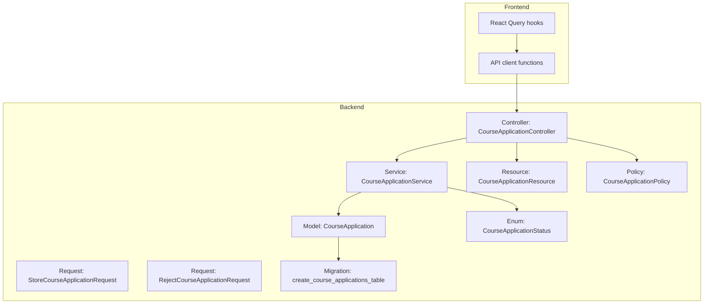
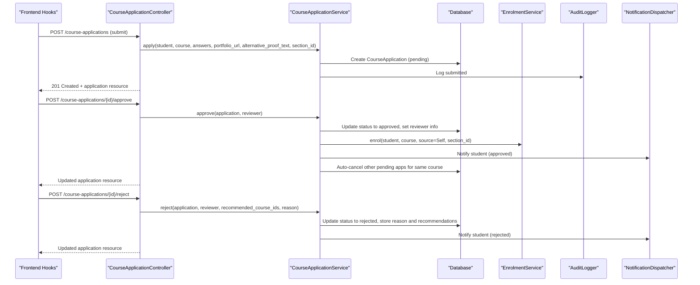
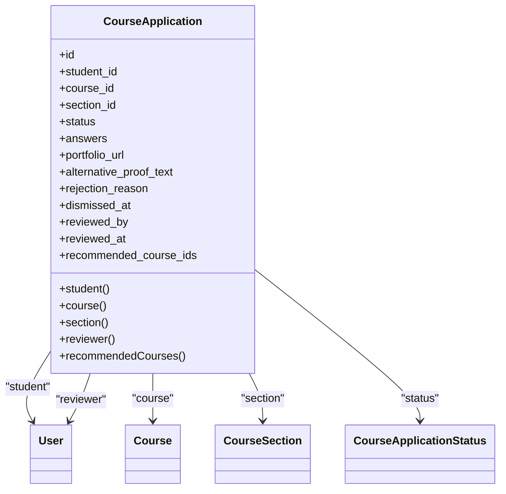
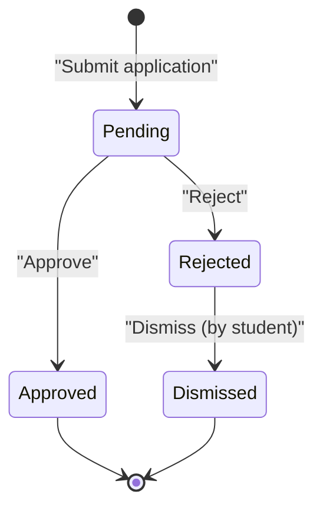
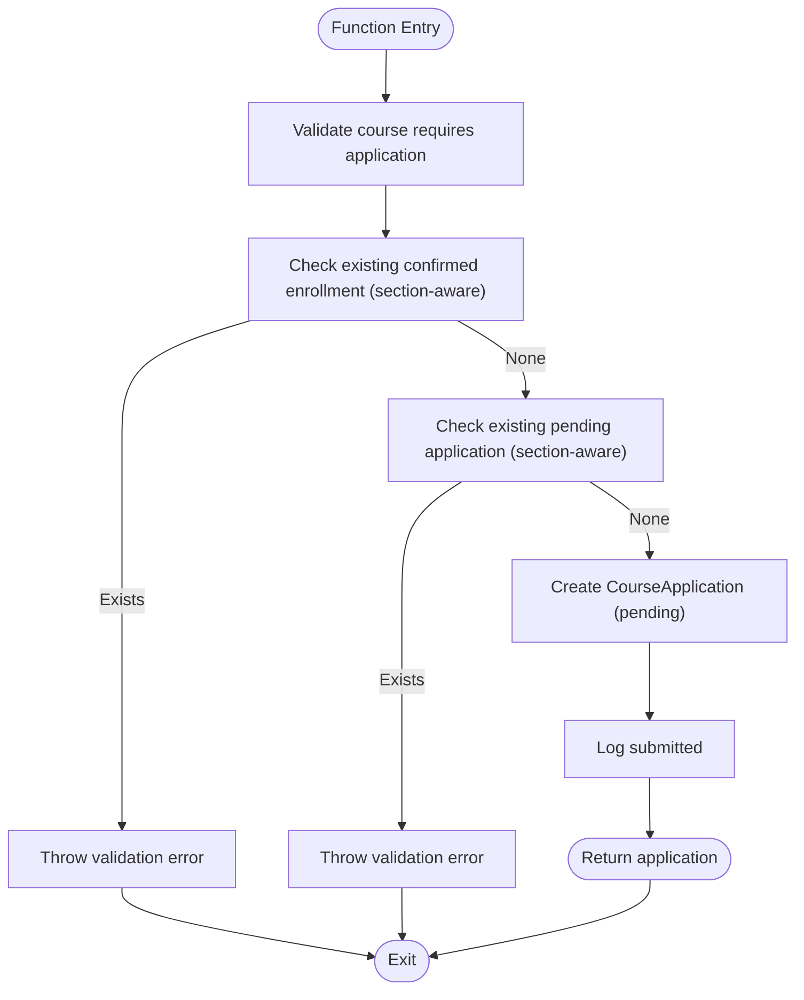
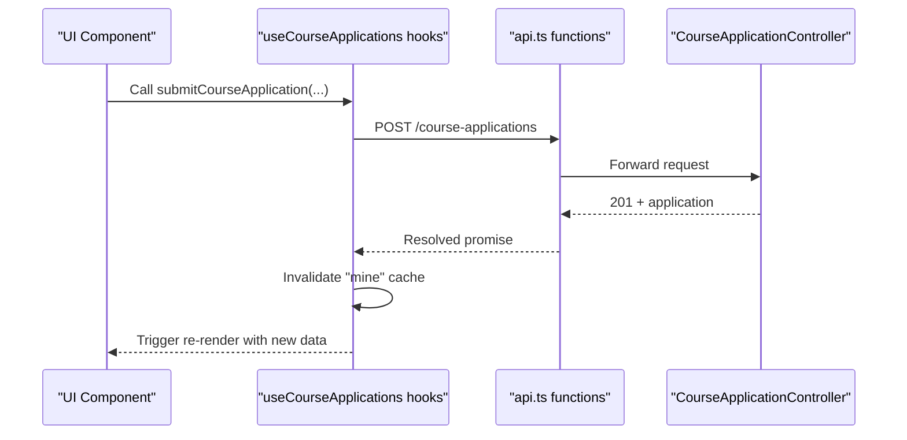
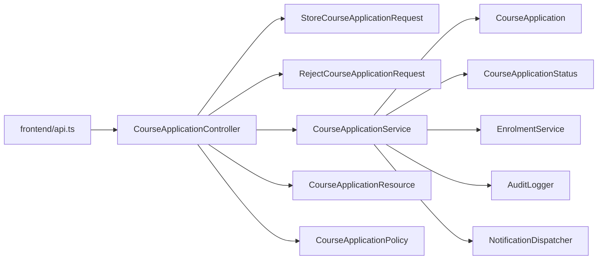

# Course Application System

<cite>
**Referenced Files in This Document**
- [CourseApplication.php](file://app/Models/CourseApplication.php)
- [CourseApplicationStatus.php](file://app/Enums/CourseApplicationStatus.php)
- [CourseApplicationService.php](file://app/Services/Enrolment/CourseApplicationService.php)
- [CourseApplicationController.php](file://app/Http/Controllers/Api/V1/CourseApplicationController.php)
- [StoreCourseApplicationRequest.php](file://app/Http/Requests/Api/V1/StoreCourseApplicationRequest.php)
- [RejectCourseApplicationRequest.php](file://app/Http/Requests/Api/V1/RejectCourseApplicationRequest.php)
- [CourseApplicationResource.php](file://app/Http/Resources/CourseApplicationResource.php)
- [CourseApplicationPolicy.php](file://app/Policies/CourseApplicationPolicy.php)
- [2026_07_29_040000_create_course_applications_table.php](file://database/migrations/2026_07_29_040000_create_course_applications_table.php)
- [api.ts](file://frontend/src/features/courseApplications/api.ts)
- [useCourseApplications.ts](file://frontend/src/features/courseApplications/useCourseApplications.ts)
</cite>

## Table of Contents
1. [Introduction](#introduction)
2. [Project Structure](#project-structure)
3. [Core Components](#core-components)
4. [Architecture Overview](#architecture-overview)
5. [Detailed Component Analysis](#detailed-component-analysis)
6. [Dependency Analysis](#dependency-analysis)
7. [Performance Considerations](#performance-considerations)
8. [Troubleshooting Guide](#troubleshooting-guide)
9. [Conclusion](#conclusion)
10. [Appendices](#appendices)

## Introduction
This document explains the course application system that enables application-based enrollment workflows. It covers the data model, lifecycle states, approval and rejection processes, service logic for validation and automation, API endpoints, frontend integration patterns, and how applications integrate with course sections and the enrollment system.

## Project Structure
The course application feature spans backend models, services, controllers, requests, resources, policies, database migrations, and a small frontend module that calls the API and manages UI state.

**Diagram sources**
- [CourseApplication.php:14-87](file://app/Models/CourseApplication.php#L14-L87)
- [CourseApplicationStatus.php:7-12](file://app/Enums/CourseApplicationStatus.php#L7-L12)
- [CourseApplicationService.php:21-289](file://app/Services/Enrolment/CourseApplicationService.php#L21-L289)
- [CourseApplicationController.php:19-104](file://app/Http/Controllers/Api/V1/CourseApplicationController.php#L19-L104)
- [StoreCourseApplicationRequest.php:11-29](file://app/Http/Requests/Api/V1/StoreCourseApplicationRequest.php#L11-L29)
- [RejectCourseApplicationRequest.php:10-25](file://app/Http/Requests/Api/V1/RejectCourseApplicationRequest.php#L10-L25)
- [CourseApplicationResource.php:14-42](file://app/Http/Resources/CourseApplicationResource.php#L14-L42)
- [CourseApplicationPolicy.php:12-53](file://app/Policies/CourseApplicationPolicy.php#L12-L53)
- [2026_07_29_040000_create_course_applications_table.php:15-33](file://database/migrations/2026_07_29_040000_create_course_applications_table.php#L15-L33)
- [api.ts:1-48](file://frontend/src/features/courseApplications/api.ts#L1-L48)
- [useCourseApplications.ts:1-100](file://frontend/src/features/courseApplications/useCourseApplications.ts#L1-L100)

**Section sources**
- [CourseApplication.php:14-87](file://app/Models/CourseApplication.php#L14-L87)
- [CourseApplicationService.php:21-289](file://app/Services/Enrolment/CourseApplicationService.php#L21-L289)
- [CourseApplicationController.php:19-104](file://app/Http/Controllers/Api/V1/CourseApplicationController.php#L19-L104)
- [StoreCourseApplicationRequest.php:11-29](file://app/Http/Requests/Api/V1/StoreCourseApplicationRequest.php#L11-L29)
- [RejectCourseApplicationRequest.php:10-25](file://app/Http/Requests/Api/V1/RejectCourseApplicationRequest.php#L10-L25)
- [CourseApplicationResource.php:14-42](file://app/Http/Resources/CourseApplicationResource.php#L14-L42)
- [CourseApplicationPolicy.php:12-53](file://app/Policies/CourseApplicationPolicy.php#L12-L53)
- [2026_07_29_040000_create_course_applications_table.php:15-33](file://database/migrations/2026_07_29_040000_create_course_applications_table.php#L15-L33)
- [api.ts:1-48](file://frontend/src/features/courseApplications/api.ts#L1-L48)
- [useCourseApplications.ts:1-100](file://frontend/src/features/courseApplications/useCourseApplications.ts#L1-L100)

## Core Components
- Model: CourseApplication stores an applicant’s submission, status, answers, optional portfolio or proof text, reviewer metadata, recommended courses on rejection, and dismissal timestamp. It relates to student, course, section, and reviewer users.
- Enum: CourseApplicationStatus defines the lifecycle states: pending, approved, rejected.
- Service: CourseApplicationService implements apply, approve, reject, visibleForDashboard, and dismiss, including validations, enrollment delegation, auto-cancellation of other pending applications, audit logging, and notifications.
- Controller: CourseApplicationController exposes endpoints for listing (admin/instructor), fetching current user’s applications, submitting, approving, rejecting, and dismissing applications.
- Requests: StoreCourseApplicationRequest validates incoming application submissions; RejectCourseApplicationRequest validates rejection payloads.
- Resource: CourseApplicationResource serializes application data for API responses.
- Policy: CourseApplicationPolicy controls access to view, approve/reject, and dismiss actions based on roles and ownership.
- Migration: Defines the course_applications table schema and indexes.
- Frontend: api.ts provides typed functions to call the backend; useCourseApplications.ts provides React Query hooks for queries and mutations with cache invalidation and optimistic updates.

**Section sources**
- [CourseApplication.php:14-87](file://app/Models/CourseApplication.php#L14-L87)
- [CourseApplicationStatus.php:7-12](file://app/Enums/CourseApplicationStatus.php#L7-L12)
- [CourseApplicationService.php:21-289](file://app/Services/Enrolment/CourseApplicationService.php#L21-L289)
- [CourseApplicationController.php:19-104](file://app/Http/Controllers/Api/V1/CourseApplicationController.php#L19-L104)
- [StoreCourseApplicationRequest.php:11-29](file://app/Http/Requests/Api/V1/StoreCourseApplicationRequest.php#L11-L29)
- [RejectCourseApplicationRequest.php:10-25](file://app/Http/Requests/Api/V1/RejectCourseApplicationRequest.php#L10-L25)
- [CourseApplicationResource.php:14-42](file://app/Http/Resources/CourseApplicationResource.php#L14-L42)
- [CourseApplicationPolicy.php:12-53](file://app/Policies/CourseApplicationPolicy.php#L12-L53)
- [2026_07_29_040000_create_course_applications_table.php:15-33](file://database/migrations/2026_07_29_040000_create_course_applications_table.php#L15-L33)
- [api.ts:1-48](file://frontend/src/features/courseApplications/api.ts#L1-L48)
- [useCourseApplications.ts:1-100](file://frontend/src/features/courseApplications/useCourseApplications.ts#L1-L100)

## Architecture Overview
The system follows a layered architecture:
- Frontend modules call REST endpoints via typed API functions and manage state with React Query hooks.
- The controller authorizes and delegates to the service.
- The service enforces business rules, interacts with related systems (enrollment), logs audits, and dispatches notifications.
- The model persists data and exposes relationships.
- Policies enforce role-based access control.

**Diagram sources**
- [CourseApplicationController.php:56-102](file://app/Http/Controllers/Api/V1/CourseApplicationController.php#L56-L102)
- [CourseApplicationService.php:44-233](file://app/Services/Enrolment/CourseApplicationService.php#L44-L233)
- [api.ts:16-47](file://frontend/src/features/courseApplications/api.ts#L16-L47)
- [useCourseApplications.ts:30-99](file://frontend/src/features/courseApplications/useCourseApplications.ts#L30-L99)

## Detailed Component Analysis

### Data Model: CourseApplication
- Fields include identifiers for student, course, and optional section; status; JSON answers; optional portfolio URL and alternative proof text; reviewer identity and timestamp; recommended course IDs on rejection; and dismissal timestamp.
- Relationships: belongsTo User (student), Course, CourseSection, User (reviewer). A helper returns recommended courses from stored IDs.
- Casting ensures status is an enum and arrays are handled as JSON.

**Diagram sources**
- [CourseApplication.php:14-87](file://app/Models/CourseApplication.php#L14-L87)
- [CourseApplicationStatus.php:7-12](file://app/Enums/CourseApplicationStatus.php#L7-L12)

**Section sources**
- [CourseApplication.php:14-87](file://app/Models/CourseApplication.php#L14-L87)
- [2026_07_29_040000_create_course_applications_table.php:15-33](file://database/migrations/2026_07_29_040000_create_course_applications_table.php#L15-L33)

### Lifecycle States and Transitions
- States: pending, approved, rejected.
- Transitions:
  - Submit creates a pending application.
  - Approve transitions to approved and triggers enrollment.
  - Reject transitions to rejected and may include recommended courses and a reason.
  - Dismiss marks a rejected application as dismissed by the student.

**Diagram sources**
- [CourseApplicationStatus.php:7-12](file://app/Enums/CourseApplicationStatus.php#L7-L12)
- [CourseApplicationService.php:44-289](file://app/Services/Enrolment/CourseApplicationService.php#L44-L289)

**Section sources**
- [CourseApplicationStatus.php:7-12](file://app/Enums/CourseApplicationStatus.php#L7-L12)
- [CourseApplicationService.php:44-289](file://app/Services/Enrolment/CourseApplicationService.php#L44-L289)

### Service Implementation: Validation, Review Workflows, Automation
- Apply:
  - Validates that the course requires an application.
  - Prevents duplicate confirmed enrollments (section-aware).
  - Prevents duplicate pending applications for the same course/section.
  - Creates a pending application and logs the action.
- Approve:
  - Ensures only pending applications can be approved.
  - Updates status and reviewer metadata.
  - Delegates to EnrolmentService::enrol to create the enrollment (may be confirmed or waitlisted depending on capacity).
  - Notifies the student and auto-cancels other pending applications for the same course.
- Reject:
  - Ensures only pending applications can be rejected.
  - Stores recommended courses and optional rejection reason.
  - Notifies the student.
- Dashboard visibility:
  - Returns pending applications plus recent rejected ones not yet dismissed and whose recommended courses have not been started by the student.
- Dismiss:
  - Marks a rejected application as dismissed by the student.

**Diagram sources**
- [CourseApplicationService.php:44-100](file://app/Services/Enrolment/CourseApplicationService.php#L44-L100)

**Section sources**
- [CourseApplicationService.php:44-289](file://app/Services/Enrolment/CourseApplicationService.php#L44-L289)

### API Endpoints and Request/Response Contracts
- List applications (admin/instructor): GET /course-applications?status={status}
  - Filters by status; instructors see only their courses.
  - Response: collection of CourseApplicationResource.
- My applications (student): GET /course-applications/me
  - Returns dashboard-visible applications using service filtering.
- Submit application (student): POST /course-applications
  - Body validated by StoreCourseApplicationRequest.
  - Response: 201 Created with CourseApplicationResource.
- Approve application (authorized): POST /course-applications/{id}/approve
  - Response: updated CourseApplicationResource.
- Reject application (authorized): POST /course-applications/{id}/reject
  - Body validated by RejectCourseApplicationRequest.
  - Response: updated CourseApplicationResource.
- Dismiss application (student, rejected only): POST /course-applications/{id}/dismiss
  - Response: updated CourseApplicationResource.

**Section sources**
- [CourseApplicationController.php:27-102](file://app/Http/Controllers/Api/V1/CourseApplicationController.php#L27-L102)
- [StoreCourseApplicationRequest.php:11-29](file://app/Http/Requests/Api/V1/StoreCourseApplicationRequest.php#L11-L29)
- [RejectCourseApplicationRequest.php:10-25](file://app/Http/Requests/Api/V1/RejectCourseApplicationRequest.php#L10-L25)
- [CourseApplicationResource.php:14-42](file://app/Http/Resources/CourseApplicationResource.php#L14-L42)

### Frontend Integration Patterns
- API layer:
  - fetchCourseApplications(status?): lists applications with optional status filter.
  - fetchMyCourseApplications(): retrieves current user’s dashboard-visible applications.
  - submitCourseApplication(payload): submits a new application.
  - approveCourseApplication(id): approves an application.
  - rejectCourseApplication(id, recommendedCourseIds?, rejectionReason?): rejects with optional recommendations and reason.
  - dismissCourseApplication(id): dismisses a rejected application.
- React Query hooks:
  - useCourseApplications(status?): admin query with caching and invalidation.
  - useMyCourseApplications(enabled?): student dashboard query.
  - useSubmitCourseApplication(): mutation that invalidates “my applications” cache on success.
  - useApproveCourseApplication(): mutation that invalidates admin list on success.
  - useRejectCourseApplication(): mutation that invalidates admin list on success.
  - useDismissCourseApplication(): optimistic update removes item immediately, rolls back on error, then invalidates.

**Diagram sources**
- [useCourseApplications.ts:30-39](file://frontend/src/features/courseApplications/useCourseApplications.ts#L30-L39)
- [api.ts:16-25](file://frontend/src/features/courseApplications/api.ts#L16-L25)
- [CourseApplicationController.php:56-72](file://app/Http/Controllers/Api/V1/CourseApplicationController.php#L56-L72)

**Section sources**
- [api.ts:1-48](file://frontend/src/features/courseApplications/api.ts#L1-L48)
- [useCourseApplications.ts:1-100](file://frontend/src/features/courseApplications/useCourseApplications.ts#L1-L100)

### Access Control and Policies
- viewAny: Admin or Instructor can access the review queue.
- approve/reject: Authorized if the user is Admin or an Instructor teaching the course associated with the application.
- dismiss: Only the owning student can dismiss a rejected application.

**Section sources**
- [CourseApplicationPolicy.php:12-53](file://app/Policies/CourseApplicationPolicy.php#L12-L53)

### Database Schema and Indexes
- Table: course_applications
  - Columns: id, student_id (FK), course_id (FK), status (enum), answers (JSON), portfolio_url (string), alternative_proof_text (text), reviewed_by (nullable FK), reviewed_at (datetime), recommended_course_ids (JSON), timestamps.
  - Indexes: composite index on (course_id, status); index on student_id for fast lookups.

**Section sources**
- [2026_07_29_040000_create_course_applications_table.php:15-33](file://database/migrations/2026_07_29_040000_create_course_applications_table.php#L15-L33)

## Dependency Analysis
- Controller depends on:
  - Requests for input validation.
  - Service for business logic.
  - Resource for response serialization.
  - Policy for authorization.
- Service depends on:
  - Model for persistence.
  - Enum for state values.
  - EnrolmentService to finalize enrollment after approval.
  - AuditLogger for immutable audit trails.
  - NotificationDispatcher to notify students on decisions.
- Frontend depends on:
  - api.ts for HTTP calls.
  - useCourseApplications.ts for caching and side effects.

**Diagram sources**
- [CourseApplicationController.php:19-104](file://app/Http/Controllers/Api/V1/CourseApplicationController.php#L19-L104)
- [CourseApplicationService.php:21-289](file://app/Services/Enrolment/CourseApplicationService.php#L21-L289)
- [StoreCourseApplicationRequest.php:11-29](file://app/Http/Requests/Api/V1/StoreCourseApplicationRequest.php#L11-L29)
- [RejectCourseApplicationRequest.php:10-25](file://app/Http/Requests/Api/V1/RejectCourseApplicationRequest.php#L10-L25)
- [CourseApplicationResource.php:14-42](file://app/Http/Resources/CourseApplicationResource.php#L14-L42)
- [CourseApplicationPolicy.php:12-53](file://app/Policies/CourseApplicationPolicy.php#L12-L53)
- [api.ts:1-48](file://frontend/src/features/courseApplications/api.ts#L1-L48)

**Section sources**
- [CourseApplicationController.php:19-104](file://app/Http/Controllers/Api/V1/CourseApplicationController.php#L19-L104)
- [CourseApplicationService.php:21-289](file://app/Services/Enrolment/CourseApplicationService.php#L21-L289)

## Performance Considerations
- Use section-aware checks to avoid unnecessary queries when validating duplicates.
- Leverage indexes on course_id/status and student_id for efficient listing and lookup.
- Prefer eager loading in controllers/resources where needed to reduce N+1 queries.
- Frontend uses React Query with selective invalidation to minimize network traffic and keep UI responsive.

[No sources needed since this section provides general guidance]

## Troubleshooting Guide
- Duplicate enrollment or pending application errors:
  - Occur when a student already has a confirmed enrollment or a pending application for the same course/section.
  - Resolution: Remove conflicting enrollment or wait for decision; ensure correct section_id is provided.
- Unauthorized actions:
  - Approve/reject require appropriate roles and course association; dismiss requires ownership and rejected status.
  - Resolution: Verify user role and course instructor membership; ensure application is rejected before dismissing.
- Missing or invalid payload fields:
  - Ensure course_id exists and is published; optional fields must conform to constraints.
  - Resolution: Validate inputs on the frontend and handle server validation errors.
- Notifications not received:
  - Confirm notification dispatcher is configured and queued jobs are processing.
  - Resolution: Check job queues and notification configuration.

**Section sources**
- [CourseApplicationService.php:44-100](file://app/Services/Enrolment/CourseApplicationService.php#L44-L100)
- [CourseApplicationPolicy.php:12-53](file://app/Policies/CourseApplicationPolicy.php#L12-L53)
- [StoreCourseApplicationRequest.php:11-29](file://app/Http/Requests/Api/V1/StoreCourseApplicationRequest.php#L11-L29)
- [RejectCourseApplicationRequest.php:10-25](file://app/Http/Requests/Api/V1/RejectCourseApplicationRequest.php#L10-L25)

## Conclusion
The course application system provides a robust, policy-gated workflow for application-based enrollment. It separates concerns across model, service, controller, and frontend layers, integrates with enrollment and notification systems, and supports section-aware operations. The design ensures clear lifecycle management, auditability, and a smooth user experience through efficient frontend caching and optimistic updates.

[No sources needed since this section summarizes without analyzing specific files]

## Appendices

### Example Workflows

- Create an application:
  - Frontend calls submitCourseApplication with course_id, optional section_id, answers, portfolio_url, and alternative_proof_text.
  - Backend validates, prevents duplicates, creates a pending application, logs the action, and returns the created resource.

- Approve an application:
  - Frontend calls approveCourseApplication for the target application ID.
  - Backend updates status to approved, enrolls the student (possibly waitlisted), notifies the student, and cancels other pending applications for the same course.

- Reject an application:
  - Frontend calls rejectCourseApplication with optional recommended_course_ids and rejection_reason.
  - Backend updates status to rejected, records recommendations and reason, and notifies the student.

- Dismiss a rejected application:
  - Frontend calls dismissCourseApplication for a rejected application owned by the student.
  - Backend marks it as dismissed and returns updated data.

**Section sources**
- [api.ts:16-47](file://frontend/src/features/courseApplications/api.ts#L16-L47)
- [useCourseApplications.ts:30-99](file://frontend/src/features/courseApplications/useCourseApplications.ts#L30-L99)
- [CourseApplicationController.php:56-102](file://app/Http/Controllers/Api/V1/CourseApplicationController.php#L56-L102)
- [CourseApplicationService.php:44-289](file://app/Services/Enrolment/CourseApplicationService.php#L44-L289)