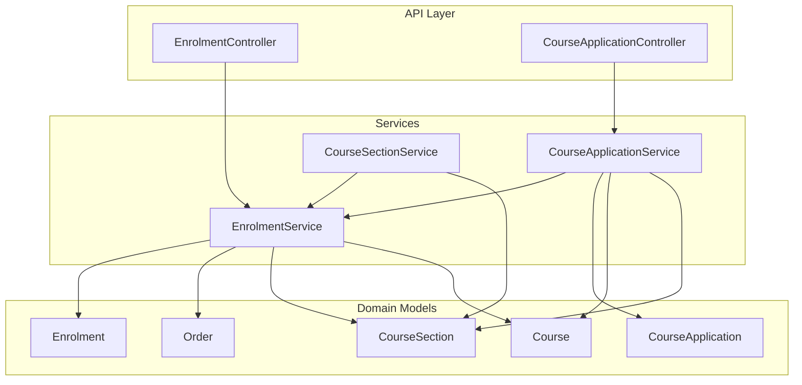
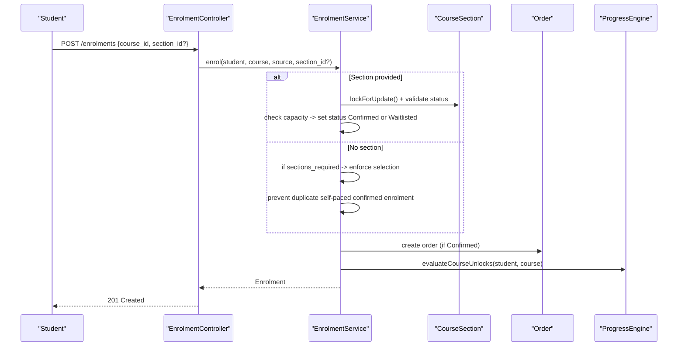
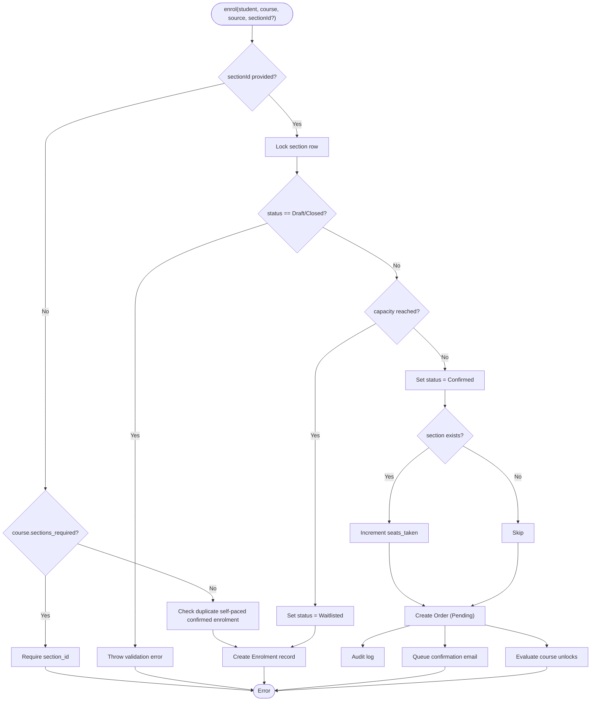
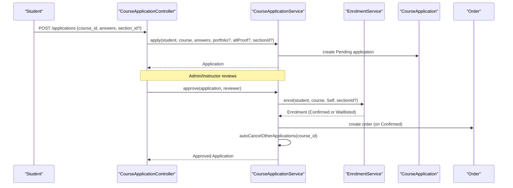
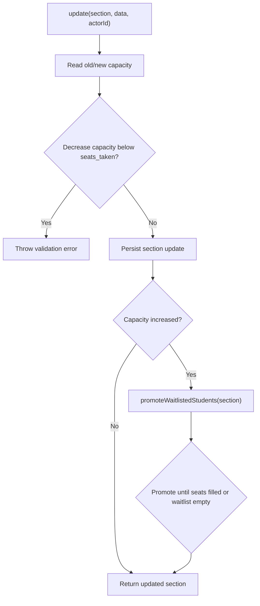
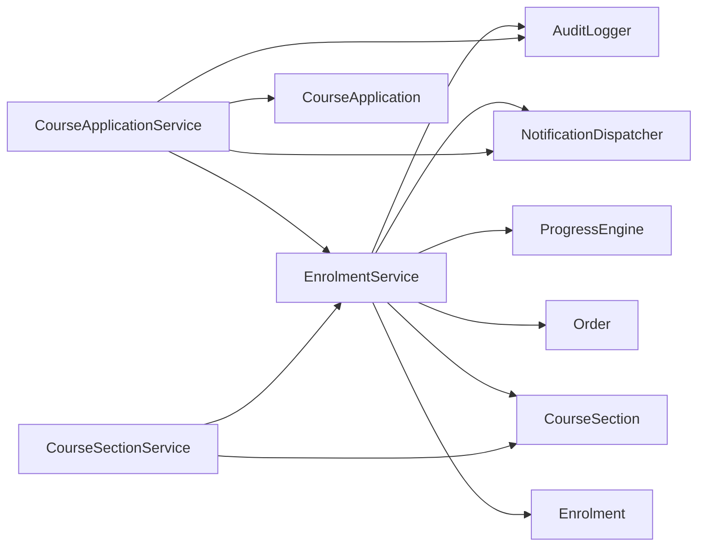

# Enrollment & Cohort System

<cite>
**Referenced Files in This Document**
- [EnrolmentService.php](file://app/Services/Enrolment/EnrolmentService.php)
- [CourseApplicationService.php](file://app/Services/Enrolment/CourseApplicationService.php)
- [CourseSectionService.php](file://app/Services/Enrolment/CourseSectionService.php)
- [EnrolmentController.php](file://app/Http/Controllers/Api/V1/EnrolmentController.php)
- [CourseApplicationController.php](file://app/Http/Controllers/Api/V1/CourseApplicationController.php)
- [Enrolment.php](file://app/Models/Enrolment.php)
- [CourseApplication.php](file://app/Models/CourseApplication.php)
- [Course.php](file://app/Models/Course.php)
- [CourseSection.php](file://app/Models/CourseSection.php)
- [Order.php](file://app/Models/Order.php)
- [EnrolmentStatus.php](file://app/Enums/EnrolmentStatus.php)
- [CourseEnrolmentPolicy.php](file://app/Enums/CourseEnrolmentPolicy.php)
- [CourseSectionStatus.php](file://app/Enums/CourseSectionStatus.php)
- [EnrolmentSource.php](file://app/Enums/EnrolmentSource.php)
</cite>

## Table of Contents
1. Introduction
2. Project Structure
3. Core Components
4. Architecture Overview
5. Detailed Component Analysis
6. Dependency Analysis
7. Performance Considerations
8. Troubleshooting Guide
9. Conclusion

## Introduction
This document explains the Enrollment & Cohort System, focusing on enrollment policies, cohort-based learning workflows, application processing, and waitlist handling. It details how EnrolmentService and CourseApplicationService implement automatic versus manual enrollment, section-based access control, and enrollment status management. It also maps relationships to course sections, applications, orders, and progress tracking.

## Project Structure
The enrollment and cohort system spans services, models, enums, and API controllers:
- Services: EnrolmentService (enrollment lifecycle), CourseApplicationService (application lifecycle), CourseSectionService (cohort capacity and promotions).
- Models: Enrolment, CourseApplication, CourseSection, Course, Order.
- Enums: EnrolmentStatus, CourseEnrolmentPolicy, CourseSectionStatus, EnrolmentSource.
- Controllers: EnrolmentController (self-enrollment and withdrawal), CourseApplicationController (apply, approve, reject, dismiss).

**Diagram sources**
- [EnrolmentController.php:20-76](file://app/Http/Controllers/Api/V1/EnrolmentController.php#L20-L76)
- [CourseApplicationController.php:19-104](file://app/Http/Controllers/Api/V1/CourseApplicationController.php#L19-L104)
- [EnrolmentService.php:30-249](file://app/Services/Enrolment/EnrolmentService.php#L30-L249)
- [CourseApplicationService.php:26-289](file://app/Services/Enrolment/CourseApplicationService.php#L26-L289)
- [CourseSectionService.php:19-164](file://app/Services/Enrolment/CourseSectionService.php#L19-L164)
- [Enrolment.php:15-76](file://app/Models/Enrolment.php#L15-L76)
- [CourseApplication.php:14-89](file://app/Models/CourseApplication.php#L14-L89)
- [CourseSection.php:14-119](file://app/Models/CourseSection.php#L14-L119)
- [Course.php:17-180](file://app/Models/Course.php#L17-L180)
- [Order.php:16-101](file://app/Models/Order.php#L16-L101)

**Section sources**
- [EnrolmentController.php:20-76](file://app/Http/Controllers/Api/V1/EnrolmentController.php#L20-L76)
- [CourseApplicationController.php:19-104](file://app/Http/Controllers/Api/V1/CourseApplicationController.php#L19-L104)
- [EnrolmentService.php:30-249](file://app/Services/Enrolment/EnrolmentService.php#L30-L249)
- [CourseApplicationService.php:26-289](file://app/Services/Enrolment/CourseApplicationService.php#L26-L289)
- [CourseSectionService.php:19-164](file://app/Services/Enrolment/CourseSectionService.php#L19-L164)
- [Enrolment.php:15-76](file://app/Models/Enrolment.php#L15-L76)
- [CourseApplication.php:14-89](file://app/Models/CourseApplication.php#L14-L89)
- [CourseSection.php:14-119](file://app/Models/CourseSection.php#L14-L119)
- [Course.php:17-180](file://app/Models/Course.php#L17-L180)
- [Order.php:16-101](file://app/Models/Order.php#L16-L101)

## Core Components
- EnrolmentService: Handles self-enrollment and admin-driven enrollment, enforces section capacity and status rules, manages waitlisting, order creation, audit logging, email queuing, and progress evaluation.
- CourseApplicationService: Manages application submission, approval/rejection flows, auto-cancellation of other pending applications for the same course, dashboard visibility logic, and dismissal.
- CourseSectionService: Creates/updates/deletes cohorts (sections), validates capacity changes, and promotes waitlisted students when capacity increases.
- Models and Enums: Enrolment, CourseApplication, CourseSection, Course, Order; EnrolmentStatus, CourseEnrolmentPolicy, CourseSectionStatus, EnrolmentSource.

Key behaviors:
- Automatic enrollment for Open/Advisory courses; Application-policy courses require review before enrollment.
- Section-aware enrollment with capacity checks and waitlisting.
- Withdrawal triggers seat release and waitlist promotion.
- Capacity increase triggers batch promotion of oldest waitlisted enrollments.

**Section sources**
- [EnrolmentService.php:30-249](file://app/Services/Enrolment/EnrolmentService.php#L30-L249)
- [CourseApplicationService.php:26-289](file://app/Services/Enrolment/CourseApplicationService.php#L26-L289)
- [CourseSectionService.php:19-164](file://app/Services/Enrolment/CourseSectionService.php#L19-L164)
- [Enrolment.php:15-76](file://app/Models/Enrolment.php#L15-L76)
- [CourseApplication.php:14-89](file://app/Models/CourseApplication.php#L14-L89)
- [CourseSection.php:14-119](file://app/Models/CourseSection.php#L14-L119)
- [Course.php:17-180](file://app/Models/Course.php#L17-L180)
- [Order.php:16-101](file://app/Models/Order.php#L16-L101)
- [EnrolmentStatus.php:7-13](file://app/Enums/EnrolmentStatus.php#L7-L13)
- [CourseEnrolmentPolicy.php:7-27](file://app/Enums/CourseEnrolmentPolicy.php#L7-L27)
- [CourseSectionStatus.php:7-15](file://app/Enums/CourseSectionStatus.php#L7-L15)
- [EnrolmentSource.php:7-12](file://app/Enums/EnrolmentSource.php#L7-L12)

## Architecture Overview
The system separates concerns across layers:
- API controllers accept requests and delegate to services.
- Services enforce business rules, coordinate domain models, and trigger side effects (orders, emails, notifications, progress evaluation).
- Models encapsulate data and relationships; enums standardize states and policies.

**Diagram sources**
- [EnrolmentController.php:43-61](file://app/Http/Controllers/Api/V1/EnrolmentController.php#L43-L61)
- [EnrolmentService.php:44-147](file://app/Services/Enrolment/EnrolmentService.php#L44-L147)
- [CourseSection.php:14-119](file://app/Models/CourseSection.php#L14-L119)
- [Order.php:16-101](file://app/Models/Order.php#L16-L101)

## Detailed Component Analysis

### EnrolmentService
Responsibilities:
- Enroll a student into a course, optionally into a specific section.
- Enforce section status and capacity constraints; mark as waitlisted when full.
- Prevent duplicate self-paced confirmed enrollments when no section is specified.
- Create orders for confirmed enrollments, log audits, queue confirmation emails, and evaluate course unlocks.
- Handle withdrawals, releasing seats and promoting waitlisted students.
- Promote from waitlist: confirm enrollment, increment seats, create order, notify, queue email, evaluate unlocks.

Concurrency and safety:
- Uses database transactions and pessimistic locking on sections to avoid race conditions during capacity checks and updates.

**Diagram sources**
- [EnrolmentService.php:44-147](file://app/Services/Enrolment/EnrolmentService.php#L44-L147)

**Section sources**
- [EnrolmentService.php:44-147](file://app/Services/Enrolment/EnrolmentService.php#L44-L147)
- [EnrolmentService.php:157-249](file://app/Services/Enrolment/EnrolmentService.php#L157-L249)
- [EnrolmentStatus.php:7-13](file://app/Enums/EnrolmentStatus.php#L7-L13)
- [CourseSectionStatus.php:7-15](file://app/Enums/CourseSectionStatus.php#L7-L15)
- [EnrolmentSource.php:7-12](file://app/Enums/EnrolmentSource.php#L7-L12)

### CourseApplicationService
Responsibilities:
- Apply to a course that requires an application; prevent duplicates for the same course/section combination.
- Approve an application: transition to approved, enroll via EnrolmentService (may be confirmed or waitlisted), notify student, auto-cancel other pending applications for the same course.
- Reject an application with optional recommended courses and reason; notify student.
- Provide dashboard-visible applications: pending plus recent rejected not dismissed and not acted upon.
- Dismiss rejected applications to hide them from the dashboard.

**Diagram sources**
- [CourseApplicationController.php:56-93](file://app/Http/Controllers/Api/V1/CourseApplicationController.php#L56-L93)
- [CourseApplicationService.php:44-154](file://app/Services/Enrolment/CourseApplicationService.php#L44-L154)
- [EnrolmentService.php:44-147](file://app/Services/Enrolment/EnrolmentService.php#L44-L147)
- [CourseApplication.php:14-89](file://app/Models/CourseApplication.php#L14-L89)
- [Order.php:16-101](file://app/Models/Order.php#L16-L101)

**Section sources**
- [CourseApplicationService.php:44-154](file://app/Services/Enrolment/CourseApplicationService.php#L44-L154)
- [CourseApplicationService.php:156-289](file://app/Services/Enrolment/CourseApplicationService.php#L156-L289)
- [CourseApplication.php:14-89](file://app/Models/CourseApplication.php#L14-L89)

### CourseSectionService
Responsibilities:
- Create/update/delete cohorts (sections).
- Validate capacity decreases against current enrollment counts.
- On capacity increase, promote oldest waitlisted enrollments up to available seats.
- Protect deletion by ensuring no enrollment or application history exists.

**Diagram sources**
- [CourseSectionService.php:54-89](file://app/Services/Enrolment/CourseSectionService.php#L54-L89)
- [CourseSectionService.php:134-162](file://app/Services/Enrolment/CourseSectionService.php#L134-L162)

**Section sources**
- [CourseSectionService.php:29-89](file://app/Services/Enrolment/CourseSectionService.php#L29-L89)
- [CourseSectionService.php:96-128](file://app/Services/Enrolment/CourseSectionService.php#L96-L128)
- [CourseSectionService.php:134-162](file://app/Services/Enrolment/CourseSectionService.php#L134-L162)

### Enrollment Status Management
States:
- Confirmed: active enrollment; grants access; order created; progress evaluated.
- Waitlisted: reserved position; no access until promoted; no order created at this stage.
- Withdrawn: student dropped; seat released; waitlist promotion may occur.

Transitions:
- Self-enrollment or application approval can result in Confirmed or Waitlisted depending on section capacity.
- Withdrawal transitions to Withdrawn and triggers seat release and potential promotion.
- Capacity increase triggers promotion from Waitlisted to Confirmed.

**Section sources**
- [EnrolmentStatus.php:7-13](file://app/Enums/EnrolmentStatus.php#L7-L13)
- [EnrolmentService.php:44-249](file://app/Services/Enrolment/EnrolmentService.php#L44-L249)
- [CourseSectionService.php:134-162](file://app/Services/Enrolment/CourseSectionService.php#L134-L162)

### Section-Based Access Control
Rules enforced:
- If a section is Draft or Closed, enrollment is blocked.
- If a course requires sections, enrollment without a section is blocked.
- Duplicate self-paced confirmed enrollment is prevented when no section is specified.
- Applications are scoped to a course and optionally a section; duplicates are prevented per scope.

**Section sources**
- [EnrolmentService.php:51-93](file://app/Services/Enrolment/EnrolmentService.php#L51-L93)
- [CourseApplicationService.php:44-80](file://app/Services/Enrolment/CourseApplicationService.php#L44-L80)
- [CourseSectionStatus.php:7-15](file://app/Enums/CourseSectionStatus.php#L7-L15)

### Relationship to Orders and Progress Tracking
- Orders: Created for confirmed enrollments (including promotions); track amount, currency, and payment status.
- Progress: After confirmed enrollment, course unlocks are evaluated to grant content access.

**Section sources**
- [Order.php:16-101](file://app/Models/Order.php#L16-L101)
- [EnrolmentService.php:107-135](file://app/Services/Enrolment/EnrolmentService.php#L107-L135)
- [EnrolmentService.php:208-249](file://app/Services/Enrolment/EnrolmentService.php#L208-L249)

## Dependency Analysis
Coupling and cohesion:
- EnrolmentService depends on CourseSection, Enrolment, Order, and external services (audit, notifications, progress).
- CourseApplicationService depends on CourseApplication, Course, EnrolmentService, audit, and notifications.
- CourseSectionService depends on CourseSection, Enrolment, and EnrolmentService.

External integration points:
- AuditLogger logs all sensitive mutations (enrollment status changes, application decisions, section updates).
- NotificationDispatcher sends user notifications for approvals, rejections, and waitlist promotions.
- ProgressEngine evaluates course unlocks after confirmed enrollment.

**Diagram sources**
- [EnrolmentService.php:30-249](file://app/Services/Enrolment/EnrolmentService.php#L30-L249)
- [CourseApplicationService.php:26-289](file://app/Services/Enrolment/CourseApplicationService.php#L26-L289)
- [CourseSectionService.php:19-164](file://app/Services/Enrolment/CourseSectionService.php#L19-L164)

**Section sources**
- [EnrolmentService.php:30-249](file://app/Services/Enrolment/EnrolmentService.php#L30-L249)
- [CourseApplicationService.php:26-289](file://app/Services/Enrolment/CourseApplicationService.php#L26-L289)
- [CourseSectionService.php:19-164](file://app/Services/Enrolment/CourseSectionService.php#L19-L164)

## Performance Considerations
- Use of database transactions and pessimistic locking ensures consistency under concurrency for capacity checks and seat updates.
- Batch promotion of waitlisted students on capacity increase limits repeated queries and reduces contention.
- Avoiding duplicate checks prevents unnecessary writes and maintains data integrity.
- Queued confirmation emails decouple I/O from request latency.

[No sources needed since this section provides general guidance]

## Troubleshooting Guide
Common issues and resolutions:
- Cannot enroll in a Draft or Closed section: Ensure section status is Open or InProgress and within application deadlines.
- Course requires a section: Provide a valid section_id when enrolling in courses with sections_required enabled.
- Already enrolled: For self-paced courses without sections, ensure there is no existing confirmed enrollment.
- Application already pending: You cannot submit another pending application for the same course/section combination.
- Capacity decrease blocked: Cannot reduce capacity below current enrollment count; adjust accordingly.
- Cannot delete section with history: Use Close instead of Delete for sections with enrollment or application history.

Operational checks:
- Verify audit logs for enrollment status changes and application decisions.
- Confirm orders exist for confirmed enrollments and promotions.
- Validate notifications were dispatched for approvals, rejections, and promotions.

**Section sources**
- [EnrolmentService.php:51-93](file://app/Services/Enrolment/EnrolmentService.php#L51-L93)
- [CourseApplicationService.php:44-80](file://app/Services/Enrolment/CourseApplicationService.php#L44-L80)
- [CourseSectionService.php:54-89](file://app/Services/Enrolment/CourseSectionService.php#L54-L89)
- [CourseSectionService.php:96-128](file://app/Services/Enrolment/CourseSectionService.php#L96-L128)

## Conclusion
The Enrollment & Cohort System provides robust, policy-driven enrollment workflows with clear separation between self-service and application-managed paths. Section-based controls and waitlist handling ensure fair access and accurate capacity management. The design integrates auditing, notifications, orders, and progress evaluation to deliver a cohesive learning experience aligned with course policies and cohort structures.

[No sources needed since this section summarizes without analyzing specific files]