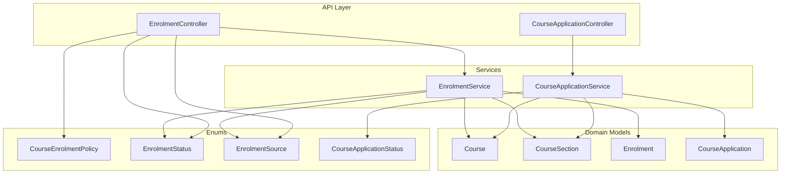
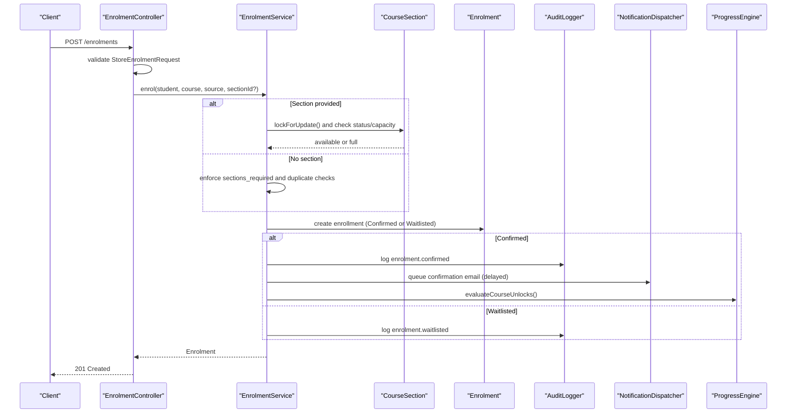
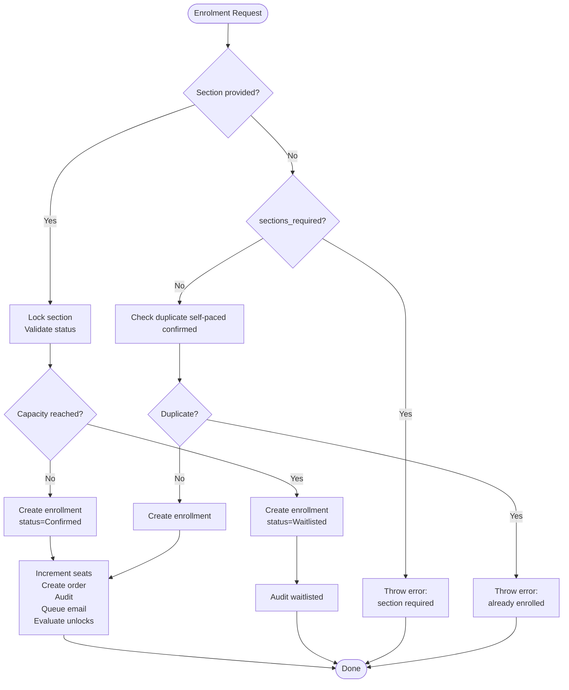
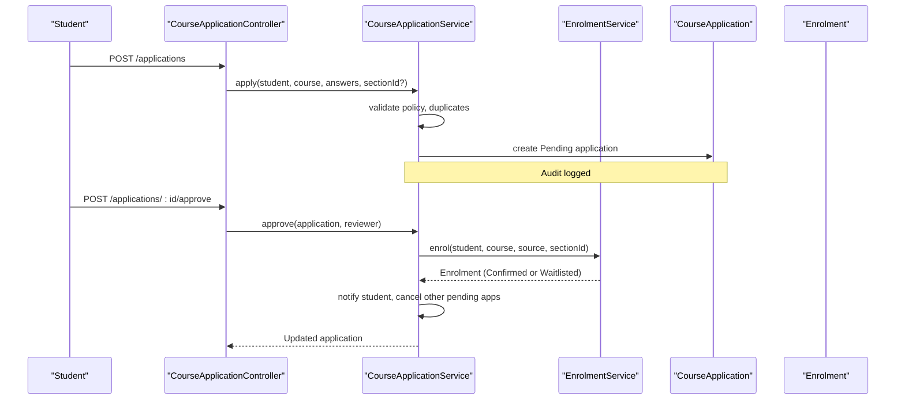
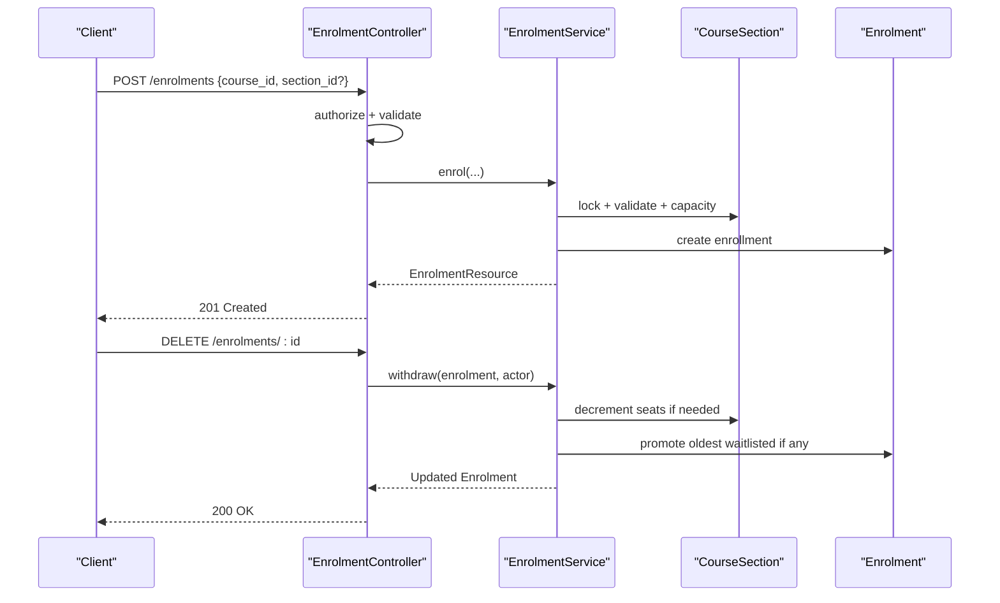
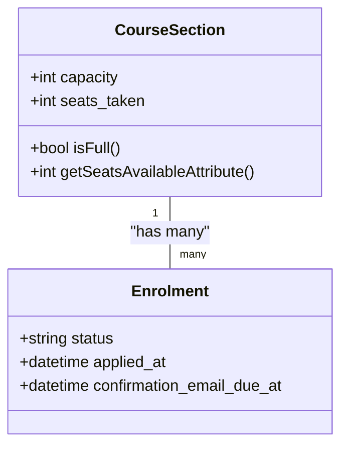
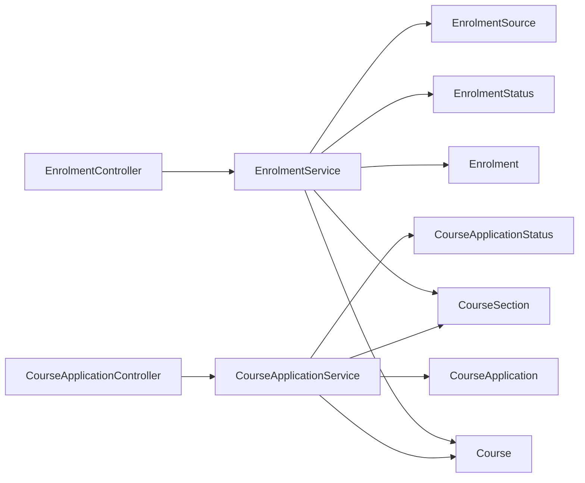

# Enrollment Policies & Workflows

<cite>
**Referenced Files in This Document**
- [EnrolmentService.php](file://app/Services/Enrolment/EnrolmentService.php)
- [CourseApplicationService.php](file://app/Services/Enrolment/CourseApplicationService.php)
- [EnrolmentController.php](file://app/Http/Controllers/Api/V1/EnrolmentController.php)
- [CourseApplicationController.php](file://app/Http/Controllers/Api/V1/CourseApplicationController.php)
- [StoreEnrolmentRequest.php](file://app/Http/Requests/Api/V1/StoreEnrolmentRequest.php)
- [Enrolment.php](file://app/Models/Enrolment.php)
- [Course.php](file://app/Models/Course.php)
- [CourseSection.php](file://app/Models/CourseSection.php)
- [CourseApplication.php](file://app/Models/CourseApplication.php)
- [CourseEnrolmentPolicy.php](file://app/Enums/CourseEnrolmentPolicy.php)
- [EnrolmentStatus.php](file://app/Enums/EnrolmentStatus.php)
- [EnrolmentSource.php](file://app/Enums/EnrolmentSource.php)
- [CourseApplicationStatus.php](file://app/Enums/CourseApplicationStatus.php)
- [2026_07_29_030000_add_enrolment_policy_to_courses_table.php](file://database/migrations/2026_07_29_030000_add_enrolment_policy_to_courses_table.php)
</cite>

## Table of Contents
1. Introduction
2. Project Structure
3. Core Components
4. Architecture Overview
5. Detailed Component Analysis
6. Dependency Analysis
7. Performance Considerations
8. Troubleshooting Guide
9. Conclusion

## Introduction
This document explains how enrollment policies and workflows control student access to courses in the ResNet Academy LMS. It covers policy types, the EnrolmentService implementation (automatic enrollment logic, status transitions, validation), end-to-end enrollment flows, error handling, waitlist management, enrollment limits, cohort-specific rules, and integration with course sections.

## Project Structure
The enrollment system spans controllers, services, models, enums, and migrations:
- Controllers expose API endpoints for self-enrollment and application submission/review.
- Services encapsulate business rules for enrollment, applications, and waitlist promotion.
- Models define data relationships and computed attributes for capacity and availability.
- Enums standardize policy, status, and source values.
- Migration adds enrollment policy configuration to courses.

**Diagram sources**
- [EnrolmentController.php:20-76](file://app/Http/Controllers/Api/V1/EnrolmentController.php#L20-L76)
- [CourseApplicationController.php:19-104](file://app/Http/Controllers/Api/V1/CourseApplicationController.php#L19-L104)
- [EnrolmentService.php:30-249](file://app/Services/Enrolment/EnrolmentService.php#L30-L249)
- [CourseApplicationService.php:26-289](file://app/Services/Enrolment/CourseApplicationService.php#L26-L289)
- [Course.php:17-180](file://app/Models/Course.php#L17-L180)
- [CourseSection.php:14-119](file://app/Models/CourseSection.php#L14-L119)
- [Enrolment.php:15-76](file://app/Models/Enrolment.php#L15-L76)
- [CourseApplication.php:14-89](file://app/Models/CourseApplication.php#L14-L89)
- [CourseEnrolmentPolicy.php:7-26](file://app/Enums/CourseEnrolmentPolicy.php#L7-L26)
- [EnrolmentStatus.php:7-12](file://app/Enums/EnrolmentStatus.php#L7-L12)
- [EnrolmentSource.php:7-11](file://app/Enums/EnrolmentSource.php#L7-L11)
- [CourseApplicationStatus.php:7-12](file://app/Enums/CourseApplicationStatus.php#L7-L12)

**Section sources**
- [EnrolmentController.php:20-76](file://app/Http/Controllers/Api/V1/EnrolmentController.php#L20-L76)
- [CourseApplicationController.php:19-104](file://app/Http/Controllers/Api/V1/CourseApplicationController.php#L19-L104)
- [EnrolmentService.php:30-249](file://app/Services/Enrolment/EnrolmentService.php#L30-L249)
- [CourseApplicationService.php:26-289](file://app/Services/Enrolment/CourseApplicationService.php#L26-L289)
- [Course.php:17-180](file://app/Models/Course.php#L17-L180)
- [CourseSection.php:14-119](file://app/Models/CourseSection.php#L14-L119)
- [Enrolment.php:15-76](file://app/Models/Enrolment.php#L15-L76)
- [CourseApplication.php:14-89](file://app/Models/CourseApplication.php#L14-L89)
- [CourseEnrolmentPolicy.php:7-26](file://app/Enums/CourseEnrolmentPolicy.php#L7-L26)
- [EnrolmentStatus.php:7-12](file://app/Enums/EnrolmentStatus.php#L7-L12)
- [EnrolmentSource.php:7-11](file://app/Enums/EnrolmentSource.php#L7-L11)
- [CourseApplicationStatus.php:7-12](file://app/Enums/CourseApplicationStatus.php#L7-L12)
- [2026_07_29_030000_add_enrolment_policy_to_courses_table.php:16-44](file://database/migrations/2026_07_29_030000_add_enrolment_policy_to_courses_table.php#L16-L44)

## Core Components
- Enrollment policies: Open, Advisory, Application. These determine whether students can self-enroll directly or must submit an application for admin review.
- Enrollment service: Centralizes enrollment creation, waitlisting, withdrawal, promotion, auditing, notifications, and progress evaluation.
- Application service: Manages application lifecycle (submit, approve, reject, dismiss) and converts approved applications into enrollments.
- Models and enums: Define entities, statuses, sources, and policy configuration.

Key responsibilities:
- EnrolmentService: Validates section state/capacity, creates enrollments, handles waitlists, decrements seats on withdrawal, promotes waitlisted students, logs audits, dispatches emails, and evaluates course unlocks.
- CourseApplicationService: Validates application eligibility, prevents duplicates, stores applications, approves/rejects/dismisses, auto-cancels other pending applications upon approval, and notifies students.

**Section sources**
- [CourseEnrolmentPolicy.php:7-26](file://app/Enums/CourseEnrolmentPolicy.php#L7-L26)
- [EnrolmentService.php:30-249](file://app/Services/Enrolment/EnrolmentService.php#L30-L249)
- [CourseApplicationService.php:26-289](file://app/Services/Enrolment/CourseApplicationService.php#L26-L289)
- [Enrolment.php:15-76](file://app/Models/Enrolment.php#L15-L76)
- [Course.php:17-180](file://app/Models/Course.php#L17-L180)
- [CourseSection.php:14-119](file://app/Models/CourseSection.php#L14-L119)
- [CourseApplication.php:14-89](file://app/Models/CourseApplication.php#L14-L89)
- [EnrolmentStatus.php:7-12](file://app/Enums/EnrolmentStatus.php#L7-L12)
- [EnrolmentSource.php:7-11](file://app/Enums/EnrolmentSource.php#L7-L11)
- [CourseApplicationStatus.php:7-12](file://app/Enums/CourseApplicationStatus.php#L7-L12)

## Architecture Overview
The enrollment architecture separates concerns across layers:
- API layer validates requests and delegates to services.
- Services enforce business rules, coordinate domain models, and trigger side effects (audit logs, notifications, emails).
- Domain models provide relationships and computed attributes for capacity and availability.
- Enums standardize policy, status, and source values.

**Diagram sources**
- [EnrolmentController.php:43-61](file://app/Http/Controllers/Api/V1/EnrolmentController.php#L43-L61)
- [StoreEnrolmentRequest.php:11-30](file://app/Http/Requests/Api/V1/StoreEnrolmentRequest.php#L11-L30)
- [EnrolmentService.php:44-147](file://app/Services/Enrolment/EnrolmentService.php#L44-L147)
- [CourseSection.php:14-119](file://app/Models/CourseSection.php#L14-L119)
- [Enrolment.php:15-76](file://app/Models/Enrolment.php#L15-L76)

**Section sources**
- [EnrolmentController.php:43-61](file://app/Http/Controllers/Api/V1/EnrolmentController.php#L43-L61)
- [StoreEnrolmentRequest.php:11-30](file://app/Http/Requests/Api/V1/StoreEnrolmentRequest.php#L11-L30)
- [EnrolmentService.php:44-147](file://app/Services/Enrolment/EnrolmentService.php#L44-L147)

## Detailed Component Analysis

### Enrollment Policies
- Open: Students can self-enroll immediately via the enrollment endpoint.
- Advisory: Self-enrollment is allowed; additional attestation may be configured per course.
- Application: Direct self-enrollment is blocked; students must submit an application that requires admin/instructor review before enrollment.

Policy defaults by level are provided, and the migration adds policy fields to courses.

**Section sources**
- [CourseEnrolmentPolicy.php:7-26](file://app/Enums/CourseEnrolmentPolicy.php#L7-L26)
- [2026_07_29_030000_add_enrolment_policy_to_courses_table.php:16-44](file://database/migrations/2026_07_29_030000_add_enrolment_policy_to_courses_table.php#L16-L44)
- [Course.php:22-56](file://app/Models/Course.php#L22-L56)

### EnrolmentService: Automatic Enrollment, Status Transitions, Validation
- Enrollment creation:
  - If a section is specified, it locks the row, validates status (not Draft/Closed), and checks capacity. If full, enrollment is created as Waitlisted.
  - If no section is specified, enforces sections_required and prevents duplicate self-paced confirmed enrollments.
  - Creates an enrollment record with applied_at and delayed confirmation email scheduling.
  - For confirmed enrollments: increments seats_taken (if sectioned), creates an order, logs audit, queues confirmation email, and evaluates course unlocks.
  - For waitlisted enrollments: logs audit without incrementing seats.
- Withdrawal:
  - Marks enrollment as Withdrawn, logs audit, decrements seats_taken if previously confirmed and sectioned, and promotes the oldest waitlisted enrollment if available.
- Promotion from waitlist:
  - Updates status to Confirmed, increments seats_taken, creates order, logs audit, sends notification, queues confirmation email, and evaluates course unlocks.

**Diagram sources**
- [EnrolmentService.php:44-147](file://app/Services/Enrolment/EnrolmentService.php#L44-L147)

**Section sources**
- [EnrolmentService.php:44-147](file://app/Services/Enrolment/EnrolmentService.php#L44-L147)
- [EnrolmentService.php:157-200](file://app/Services/Enrolment/EnrolmentService.php#L157-L200)
- [EnrolmentService.php:208-249](file://app/Services/Enrolment/EnrolmentService.php#L208-L249)

### Course Applications: Submit, Approve, Reject, Dismiss
- Apply:
  - Validates course policy is Application, checks for existing confirmed enrollment or pending application for the same course/section, and creates a pending application.
- Approve:
  - Marks application as Approved, calls EnrolmentService::enrol to create enrollment (may be confirmed or waitlisted based on section capacity), notifies student, and auto-cancels other pending applications for the same course.
- Reject:
  - Marks application as Rejected, optionally records recommended courses and rejection reason, notifies student.
- Dismiss:
  - Marks application as dismissed for dashboard visibility purposes.

**Diagram sources**
- [CourseApplicationController.php:56-81](file://app/Http/Controllers/Api/V1/CourseApplicationController.php#L56-L81)
- [CourseApplicationService.php:44-154](file://app/Services/Enrolment/CourseApplicationService.php#L44-L154)
- [EnrolmentService.php:44-147](file://app/Services/Enrolment/EnrolmentService.php#L44-L147)

**Section sources**
- [CourseApplicationService.php:44-154](file://app/Services/Enrolment/CourseApplicationService.php#L44-L154)
- [CourseApplicationService.php:156-190](file://app/Services/Enrolment/CourseApplicationService.php#L156-L190)
- [CourseApplicationService.php:195-233](file://app/Services/Enrolment/CourseApplicationService.php#L195-L233)
- [CourseApplicationService.php:243-287](file://app/Services/Enrolment/CourseApplicationService.php#L243-L287)

### Enrollment Workflow: From Request to Completion
- Self-enrollment flow:
  - Controller validates request and policy (blocks direct enrollment for Application-policy courses).
  - Service enforces section requirements, capacity, and duplication rules.
  - On success, returns created enrollment with related resources.
- Withdrawal flow:
  - Controller authorizes action and delegates to service to mark withdrawn and handle waitlist promotion.

**Diagram sources**
- [EnrolmentController.php:43-74](file://app/Http/Controllers/Api/V1/EnrolmentController.php#L43-L74)
- [EnrolmentService.php:44-200](file://app/Services/Enrolment/EnrolmentService.php#L44-L200)

**Section sources**
- [EnrolmentController.php:43-74](file://app/Http/Controllers/Api/V1/EnrolmentController.php#L43-L74)
- [EnrolmentService.php:44-200](file://app/Services/Enrolment/EnrolmentService.php#L44-L200)

### Waitlist Management, Enrollment Limits, Cohort-Specific Rules
- Waitlist:
  - When a section reaches capacity, new enrollments are created as Waitlisted.
  - On withdrawal or capacity increase, the oldest waitlisted enrollment is promoted to Confirmed, seats_taken incremented, order created, notification sent, email queued, and course unlocks evaluated.
- Enrollment limits:
  - Section-level capacity enforced via seats_taken vs capacity.
  - Unlimited sections are supported when capacity is null.
- Cohort-specific rules:
  - Courses can require enrollment in a specific section; attempting self-paced enrollment will fail if sections are active and required.
  - Applications can target a specific section; approvals create enrollments scoped to that section.

**Diagram sources**
- [CourseSection.php:14-119](file://app/Models/CourseSection.php#L14-L119)
- [Enrolment.php:15-76](file://app/Models/Enrolment.php#L15-L76)

**Section sources**
- [EnrolmentService.php:44-147](file://app/Services/Enrolment/EnrolmentService.php#L44-L147)
- [EnrolmentService.php:157-200](file://app/Services/Enrolment/EnrolmentService.php#L157-L200)
- [EnrolmentService.php:208-249](file://app/Services/Enrolment/EnrolmentService.php#L208-L249)
- [CourseSection.php:72-119](file://app/Models/CourseSection.php#L72-L119)

### Integration with Course Sections
- Enrollment respects section status and capacity:
  - Draft/Closed sections block enrollment.
  - Confirmed enrollments increment seats_taken; waitlisted do not.
- Applications integrate with sections:
  - Applications can be scoped to a section; approvals create enrollments for that section.
- Dashboard and UI can use computed attributes like seats_available and is_full to guide user actions.

**Section sources**
- [EnrolmentService.php:44-147](file://app/Services/Enrolment/EnrolmentService.php#L44-L147)
- [CourseApplicationService.php:44-154](file://app/Services/Enrolment/CourseApplicationService.php#L44-L154)
- [CourseSection.php:72-119](file://app/Models/CourseSection.php#L72-L119)

## Dependency Analysis
- Controllers depend on services for business logic and on models/resources for responses.
- Services depend on models for data operations and on enums for type-safe states/sources.
- Models define relationships to other entities (courses, sections, users, orders).
- Migrations introduce policy configuration fields on courses.

**Diagram sources**
- [EnrolmentController.php:20-76](file://app/Http/Controllers/Api/V1/EnrolmentController.php#L20-L76)
- [CourseApplicationController.php:19-104](file://app/Http/Controllers/Api/V1/CourseApplicationController.php#L19-L104)
- [EnrolmentService.php:30-249](file://app/Services/Enrolment/EnrolmentService.php#L30-L249)
- [CourseApplicationService.php:26-289](file://app/Services/Enrolment/CourseApplicationService.php#L26-L289)
- [Course.php:17-180](file://app/Models/Course.php#L17-L180)
- [CourseSection.php:14-119](file://app/Models/CourseSection.php#L14-L119)
- [Enrolment.php:15-76](file://app/Models/Enrolment.php#L15-L76)
- [CourseApplication.php:14-89](file://app/Models/CourseApplication.php#L14-L89)
- [EnrolmentStatus.php:7-12](file://app/Enums/EnrolmentStatus.php#L7-L12)
- [EnrolmentSource.php:7-11](file://app/Enums/EnrolmentSource.php#L7-L11)
- [CourseApplicationStatus.php:7-12](file://app/Enums/CourseApplicationStatus.php#L7-L12)

**Section sources**
- [EnrolmentController.php:20-76](file://app/Http/Controllers/Api/V1/EnrolmentController.php#L20-L76)
- [CourseApplicationController.php:19-104](file://app/Http/Controllers/Api/V1/CourseApplicationController.php#L19-L104)
- [EnrolmentService.php:30-249](file://app/Services/Enrolment/EnrolmentService.php#L30-L249)
- [CourseApplicationService.php:26-289](file://app/Services/Enrolment/CourseApplicationService.php#L26-L289)

## Performance Considerations
- Pessimistic locking: Section rows are locked during enrollment to prevent race conditions on capacity checks and seat increments.
- Transactional boundaries: Enrollment and withdrawal operations run within database transactions to ensure consistency.
- Delayed emails: Confirmation emails are dispatched with configurable delays to avoid blocking immediate enrollment response times.
- Efficient queries: Use of exists checks and targeted updates minimizes overhead.

[No sources needed since this section provides general guidance]

## Troubleshooting Guide
Common errors and their causes:
- Application-policy courses: Direct self-enrollment is blocked; students must submit an application first.
- Section not open: Enrollment fails if the section is Draft or Closed.
- Section required: Self-paced enrollment fails if the course requires enrollment in a specific section and active sections exist.
- Duplicate enrollment: Self-paced confirmed enrollment prevented for the same course.
- Capacity exceeded: New enrollments become Waitlisted; monitor waitlist and consider increasing capacity or promoting from waitlist.
- Withdrawal impact: Withdrawing a confirmed enrollment frees a seat and may promote the oldest waitlisted student.

Validation and authorization:
- Requests are validated against schema and existence constraints.
- Authorization checks ensure only permitted actors can perform sensitive actions (e.g., withdrawal).

**Section sources**
- [EnrolmentController.php:43-74](file://app/Http/Controllers/Api/V1/EnrolmentController.php#L43-L74)
- [StoreEnrolmentRequest.php:11-30](file://app/Http/Requests/Api/V1/StoreEnrolmentRequest.php#L11-L30)
- [EnrolmentService.php:44-147](file://app/Services/Enrolment/EnrolmentService.php#L44-L147)
- [EnrolmentService.php:157-200](file://app/Services/Enrolment/EnrolmentService.php#L157-L200)

## Conclusion
The ResNet Academy LMS implements a robust enrollment system governed by clear policies and well-defined workflows. The EnrolmentService centralizes critical logic for automatic enrollment, waitlist management, and status transitions, while the CourseApplicationService manages application lifecycles and integrates seamlessly with enrollment creation. Section-based capacity controls and cohort-specific rules ensure precise access management. Together, these components provide a scalable, auditable, and user-friendly enrollment experience.

[No sources needed since this section summarizes without analyzing specific files]