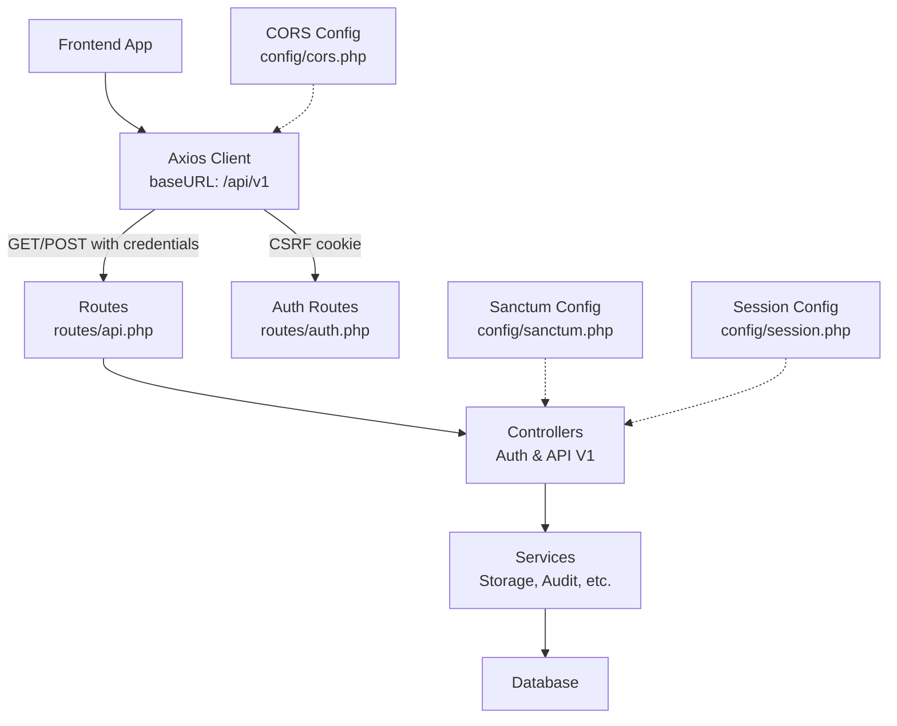
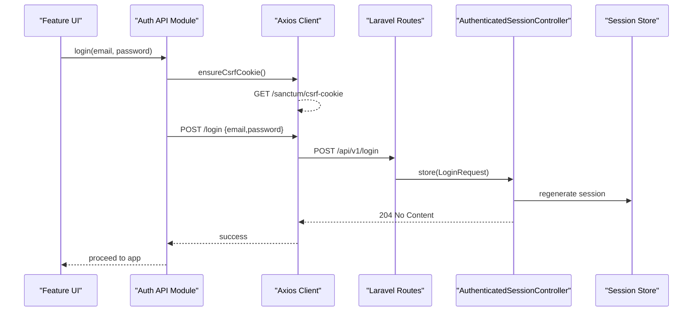
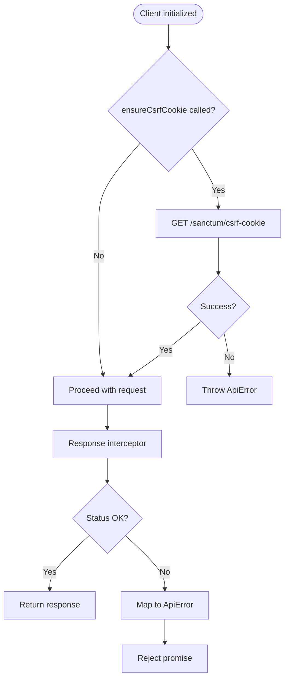
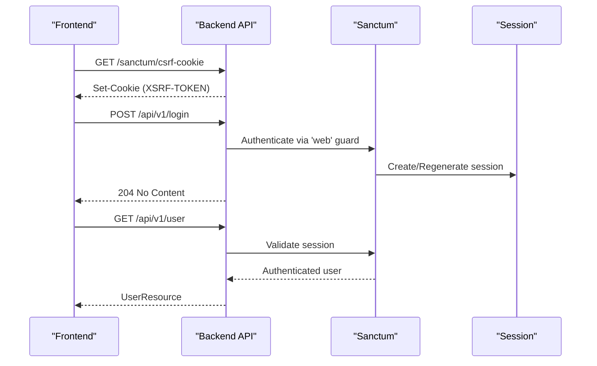
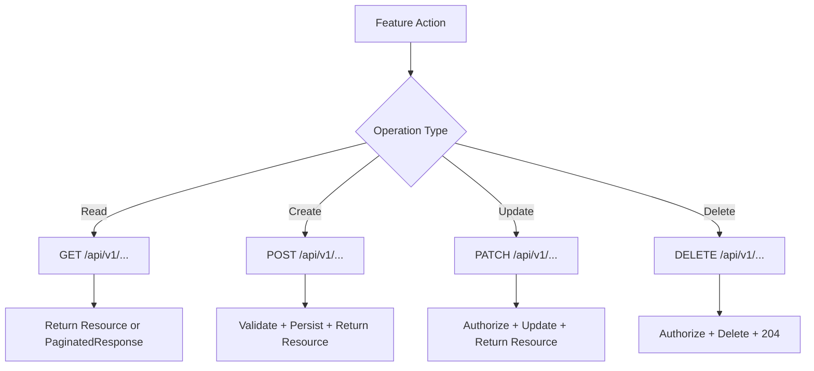
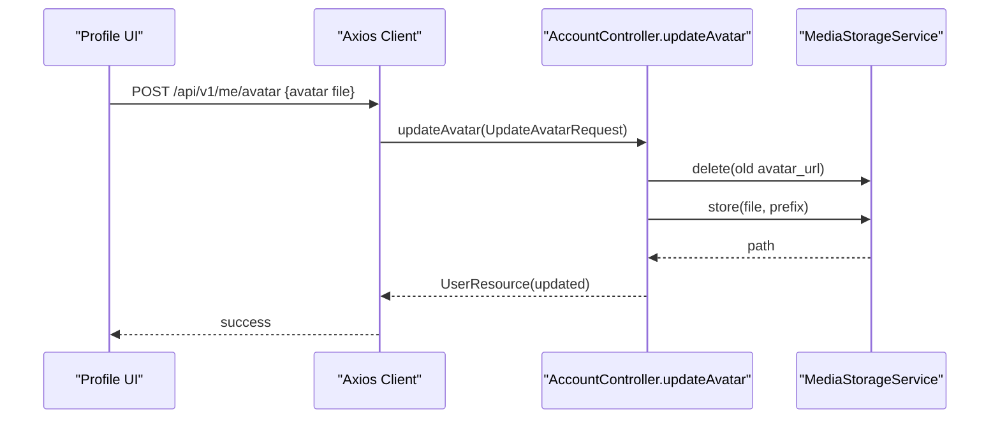
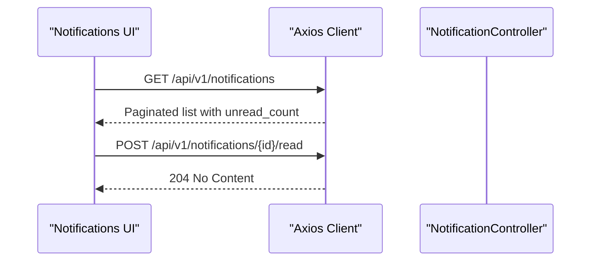
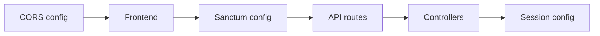

# API Integration Layer

<cite>
**Referenced Files in This Document**
- [routes/api.php](file://routes/api.php)
- [routes/auth.php](file://routes/auth.php)
- [config/sanctum.php](file://config/sanctum.php)
- [config/session.php](file://config/session.php)
- [config/cors.php](file://config/cors.php)
- [AuthenticatedSessionController.php](file://app/Http/Controllers/Auth/AuthenticatedSessionController.php)
- [AccountController.php](file://app/Http/Controllers/Api/V1/AccountController.php)
- [client.ts](file://frontend/src/lib/api/client.ts)
- [auth api.ts](file://frontend/src/features/auth/api.ts)
- [types.ts](file://frontend/src/lib/api/types.ts)
</cite>

## Table of Contents
1. [Introduction](#introduction)
2. [Project Structure](#project-structure)
3. [Core Components](#core-components)
4. [Architecture Overview](#architecture-overview)
5. [Detailed Component Analysis](#detailed-component-analysis)
6. [Dependency Analysis](#dependency-analysis)
7. [Performance Considerations](#performance-considerations)
8. [Troubleshooting Guide](#troubleshooting-guide)
9. [Conclusion](#conclusion)
10. [Appendices](#appendices)

## Introduction
This document explains the API integration layer architecture for a Laravel backend and its frontend client. It focuses on:
- A service-oriented approach to API calls via a centralized HTTP client
- Request/response handling, error normalization, and CSRF/XSRF token management
- Authentication flow with Laravel Sanctum (stateful SPA sessions), including login, logout, and current user retrieval
- Examples of CRUD operations, file uploads, and real-time patterns
- Interceptors, response transformations, and retry strategies
- Testing strategy for API integrations, mock implementations, and offline support patterns
- Guidelines for adding new endpoints while maintaining consistent client patterns

## Project Structure
The API is versioned under /api/v1 and protected by Sanctum stateful sessions where required. The frontend uses an Axios-based client that centralizes base URL, credentials, XSRF token handling, and error transformation.

**Diagram sources**
- [routes/api.php:49-241](file://routes/api.php#L49-L241)
- [routes/auth.php:11-37](file://routes/auth.php#L11-L37)
- [config/sanctum.php:21-40](file://config/sanctum.php#L21-L40)
- [config/cors.php:18-36](file://config/cors.php#L18-L36)
- [config/session.php:21-36](file://config/session.php#L21-L36)

**Section sources**
- [routes/api.php:49-241](file://routes/api.php#L49-L241)
- [routes/auth.php:11-37](file://routes/auth.php#L11-L37)
- [config/sanctum.php:21-40](file://config/sanctum.php#L21-L40)
- [config/cors.php:18-36](file://config/cors.php#L18-L36)
- [config/session.php:21-36](file://config/session.php#L21-L36)

## Core Components
- Frontend HTTP client: Centralized Axios instance with baseURL, credentials, and XSRF token enabled; global response interceptor normalizes errors into a typed ApiError.
- CSRF seeding: ensureCsrfCookie fetches the Sanctum CSRF cookie once per page load before any mutating request.
- Auth API module: Functions for login, register, logout, password reset flows, and fetching the current user.
- Backend routes: Versioned API routes grouped under Sanctum middleware for authenticated endpoints; public endpoints exposed without auth.
- Session and Sanctum configuration: Stateful domains, guards, expiration, and session driver settings.
- Controllers: AuthenticatedSessionController handles login/logout; AccountController exposes profile/avatar/password changes and data export.

**Section sources**
- [client.ts:6-68](file://frontend/src/lib/api/client.ts#L6-L68)
- [auth api.ts:6-61](file://frontend/src/features/auth/api.ts#L6-L61)
- [routes/api.php:49-241](file://routes/api.php#L49-L241)
- [AuthenticatedSessionController.php:18-40](file://app/Http/Controllers/Auth/AuthenticatedSessionController.php#L18-L40)
- [AccountController.php:61-179](file://app/Http/Controllers/Api/V1/AccountController.php#L61-L179)
- [config/sanctum.php:21-40](file://config/sanctum.php#L21-L40)
- [config/session.php:21-36](file://config/session.php#L21-L36)

## Architecture Overview
The integration follows a service-oriented pattern:
- Feature modules call thin API functions that use the shared Axios client
- The client ensures CSRF cookies are present for stateful authentication
- Requests go through Laravel’s routing and Sanctum middleware
- Controllers delegate business logic to services and return JSON resources
- Errors are normalized on the client side for consistent handling

**Diagram sources**
- [client.ts:22-33](file://frontend/src/lib/api/client.ts#L22-L33)
- [auth api.ts:15-18](file://frontend/src/features/auth/api.ts#L15-L18)
- [routes/auth.php:15-17](file://routes/auth.php#L15-L17)
- [AuthenticatedSessionController.php:18-27](file://app/Http/Controllers/Auth/AuthenticatedSessionController.php#L18-L27)

## Detailed Component Analysis

### Frontend API Client
- Base configuration: baseURL points to /api/v1, credentials enabled for cross-origin stateful sessions, Accept header set to JSON.
- CSRF handling: ensureCsrfCookie performs a single GET to /sanctum/csrf-cookie per page load to seed the XSRF cookie required by Sanctum for subsequent mutations.
- Error normalization: Response interceptor maps Axios errors to a typed ApiError with status, code, message, fields, and optional missing_fields.

**Diagram sources**
- [client.ts:6-13](file://frontend/src/lib/api/client.ts#L6-L13)
- [client.ts:22-33](file://frontend/src/lib/api/client.ts#L22-L33)
- [client.ts:54-68](file://frontend/src/lib/api/client.ts#L54-L68)

**Section sources**
- [client.ts:6-68](file://frontend/src/lib/api/client.ts#L6-L68)

### Authentication Flow (Laravel Sanctum)
- Sanctum stateful mode: configured via stateful domains and guard 'web'; supports credentials and CSRF for SPA.
- Login: Frontend calls ensureCsrfCookie then POST /login; backend regenerates session and updates last_login_at.
- Logout: Frontend POST /logout; backend logs out, invalidates session, and regenerates token.
- Current user: GET /api/v1/user returns UserResource when authenticated.

**Diagram sources**
- [config/sanctum.php:21-40](file://config/sanctum.php#L21-L40)
- [routes/auth.php:15-17](file://routes/auth.php#L15-L17)
- [AuthenticatedSessionController.php:18-27](file://app/Http/Controllers/Auth/AuthenticatedSessionController.php#L18-L27)
- [routes/api.php:49-50](file://routes/api.php#L49-L50)

**Section sources**
- [config/sanctum.php:21-40](file://config/sanctum.php#L21-L40)
- [routes/auth.php:15-17](file://routes/auth.php#L15-L17)
- [AuthenticatedSessionController.php:18-27](file://app/Http/Controllers/Auth/AuthenticatedSessionController.php#L18-L27)
- [routes/api.php:49-50](file://routes/api.php#L49-L50)

### Request and Response Handling
- Requests: All feature APIs use the shared client; headers include Accept: application/json; credentials enabled for cross-origin stateful sessions.
- Responses: Successful responses return typed data; errors are transformed into ApiError with structured fields for validation feedback.
- CSRF: Required for all mutating requests behind Sanctum; ensureCsrfCookie must be called prior to login/register/reset flows.

**Section sources**
- [client.ts:6-13](file://frontend/src/lib/api/client.ts#L6-L13)
- [client.ts:54-68](file://frontend/src/lib/api/client.ts#L54-L68)
- [auth api.ts:15-57](file://frontend/src/features/auth/api.ts#L15-L57)

### CRUD Operations Examples
- Catalogue and content: Public read endpoints for categories, courses, resources; authenticated writes for admin/instructor actions.
- Assignments and evaluations: CRUD for assignments and evaluations; submission and grading endpoints for assessments.
- Messaging and tickets: Create/read conversations/messages; create/update tickets and messages.
- Progress and certificates: Read progress dashboards; mark video watch/read/open/attendance; list/show certificates.

**Diagram sources**
- [routes/api.php:53-241](file://routes/api.php#L53-L241)

**Section sources**
- [routes/api.php:53-241](file://routes/api.php#L53-L241)

### File Uploads
- Avatar upload: POST /api/v1/me/avatar or /api/v1/account/avatar accepts multipart/form-data; stored via MediaStorageService with role-based prefix; returns updated UserResource.
- Payment submissions: POST /api/v1/orders/{order}/payment-submissions for receipt uploads.
- Forum posts: Support attachments with type and URL metadata.

**Diagram sources**
- [AccountController.php:61-72](file://app/Http/Controllers/Api/V1/AccountController.php#L61-L72)
- [routes/api.php:84-86](file://routes/api.php#L84-L86)

**Section sources**
- [AccountController.php:61-72](file://app/Http/Controllers/Api/V1/AccountController.php#L61-L72)
- [routes/api.php:84-86](file://routes/api.php#L84-L86)

### Real-Time Features
- Announcements and notifications: Endpoints to list announcements and manage notification read states; suitable for polling or WebSocket broadcasting from server events.
- Live sessions: Resource types include live_session details; attendance tracking endpoints exist for marking presence.

**Diagram sources**
- [routes/api.php:236-240](file://routes/api.php#L236-L240)

**Section sources**
- [routes/api.php:236-240](file://routes/api.php#L236-L240)

### Interceptors, Transformations, and Retry Mechanisms
- Interceptors: Global response interceptor converts Axios errors to ApiError with structured fields for UI handling.
- Transformations: Responses are expected to follow a consistent shape; features unwrap data envelopes (e.g., data.data).
- Retries: Not implemented in the provided client. Recommended additions:
  - Exponential backoff for transient network errors
  - Idempotent request retries for GET/PATCH/DELETE
  - Circuit breaker for repeated failures
  - Local retry queue for offline scenarios

[No sources needed since this section provides general guidance]

### Testing Strategy for API Integrations
- Unit tests: Mock axios calls for each API function to assert request payloads and handle error branches.
- Integration tests: Use Laravel test suite to assert controller behavior, authorization, and resource shapes.
- E2E tests: Playwright scripts can exercise login, navigation, and critical user flows against a running instance.
- Mock implementations: For offline or CI environments, provide local mocks for external storage or third-party services.

**Section sources**
- [client.ts:54-68](file://frontend/src/lib/api/client.ts#L54-L68)
- [routes/api.php:49-241](file://routes/api.php#L49-L241)

### Offline Support Patterns
- Cache reads: Use in-memory or persistent cache for GET endpoints to serve stale data when offline.
- Queue writes: Defer POST/PATCH/DELETE until connectivity restored; reconcile conflicts on reconnect.
- Sync strategy: Implement optimistic updates with rollback on failure; background sync for non-critical mutations.

[No sources needed since this section provides general guidance]

## Dependency Analysis
The integration depends on coordinated configuration and routing:
- CORS allows the frontend domain(s) to make credentialed requests
- Sanctum enables stateful sessions for SPAs using cookies and CSRF tokens
- Sessions persist across requests for authenticated users
- Routes enforce auth:sanctum middleware for protected endpoints

**Diagram sources**
- [config/cors.php:18-36](file://config/cors.php#L18-L36)
- [config/sanctum.php:21-40](file://config/sanctum.php#L21-L40)
- [routes/api.php:49-241](file://routes/api.php#L49-L241)
- [config/session.php:21-36](file://config/session.php#L21-L36)

**Section sources**
- [config/cors.php:18-36](file://config/cors.php#L18-L36)
- [config/sanctum.php:21-40](file://config/sanctum.php#L21-L40)
- [routes/api.php:49-241](file://routes/api.php#L49-L241)
- [config/session.php:21-36](file://config/session.php#L21-L36)

## Performance Considerations
- Minimize payload size by returning only necessary fields via Resources
- Paginate large lists consistently
- Use efficient queries and eager loading in controllers/services
- Avoid unnecessary re-authentication by leveraging stateful sessions
- Cache static or infrequently changing data at CDN or edge layers

[No sources needed since this section provides general guidance]

## Troubleshooting Guide
Common issues and resolutions:
- 401 Unauthorized: Ensure ensureCsrfCookie is called before login/register/reset; verify CORS and Sanctum stateful domains; confirm session cookie is accepted by the browser.
- Validation errors: Inspect ApiError.fields for field-specific messages; map them to form controls.
- Network errors: Handle ApiError.code === 'network_error' with retry or fallback UI.
- File upload failures: Verify multipart/form-data usage and storage permissions; check media storage service responses.

**Section sources**
- [client.ts:54-68](file://frontend/src/lib/api/client.ts#L54-L68)
- [config/sanctum.php:21-40](file://config/sanctum.php#L21-L40)
- [config/cors.php:18-36](file://config/cors.php#L18-L36)

## Conclusion
The API integration layer combines a robust Laravel backend with a disciplined frontend client. Sanctum stateful sessions secure authenticated flows, while a centralized Axios client standardizes error handling and CSRF management. The modular route structure and service-oriented controllers enable scalable feature development. Following the guidelines here will help maintain consistency, reliability, and performance as the system evolves.

## Appendices

### Adding New API Endpoints
- Define routes under routes/api.php within appropriate groups (public vs. auth:sanctum)
- Implement controller methods with request validation and policy checks
- Return consistent JSON structures using Resources
- Add corresponding frontend API functions using the shared client
- Include tests for both backend and frontend

**Section sources**
- [routes/api.php:49-241](file://routes/api.php#L49-L241)

### Maintaining Consistent Client Patterns
- Always use the shared client for requests
- Call ensureCsrfCookie before any mutating operation
- Normalize errors using ApiError and handle fields appropriately
- Keep feature modules focused on orchestration; avoid direct axios usage

**Section sources**
- [client.ts:6-68](file://frontend/src/lib/api/client.ts#L6-L68)
- [auth api.ts:6-61](file://frontend/src/features/auth/api.ts#L6-L61)