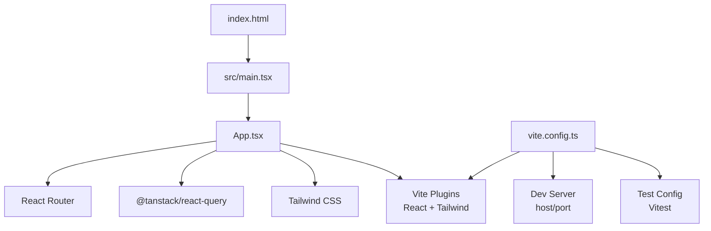
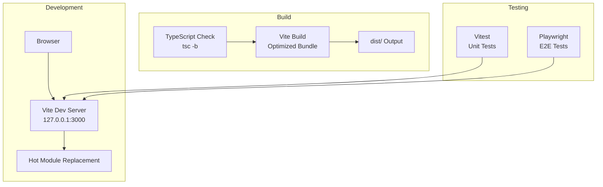
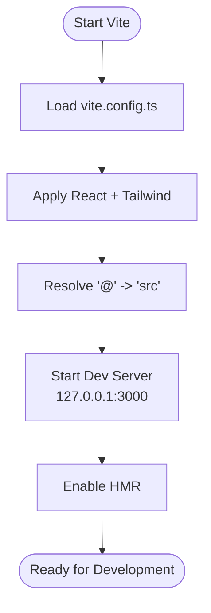
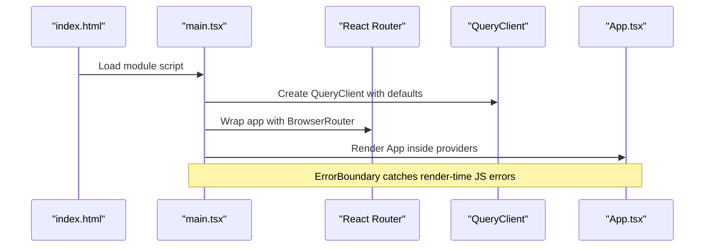
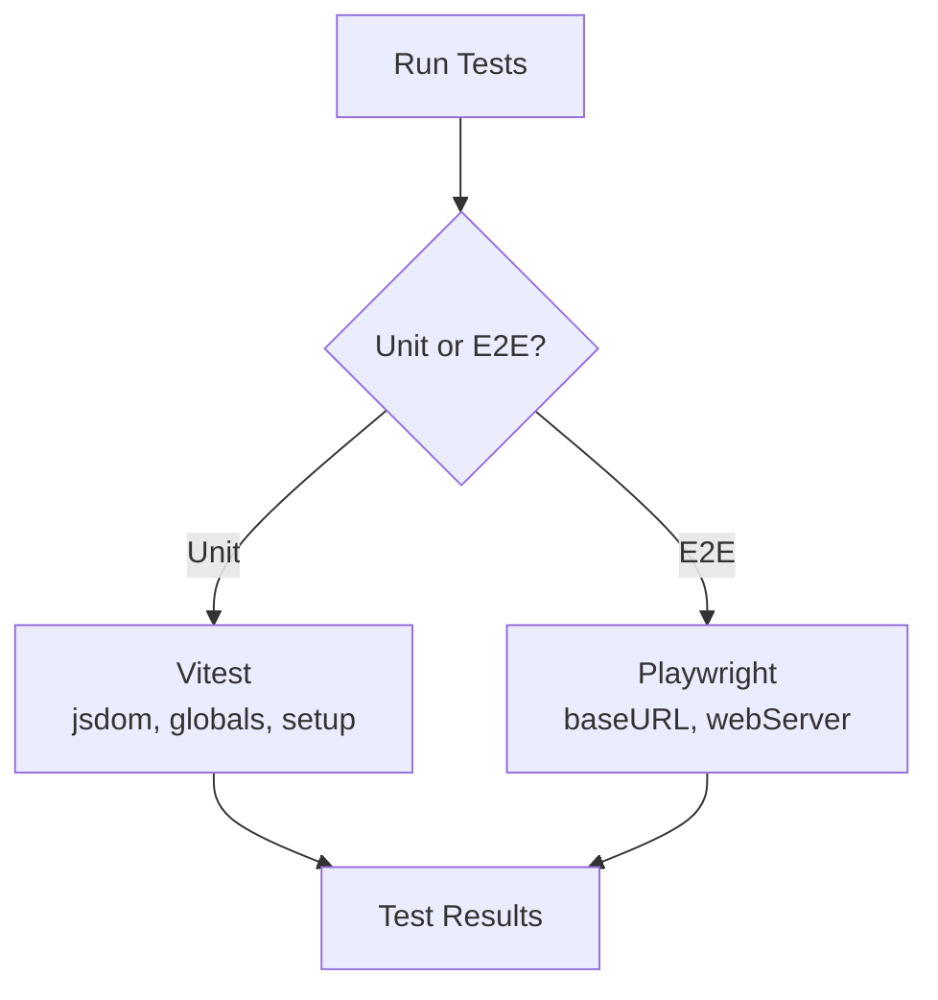
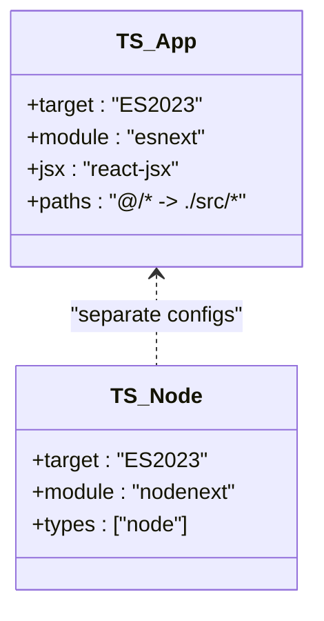
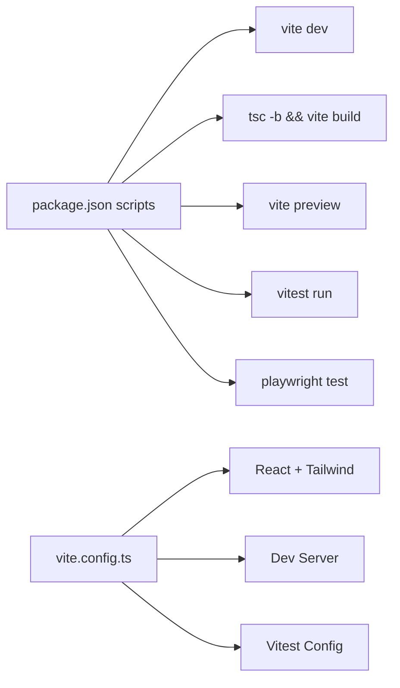

# Build & Deployment

<cite>
**Referenced Files in This Document**
- [frontend/vite.config.ts](file://frontend/vite.config.ts)
- [frontend/package.json](file://frontend/package.json)
- [frontend/playwright.config.ts](file://frontend/playwright.config.ts)
- [frontend/index.html](file://frontend/index.html)
- [frontend/tsconfig.app.json](file://frontend/tsconfig.app.json)
- [frontend/tsconfig.node.json](file://frontend/tsconfig.node.json)
- [frontend/src/main.tsx](file://frontend/src/main.tsx)
</cite>

## Table of Contents
1. Introduction
2. Project Structure
3. Core Components
4. Architecture Overview
5. Detailed Component Analysis
6. Dependency Analysis
7. Performance Considerations
8. Troubleshooting Guide
9. Conclusion
10. Appendices

## Introduction
This document explains the build system and deployment process for the frontend using Vite, including development environment setup, hot module replacement (HMR), debugging configuration, production build optimizations, asset bundling, code splitting strategies, environment variables, proxy setup, static assets management, deployment to hosting platforms, CI/CD integration, performance monitoring, and testing with Playwright for end-to-end tests and Vitest for unit tests.

## Project Structure
The frontend is a React + TypeScript application built with Vite. The entry point is index.html, which mounts the React app via main.tsx. Vite config defines plugins, dev server settings, path aliases, and test configuration. Package scripts orchestrate development, building, previewing, linting, formatting, and testing.

**Diagram sources**
- [frontend/index.html:1-21](file://frontend/index.html#L1-L21)
- [frontend/src/main.tsx:1-61](file://frontend/src/main.tsx#L1-L61)
- [frontend/vite.config.ts:1-30](file://frontend/vite.config.ts#L1-L30)

**Section sources**
- [frontend/index.html:1-21](file://frontend/index.html#L1-L21)
- [frontend/src/main.tsx:1-61](file://frontend/src/main.tsx#L1-L61)
- [frontend/vite.config.ts:1-30](file://frontend/vite.config.ts#L1-L30)

## Core Components
- Vite Configuration: Defines plugins (React, Tailwind), path alias (@ -> src), dev server host/port, and Vitest settings (jsdom environment, globals, setup file, pool/fork options).
- Package Scripts: Provide commands for development, type checking + build, lint, format, unit tests, e2e tests, and preview.
- TypeScript Configurations: App-level TS config targets ES2023, uses bundler module resolution, JSX react-jsx, and path mapping for @/*. Node-level TS config covers vite.config.ts.
- Entry Point: index.html loads the root div and the module script from src/main.tsx.
- Application Bootstrap: main.tsx creates a React Query client, sets up an error boundary, and renders the app within providers.

Key responsibilities:
- Development: Fast incremental builds, HMR, and local dev server on 127.0.0.1:3000.
- Testing: Unit tests run with Vitest under jsdom; e2e tests run with Playwright against the dev server.
- Production: Type check then bundle with Vite for optimized output.

**Section sources**
- [frontend/vite.config.ts:1-30](file://frontend/vite.config.ts#L1-L30)
- [frontend/package.json:1-91](file://frontend/package.json#L1-L91)
- [frontend/tsconfig.app.json:1-32](file://frontend/tsconfig.app.json#L1-L32)
- [frontend/tsconfig.node.json:1-24](file://frontend/tsconfig.node.json#L1-L24)
- [frontend/index.html:1-21](file://frontend/index.html#L1-L21)
- [frontend/src/main.tsx:1-61](file://frontend/src/main.tsx#L1-L61)

## Architecture Overview
The build and runtime architecture centers around Vite as the build tool and dev server, React as the UI framework, and Tailwind CSS for styling. Tests are split into unit tests (Vitest) and e2e tests (Playwright).

**Diagram sources**
- [frontend/vite.config.ts:15-18](file://frontend/vite.config.ts#L15-L18)
- [frontend/package.json:6-16](file://frontend/package.json#L6-L16)
- [frontend/playwright.config.ts:41-47](file://frontend/playwright.config.ts#L41-L47)

## Detailed Component Analysis

### Vite Configuration and Dev Server
- Plugins: React and Tailwind are enabled for compilation and styles.
- Path Aliases: @ maps to src for cleaner imports.
- Dev Server: Host set to 127.0.0.1 and port to 3000.
- Test Settings: Vitest runs in jsdom with globals enabled, a setup file, and forked workers with increased timeout for Windows environments.

**Diagram sources**
- [frontend/vite.config.ts:1-30](file://frontend/vite.config.ts#L1-L30)

**Section sources**
- [frontend/vite.config.ts:1-30](file://frontend/vite.config.ts#L1-L30)

### Application Bootstrap and Error Handling
- main.tsx initializes React Query with default options, wraps the app in an error boundary that displays errors and offers reload, and renders the app inside providers (Router, QueryClient, Auth).
- This ensures robust runtime error handling during development and production.

**Diagram sources**
- [frontend/index.html:16-19](file://frontend/index.html#L16-L19)
- [frontend/src/main.tsx:1-61](file://frontend/src/main.tsx#L1-L61)

**Section sources**
- [frontend/src/main.tsx:1-61](file://frontend/src/main.tsx#L1-L61)

### Testing Configuration
- Unit Tests: Vitest configured in vite.config.ts with jsdom environment, globals, setup file, and worker pool tuned for Windows.
- E2E Tests: Playwright configured to run tests in ./e2e, parallel execution, retries on CI, HTML reporter, base URL pointing to localhost:5173, and webServer command to start the dev server before tests.

**Diagram sources**
- [frontend/vite.config.ts:19-28](file://frontend/vite.config.ts#L19-L28)
- [frontend/playwright.config.ts:1-49](file://frontend/playwright.config.ts#L1-L49)

**Section sources**
- [frontend/vite.config.ts:19-28](file://frontend/vite.config.ts#L19-L28)
- [frontend/playwright.config.ts:1-49](file://frontend/playwright.config.ts#L1-L49)

### TypeScript Configuration
- App-level TS config targets ES2023, uses bundler module resolution, JSX react-jsx, and path mapping for @/* to src/.
- Node-level TS config covers vite.config.ts with nodenext module and node types.

**Diagram sources**
- [frontend/tsconfig.app.json:1-32](file://frontend/tsconfig.app.json#L1-L32)
- [frontend/tsconfig.node.json:1-24](file://frontend/tsconfig.node.json#L1-L24)

**Section sources**
- [frontend/tsconfig.app.json:1-32](file://frontend/tsconfig.app.json#L1-L32)
- [frontend/tsconfig.node.json:1-24](file://frontend/tsconfig.node.json#L1-L24)

## Dependency Analysis
The build pipeline depends on Vite, React plugin, Tailwind plugin, TypeScript, and testing tools. Scripts coordinate the order of operations (type check then build).

**Diagram sources**
- [frontend/package.json:6-16](file://frontend/package.json#L6-L16)
- [frontend/vite.config.ts:1-30](file://frontend/vite.config.ts#L1-L30)

**Section sources**
- [frontend/package.json:6-16](file://frontend/package.json#L6-L16)
- [frontend/vite.config.ts:1-30](file://frontend/vite.config.ts#L1-L30)

## Performance Considerations
- Development:
  - Use the configured dev server (127.0.0.1:3000) for fast incremental builds and HMR.
  - Keep dependencies minimal and leverage lazy loading where possible to reduce initial bundle size.
- Production:
  - The build script performs type checking first (tsc -b) then builds with Vite, enabling optimized output.
  - Ensure large libraries are imported lazily if not used on every page.
  - Monitor bundle sizes and consider code splitting by route or feature boundaries.
- Caching and Assets:
  - Place static assets under public/ for direct serving.
  - Prefer importing assets in modules to benefit from Vite’s hashing and caching.

[No sources needed since this section provides general guidance]

## Troubleshooting Guide
- Dev Server Port Conflict:
  - The dev server is bound to 127.0.0.1:3000. If another service uses this port, adjust the host/port in vite.config.ts.
- HMR Not Working:
  - Ensure the browser is accessing the correct host and port. Verify network access to 127.0.0.1.
- E2E Tests Fail to Connect:
  - Playwright expects the dev server at http://localhost:5173. Update baseURL in playwright.config.ts to match your dev server port or change the dev server port to 5173.
- Unit Tests Timeouts on Windows:
  - Vitest worker startup may exceed default timeouts. The current config increases execTimeout for forks to handle heavy import scenarios.
- Runtime Errors:
  - The error boundary in main.tsx will display errors and allow reloading. Inspect console logs and network requests for clues.

**Section sources**
- [frontend/vite.config.ts:15-18](file://frontend/vite.config.ts#L15-L18)
- [frontend/playwright.config.ts:25-31](file://frontend/playwright.config.ts#L25-L31)
- [frontend/playwright.config.ts:41-47](file://frontend/playwright.config.ts#L41-L47)
- [frontend/vite.config.ts:19-28](file://frontend/vite.config.ts#L19-L28)
- [frontend/src/main.tsx:18-46](file://frontend/src/main.tsx#L18-L46)

## Conclusion
The project uses Vite to provide a fast development experience with HMR, robust unit testing via Vitest, and end-to-end testing with Playwright. The build pipeline integrates TypeScript checks and produces optimized bundles. Static assets are managed through the public directory, and the dev server is configured for local development. For production, ensure proper environment variables and proxy configurations are set according to your hosting platform requirements.

[No sources needed since this section summarizes without analyzing specific files]

## Appendices

### Environment Variables and Proxy Setup
- Environment Variables:
  - Vite exposes environment variables prefixed with VITE_ to the client. Access them via import.meta.env.* in your code.
  - Define variables in .env files at the project root or frontend folder depending on your workflow.
- Proxy for Development:
  - Configure a proxy in vite.config.ts under server.proxy to forward API requests to your backend during development.
  - Example pattern: map /api to your backend URL to avoid CORS issues while developing locally.

[No sources needed since this section provides general guidance]

### Static Asset Management
- Place non-module assets (images, icons, fonts) under frontend/public/ to be served as-is.
- Reference them in HTML or CSS using absolute paths from the project root (e.g., /favicon.svg).
- For assets imported in modules, Vite will optimize and cache them with content hashes.

**Section sources**
- [frontend/index.html:4-14](file://frontend/index.html#L4-L14)

### Deployment to Hosting Platforms
- General Steps:
  - Run the build script to generate optimized assets in dist/.
  - Serve the dist/ directory with a static site host (e.g., Netlify, Vercel, GitHub Pages) or configure your web server to serve these files.
- SPA Routing:
  - If using client-side routing, configure your hosting provider to redirect all routes to index.html to support deep links.
- Environment Variables:
  - Set required environment variables in your hosting platform’s dashboard or CI/CD environment.

[No sources needed since this section provides general guidance]

### CI/CD Pipeline Integration
- Suggested Steps:
  - Install dependencies, run linting, execute unit tests (vitest run), run e2e tests (playwright test), and build (npm run build).
  - Cache node_modules between runs to speed up pipelines.
  - Publish artifacts (dist/) to your hosting platform or artifact store.

[No sources needed since this section provides general guidance]

### Performance Monitoring
- Client-Side Monitoring:
  - Integrate a monitoring solution (e.g., Sentry, LogRocket) to capture runtime errors and user interactions.
  - Use browser performance APIs to measure key metrics like LCP, FID, and CLS.
- Build-Time Analysis:
  - Consider adding a bundle analyzer to identify large dependencies and optimize imports.

[No sources needed since this section provides general guidance]

### Testing Execution Commands
- Unit Tests: npm run test
- Unit Tests Watch Mode: npm run test:watch
- E2E Tests: npm run test:e2e
- E2E Tests UI: npm run test:e2e:ui
- E2E Tests Debug: npm run test:e2e:debug

**Section sources**
- [frontend/package.json:6-16](file://frontend/package.json#L6-L16)