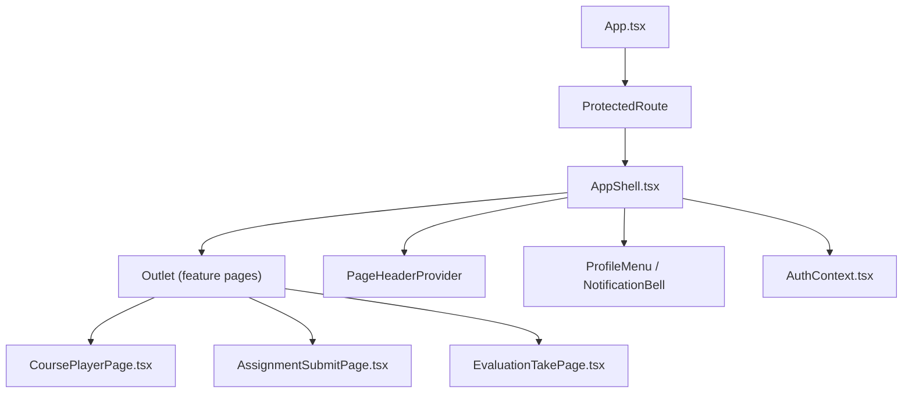
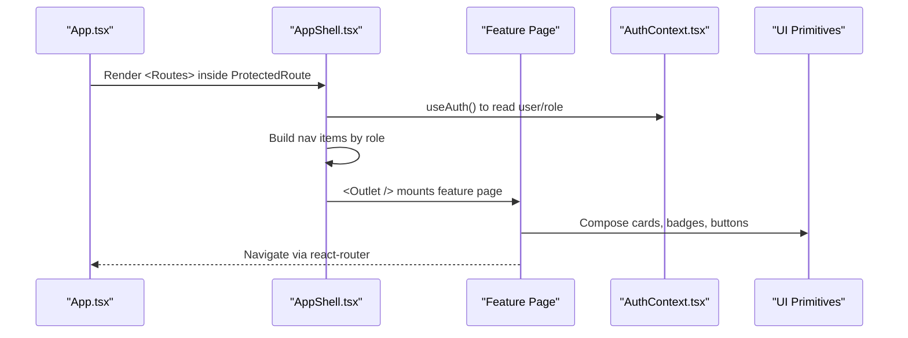
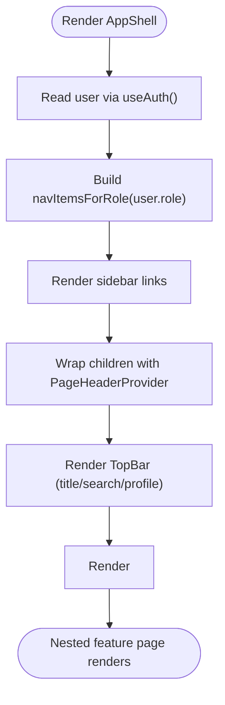
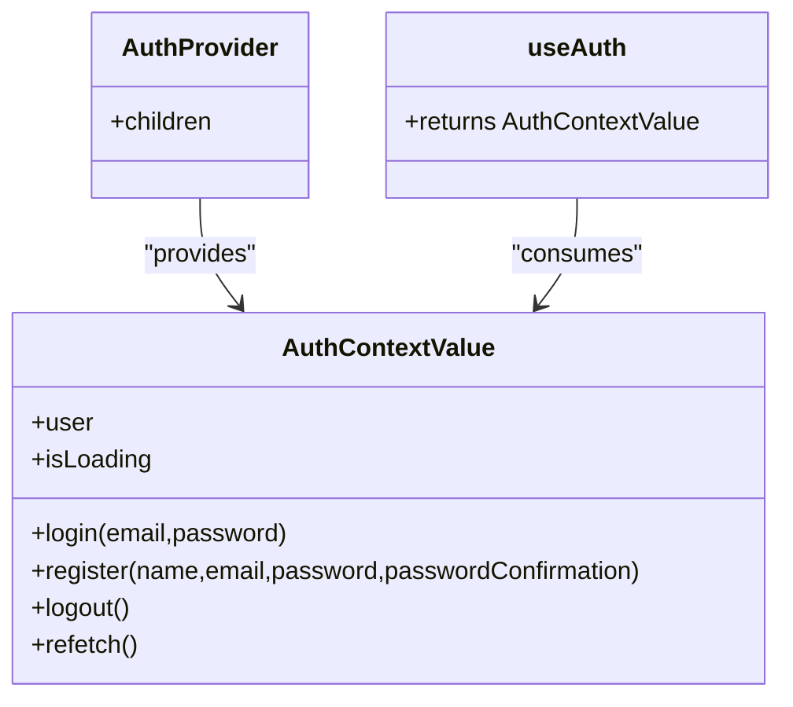
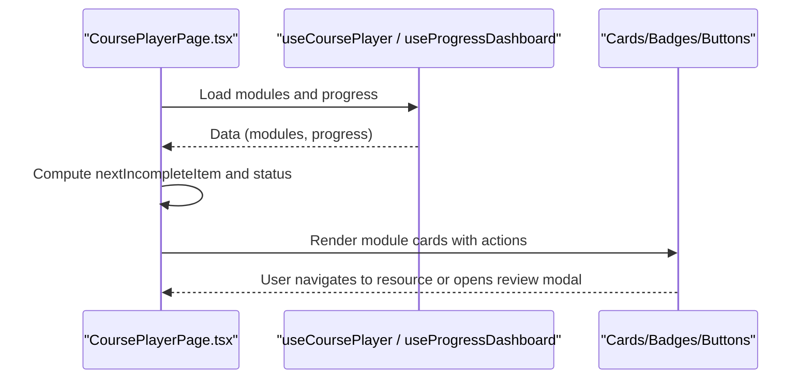
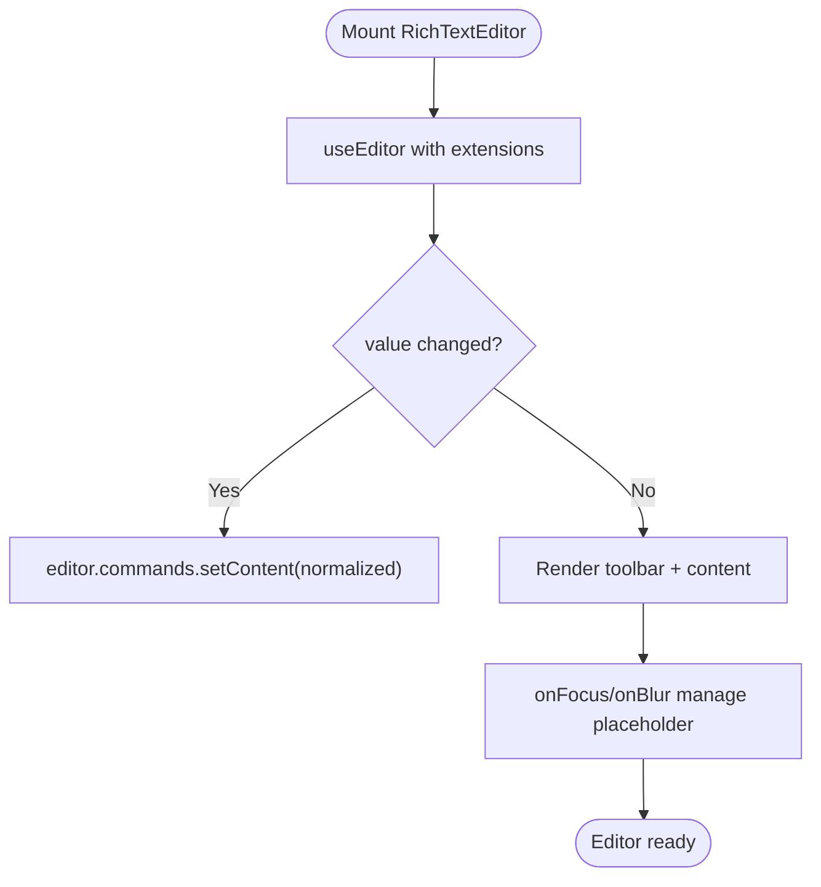
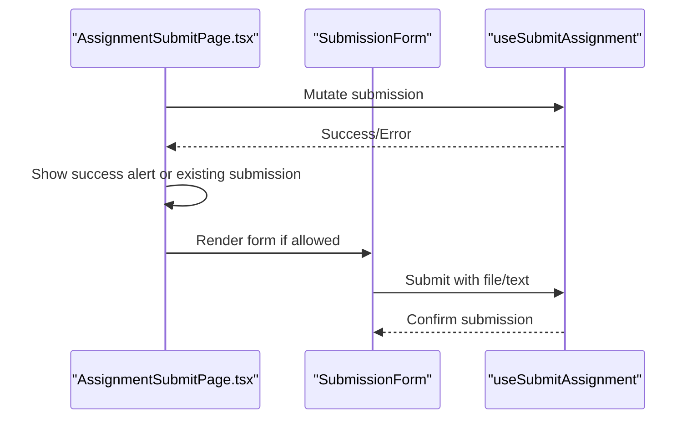
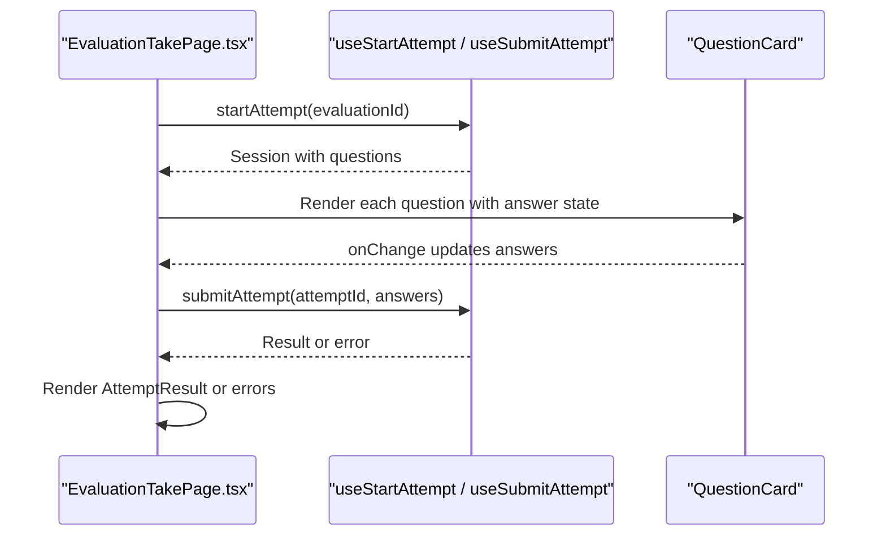
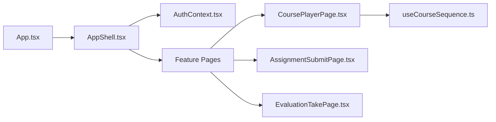

# Component Composition Patterns

<cite>
**Referenced Files in This Document**
- [App.tsx](file://frontend/src/App.tsx)
- [AppShell.tsx](file://frontend/src/components/layout/AppShell.tsx)
- [AuthContext.tsx](file://frontend/src/lib/auth/AuthContext.tsx)
- [CoursePlayerPage.tsx](file://frontend/src/features/learning/CoursePlayerPage.tsx)
- [RichTextEditor.tsx](file://frontend/src/components/editor/RichTextEditor.tsx)
- [AssignmentSubmitPage.tsx](file://frontend/src/features/assessment/AssignmentSubmitPage.tsx)
- [EvaluationTakePage.tsx](file://frontend/src/features/assessment/EvaluationTakePage.tsx)
- [useCourseSequence.ts](file://frontend/src/features/learning/useCourseSequence.ts)
</cite>

## Table of Contents
1. Introduction
2. Project Structure
3. Core Components
4. Architecture Overview
5. Detailed Component Analysis
6. Dependency Analysis
7. Performance Considerations
8. Troubleshooting Guide
9. Conclusion

## Introduction
This document explains advanced component composition patterns and architectural principles used across the application’s frontend. It focuses on how shared state is propagated without prop drilling, how contexts and custom hooks enable reusable logic, and how complex features like the rich text editor, course player, and assessment forms are composed from smaller building blocks. It also covers performance strategies such as memoization and efficient re-rendering, and outlines testing approaches for composed components with mocked external dependencies.

## Project Structure
The frontend follows a feature-based layout under src/features, with shared UI primitives under src/components and cross-cutting concerns (auth, utilities, page header context) under src/lib. Routing is centralized in App.tsx, which composes protected routes around an AppShell that provides global navigation and page-level context providers.

**Diagram sources**
- [App.tsx:42-243](file://frontend/src/App.tsx#L42-L243)
- [AppShell.tsx:170-269](file://frontend/src/components/layout/AppShell.tsx#L170-L269)
- [AuthContext.tsx:24-60](file://frontend/src/lib/auth/AuthContext.tsx#L24-L60)

**Section sources**
- [App.tsx:42-243](file://frontend/src/App.tsx#L42-L243)
- [AppShell.tsx:170-269](file://frontend/src/components/layout/AppShell.tsx#L170-L269)

## Core Components
- AppShell: Provides role-aware sidebar navigation, top bar with page title/search via PageHeaderProvider, and renders nested routes through Outlet. It centralizes layout and global UI state (collapsed sidebar).
- AuthContext: Encapsulates authentication state and actions using React Query. Consumers access user, loading, login/register/logout via useAuth, avoiding prop drilling across the app.
- CoursePlayerPage: Orchestrates modules, progress, and next-item navigation; composes cards, badges, and status indicators to present a structured learning experience.
- RichTextEditor: A controlled Tiptap-based editor with extensions and normalization, exposing value/onChange to parents while managing internal editor lifecycle.
- AssignmentSubmitPage: Composes assignment details, submission form, and existing submission view; uses local state for file/text inputs and mutation hooks for submission.
- EvaluationTakePage: Manages attempt lifecycle, question rendering, answer state, countdown timer, and submission flow; composes small presentational components for questions and results.

**Section sources**
- [AppShell.tsx:170-269](file://frontend/src/components/layout/AppShell.tsx#L170-L269)
- [AuthContext.tsx:24-60](file://frontend/src/lib/auth/AuthContext.tsx#L24-L60)
- [CoursePlayerPage.tsx:45-276](file://frontend/src/features/learning/CoursePlayerPage.tsx#L45-L276)
- [RichTextEditor.tsx:20-105](file://frontend/src/components/editor/RichTextEditor.tsx#L20-L105)
- [AssignmentSubmitPage.tsx:217-399](file://frontend/src/features/assessment/AssignmentSubmitPage.tsx#L217-L399)
- [EvaluationTakePage.tsx:156-265](file://frontend/src/features/assessment/EvaluationTakePage.tsx#L156-L265)

## Architecture Overview
The application composes pages within a protected shell and shares global state via contexts and hooks. Feature pages compose smaller presentational components and rely on custom hooks for data fetching and mutations.

**Diagram sources**
- [App.tsx:42-243](file://frontend/src/App.tsx#L42-L243)
- [AppShell.tsx:170-269](file://frontend/src/components/layout/AppShell.tsx#L170-L269)
- [AuthContext.tsx:24-60](file://frontend/src/lib/auth/AuthContext.tsx#L24-L60)

## Detailed Component Analysis

### AppShell: Layout and Context Provider Pattern
- Role-aware navigation: Builds menu items based on user role, enabling different dashboards for admin/instructor/student.
- Page header context: Wraps content with PageHeaderProvider so child pages can set title/subtitle and search behavior without prop drilling.
- Outlet composition: Renders nested route content, keeping layout consistent across features.

**Diagram sources**
- [AppShell.tsx:170-269](file://frontend/src/components/layout/AppShell.tsx#L170-L269)

**Section sources**
- [AppShell.tsx:170-269](file://frontend/src/components/layout/AppShell.tsx#L170-L269)

### AuthContext: Global State Without Prop Drilling
- Centralizes current user, loading state, and auth actions.
- Uses React Query to fetch and cache current user; refetches after login/register/logout.
- Exposes a typed hook (useAuth) for safe consumption throughout the app.

**Diagram sources**
- [AuthContext.tsx:11-70](file://frontend/src/lib/auth/AuthContext.tsx#L11-L70)

**Section sources**
- [AuthContext.tsx:11-70](file://frontend/src/lib/auth/AuthContext.tsx#L11-L70)

### CoursePlayerPage: Complex Composition and Navigation
- Composes module cards, status badges, and action buttons to guide learners.
- Uses helpers to compute next incomplete item and describe locked modules.
- Integrates review modal and progress dashboard to provide a cohesive learning journey.

**Diagram sources**
- [CoursePlayerPage.tsx:45-276](file://frontend/src/features/learning/CoursePlayerPage.tsx#L45-L276)

**Section sources**
- [CoursePlayerPage.tsx:45-276](file://frontend/src/features/learning/CoursePlayerPage.tsx#L45-L276)

### RichTextEditor: Controlled Editor Composition
- Wraps Tiptap with a controlled interface (value/onChange), normalizing legacy plain-text content into HTML before rendering.
- Manages focus state to display placeholder only when appropriate.
- Delegates toolbar rendering to a separate component for separation of concerns.

**Diagram sources**
- [RichTextEditor.tsx:20-105](file://frontend/src/components/editor/RichTextEditor.tsx#L20-L105)

**Section sources**
- [RichTextEditor.tsx:20-105](file://frontend/src/components/editor/RichTextEditor.tsx#L20-L105)

### AssignmentSubmitPage: Form Composition and State Sharing
- Composes assignment details, existing submission view, and submission form.
- Uses local state for file/text inputs and mutation hooks for submission.
- Validates input based on assignment type and shows contextual alerts.

**Diagram sources**
- [AssignmentSubmitPage.tsx:217-399](file://frontend/src/features/assessment/AssignmentSubmitPage.tsx#L217-L399)

**Section sources**
- [AssignmentSubmitPage.tsx:217-399](file://frontend/src/features/assessment/AssignmentSubmitPage.tsx#L217-L399)

### EvaluationTakePage: Assessment Flow Composition
- Starts/resumes attempts, manages per-question answers, and enforces time limits.
- Composes QuestionCard, CountdownBadge, and AttemptResult to render a focused assessment experience.
- Submits answers server-side and displays results or pending states.

**Diagram sources**
- [EvaluationTakePage.tsx:156-265](file://frontend/src/features/assessment/EvaluationTakePage.tsx#L156-L265)

**Section sources**
- [EvaluationTakePage.tsx:156-265](file://frontend/src/features/assessment/EvaluationTakePage.tsx#L156-L265)

### Conceptual Overview
- Prop drilling alternatives: Use contexts (AuthContext, PageHeaderProvider) and custom hooks to share state and behavior across deeply nested components.
- Render props and higher-order components: While not explicitly used here, the pattern of composing small presentational components (e.g., QuestionCard, ExistingSubmission) mirrors render-prop-like composition by passing data and callbacks down.
- Custom hooks for state sharing: Features encapsulate data fetching and mutations in hooks (e.g., useCoursePlayer, useAssessment), promoting reuse and testability.

[No sources needed since this section doesn't analyze specific files]

## Dependency Analysis
- Routing and layout: App.tsx wires routes and wraps protected areas with AppShell, which depends on AuthContext for user info and PageHeaderProvider for page metadata.
- Feature composition: CoursePlayerPage, AssignmentSubmitPage, and EvaluationTakePage depend on UI primitives and custom hooks to assemble their interfaces.
- Shared utilities: useCourseSequence demonstrates computed derived state via useMemo over module lists.

**Diagram sources**
- [App.tsx:42-243](file://frontend/src/App.tsx#L42-L243)
- [AppShell.tsx:170-269](file://frontend/src/components/layout/AppShell.tsx#L170-L269)
- [useCourseSequence.ts:1-17](file://frontend/src/features/learning/useCourseSequence.ts#L1-L17)

**Section sources**
- [App.tsx:42-243](file://frontend/src/App.tsx#L42-L243)
- [AppShell.tsx:170-269](file://frontend/src/components/layout/AppShell.tsx#L170-L269)
- [useCourseSequence.ts:1-17](file://frontend/src/features/learning/useCourseSequence.ts#L1-L17)

## Performance Considerations
- Memoization: Derived sequences and computations should be wrapped in useMemo where appropriate (e.g., flattening module items) to avoid recomputation on every render.
- Controlled editors: Keep editor instances stable and guard against destroyed references to prevent unnecessary re-renders or crashes under StrictMode.
- Selective updates: Pass minimal props to leaf components (e.g., QuestionCard) and lift state up only as needed to reduce re-renders.
- Avoid heavy work in render: Offload expensive operations to hooks or utilities and keep components focused on presentation and event handling.

[No sources needed since this section provides general guidance]

## Troubleshooting Guide
- Editor lifecycle issues: Ensure checks for editor.isDestroyed before accessing commands or content to handle concurrent rendering scenarios safely.
- Context usage errors: Always consume contexts within their providers; throw descriptive errors when misused to aid debugging.
- Route protection: Verify that ProtectedRoute correctly guards routes and redirects appropriately for unauthenticated users.
- Form validation: Validate inputs early and surface clear error messages to improve user feedback during submissions.

**Section sources**
- [RichTextEditor.tsx:80-87](file://frontend/src/components/editor/RichTextEditor.tsx#L80-L87)
- [AuthContext.tsx:62-70](file://frontend/src/lib/auth/AuthContext.tsx#L62-L70)
- [App.tsx:74-79](file://frontend/src/App.tsx#L74-L79)
- [AssignmentSubmitPage.tsx:132-154](file://frontend/src/features/assessment/AssignmentSubmitPage.tsx#L132-L154)

## Conclusion
The application leverages modern React composition patterns—contexts, custom hooks, and feature-driven layouts—to build complex, maintainable interfaces. By centralizing shared state in contexts, encapsulating logic in hooks, and composing small presentational components, the codebase remains scalable and performant. These patterns are evident in the rich text editor, course player, and assessment flows, providing a solid foundation for future enhancements and testing strategies.