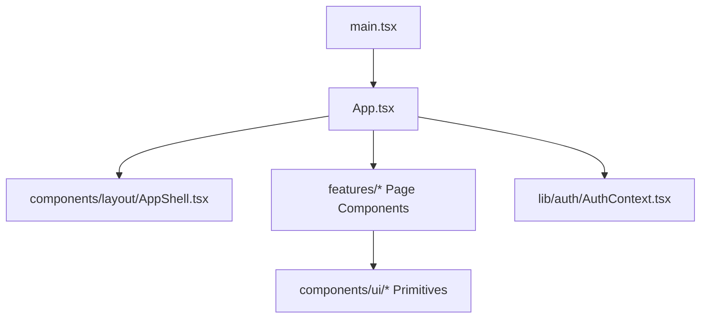
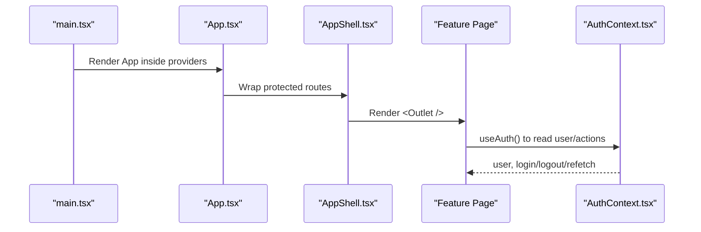
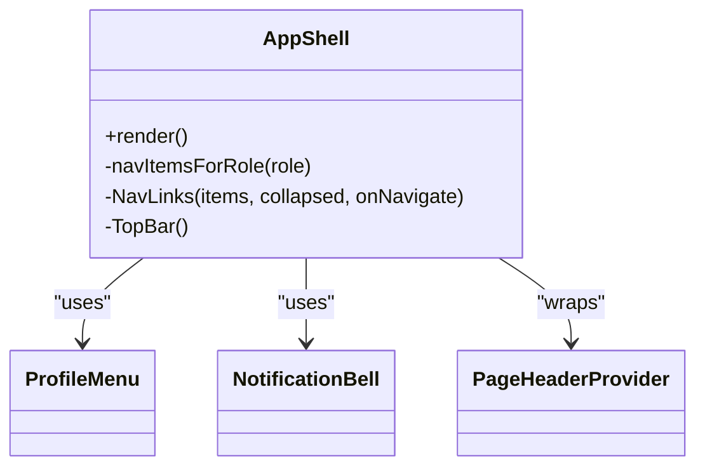
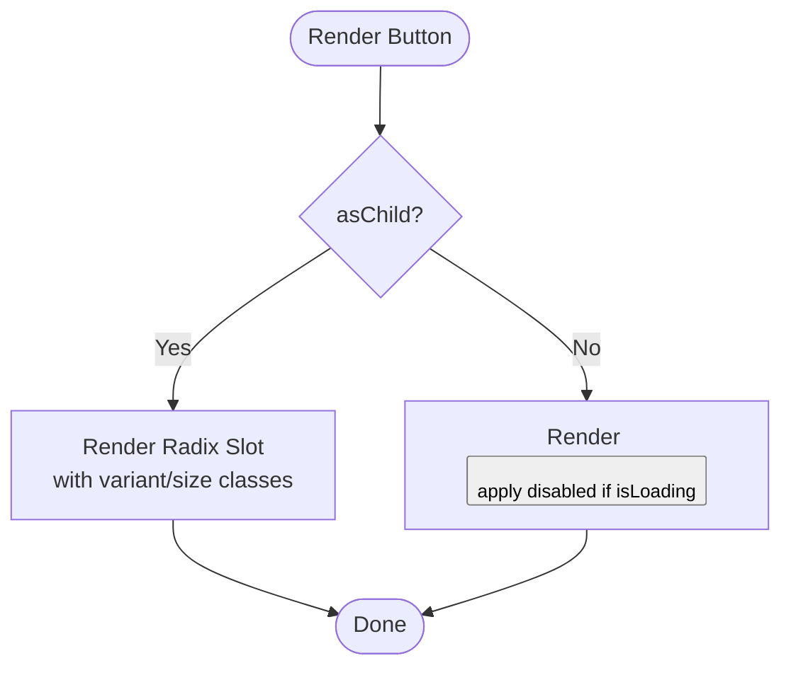
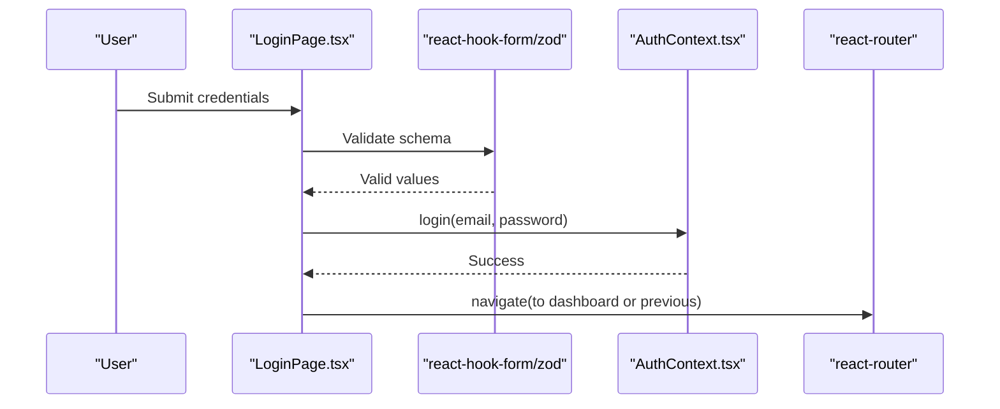
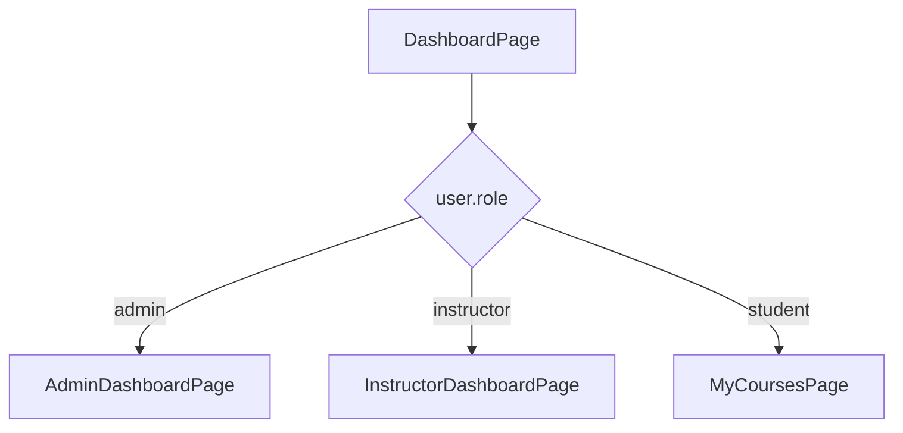
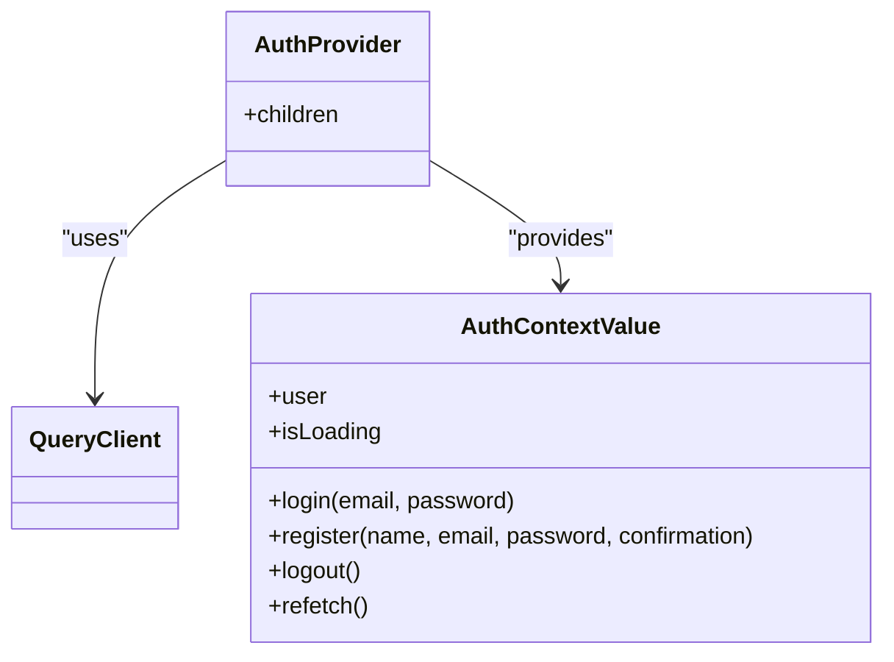
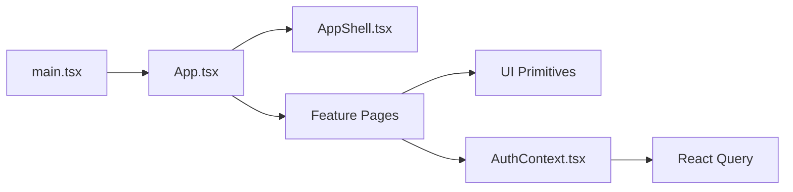

# Component Structure

<cite>
**Referenced Files in This Document**
- [App.tsx](file://frontend/src/App.tsx)
- [main.tsx](file://frontend/src/main.tsx)
- [AppShell.tsx](file://frontend/src/components/layout/AppShell.tsx)
- [Button.tsx](file://frontend/src/components/ui/Button.tsx)
- [LoginPage.tsx](file://frontend/src/features/auth/LoginPage.tsx)
- [DashboardPage.tsx](file://frontend/src/features/dashboard/DashboardPage.tsx)
- [AuthContext.tsx](file://frontend/src/lib/auth/AuthContext.tsx)
</cite>

## Table of Contents
1. Introduction
2. Project Structure
3. Core Components
4. Architecture Overview
5. Detailed Component Analysis
6. Dependency Analysis
7. Performance Considerations
8. Troubleshooting Guide
9. Conclusion

## Introduction
This document explains the React component architecture used in the application, focusing on a feature-based organization pattern. It details how components are grouped under features directories and shared UI components, describes composition patterns, prop interfaces, and state management approaches, and clarifies the relationships between layout, page, and business logic components. It also provides guidance for testing strategies and maintainable code organization.

## Project Structure
The frontend follows a clear separation of concerns:
- Features: Each domain area (auth, dashboard, assessment, communication, etc.) is encapsulated in its own folder with page-level components and related utilities.
- Shared components: Reusable UI primitives live under components/ui, while layout shell and navigation live under components/layout.
- Pages: Top-level route entry points are defined in App.tsx and map to feature pages or public pages.
- Application bootstrap: main.tsx sets up providers (React Query, Router, Auth), an error boundary, and renders App.

**Diagram sources**
- [main.tsx:1-61](file://frontend/src/main.tsx#L1-L61)
- [App.tsx:1-247](file://frontend/src/App.tsx#L1-L247)
- [AppShell.tsx:1-270](file://frontend/src/components/layout/AppShell.tsx#L1-L270)
- [AuthContext.tsx:1-71](file://frontend/src/lib/auth/AuthContext.tsx#L1-L71)

**Section sources**
- [main.tsx:1-61](file://frontend/src/main.tsx#L1-L61)
- [App.tsx:1-247](file://frontend/src/App.tsx#L1-L247)

## Core Components
- Layout Shell (AppShell): Provides role-aware sidebar navigation, top bar, and outlet for page content. It composes smaller layout pieces like ProfileMenu and NotificationBell and exposes a consistent chrome for protected routes.
- UI Primitives (Button and others): Small, composable building blocks with variant/size props and accessibility considerations. Button supports loading states and asChild rendering via Radix Slot.
- Feature Pages (e.g., LoginPage, DashboardPage): Domain-specific screens that compose UI primitives and layout shells, handle local form state, and interact with global auth context.
- Global State (AuthContext): Centralized user session and actions (login, register, logout) backed by React Query for data fetching and caching.

Key responsibilities:
- AppShell: Navigation, header, and routing outlet; role-based menu configuration.
- Button: Consistent styling and behavior across the app.
- LoginPage: Form validation, submission, and redirection using react-hook-form and zod.
- DashboardPage: Role-based routing to specific dashboards.
- AuthContext: User session state and side effects, integrated with React Query.

**Section sources**
- [AppShell.tsx:1-270](file://frontend/src/components/layout/AppShell.tsx#L1-L270)
- [Button.tsx:1-72](file://frontend/src/components/ui/Button.tsx#L1-L72)
- [LoginPage.tsx:1-101](file://frontend/src/features/auth/LoginPage.tsx#L1-L101)
- [DashboardPage.tsx:1-17](file://frontend/src/features/dashboard/DashboardPage.tsx#L1-L17)
- [AuthContext.tsx:1-71](file://frontend/src/lib/auth/AuthContext.tsx#L1-L71)

## Architecture Overview
The application uses a layered approach:
- Bootstrap layer: Providers and error handling in main.tsx.
- Routing layer: App.tsx defines public and protected routes, wrapping protected sections with AppShell.
- Layout layer: AppShell manages chrome and delegates content to child routes via Outlet.
- Feature layer: Feature pages implement business logic and compose UI primitives.
- Data layer: AuthContext integrates with React Query for server state and caches user info.

**Diagram sources**
- [main.tsx:1-61](file://frontend/src/main.tsx#L1-L61)
- [App.tsx:1-247](file://frontend/src/App.tsx#L1-L247)
- [AppShell.tsx:1-270](file://frontend/src/components/layout/AppShell.tsx#L1-L270)
- [AuthContext.tsx:1-71](file://frontend/src/lib/auth/AuthContext.tsx#L1-L71)

## Detailed Component Analysis

### Layout Shell (AppShell)
Role-aware navigation and consistent chrome for protected areas. It computes navigation items based on user role and renders both desktop sidebar and mobile bottom nav. The top bar integrates page header and search via context, and includes notification and profile controls.

**Diagram sources**
- [AppShell.tsx:1-270](file://frontend/src/components/layout/AppShell.tsx#L1-L270)

**Section sources**
- [AppShell.tsx:1-270](file://frontend/src/components/layout/AppShell.tsx#L1-L270)

### UI Primitive: Button
A highly reusable button with variants, sizes, loading indicator, and asChild support for composing with other interactive elements. Uses class-variance-authority for style variants and Radix Slot for flexible composition.

**Diagram sources**
- [Button.tsx:1-72](file://frontend/src/components/ui/Button.tsx#L1-L72)

**Section sources**
- [Button.tsx:1-72](file://frontend/src/components/ui/Button.tsx#L1-L72)

### Feature Page: Login
Handles email/password authentication with client-side validation and redirects after success. Uses react-hook-form with zod resolver, displays errors via Alert, and navigates using react-router.

**Diagram sources**
- [LoginPage.tsx:1-101](file://frontend/src/features/auth/LoginPage.tsx#L1-L101)
- [AuthContext.tsx:1-71](file://frontend/src/lib/auth/AuthContext.tsx#L1-L71)

**Section sources**
- [LoginPage.tsx:1-101](file://frontend/src/features/auth/LoginPage.tsx#L1-L101)

### Feature Page: Dashboard
Routes to role-specific dashboards from a single route, keeping navigation simple and centralized.

**Diagram sources**
- [DashboardPage.tsx:1-17](file://frontend/src/features/dashboard/DashboardPage.tsx#L1-L17)

**Section sources**
- [DashboardPage.tsx:1-17](file://frontend/src/features/dashboard/DashboardPage.tsx#L1-L17)

### Global State: AuthContext
Provides user session, loading state, and actions (login, register, logout). Integrates with React Query to fetch current user and invalidate cache on logout.

**Diagram sources**
- [AuthContext.tsx:1-71](file://frontend/src/lib/auth/AuthContext.tsx#L1-L71)

**Section sources**
- [AuthContext.tsx:1-71](file://frontend/src/lib/auth/AuthContext.tsx#L1-L71)

## Dependency Analysis
High-level dependencies among core files:
- main.tsx bootstraps providers and renders App.
- App.tsx wires routes and guards, composing AppShell for protected areas.
- AppShell depends on layout utilities and feature modules for notifications/profile.
- Feature pages depend on UI primitives and AuthContext.
- AuthContext depends on React Query and API calls.

**Diagram sources**
- [main.tsx:1-61](file://frontend/src/main.tsx#L1-L61)
- [App.tsx:1-247](file://frontend/src/App.tsx#L1-L247)
- [AppShell.tsx:1-270](file://frontend/src/components/layout/AppShell.tsx#L1-L270)
- [AuthContext.tsx:1-71](file://frontend/src/lib/auth/AuthContext.tsx#L1-L71)

**Section sources**
- [App.tsx:1-247](file://frontend/src/App.tsx#L1-L247)
- [AuthContext.tsx:1-71](file://frontend/src/lib/auth/AuthContext.tsx#L1-L71)

## Performance Considerations
- Use React Query caching and refetch policies to minimize network requests for user data and feature resources.
- Keep UI primitives small and pure; prefer composition over deep nesting to reduce re-renders.
- Defer heavy computations to feature-level hooks or memoized selectors where appropriate.
- Avoid unnecessary re-renders in AppShell by memoizing computed navigation lists and stable callbacks.

[No sources needed since this section provides general guidance]

## Troubleshooting Guide
- Rendering errors: An ErrorBoundary in main.tsx catches runtime errors and shows a friendly message with a reload option.
- Authentication issues: AuthContext throws when used outside provider; ensure App is wrapped by AuthProvider. On logout, session data is cleared and UI state reset.
- Form errors: LoginPage validates with zod and surfaces messages via Alert; check schema constraints and API error mapping.

**Section sources**
- [main.tsx:18-46](file://frontend/src/main.tsx#L18-L46)
- [AuthContext.tsx:62-70](file://frontend/src/lib/auth/AuthContext.tsx#L62-L70)
- [LoginPage.tsx:33-49](file://frontend/src/features/auth/LoginPage.tsx#L33-L49)

## Conclusion
The application adopts a clean feature-based architecture with shared UI primitives and a robust layout shell. Pages compose primitives and leverage a centralized auth context backed by React Query for predictable state and data flow. This structure promotes maintainability, testability, and scalability as new features are added.

[No sources needed since this section summarizes without analyzing specific files]