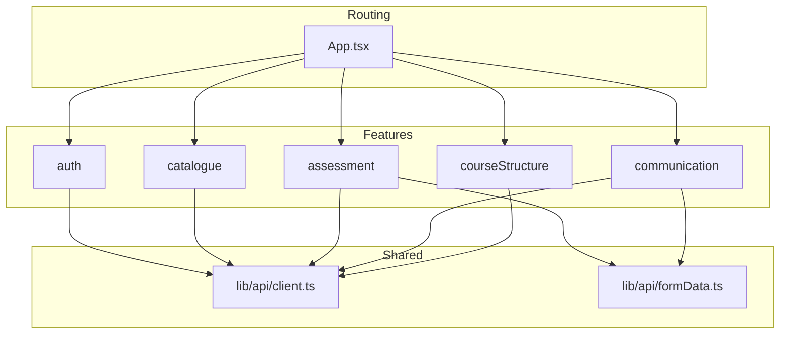
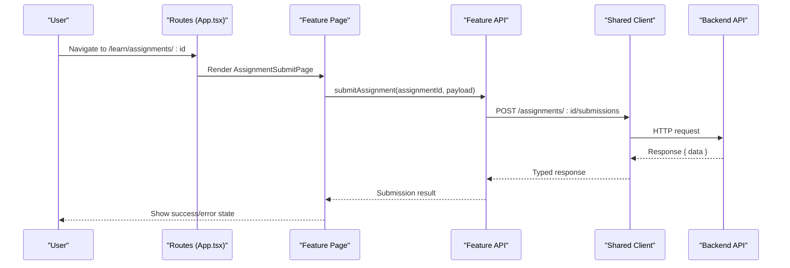
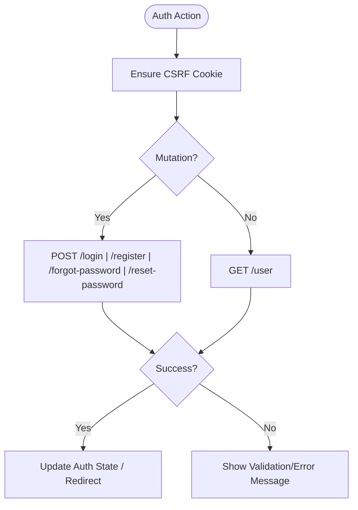
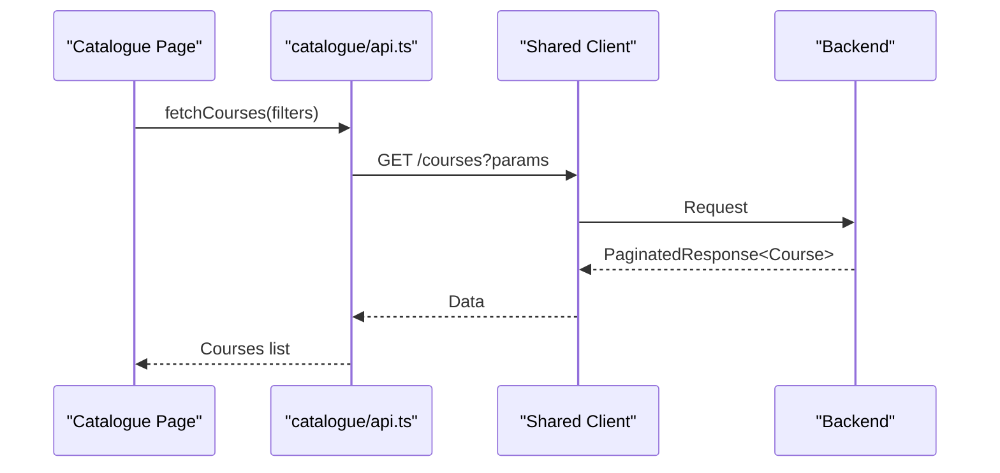
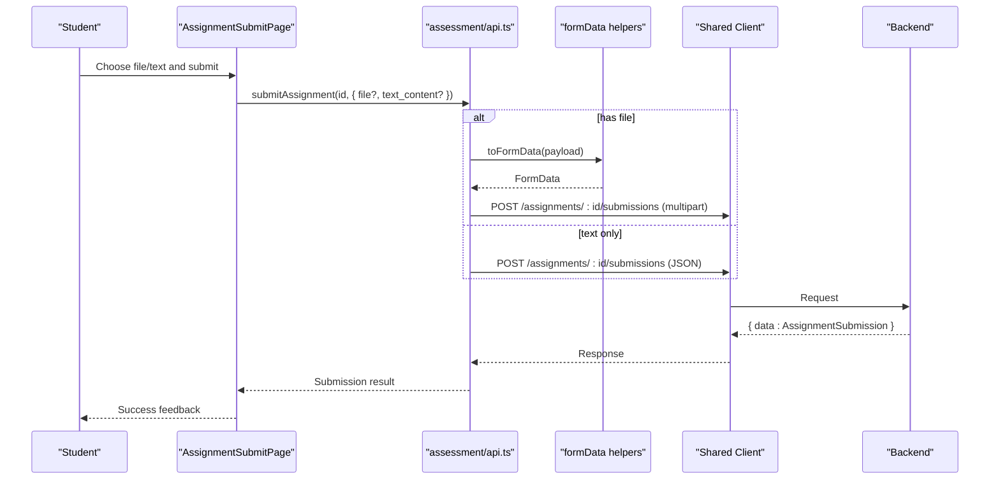
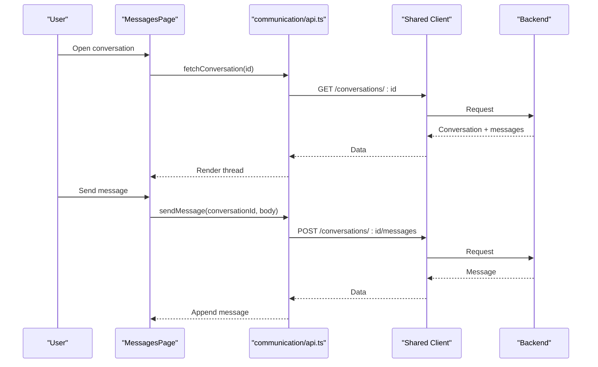
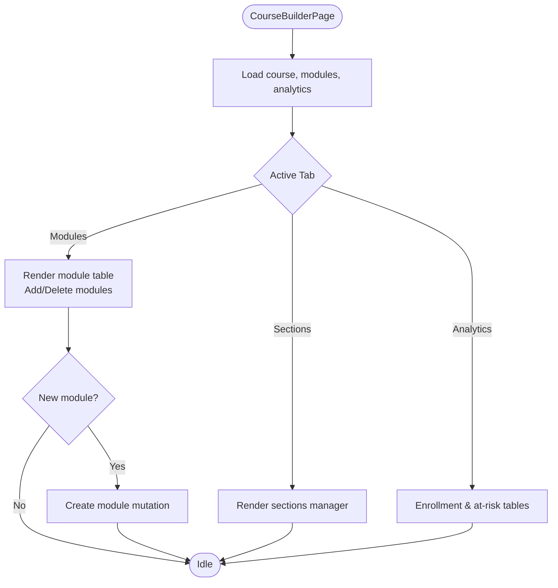
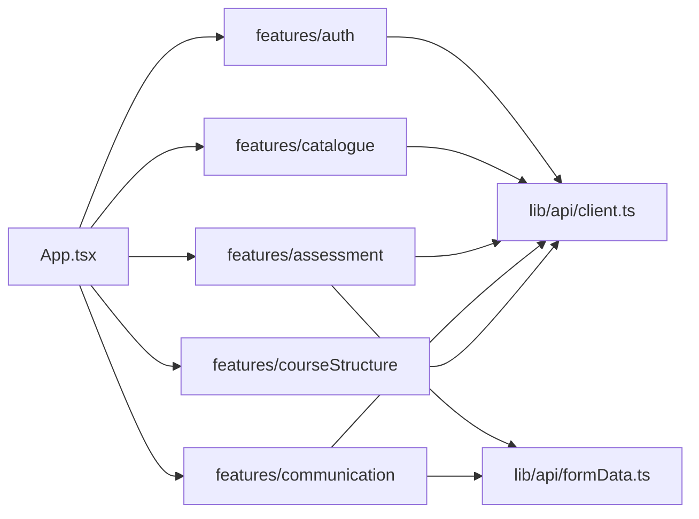

# Feature Components

<cite>
**Referenced Files in This Document**
- [App.tsx](file://frontend/src/App.tsx)
- [auth/api.ts](file://frontend/src/features/auth/api.ts)
- [catalogue/api.ts](file://frontend/src/features/catalogue/api.ts)
- [assessment/api.ts](file://frontend/src/features/assessment/api.ts)
- [communication/api.ts](file://frontend/src/features/communication/api.ts)
- [courseStructure/CourseBuilderPage.tsx](file://frontend/src/features/courseStructure/CourseBuilderPage.tsx)
- [assessment/AssignmentSubmitPage.tsx](file://frontend/src/features/assessment/AssignmentSubmitPage.tsx)
- [communication/MessagesPage.tsx](file://frontend/src/features/communication/MessagesPage.tsx)
- [lib/api/client.ts](file://frontend/src/lib/api/client.ts)
- [lib/api/formData.ts](file://frontend/src/lib/api/formData.ts)
</cite>

## Table of Contents
1. [Introduction](#introduction)
2. [Project Structure](#project-structure)
3. [Core Components](#core-components)
4. [Architecture Overview](#architecture-overview)
5. [Detailed Component Analysis](#detailed-component-analysis)
6. [Dependency Analysis](#dependency-analysis)
7. [Performance Considerations](#performance-considerations)
8. [Troubleshooting Guide](#troubleshooting-guide)
9. [Conclusion](#conclusion)
10. [Appendices](#appendices)

## Introduction
This document explains how features are organized and implemented across dedicated directories (auth, catalogue, assessment, communication, course structure, etc.) and how they compose shared components and APIs. It covers component composition patterns, API integration approaches, state management strategies, and testing practices. Complex feature implementations such as the course builder, assessment forms, and communication tools are analyzed with diagrams and code-level references.

## Project Structure
The frontend is organized by feature under frontend/src/features, each containing:
- Pages and UI components for that feature
- A feature-scoped api module that encapsulates HTTP calls
- Optional hooks or utilities specific to the feature
- Tests colocated near the implementation

Routing and access control are centralized in App.tsx, which wires feature pages behind protected routes and role-based guards. Shared infrastructure lives under frontend/src/lib (API client, form data helpers, auth context, utilities).

**Diagram sources**
- [App.tsx:42-242](file://frontend/src/App.tsx#L42-L242)
- [lib/api/client.ts:1-200](file://frontend/src/lib/api/client.ts#L1-L200)
- [lib/api/formData.ts:1-200](file://frontend/src/lib/api/formData.ts#L1-L200)

**Section sources**
- [App.tsx:42-242](file://frontend/src/App.tsx#L42-L242)

## Core Components
- Routing and protection: App.tsx defines public and protected routes, using a ProtectedRoute wrapper to enforce authentication and roles.
- Feature modules: Each feature directory contains its own page components and an api.ts that centralizes HTTP interactions via a shared client.
- Shared utilities: lib/api/client.ts provides a typed HTTP client; lib/api/formData.ts handles multipart payloads for file uploads.

Key responsibilities:
- App.tsx: Route definitions, role-based guards, navigation between features.
- Feature api modules: Encapsulate endpoints, request/response types, and payload builders.
- Shared client: Centralized base URL, headers, CSRF handling, error mapping.

**Section sources**
- [App.tsx:42-242](file://frontend/src/App.tsx#L42-L242)
- [lib/api/client.ts:1-200](file://frontend/src/lib/api/client.ts#L1-L200)
- [lib/api/formData.ts:1-200](file://frontend/src/lib/api/formData.ts#L1-L200)

## Architecture Overview
The application follows a feature-sliced architecture:
- Routes in App.tsx map URLs to feature pages.
- Feature pages consume feature-specific hooks and components.
- Features call their scoped api modules, which use the shared client for network requests.
- File uploads go through FormData helpers to ensure correct content-type and serialization.

**Diagram sources**
- [App.tsx:208-223](file://frontend/src/App.tsx#L208-L223)
- [assessment/api.ts:116-133](file://frontend/src/features/assessment/api.ts#L116-L133)
- [lib/api/client.ts:1-200](file://frontend/src/lib/api/client.ts#L1-L200)

## Detailed Component Analysis

### Authentication Feature
- Purpose: Login, registration, password reset, email verification, and current user retrieval.
- Composition: Pages import functions from features/auth/api.ts to perform actions like login, register, logout, and fetch current user.
- API approach: Uses the shared client with CSRF cookie handling for mutations; GET endpoints return typed user objects.

**Diagram sources**
- [auth/api.ts:6-62](file://frontend/src/features/auth/api.ts#L6-L62)

**Section sources**
- [auth/api.ts:6-62](file://frontend/src/features/auth/api.ts#L6-L62)

### Catalogue Feature
- Purpose: Browse courses, view details, fetch categories, and list course modules.
- Composition: Pages and cards use catalogue/api.ts to fetch paginated courses, single course details, categories, and modules.
- API approach: GET endpoints returning typed responses; filters passed as query params.

**Diagram sources**
- [catalogue/api.ts:14-32](file://frontend/src/features/catalogue/api.ts#L14-L32)

**Section sources**
- [catalogue/api.ts:14-32](file://frontend/src/features/catalogue/api.ts#L14-L32)

### Assessment Feature
- Purpose: Create/update assignments and evaluations, manage question banks/questions, submit assignments, take evaluations, grade submissions/attempts, and view gradebook.
- Composition: Pages like AssignmentSubmitPage and EvaluationTakePage use assessment/api.ts and feature hooks to orchestrate flows.
- API approach: Mix of JSON and FormData for file uploads; robust typing for payloads and responses.

**Diagram sources**
- [assessment/api.ts:116-133](file://frontend/src/features/assessment/api.ts#L116-L133)
- [lib/api/formData.ts:1-200](file://frontend/src/lib/api/formData.ts#L1-L200)

**Section sources**
- [assessment/api.ts:17-204](file://frontend/src/features/assessment/api.ts#L17-L204)
- [assessment/AssignmentSubmitPage.tsx:118-213](file://frontend/src/features/assessment/AssignmentSubmitPage.tsx#L118-L213)

### Communication Feature
- Purpose: Direct messages, tickets, forums, announcements, and notifications.
- Composition: MessagesPage composes conversation lists, thread views, and compose modals; uses communication/api.ts for all operations.
- API approach: JSON for most endpoints; forum posts support attachments via FormData; pagination and filtering supported.

**Diagram sources**
- [communication/api.ts:21-48](file://frontend/src/features/communication/api.ts#L21-L48)
- [communication/MessagesPage.tsx:75-176](file://frontend/src/features/communication/MessagesPage.tsx#L75-L176)

**Section sources**
- [communication/api.ts:21-240](file://frontend/src/features/communication/api.ts#L21-L240)
- [communication/MessagesPage.tsx:180-291](file://frontend/src/features/communication/MessagesPage.tsx#L180-L291)

### Course Builder (Course Structure)
- Purpose: Manage modules, sections, and analytics for a course; create/delete modules; view enrollment and at-risk students.
- Composition: CourseBuilderPage orchestrates tabs (modules, sections, analytics), composes ModuleTableRow and TrashedModulesSection, and integrates analytics widgets.
- API approach: Uses feature hooks (e.g., useModules, useCreateModule, useDeleteModule) backed by courseStructure/api.ts; analytics via analytics hooks.

**Diagram sources**
- [courseStructure/CourseBuilderPage.tsx:27-261](file://frontend/src/features/courseStructure/CourseBuilderPage.tsx#L27-L261)

**Section sources**
- [courseStructure/CourseBuilderPage.tsx:27-261](file://frontend/src/features/courseStructure/CourseBuilderPage.tsx#L27-L261)

## Dependency Analysis
- Routing dependency: App.tsx depends on feature pages and route guards.
- Feature dependencies: Each feature’s api.ts depends on the shared client; some features also depend on formData helpers for uploads.
- Cohesion: Feature directories encapsulate related UI, logic, and API calls, reducing cross-feature coupling.
- External integrations: Backend REST endpoints are abstracted behind feature api modules, enabling consistent error handling and type safety.

**Diagram sources**
- [App.tsx:42-242](file://frontend/src/App.tsx#L42-L242)
- [lib/api/client.ts:1-200](file://frontend/src/lib/api/client.ts#L1-L200)
- [lib/api/formData.ts:1-200](file://frontend/src/lib/api/formData.ts#L1-L200)

**Section sources**
- [App.tsx:42-242](file://frontend/src/App.tsx#L42-L242)

## Performance Considerations
- Prefer feature-scoped hooks to batch and cache data per feature (e.g., useModules, useConversations).
- Use pagination for large datasets (courses, threads, submissions) to reduce payload size.
- Defer heavy computations to background jobs where possible (backend already includes jobs for certificates, imports, emails).
- Avoid unnecessary re-renders by memoizing derived lists and using stable keys for lists.
- For file uploads, stream large files and show progress indicators to improve perceived performance.

[No sources needed since this section provides general guidance]

## Troubleshooting Guide
Common issues and remedies:
- Authentication failures: Ensure CSRF cookies are set before mutations; verify login/register endpoints and error fields.
- Upload errors: Confirm FormData construction and multipart headers; validate file size and type constraints.
- Network errors: Inspect shared client error mapping; handle ApiError fields for validation messages.
- Empty states: Provide meaningful empty states and prompts to guide users when no data is available.

**Section sources**
- [auth/api.ts:15-57](file://frontend/src/features/auth/api.ts#L15-L57)
- [assessment/api.ts:116-133](file://frontend/src/features/assessment/api.ts#L116-L133)
- [communication/api.ts:88-103](file://frontend/src/features/communication/api.ts#L88-L103)

## Conclusion
The feature-sliced organization promotes clear boundaries, testability, and maintainability. Each feature owns its UI, state, and API layer while sharing common infrastructure. Complex workflows like assignment submission and messaging are composed from small, focused components and hooks, making them easier to understand, test, and evolve.

[No sources needed since this section summarizes without analyzing specific files]

## Appendices

### Testing Strategies for Feature Components
- Unit tests: Test pure utilities and hooks within feature directories; assert API calls and state transitions.
- Integration tests: Validate full flows (e.g., submit assignment, send message) using mocked backend responses.
- E2E tests: Cover critical user journeys across routes defined in App.tsx; verify role-based access and navigation.
- Colocation: Keep tests next to feature code for discoverability and maintenance.

[No sources needed since this section provides general guidance]

### Best Practices for Maintainable Feature Organization
- Keep feature boundaries strict: avoid importing unrelated feature code; share via lib utilities when necessary.
- Centralize API calls in feature api modules; never scatter fetch calls across components.
- Use consistent naming and folder conventions; group related components, hooks, and tests together.
- Leverage ProtectedRoute for role-based access control at the route level.
- Document complex flows with diagrams and comments to aid future contributors.

[No sources needed since this section provides general guidance]