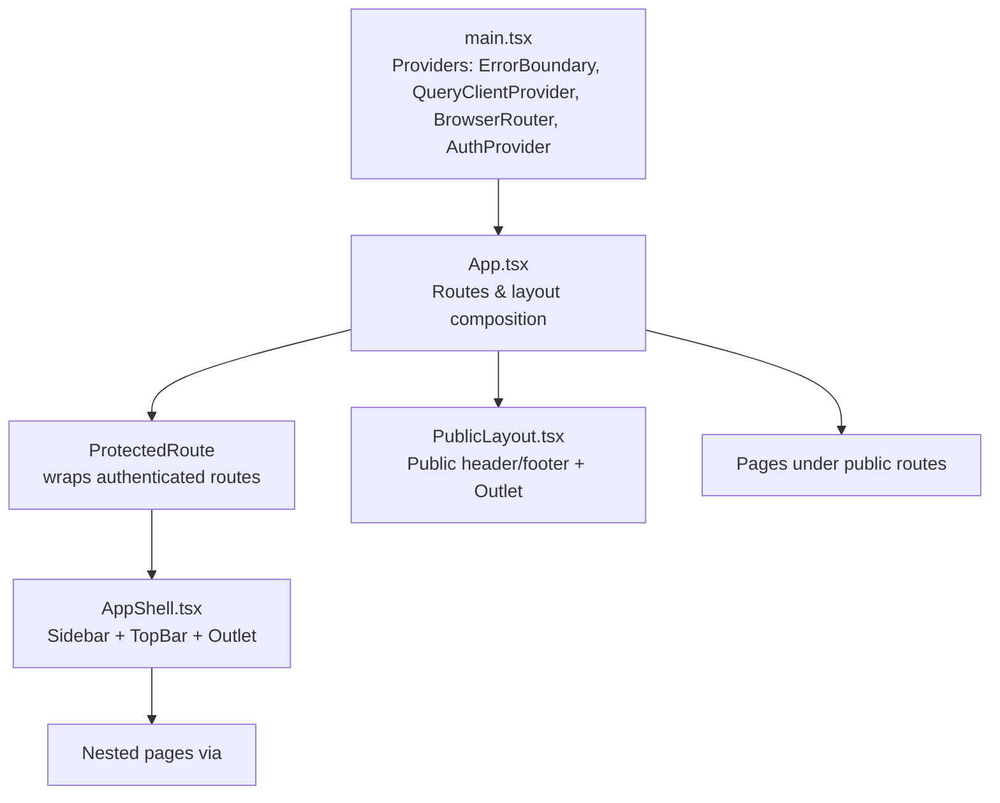
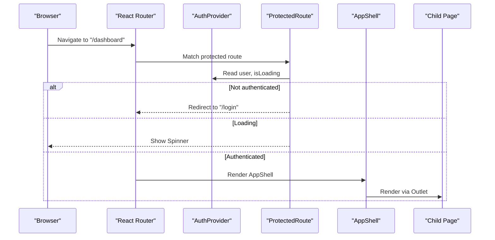
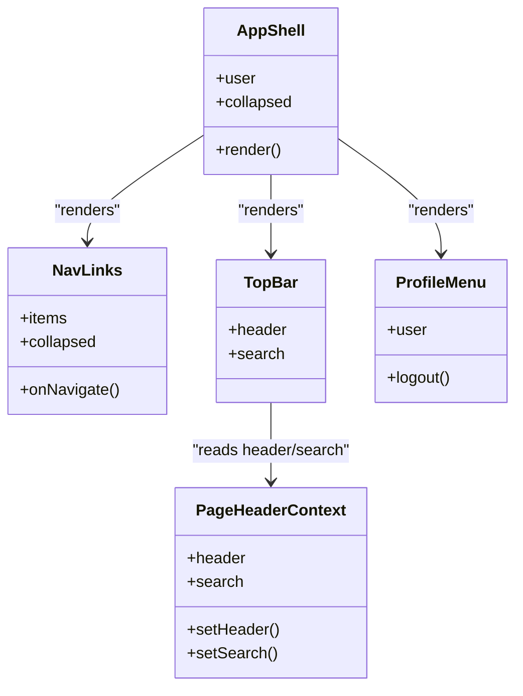
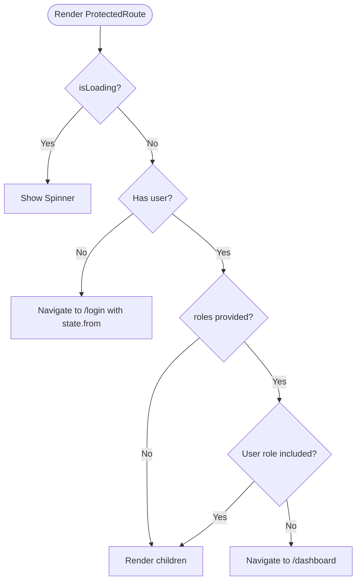
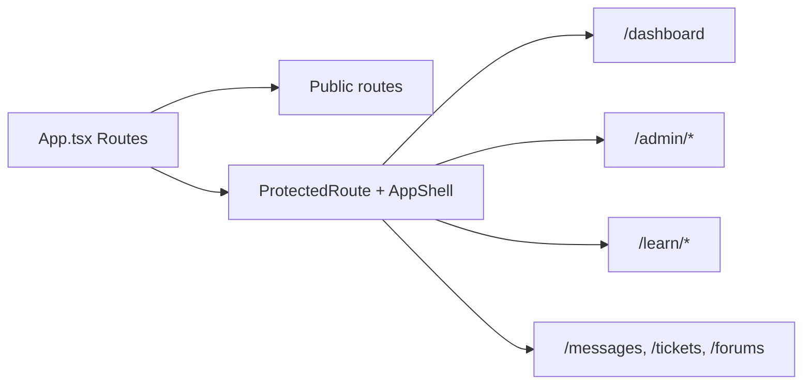
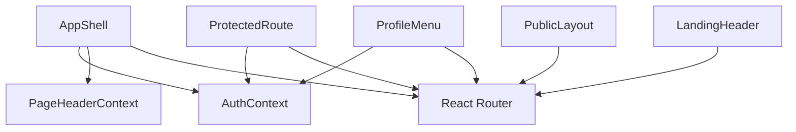

# Layout Components

<cite>
**Referenced Files in This Document**
- [AppShell.tsx](file://frontend/src/components/layout/AppShell.tsx)
- [ProtectedRoute.tsx](file://frontend/src/components/layout/ProtectedRoute.tsx)
- [PublicLayout.tsx](file://frontend/src/components/layout/PublicLayout.tsx)
- [LandingHeader.tsx](file://frontend/src/components/layout/LandingHeader.tsx)
- [ProfileMenu.tsx](file://frontend/src/components/layout/ProfileMenu.tsx)
- [PageHeaderContext.tsx](file://frontend/src/lib/pageHeader/PageHeaderContext.tsx)
- [AuthContext.tsx](file://frontend/src/lib/auth/AuthContext.tsx)
- [App.tsx](file://frontend/src/App.tsx)
- [main.tsx](file://frontend/src/main.tsx)
</cite>

## Table of Contents
1. Introduction
2. Project Structure
3. Core Components
4. Architecture Overview
5. Detailed Component Analysis
6. Dependency Analysis
7. Performance Considerations
8. Troubleshooting Guide
9. Conclusion

## Introduction
This document explains the layout and shell architecture that provides the application structure. It covers the AppShell component, routing integration, navigation patterns, ProtectedRoute for authentication-based access control, landing page layouts and header management, nested layouts, sidebar navigation, responsive design, and state management for layout-wide concerns such as user sessions and theme handling.

## Project Structure
The frontend is a React application bootstrapped with React Router and TanStack Query. The root provider tree sets up error handling, data fetching, routing, and authentication context before rendering the route tree.

**Diagram sources**
- [main.tsx:48-60](file://frontend/src/main.tsx#L48-L60)
- [App.tsx:50-80](file://frontend/src/App.tsx#L50-L80)
- [ProtectedRoute.tsx:17-34](file://frontend/src/components/layout/ProtectedRoute.tsx#L17-L34)
- [AppShell.tsx:170-269](file://frontend/src/components/layout/AppShell.tsx#L170-L269)
- [PublicLayout.tsx:6-54](file://frontend/src/components/layout/PublicLayout.tsx#L6-L54)

**Section sources**
- [main.tsx:48-60](file://frontend/src/main.tsx#L48-L60)
- [App.tsx:50-80](file://frontend/src/App.tsx#L50-L80)

## Core Components
- AppShell: Provides the authenticated application shell with a role-aware sidebar, top bar (with dynamic page title/search), notifications, profile menu, and mobile bottom navigation. Renders child routes via Outlet.
- ProtectedRoute: Guards routes by checking authentication and optional roles; redirects to login or dashboard as needed.
- PublicLayout: Provides a simple public-facing layout with header and footer for unauthenticated pages.
- LandingHeader: A feature-rich header for the landing page with sticky behavior, active indicator, mobile menu, and auth actions.
- ProfileMenu: User dropdown for account settings, support, and sign out.
- PageHeaderContext: Shared context for setting page titles/subtitles and a global search input in the top bar.
- AuthContext: Centralized authentication state and actions (login, register, logout, refetch).

**Section sources**
- [AppShell.tsx:170-269](file://frontend/src/components/layout/AppShell.tsx#L170-L269)
- [ProtectedRoute.tsx:17-34](file://frontend/src/components/layout/ProtectedRoute.tsx#L17-L34)
- [PublicLayout.tsx:6-54](file://frontend/src/components/layout/PublicLayout.tsx#L6-L54)
- [LandingHeader.tsx:23-232](file://frontend/src/components/layout/LandingHeader.tsx#L23-L232)
- [ProfileMenu.tsx:13-94](file://frontend/src/components/layout/ProfileMenu.tsx#L13-L94)
- [PageHeaderContext.tsx:23-77](file://frontend/src/lib/pageHeader/PageHeaderContext.tsx#L23-L77)
- [AuthContext.tsx:24-60](file://frontend/src/lib/auth/AuthContext.tsx#L24-L60)

## Architecture Overview
The application uses two primary layout strategies:
- Public routes: Rendered directly or within PublicLayout for marketing/catalog pages.
- Authenticated routes: Wrapped in ProtectedRoute and rendered inside AppShell, which manages navigation and shared chrome.

**Diagram sources**
- [App.tsx:74-83](file://frontend/src/App.tsx#L74-L83)
- [ProtectedRoute.tsx:17-34](file://frontend/src/components/layout/ProtectedRoute.tsx#L17-L34)
- [AppShell.tsx:170-242](file://frontend/src/components/layout/AppShell.tsx#L170-L242)
- [AuthContext.tsx:24-60](file://frontend/src/lib/auth/AuthContext.tsx#L24-L60)

## Detailed Component Analysis

### AppShell: Application Shell and Navigation
AppShell composes:
- Role-aware sidebar navigation with collapsible state and icon-only mode on small widths.
- Top bar with dynamic page title/subtitle and optional search input provided by PageHeaderContext.
- Notification bell and ProfileMenu.
- Mobile bottom navigation showing the first five items.
- Outlet for nested pages.

Navigation configuration is derived from the current user’s role, enabling different menus for admin, instructor, and student users.

**Diagram sources**
- [AppShell.tsx:170-269](file://frontend/src/components/layout/AppShell.tsx#L170-L269)
- [PageHeaderContext.tsx:23-77](file://frontend/src/lib/pageHeader/PageHeaderContext.tsx#L23-L77)
- [ProfileMenu.tsx:13-94](file://frontend/src/components/layout/ProfileMenu.tsx#L13-L94)

Key behaviors:
- Sidebar width toggles between collapsed and expanded states.
- Active link highlighting uses NavLink props.
- Mobile bottom nav shows a subset of items for quick access.

**Section sources**
- [AppShell.tsx:28-73](file://frontend/src/components/layout/AppShell.tsx#L28-L73)
- [AppShell.tsx:77-115](file://frontend/src/components/layout/AppShell.tsx#L77-L115)
- [AppShell.tsx:119-166](file://frontend/src/components/layout/AppShell.tsx#L119-L166)
- [AppShell.tsx:170-269](file://frontend/src/components/layout/AppShell.tsx#L170-L269)

### ProtectedRoute: Authentication and Role-Based Access Control
ProtectedRoute ensures:
- While loading, it renders a spinner.
- If not authenticated, it redirects to login while preserving the intended destination.
- If roles are specified and the current user does not match, it redirects to the dashboard.

**Diagram sources**
- [ProtectedRoute.tsx:17-34](file://frontend/src/components/layout/ProtectedRoute.tsx#L17-L34)

Usage examples in routing:
- Admin/instructor-only routes for course management and grading.
- Student-only learning routes.
- General protected routes for messages, tickets, forums.

**Section sources**
- [ProtectedRoute.tsx:17-34](file://frontend/src/components/layout/ProtectedRoute.tsx#L17-L34)
- [App.tsx:87-238](file://frontend/src/App.tsx#L87-L238)

### PublicLayout: Public-Facing Layout
PublicLayout provides:
- A minimal header with logo, browse courses link, and conditional login/signup or dashboard button based on authentication state.
- An Outlet for public pages.
- A footer with certificate verification link.

It is used for non-authenticated experiences and complements the landing page components.

**Section sources**
- [PublicLayout.tsx:6-54](file://frontend/src/components/layout/PublicLayout.tsx#L6-L54)

### LandingHeader: Landing Page Header
LandingHeader offers:
- Sticky header with scroll shadow and backdrop blur.
- Desktop pill navigation with an animated indicator aligned to the active link.
- Mobile hamburger menu with accessible toggle.
- Conditional buttons for authenticated vs unauthenticated users.

It integrates with React Router to highlight the active section and supports callbacks for login/signup flows.

**Section sources**
- [LandingHeader.tsx:23-232](file://frontend/src/components/layout/LandingHeader.tsx#L23-L232)

### ProfileMenu: User Menu and Session Management
ProfileMenu displays:
- Avatar and name with a dropdown for Edit profile, Account settings (scrolls to security section), Support, and Sign out.
- Uses AuthContext to perform logout and navigate to login after signing out.

**Section sources**
- [ProfileMenu.tsx:13-94](file://frontend/src/components/layout/ProfileMenu.tsx#L13-L94)
- [AuthContext.tsx:48-53](file://frontend/src/lib/auth/AuthContext.tsx#L48-L53)

### PageHeaderContext: Layout-Wide Title and Search
PageHeaderContext enables pages to declare:
- A page title and optional subtitle that appear in the top bar.
- A single global search input slot that any page can plug into; only one search is shown at a time and clears on unmount.

AppShell consumes this context to render the dynamic header and search UI.

**Section sources**
- [PageHeaderContext.tsx:23-77](file://frontend/src/lib/pageHeader/PageHeaderContext.tsx#L23-L77)
- [AppShell.tsx:119-166](file://frontend/src/components/layout/AppShell.tsx#L119-L166)

### Routing Integration and Nested Layouts
The root route tree:
- Wraps all authenticated routes with ProtectedRoute and AppShell.
- Exposes public routes directly or under a public layout where appropriate.
- Demonstrates nested protected routes for admin, instructor, and student features.

**Diagram sources**
- [App.tsx:50-242](file://frontend/src/App.tsx#L50-L242)

Examples of nested layouts:
- Admin module: multiple sub-routes under /admin/* share the same shell and sidebar.
- Learning module: student-only routes under /learn/* use the same shell but restrict access via roles.

**Section sources**
- [App.tsx:74-238](file://frontend/src/App.tsx#L74-L238)

## Dependency Analysis
High-level dependencies among layout components:
- AppShell depends on AuthContext for user info and role-based navigation, PageHeaderContext for header/search, and React Router for navigation and Outlet.
- ProtectedRoute depends on AuthContext and React Router for redirection.
- PublicLayout and LandingHeader depend on React Router and may consume AuthContext for conditional UI.
- ProfileMenu depends on AuthContext for logout and React Router for navigation.
- PageHeaderContext is consumed by AppShell and individual pages to set header/search state.

**Diagram sources**
- [AppShell.tsx:170-269](file://frontend/src/components/layout/AppShell.tsx#L170-L269)
- [ProtectedRoute.tsx:17-34](file://frontend/src/components/layout/ProtectedRoute.tsx#L17-L34)
- [PublicLayout.tsx:6-54](file://frontend/src/components/layout/PublicLayout.tsx#L6-L54)
- [LandingHeader.tsx:23-232](file://frontend/src/components/layout/LandingHeader.tsx#L23-L232)
- [ProfileMenu.tsx:13-94](file://frontend/src/components/layout/ProfileMenu.tsx#L13-L94)
- [PageHeaderContext.tsx:23-77](file://frontend/src/lib/pageHeader/PageHeaderContext.tsx#L23-L77)
- [AuthContext.tsx:24-60](file://frontend/src/lib/auth/AuthContext.tsx#L24-L60)

**Section sources**
- [AppShell.tsx:170-269](file://frontend/src/components/layout/AppShell.tsx#L170-L269)
- [ProtectedRoute.tsx:17-34](file://frontend/src/components/layout/ProtectedRoute.tsx#L17-L34)
- [PublicLayout.tsx:6-54](file://frontend/src/components/layout/PublicLayout.tsx#L6-L54)
- [LandingHeader.tsx:23-232](file://frontend/src/components/layout/LandingHeader.tsx#L23-L232)
- [ProfileMenu.tsx:13-94](file://frontend/src/components/layout/ProfileMenu.tsx#L13-L94)
- [PageHeaderContext.tsx:23-77](file://frontend/src/lib/pageHeader/PageHeaderContext.tsx#L23-L77)
- [AuthContext.tsx:24-60](file://frontend/src/lib/auth/AuthContext.tsx#L24-L60)

## Performance Considerations
- Minimize re-renders in AppShell by keeping sidebar state local and avoiding unnecessary prop changes.
- Use React Router’s NavLink for efficient active-state updates without full reloads.
- Leverage PageHeaderContext to avoid passing header/search props deeply through the tree.
- Keep ProtectedRoute lightweight; rely on server-side authorization for real enforcement.
- Debounce expensive operations in LandingHeader if adding more scroll-driven effects.

[No sources needed since this section provides general guidance]

## Troubleshooting Guide
Common issues and resolutions:
- Blank screen after login: Ensure AuthProvider wraps the app and that ProtectedRoute reads from AuthContext. Verify that the root route redirects authenticated users appropriately.
- Sidebar not updating after role change: Confirm that user object updates trigger re-render and that navItemsForRole recomputes based on the latest role.
- Stale page title/search in top bar: Make sure pages call the header/search setters and that they clear on unmount to prevent stale values.
- Redirect loops: Check ProtectedRoute logic for roles and ensure there is a valid fallback route (e.g., /dashboard) when unauthorized.
- Mobile menu not closing: Ensure event handlers close the mobile menu on navigation or action completion.

**Section sources**
- [ProtectedRoute.tsx:17-34](file://frontend/src/components/layout/ProtectedRoute.tsx#L17-L34)
- [AppShell.tsx:170-269](file://frontend/src/components/layout/AppShell.tsx#L170-L269)
- [PageHeaderContext.tsx:45-77](file://frontend/src/lib/pageHeader/PageHeaderContext.tsx#L45-L77)
- [AuthContext.tsx:24-60](file://frontend/src/lib/auth/AuthContext.tsx#L24-L60)

## Conclusion
The layout system centers around AppShell for authenticated experiences and PublicLayout for public content, with ProtectedRoute enforcing access control and PageHeaderContext providing shared header/search capabilities. Navigation is role-aware and responsive, supporting both desktop sidebars and mobile bottom navigation. State for user sessions is centralized in AuthContext, enabling consistent behavior across layouts and features.

[No sources needed since this section summarizes without analyzing specific files]