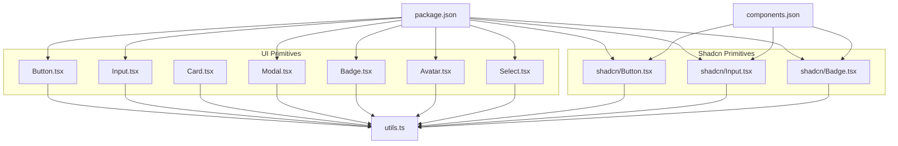
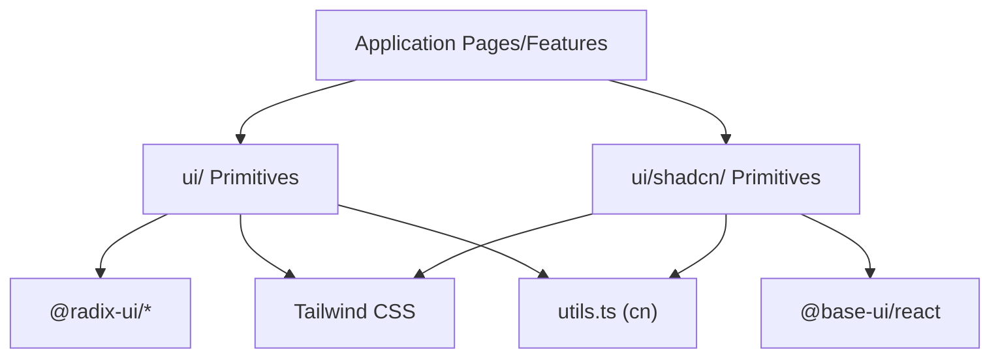
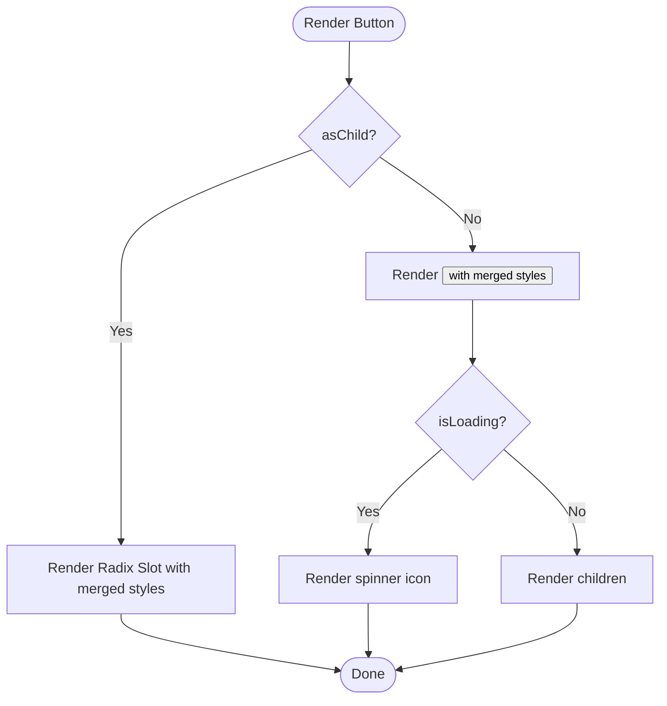
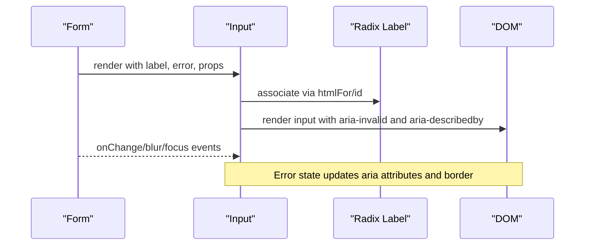
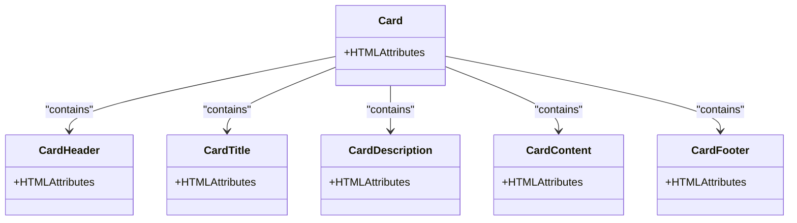
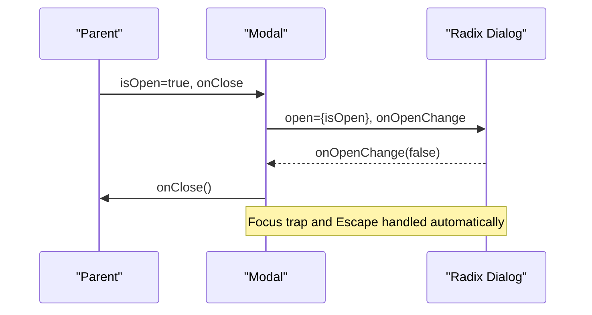
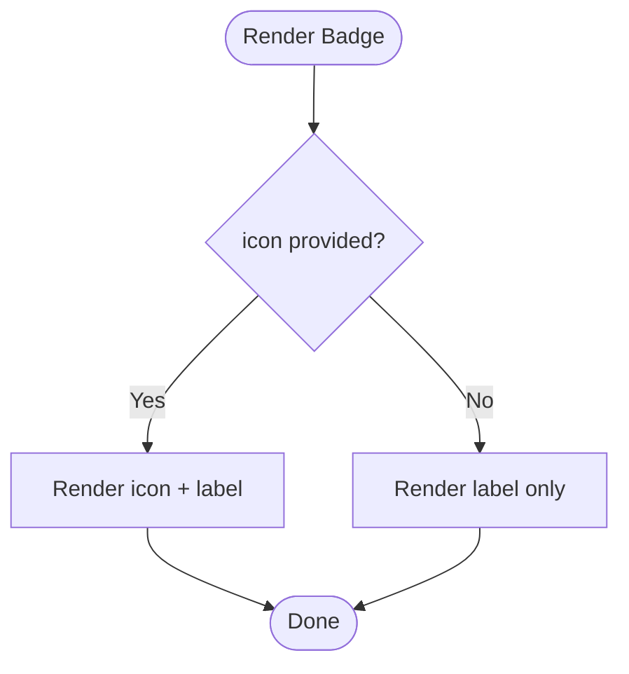
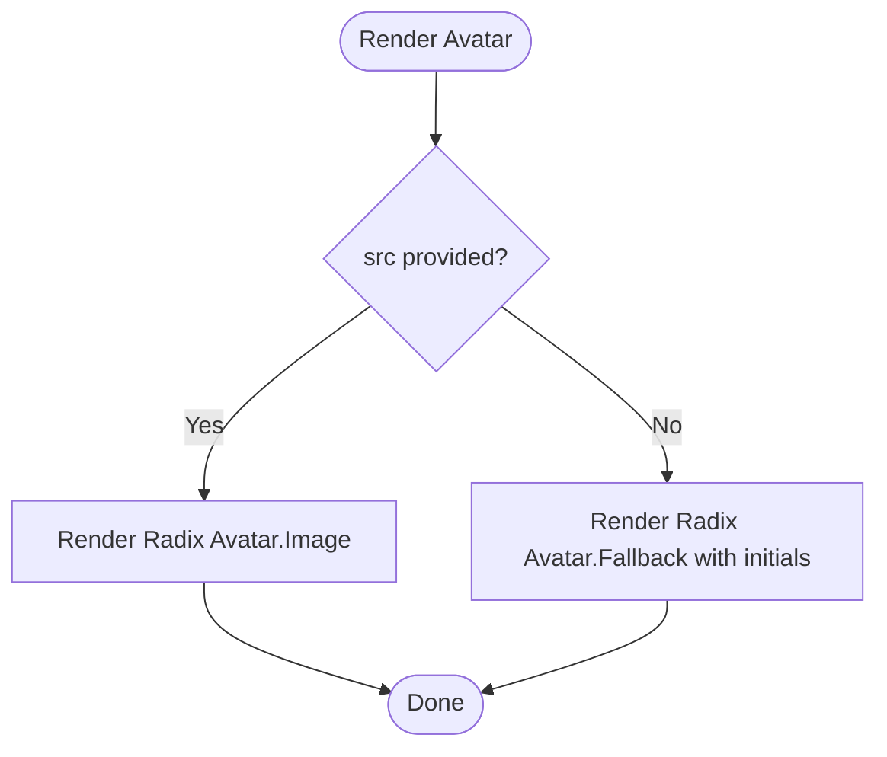
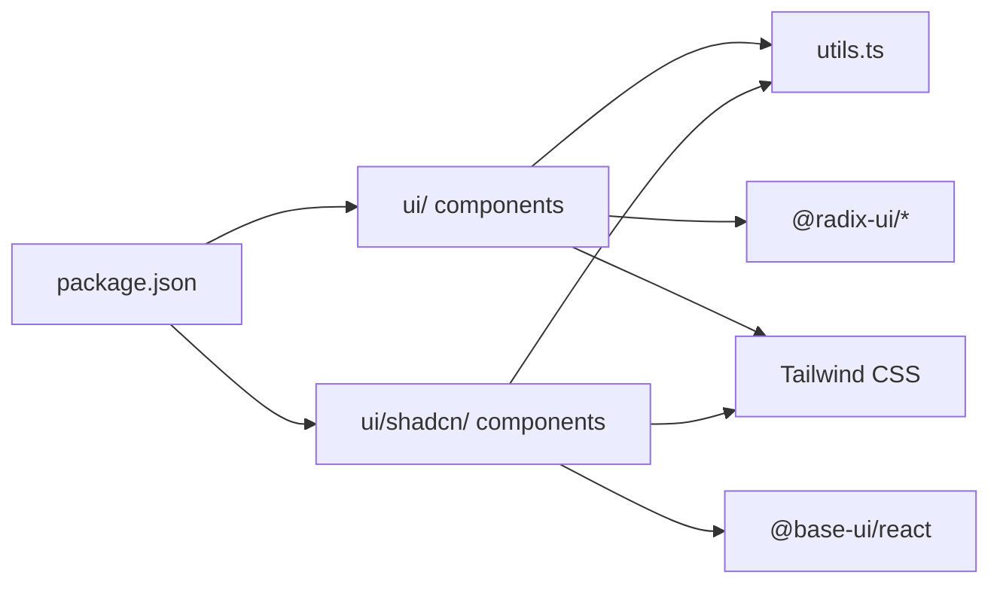

# Shared UI Components

<cite>
**Referenced Files in This Document**
- [Button.tsx](file://frontend/src/components/ui/Button.tsx)
- [Input.tsx](file://frontend/src/components/ui/Input.tsx)
- [Card.tsx](file://frontend/src/components/ui/Card.tsx)
- [Modal.tsx](file://frontend/src/components/ui/Modal.tsx)
- [Badge.tsx](file://frontend/src/components/ui/Badge.tsx)
- [Avatar.tsx](file://frontend/src/components/ui/Avatar.tsx)
- [Select.tsx](file://frontend/src/components/ui/Select.tsx)
- [shadcn Button.tsx](file://frontend/src/components/ui/shadcn/Button.tsx)
- [shadcn Input.tsx](file://frontend/src/components/ui/shadcn/Input.tsx)
- [shadcn Badge.tsx](file://frontend/src/components/ui/shadcn/Badge.tsx)
- [utils.ts](file://frontend/src/lib/utils.ts)
- [components.json](file://frontend/components.json)
- [package.json](file://frontend/package.json)
</cite>

## Table of Contents
1. Introduction
2. Project Structure
3. Core Components
4. Architecture Overview
5. Detailed Component Analysis
6. Dependency Analysis
7. Performance Considerations
8. Troubleshooting Guide
9. Conclusion
10. Appendices

## Introduction
This document describes the shared UI component library used across the frontend application. It covers reusable primitives such as Button, Input, Card, Modal, Badge, Avatar, and Select, including their props, events, styling options, accessibility, responsive behavior, and performance characteristics. It also explains how shadcn is integrated and how to extend or customize components consistently.

## Project Structure
The UI components live under frontend/src/components/ui and are built with React, TypeScript, Tailwind CSS, and Radix UI primitives. A parallel set of shadcn-based primitives exists under frontend/src/components/ui/shadcn for a different design system integration. Utilities like cn (class merging) centralize styling logic. The project uses shadcn configuration via components.json and declares dependencies in package.json.



**Diagram sources**
- [Button.tsx:1-72](file://frontend/src/components/ui/Button.tsx#L1-L72)
- [Input.tsx:1-50](file://frontend/src/components/ui/Input.tsx#L1-L50)
- [Card.tsx:1-57](file://frontend/src/components/ui/Card.tsx#L1-L57)
- [Modal.tsx:1-55](file://frontend/src/components/ui/Modal.tsx#L1-L55)
- [Badge.tsx:1-48](file://frontend/src/components/ui/Badge.tsx#L1-L48)
- [Avatar.tsx:1-50](file://frontend/src/components/ui/Avatar.tsx#L1-L50)
- [Select.tsx:1-182](file://frontend/src/components/ui/Select.tsx#L1-L182)
- [shadcn Button.tsx:1-50](file://frontend/src/components/ui/shadcn/Button.tsx#L1-L50)
- [shadcn Input.tsx:1-21](file://frontend/src/components/ui/shadcn/Input.tsx#L1-L21)
- [shadcn Badge.tsx:1-45](file://frontend/src/components/ui/shadcn/Badge.tsx#L1-L45)
- [utils.ts:1-37](file://frontend/src/lib/utils.ts#L1-L37)
- [package.json:18-88](file://frontend/package.json#L18-L88)
- [components.json:1-26](file://frontend/components.json#L1-L26)

**Section sources**
- [package.json:18-88](file://frontend/package.json#L18-L88)
- [components.json:1-26](file://frontend/components.json#L1-L26)
- [utils.ts:1-6](file://frontend/src/lib/utils.ts#L1-L6)

## Core Components
This section summarizes each primitive’s purpose, key props, events, styling customization, accessibility, and usage patterns.

- Button
  - Purpose: Primary interactive element with variants and sizes; supports loading state and rendering as another element via slot.
  - Key props: variant, size, isLoading, asChild, plus standard button attributes.
  - Events: all native button events via spread props.
  - Styling: class-variance-authority variants merged with className using cn.
  - Accessibility: focus-visible outlines; disabled state handled; icon aria-hidden when present.
  - Usage pattern: wrap links or other elements with asChild to inherit styles without extra DOM nodes.
  - Section sources
    - [Button.tsx:7-30](file://frontend/src/components/ui/Button.tsx#L7-L30)
    - [Button.tsx:32-69](file://frontend/src/components/ui/Button.tsx#L32-L69)

- Input
  - Purpose: Accessible text input with label and optional error message.
  - Key props: label, error, labelClassName, plus standard input attributes.
  - Events: onChange, onBlur, onFocus, etc., passed through.
  - Styling: consistent border, focus ring, disabled state; error state highlighted.
  - Accessibility: Radix Label linked by htmlFor; aria-invalid and aria-describedby for errors; generated id fallback.
  - Usage pattern: pair with form libraries; use labelClassName to visually hide labels while keeping them accessible.
  - Section sources
    - [Input.tsx:5-10](file://frontend/src/components/ui/Input.tsx#L5-L10)
    - [Input.tsx:12-49](file://frontend/src/components/ui/Input.tsx#L12-L49)

- Card
  - Purpose: Container with header, title, description, content, and footer sections.
  - Key props: standard HTML attributes on each part; className overrides per section.
  - Events: none beyond standard DOM events.
  - Styling: rounded borders, subtle shadow, consistent spacing; padding can be overridden via className.
  - Accessibility: semantic headings for titles; structure aids screen readers.
  - Usage pattern: compose CardHeader, CardTitle, CardDescription, CardContent, CardFooter for structured layouts.
  - Section sources
    - [Card.tsx:4-15](file://frontend/src/components/ui/Card.tsx#L4-L15)
    - [Card.tsx:17-56](file://frontend/src/components/ui/Card.tsx#L17-L56)

- Modal
  - Purpose: Accessible dialog with overlay, focus trap, escape handling, and animated transitions.
  - Key props: isOpen, onClose, title, children, footer, className.
  - Events: controlled open/close via isOpen and onClose; internal close via overlay click and Escape.
  - Styling: fixed positioning, responsive max width/height, transition states based on Radix data attributes.
  - Accessibility: Radix Dialog provides focus management, return-focus-on-close, and keyboard support; close button has aria-label.
  - Usage pattern: manage open state in parent; pass actions in footer; keep content scrollable within constraints.
  - Section sources
    - [Modal.tsx:6-13](file://frontend/src/components/ui/Modal.tsx#L6-L13)
    - [Modal.tsx:15-54](file://frontend/src/components/ui/Modal.tsx#L15-L54)

- Badge
  - Purpose: Compact status indicator with tone and optional icon.
  - Key props: label, tone, icon, className.
  - Events: none.
  - Styling: tone-based color schemes; outline variant available; inline-flex layout.
  - Accessibility: color is never the only indicator; icon + label ensure context.
  - Usage pattern: combine with status systems; avoid relying solely on color.
  - Section sources
    - [Badge.tsx:5-28](file://frontend/src/components/ui/Badge.tsx#L5-L28)
    - [Badge.tsx:30-47](file://frontend/src/components/ui/Badge.tsx#L30-L47)

- Avatar
  - Purpose: User avatar with image and initials fallback; deterministic background tone from name.
  - Key props: name, src, size, className.
  - Events: none.
  - Styling: circular container; size variants; dynamic background color based on name hashing.
  - Accessibility: alt text on image; fallback shows initials for non-image contexts.
  - Usage pattern: provide src for user images; rely on fallback if load fails.
  - Section sources
    - [Avatar.tsx:4-18](file://frontend/src/components/ui/Avatar.tsx#L4-L18)
    - [Avatar.tsx:20-49](file://frontend/src/components/ui/Avatar.tsx#L20-L49)

- Select
  - Purpose: Accessible select with label, placeholder, options array or children, and hidden input for forms.
  - Key props: label, labelClassName, options, children, value, defaultValue, onChange, placeholder, disabled, name, required, plus standard select attributes.
  - Events: onChange receives synthetic event; onBlur/onFocus forwarded.
  - Styling: trigger and dropdown styled with Tailwind; selected item indicator included.
  - Accessibility: label association via htmlFor/id; hidden input maintains form semantics; Radix Select handles keyboard navigation.
  - Usage pattern: prefer options array for typed lists; fall back to children for custom items; integrate with form libraries via name/value/onChange.
  - Section sources
    - [Select.tsx:18-34](file://frontend/src/components/ui/Select.tsx#L18-L34)
    - [Select.tsx:36-41](file://frontend/src/components/ui/Select.tsx#L36-L41)
    - [Select.tsx:43-181](file://frontend/src/components/ui/Select.tsx#L43-L181)

## Architecture Overview
The UI layer composes Radix primitives and shadcn primitives with Tailwind CSS utilities. The shared components in ui/ are application-specific wrappers that enforce consistent design tokens and accessibility. The shadcn directory provides alternative primitives aligned with Base UI and shadcn conventions.



**Diagram sources**
- [Button.tsx:1-6](file://frontend/src/components/ui/Button.tsx#L1-L6)
- [Select.tsx:1-16](file://frontend/src/components/ui/Select.tsx#L1-L16)
- [Modal.tsx:1-4](file://frontend/src/components/ui/Modal.tsx#L1-L4)
- [shadcn Button.tsx:1-4](file://frontend/src/components/ui/shadcn/Button.tsx#L1-L4)
- [shadcn Input.tsx:1-4](file://frontend/src/components/ui/shadcn/Input.tsx#L1-L4)
- [utils.ts:1-6](file://frontend/src/lib/utils.ts#L1-L6)
- [package.json:18-60](file://frontend/package.json#L18-L60)

## Detailed Component Analysis

### Button
- Props and types
  - Inherits standard button attributes; adds variant, size, isLoading, asChild.
  - Variant values include primary, secondary, ghost, destructive, outline.
  - Size values include default, sm, lg, icon.
- Events
  - All native button events supported via prop spreading.
- Styling
  - Uses cva for variant/size classes; merges with className via cn.
  - Focus-visible outlines and disabled states are enforced.
- Accessibility
  - Focus ring visible; icons marked aria-hidden when decorative.
- Customization
  - Extend variants via cva; override with className; use asChild to render inside links or other components.
- Example usage pattern
  - Wrap a link with asChild to apply button styles without nested buttons.
  - Show spinner when isLoading is true; disable during async operations.



**Diagram sources**
- [Button.tsx:38-69](file://frontend/src/components/ui/Button.tsx#L38-L69)

**Section sources**
- [Button.tsx:7-30](file://frontend/src/components/ui/Button.tsx#L7-L30)
- [Button.tsx:32-69](file://frontend/src/components/ui/Button.tsx#L32-L69)

### Input
- Props and types
  - label, error, labelClassName, plus standard input attributes.
- Events
  - Standard input events forwarded; integrates with form libraries via name/value/onChange.
- Styling
  - Consistent border, focus ring, disabled state; error state highlights border.
- Accessibility
  - Label linked via htmlFor; aria-invalid and aria-describedby for error messages; generated id fallback ensures unique ids.
- Customization
  - Hide label visually with labelClassName (e.g., sr-only) while preserving accessibility.
- Example usage pattern
  - Pair with react-hook-form or similar; display error messages via error prop.



**Diagram sources**
- [Input.tsx:12-49](file://frontend/src/components/ui/Input.tsx#L12-L49)

**Section sources**
- [Input.tsx:5-10](file://frontend/src/components/ui/Input.tsx#L5-L10)
- [Input.tsx:12-49](file://frontend/src/components/ui/Input.tsx#L12-L49)

### Card
- Props and types
  - Each part accepts standard HTML attributes and className overrides.
- Events
  - None beyond standard DOM events.
- Styling
  - Rounded borders, subtle shadow, consistent spacing; padding adjustable via className.
- Accessibility
  - Semantic heading for title; structured sections aid assistive technologies.
- Customization
  - Override padding or layout via className on any part.
- Example usage pattern
  - Compose CardHeader, CardTitle, CardDescription, CardContent, CardFooter for consistent card layouts.



**Diagram sources**
- [Card.tsx:4-15](file://frontend/src/components/ui/Card.tsx#L4-L15)
- [Card.tsx:17-56](file://frontend/src/components/ui/Card.tsx#L17-L56)

**Section sources**
- [Card.tsx:4-15](file://frontend/src/components/ui/Card.tsx#L4-L15)
- [Card.tsx:17-56](file://frontend/src/components/ui/Card.tsx#L17-L56)

### Modal
- Props and types
  - Controlled isOpen and onClose; title, children, footer, className.
- Events
  - Controlled open/close; internal close via overlay click and Escape; focus trapping managed by Radix.
- Styling
  - Fixed overlay and content with transitions; responsive sizing; scrollable content area.
- Accessibility
  - Radix Dialog provides focus trap, return-focus-on-close, and keyboard interactions; close button labeled.
- Customization
  - Pass footer for actions; adjust className for layout tweaks; keep content within max height.
- Example usage pattern
  - Manage modal state in parent; pass handlers to update isOpen; include confirm/cancel actions in footer.



**Diagram sources**
- [Modal.tsx:15-54](file://frontend/src/components/ui/Modal.tsx#L15-L54)

**Section sources**
- [Modal.tsx:6-13](file://frontend/src/components/ui/Modal.tsx#L6-L13)
- [Modal.tsx:15-54](file://frontend/src/components/ui/Modal.tsx#L15-L54)

### Badge
- Props and types
  - label, tone (success, progress, neutral, warning, danger), icon, className.
- Events
  - None.
- Styling
  - Tone-based colors; outline variant; compact inline layout.
- Accessibility
  - Color is never the sole indicator; icon + label ensure meaning.
- Customization
  - Add icon for additional context; use outline variant for emphasis.
- Example usage pattern
  - Combine with status systems; avoid color-only signals.



**Diagram sources**
- [Badge.tsx:30-47](file://frontend/src/components/ui/Badge.tsx#L30-L47)

**Section sources**
- [Badge.tsx:5-28](file://frontend/src/components/ui/Badge.tsx#L5-L28)
- [Badge.tsx:30-47](file://frontend/src/components/ui/Badge.tsx#L30-L47)

### Avatar
- Props and types
  - name, src, size (sm, lg), className.
- Events
  - None.
- Styling
  - Circular container; deterministic background tone from name; size variants.
- Accessibility
  - Alt text on image; fallback shows initials when image unavailable.
- Customization
  - Provide src for user images; rely on fallback for robustness.
- Example usage pattern
  - Use name to generate initials; optionally provide src for profile images.



**Diagram sources**
- [Avatar.tsx:20-49](file://frontend/src/components/ui/Avatar.tsx#L20-L49)

**Section sources**
- [Avatar.tsx:4-18](file://frontend/src/components/ui/Avatar.tsx#L4-L18)
- [Avatar.tsx:20-49](file://frontend/src/components/ui/Avatar.tsx#L20-L49)

### Select
- Props and types
  - label, labelClassName, options, children, value, defaultValue, onChange, placeholder, disabled, name, required, plus standard select attributes.
- Events
  - onChange receives synthetic event; onBlur/onFocus forwarded.
- Styling
  - Trigger and dropdown styled; selected item indicator included; portalized content.
- Accessibility
  - Label association via htmlFor/id; hidden input maintains form semantics; Radix Select manages keyboard navigation.
- Customization
  - Prefer options array for typed lists; use children for custom items; integrate with form libraries via name/value/onChange.
- Example usage pattern
  - Control value externally or use defaultValue; normalize options to strings; handle change via onChange.

```mermaid
sequenceDiagram
participant Parent as "Parent"
participant Select as "Select"
participant Radix as "Radix Select"
participant Hidden as "Hidden Input"
Parent->>Select : value/defaultValue, options/children, onChange
Select->>Radix : Root with value and onValueChange
Radix-->>Select : onValueChange(nextValue)
Select->>Parent : onChange(synthetic event)
Select->>Hidden : update value/name/required
Note over Select,Radix : Portal renders dropdown; keyboard navigation handled
```

**Diagram sources**
- [Select.tsx:36-41](file://frontend/src/components/ui/Select.tsx#L36-L41)
- [Select.tsx:43-181](file://frontend/src/components/ui/Select.tsx#L43-L181)

**Section sources**
- [Select.tsx:18-34](file://frontend/src/components/ui/Select.tsx#L18-L34)
- [Select.tsx:43-181](file://frontend/src/components/ui/Select.tsx#L43-L181)

## Dependency Analysis
- External dependencies
  - Radix UI primitives for dialogs, selects, avatars, labels, and slots.
  - Base UI primitives for shadcn-style components.
  - Class Variance Authority for variant-driven styling.
  - Tailwind CSS for utility classes.
  - Lucide React for icons.
  - Utility functions for class merging and relative time formatting.
- Internal dependencies
  - All components import cn from utils for consistent class merging.
  - shadcn components follow Base UI patterns and merge props/styles similarly.



**Diagram sources**
- [package.json:18-88](file://frontend/package.json#L18-L88)
- [utils.ts:1-6](file://frontend/src/lib/utils.ts#L1-L6)
- [Button.tsx:1-6](file://frontend/src/components/ui/Button.tsx#L1-L6)
- [shadcn Button.tsx:1-4](file://frontend/src/components/ui/shadcn/Button.tsx#L1-L4)

**Section sources**
- [package.json:18-88](file://frontend/package.json#L18-L88)
- [utils.ts:1-6](file://frontend/src/lib/utils.ts#L1-L6)

## Performance Considerations
- Avoid unnecessary re-renders
  - Memoize option lists in Select where appropriate; the component already normalizes options with useMemo.
  - Keep Modal content lightweight; defer heavy computations until open.
- Efficient styling
  - Use cva variants to minimize conditional class logic; leverage Tailwind utilities for consistent styles.
  - Merge classes via cn to prevent conflicts and reduce style recalculations.
- Accessibility and UX
  - Ensure focus management in Modals; avoid blocking the main thread with long tasks.
  - Use lazy loading for images in Avatars; rely on Radix fallbacks to prevent layout shifts.
- Bundle size
  - Import only needed Radix/Base UI primitives; tree-shaking reduces unused code.
  - Prefer utility-first styling to avoid large CSS payloads.

[No sources needed since this section provides general guidance]

## Troubleshooting Guide
- Input not submitting value
  - Ensure name and value are set; Select uses a hidden input to maintain form semantics—verify name/value linkage.
  - Section sources
    - [Select.tsx:120-129](file://frontend/src/components/ui/Select.tsx#L120-L129)
- Modal not closing on Escape
  - Confirm Radix Dialog is used; it handles Escape automatically. If custom overlays exist, ensure they do not intercept events.
  - Section sources
    - [Modal.tsx:15-54](file://frontend/src/components/ui/Modal.tsx#L15-L54)
- Button not clickable when wrapped
  - When using asChild, ensure exactly one child is passed; avoid boolean children alongside the slot.
  - Section sources
    - [Button.tsx:40-52](file://frontend/src/components/ui/Button.tsx#L40-L52)
- Badge conveying status by color only
  - Always include an icon or label to communicate meaning; avoid color-only indicators.
  - Section sources
    - [Badge.tsx:37-47](file://frontend/src/components/ui/Badge.tsx#L37-L47)
- Avatar showing broken image briefly
  - Rely on Radix Avatar fallback; it prevents flash of broken image by managing load state internally.
  - Section sources
    - [Avatar.tsx:33-49](file://frontend/src/components/ui/Avatar.tsx#L33-L49)

## Conclusion
The shared UI component library provides a cohesive set of accessible, customizable primitives built on Radix and Base UI with Tailwind CSS. Components emphasize consistent styling via cva and cn, strong accessibility practices, and clear composition patterns. The shadcn integration offers an alternative design system path while maintaining consistency through shared utilities. By following the documented props, events, and customization approaches, teams can build reliable, performant interfaces at scale.

[No sources needed since this section summarizes without analyzing specific files]

## Appendices

### shadcn Integration and Customization
- Configuration
  - components.json defines aliases, style, and integrations; enables consistent imports and tooling.
  - Section sources
    - [components.json:1-26](file://frontend/components.json#L1-L26)
- Primitives
  - shadcn Button, Input, and Badge wrap Base UI primitives with Tailwind styles and variant systems.
  - Section sources
    - [shadcn Button.tsx:1-50](file://frontend/src/components/ui/shadcn/Button.tsx#L1-L50)
    - [shadcn Input.tsx:1-21](file://frontend/src/components/ui/shadcn/Input.tsx#L1-L21)
    - [shadcn Badge.tsx:1-45](file://frontend/src/components/ui/shadcn/Badge.tsx#L1-L45)
- Extending components
  - Add new variants via cva; merge with className using cn; follow existing patterns for consistency.
  - Section sources
    - [utils.ts:1-6](file://frontend/src/lib/utils.ts#L1-L6)
    - [shadcn Button.tsx:6-41](file://frontend/src/components/ui/shadcn/Button.tsx#L6-L41)

### TypeScript Interfaces and Patterns
- Common patterns
  - forwardRef for refs; explicit prop interfaces; omit/rename props to align with underlying primitives.
  - Section sources
    - [Button.tsx:32-36](file://frontend/src/components/ui/Button.tsx#L32-L36)
    - [Input.tsx:5-10](file://frontend/src/components/ui/Input.tsx#L5-L10)
    - [Select.tsx:18-34](file://frontend/src/components/ui/Select.tsx#L18-L34)
- Event handling
  - Synthetic events for Select; standard events for others; ensure type safety with proper generics.
  - Section sources
    - [Select.tsx:36-41](file://frontend/src/components/ui/Select.tsx#L36-L41)