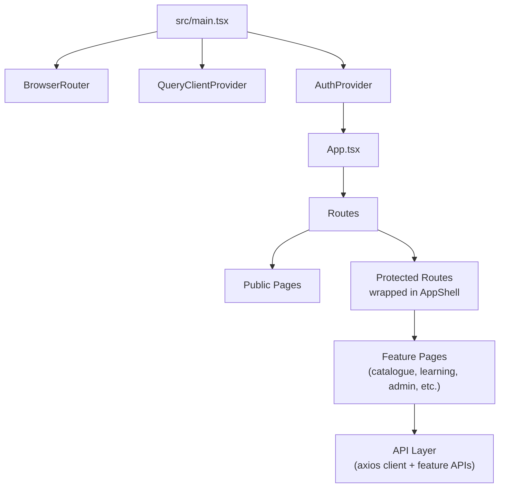
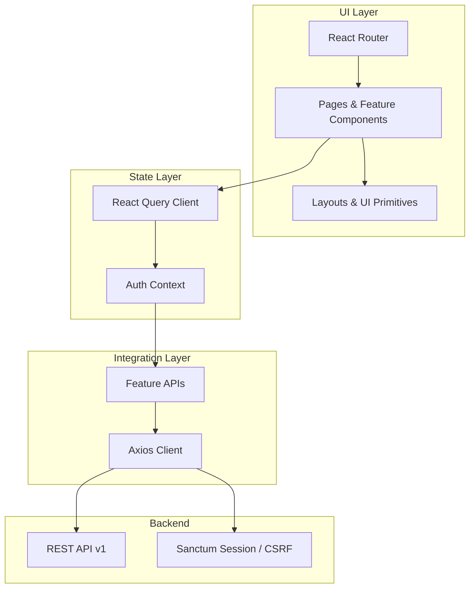
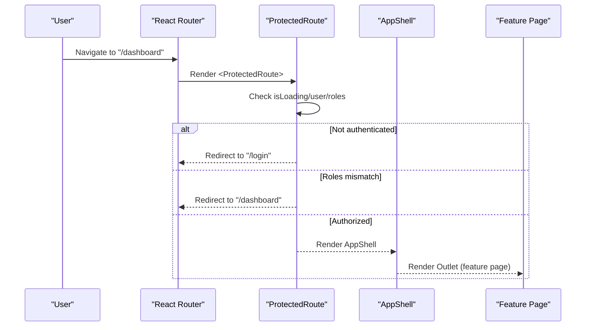
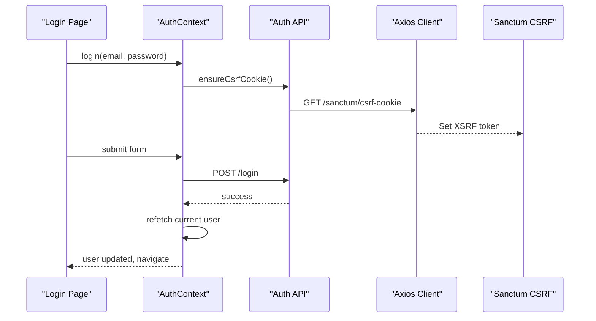
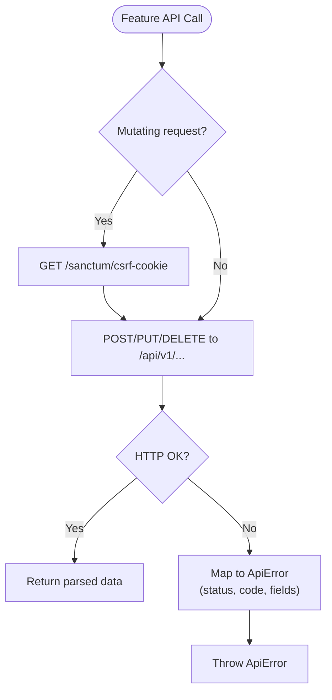
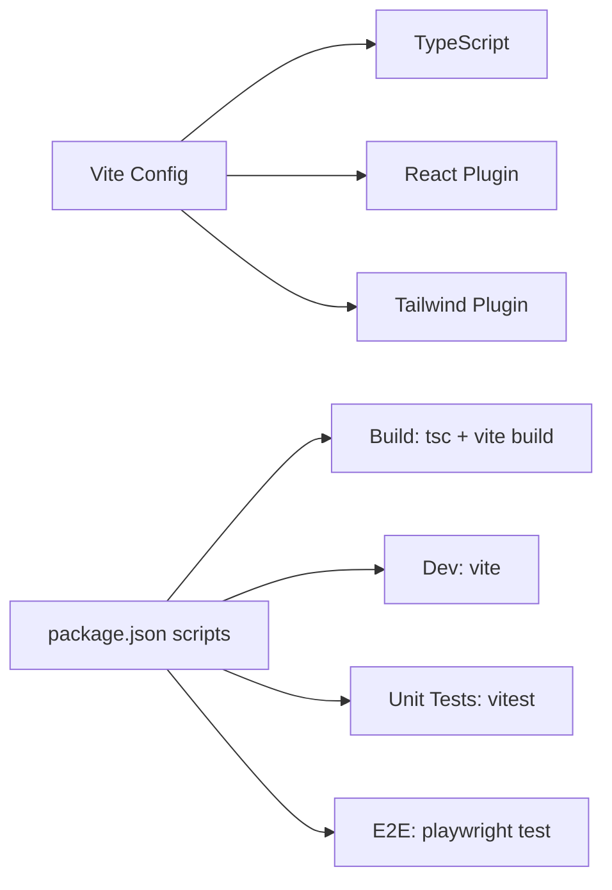

# Frontend Architecture

<cite>
**Referenced Files in This Document**
- [package.json](file://frontend/package.json)
- [vite.config.ts](file://frontend/vite.config.ts)
- [playwright.config.ts](file://frontend/playwright.config.ts)
- [main.tsx](file://frontend/src/main.tsx)
- [App.tsx](file://frontend/src/App.tsx)
- [AuthContext.tsx](file://frontend/src/lib/auth/AuthContext.tsx)
- [client.ts](file://frontend/src/lib/api/client.ts)
- [api.ts](file://frontend/src/features/auth/api.ts)
- [LoginPage.tsx](file://frontend/src/features/auth/LoginPage.tsx)
- [AppShell.tsx](file://frontend/src/components/layout/AppShell.tsx)
- [ProtectedRoute.tsx](file://frontend/src/components/layout/ProtectedRoute.tsx)
</cite>

## Table of Contents
1. Introduction
2. Project Structure
3. Core Components
4. Architecture Overview
5. Detailed Component Analysis
6. Dependency Analysis
7. Performance Considerations
8. Troubleshooting Guide
9. Conclusion

## Introduction
This document describes the React frontend architecture for the application. It covers component structure, state management with React Query, routing configuration, API integration, feature-based organization, UI library usage (Radix UI and Tailwind CSS), build configuration with Vite, testing strategy with Playwright, development workflow, infrastructure requirements, deployment topology, performance optimizations, and cross-cutting concerns such as authentication, error handling, and responsive design.

## Project Structure
The frontend is organized by features under src/features, shared layout components under src/components/layout, reusable UI primitives under src/components/ui, and a thin API layer under src/lib/api. Routing is centralized in App.tsx, while global providers (React Router, React Query, Auth) are configured in main.tsx.

**Diagram sources**
- [main.tsx:1-61](file://frontend/src/main.tsx#L1-L61)
- [App.tsx:1-247](file://frontend/src/App.tsx#L1-L247)

**Section sources**
- [package.json:1-91](file://frontend/package.json#L1-L91)
- [vite.config.ts:1-30](file://frontend/vite.config.ts#L1-L30)

## Core Components
- Global bootstrap: main.tsx creates the React root, configures React Query with default options, wraps the app with an ErrorBoundary, and provides BrowserRouter, QueryClientProvider, and AuthProvider.
- Routing: App.tsx defines public routes (landing, auth flows, catalogue) and protected routes grouped under AppShell with role-based guards via ProtectedRoute.
- Shell and navigation: AppShell renders role-aware sidebar navigation, top bar with search and profile menu, and mobile bottom nav.
- Authentication context: AuthContext uses React Query to fetch current user and exposes login/register/logout/refetch helpers.
- API client: Axios instance with CSRF cookie handling for Sanctum SPA auth and typed error mapping.

**Section sources**
- [main.tsx:1-61](file://frontend/src/main.tsx#L1-L61)
- [App.tsx:1-247](file://frontend/src/App.tsx#L1-L247)
- [AppShell.tsx:1-270](file://frontend/src/components/layout/AppShell.tsx#L1-L270)
- [AuthContext.tsx:1-71](file://frontend/src/lib/auth/AuthContext.tsx#L1-L71)
- [client.ts:1-69](file://frontend/src/lib/api/client.ts#L1-L69)

## Architecture Overview
The frontend follows a feature-sliced architecture:
- Features encapsulate domain logic, pages, and feature-specific API calls.
- Shared layout and UI components provide consistent UX across features.
- React Query manages server state and caching; AuthContext orchestrates session state using React Query.
- Routing enforces access control at the route level, complemented by backend policies.

**Diagram sources**
- [main.tsx:1-61](file://frontend/src/main.tsx#L1-L61)
- [App.tsx:1-247](file://frontend/src/App.tsx#L1-L247)
- [AuthContext.tsx:1-71](file://frontend/src/lib/auth/AuthContext.tsx#L1-L71)
- [client.ts:1-69](file://frontend/src/lib/api/client.ts#L1-L69)

## Detailed Component Analysis

### Routing and Access Control
- Public routes include landing, about, contact, auth flows, and catalogue browsing.
- Protected routes are wrapped in AppShell and gated by ProtectedRoute, which checks authentication and optional roles.
- Role-based navigation is rendered in AppShell based on the authenticated user’s role.

**Diagram sources**
- [App.tsx:1-247](file://frontend/src/App.tsx#L1-L247)
- [ProtectedRoute.tsx:1-35](file://frontend/src/components/layout/ProtectedRoute.tsx#L1-L35)
- [AppShell.tsx:1-270](file://frontend/src/components/layout/AppShell.tsx#L1-L270)

**Section sources**
- [App.tsx:1-247](file://frontend/src/App.tsx#L1-L247)
- [ProtectedRoute.tsx:1-35](file://frontend/src/components/layout/ProtectedRoute.tsx#L1-L35)
- [AppShell.tsx:1-270](file://frontend/src/components/layout/AppShell.tsx#L1-L270)

### Authentication Flow with React Query
- AuthContext uses a query to fetch the current user and caches it with staleTime. Login/register trigger refetch to update user state; logout clears cache and session UI flags.
- Feature APIs use the axios client with CSRF cookie seeding before mutating requests.

**Diagram sources**
- [AuthContext.tsx:1-71](file://frontend/src/lib/auth/AuthContext.tsx#L1-L71)
- [api.ts:1-62](file://frontend/src/features/auth/api.ts#L1-L62)
- [client.ts:1-69](file://frontend/src/lib/api/client.ts#L1-L69)
- [LoginPage.tsx:1-101](file://frontend/src/features/auth/LoginPage.tsx#L1-L101)

**Section sources**
- [AuthContext.tsx:1-71](file://frontend/src/lib/auth/AuthContext.tsx#L1-L71)
- [api.ts:1-62](file://frontend/src/features/auth/api.ts#L1-L62)
- [client.ts:1-69](file://frontend/src/lib/api/client.ts#L1-L69)
- [LoginPage.tsx:1-101](file://frontend/src/features/auth/LoginPage.tsx#L1-L101)

### API Integration Layer
- The axios client sets baseURL to /api/v1, enables credentials and XSRF token, and normalizes errors into a typed ApiError with status, code, message, and field-level details.
- Feature modules (e.g., auth) call ensureCsrfCookie before mutations and then perform REST calls.

**Diagram sources**
- [client.ts:1-69](file://frontend/src/lib/api/client.ts#L1-L69)
- [api.ts:1-62](file://frontend/src/features/auth/api.ts#L1-L62)

**Section sources**
- [client.ts:1-69](file://frontend/src/lib/api/client.ts#L1-L69)
- [api.ts:1-62](file://frontend/src/features/auth/api.ts#L1-L62)

### UI Library Usage and Responsive Design
- Radix UI primitives are used for accessible building blocks (avatar, dialog, dropdown, select, progress).
- Tailwind CSS powers styling with utility classes; shadcn-style components are composed from Radix and Tailwind.
- AppShell implements responsive layouts: desktop sidebar with collapse toggle, top bar with search, and mobile bottom navigation.

**Section sources**
- [package.json:18-61](file://frontend/package.json#L18-L61)
- [AppShell.tsx:1-270](file://frontend/src/components/layout/AppShell.tsx#L1-L270)

## Dependency Analysis
- Build tooling: Vite with React plugin and Tailwind CSS plugin; TypeScript compilation via tsc -b in build script.
- Testing: Vitest for unit tests with jsdom environment; Playwright for end-to-end tests with HTML reporter and webServer integration.
- Runtime dependencies: React Router for navigation, React Query for server state, Axios for HTTP, Zod for validation, React Hook Form for forms, and Radix UI primitives.

**Diagram sources**
- [vite.config.ts:1-30](file://frontend/vite.config.ts#L1-L30)
- [package.json:6-16](file://frontend/package.json#L6-L16)
- [playwright.config.ts:1-49](file://frontend/playwright.config.ts#L1-L49)

**Section sources**
- [package.json:1-91](file://frontend/package.json#L1-L91)
- [vite.config.ts:1-30](file://frontend/vite.config.ts#L1-L30)
- [playwright.config.ts:1-49](file://frontend/playwright.config.ts#L1-L49)

## Performance Considerations
- React Query defaults: single retry and disabled refetch on window focus reduce unnecessary network churn.
- Stale time for current user query minimizes re-fetches during sessions.
- Conditional rendering in routes avoids loading protected shells until necessary.
- Use of lightweight UI libraries (Radix) and utility-first CSS (Tailwind) reduces bundle size and improves runtime performance.
- Consider adding route-level code splitting and lazy loading for large feature modules to further reduce initial bundle size.

[No sources needed since this section provides general guidance]

## Troubleshooting Guide
- Global error boundary: main.tsx includes an ErrorBoundary that catches render-time errors and displays a friendly message with a reload action.
- API errors: client.ts maps Axios errors to ApiError with structured fields; feature pages should catch ApiError to display user-friendly messages.
- Authentication issues: ensure CSRF cookie is fetched before mutations; verify VITE_API_BASE_URL points to the correct backend.
- Routing redirects: ProtectedRoute redirects unauthenticated users to login and preserves destination via location state.

**Section sources**
- [main.tsx:18-46](file://frontend/src/main.tsx#L18-L46)
- [client.ts:35-69](file://frontend/src/lib/api/client.ts#L35-L69)
- [ProtectedRoute.tsx:17-35](file://frontend/src/components/layout/ProtectedRoute.tsx#L17-L35)

## Conclusion
The frontend employs a clean, feature-based architecture with strong separation of concerns: routing and access control in App.tsx, global state via React Query and AuthContext, a robust API integration layer with CSRF support, and a responsive UI built on Radix UI and Tailwind CSS. Vite provides fast development and optimized builds, while Vitest and Playwright ensure quality through unit and end-to-end testing. With these foundations, the application scales well across features and roles while maintaining clarity and maintainability.