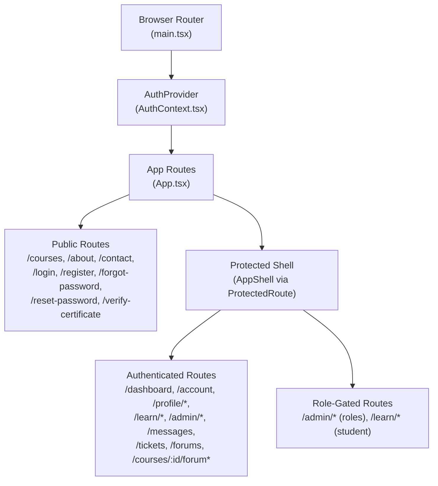
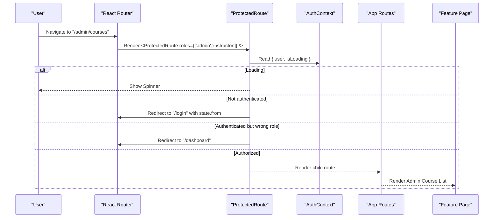
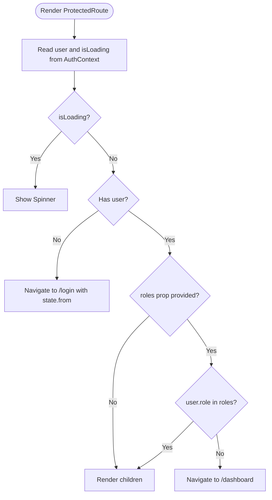
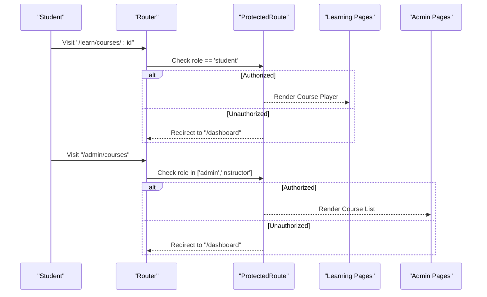
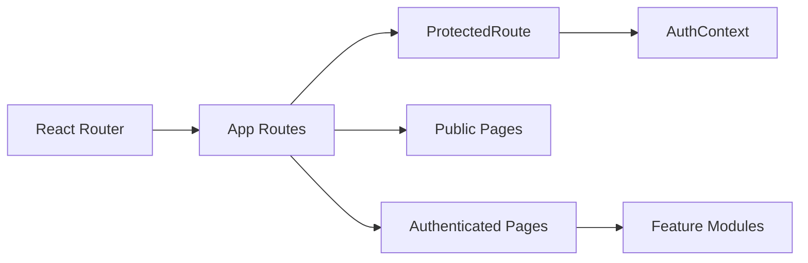

# Routing & Navigation

<cite>
**Referenced Files in This Document**
- [main.tsx](file://frontend/src/main.tsx)
- [App.tsx](file://frontend/src/App.tsx)
- [ProtectedRoute.tsx](file://frontend/src/components/layout/ProtectedRoute.tsx)
- [AuthContext.tsx](file://frontend/src/lib/auth/AuthContext.tsx)
- [LoginPage.tsx](file://frontend/src/features/auth/LoginPage.tsx)
- [DashboardPage.tsx](file://frontend/src/features/dashboard/DashboardPage.tsx)
- [MyCoursesPage.tsx](file://frontend/src/features/enrolment/MyCoursesPage.tsx)
- [AdminDashboardPage.tsx](file://frontend/src/features/admin/dashboard/AdminDashboardPage.tsx)
</cite>

## Table of Contents
1. [Introduction](#introduction)
2. [Project Structure](#project-structure)
3. [Core Components](#core-components)
4. [Architecture Overview](#architecture-overview)
5. [Detailed Component Analysis](#detailed-component-analysis)
6. [Dependency Analysis](#dependency-analysis)
7. [Performance Considerations](#performance-considerations)
8. [Troubleshooting Guide](#troubleshooting-guide)
9. [Conclusion](#conclusion)

## Introduction
This document explains the React Router implementation and navigation patterns used across the application. It covers route configuration, protected routes with authentication guards, nested routing structures, programmatic navigation, route parameters, query string handling, lazy loading strategies, and role-based access control. It also maps the navigation flow between key features such as courses, assessments, and admin panels.

## Project Structure
The application bootstraps React Router at the root and wraps the app with providers for data fetching and authentication. Routes are declared centrally to define public pages, authenticated shells, and feature-specific sub-routes. Protected areas are gated by a reusable guard component that enforces authentication and role checks.

**Diagram sources**
- [main.tsx:1-61](file://frontend/src/main.tsx#L1-L61)
- [App.tsx:1-247](file://frontend/src/App.tsx#L1-L247)

**Section sources**
- [main.tsx:1-61](file://frontend/src/main.tsx#L1-L61)
- [App.tsx:1-247](file://frontend/src/App.tsx#L1-L247)

## Core Components
- BrowserRouter and Providers: The app initializes React Router and wraps components with QueryClientProvider and AuthProvider to enable data fetching and authentication context.
- Centralized Routing: All routes are defined in one place, grouping public routes, an authenticated shell, and nested feature routes under shared layouts.
- ProtectedRoute Guard: A reusable wrapper that shows a spinner while auth state loads, redirects unauthenticated users to login preserving the intended destination, and enforces role-based access by redirecting unauthorized users to the dashboard.
- Auth Context: Provides current user, loading state, and actions for login/register/logout; it refetches the current user after mutations and clears per-session UI state on logout.

Key behaviors:
- On first load, if the user is authenticated and not requesting a special hash fragment, they are redirected to the dashboard.
- Unauthenticated attempts to access protected routes store the original location in navigation state so the user can be returned after login.
- Role checks are enforced per route using the roles prop on ProtectedRoute.

**Section sources**
- [main.tsx:1-61](file://frontend/src/main.tsx#L1-L61)
- [App.tsx:1-247](file://frontend/src/App.tsx#L1-L247)
- [ProtectedRoute.tsx:1-35](file://frontend/src/components/layout/ProtectedRoute.tsx#L1-L35)
- [AuthContext.tsx:1-71](file://frontend/src/lib/auth/AuthContext.tsx#L1-L71)

## Architecture Overview
The routing architecture separates public and authenticated experiences, uses a single shell for authenticated sections, and applies role-based guards at the route level. Feature modules register their own sub-routes under logical prefixes (e.g., /learn, /admin).

**Diagram sources**
- [App.tsx:74-149](file://frontend/src/App.tsx#L74-L149)
- [ProtectedRoute.tsx:17-33](file://frontend/src/components/layout/ProtectedRoute.tsx#L17-L33)
- [AuthContext.tsx:24-53](file://frontend/src/lib/auth/AuthContext.tsx#L24-L53)

## Detailed Component Analysis

### Route Configuration and Layouts
- Public routes include catalogue, about, contact, and all auth flows.
- An authenticated shell wraps protected routes, providing consistent layout and navigation chrome.
- Nested routes organize features:
  - Learning: /learn/courses/:id, /learn/resources/:id, /learn/assignments/:id, /learn/evaluations/:id
  - Admin: /admin/courses/*, /admin/applications, /admin/reviews, /admin/payments, /admin/users, /admin/audit-log, /admin/assignments/:id, /admin/evaluations/:id, /admin/resources/:id/attendance
  - Communication: /messages, /messages/:id, /tickets, /tickets/:id, /forums, /courses/:id/forum, /courses/:id/forum/moderation

Programmatic navigation examples:
- After successful login, navigate to the originally requested page or fallback to dashboard.
- From dashboards and course cards, navigate to learning paths and admin tools.

Route parameters and query strings:
- Route params are used extensively (e.g., :id for courses, assignments, evaluations).
- Hash-based navigation is used to allow logged-in students to reach the catalogue section via #courses.

Lazy loading and code splitting:
- No dynamic imports are present in the central route file; routes are statically imported. Lazy loading can be introduced per route using React.lazy and Suspense to improve initial bundle size.

Navigation state preservation:
- The login flow preserves the intended destination via navigation state and restores it after authentication.

**Section sources**
- [App.tsx:50-242](file://frontend/src/App.tsx#L50-L242)
- [LoginPage.tsx:21-49](file://frontend/src/features/auth/LoginPage.tsx#L21-L49)
- [MyCoursesPage.tsx:306-316](file://frontend/src/features/enrolment/MyCoursesPage.tsx#L306-L316)

### Authentication Guards and Role-Based Protection
- ProtectedRoute renders a spinner during auth initialization, redirects unauthenticated users to login while preserving the target path, and enforces role constraints by redirecting unauthorized users to the dashboard.
- Roles are specified per route where needed (e.g., admin-only vs instructor-accessible routes).

Integration points:
- AuthContext provides current user and loading state.
- Login flow triggers user fetch and navigates to the stored destination.

**Diagram sources**
- [ProtectedRoute.tsx:17-33](file://frontend/src/components/layout/ProtectedRoute.tsx#L17-L33)
- [AuthContext.tsx:24-53](file://frontend/src/lib/auth/AuthContext.tsx#L24-L53)

**Section sources**
- [ProtectedRoute.tsx:1-35](file://frontend/src/components/layout/ProtectedRoute.tsx#L1-L35)
- [AuthContext.tsx:1-71](file://frontend/src/lib/auth/AuthContext.tsx#L1-L71)
- [LoginPage.tsx:21-49](file://frontend/src/features/auth/LoginPage.tsx#L21-L49)

### Navigation Flow Between Features
- Catalogue and Courses:
  - Public catalogue at /courses and detail at /courses/:id.
  - Logged-in users can still reach the catalogue via a special hash (#courses) to browse course sections.
- Learning:
  - Students access courses, resources, assignments, and evaluations under /learn/* with student role protection.
- Assessments:
  - Student submission and grading interfaces are routed under /learn/assignments/:id and /learn/evaluations/:id for students, and under /admin/assignments/:id and /admin/evaluations/:id for instructors/admins.
- Admin Panel:
  - Admin and instructor routes manage courses, applications, reviews, payments, users, gradebook, audit log, and attendance.

**Diagram sources**
- [App.tsx:143-223](file://frontend/src/App.tsx#L143-L223)
- [ProtectedRoute.tsx:17-33](file://frontend/src/components/layout/ProtectedRoute.tsx#L17-L33)

**Section sources**
- [App.tsx:50-242](file://frontend/src/App.tsx#L50-L242)
- [DashboardPage.tsx:1-17](file://frontend/src/features/dashboard/DashboardPage.tsx#L1-L17)
- [AdminDashboardPage.tsx:111-134](file://frontend/src/features/admin/dashboard/AdminDashboardPage.tsx#L111-L134)

### Programmatic Navigation, Parameters, and Query Handling
- Programmatic navigation:
  - After login, navigate to the previously requested route or default to dashboard.
  - Dashboard and course cards link to learning paths and admin tools.
- Route parameters:
  - Use :id for courses, assignments, evaluations, resources, tickets, and messages.
- Query strings:
  - While no explicit query parsing is shown in the analyzed files, React Router supports query strings via URLSearchParams when needed. For example, filtering or search could be implemented by reading and updating searchParams on navigation.

Examples to implement:
- Filtering catalogue or lists by adding ?q=... and reading searchParams in components.
- Preserving filters across navigations by including searchParams in Link or useNavigate calls.

**Section sources**
- [LoginPage.tsx:21-49](file://frontend/src/features/auth/LoginPage.tsx#L21-L49)
- [MyCoursesPage.tsx:306-316](file://frontend/src/features/enrolment/MyCoursesPage.tsx#L306-L316)
- [App.tsx:64-231](file://frontend/src/App.tsx#L64-L231)

### Lazy Loading and Route-Based Code Splitting
Current state:
- Routes are statically imported in the central route file.

Recommendations:
- Introduce React.lazy for heavy feature pages (e.g., admin dashboards, gradebook, course builder) to reduce initial bundle size.
- Wrap lazy-loaded routes with Suspense boundaries to show loading indicators.
- Keep lightweight components (auth forms, small dashboards) eagerly loaded.

Example pattern:
- Replace static import with dynamic import inside Route element.
- Provide a fallback loader component for Suspense.

[No sources needed since this section provides general guidance]

### Integration with Authentication Middleware and Role-Based Protection
Frontend:
- ProtectedRoute enforces authentication and role checks before rendering feature content.
- AuthContext manages user session state and provides login/logout/refetch capabilities.

Backend integration note:
- Frontend guards are UX conveniences; server-side authorization via Policies must be enforced for all write operations.

Best practices:
- Always validate permissions on the backend for sensitive actions.
- Keep frontend roles aligned with backend policies to avoid inconsistent behavior.

**Section sources**
- [ProtectedRoute.tsx:12-33](file://frontend/src/components/layout/ProtectedRoute.tsx#L12-L33)
- [AuthContext.tsx:24-53](file://frontend/src/lib/auth/AuthContext.tsx#L24-L53)

## Dependency Analysis
The routing layer depends on:
- React Router for navigation primitives (Routes, Route, Navigate, useLocation, useNavigate).
- AuthContext for user state and actions.
- Feature components for each route segment.

**Diagram sources**
- [App.tsx:1-247](file://frontend/src/App.tsx#L1-L247)
- [ProtectedRoute.tsx:1-35](file://frontend/src/components/layout/ProtectedRoute.tsx#L1-L35)
- [AuthContext.tsx:1-71](file://frontend/src/lib/auth/AuthContext.tsx#L1-L71)

**Section sources**
- [App.tsx:1-247](file://frontend/src/App.tsx#L1-L247)
- [ProtectedRoute.tsx:1-35](file://frontend/src/components/layout/ProtectedRoute.tsx#L1-L35)
- [AuthContext.tsx:1-71](file://frontend/src/lib/auth/AuthContext.tsx#L1-L71)

## Performance Considerations
- Initial bundle size: Since routes are statically imported, consider lazy-loading heavy feature pages to improve Time to Interactive.
- Navigation transitions: Use replace navigation for redirects to avoid unnecessary history entries.
- Data fetching: Leverage React Query caching and stale times configured in the client to minimize redundant requests.
- Error boundaries: The root error boundary prevents white screens and offers recovery via reload.

[No sources needed since this section provides general guidance]

## Troubleshooting Guide
Common issues and resolutions:
- Infinite redirect loop after login:
  - Ensure the login flow reads the intended destination from navigation state and falls back to a valid route.
- Access denied to admin routes:
  - Verify the user’s role matches the required roles for the route.
- Blank screen on load:
  - Check the root error boundary and ensure providers are correctly wrapped around App.
- Lost filters or search state:
  - Persist search parameters in the URL and read them in components to maintain state across navigations.

**Section sources**
- [LoginPage.tsx:21-49](file://frontend/src/features/auth/LoginPage.tsx#L21-L49)
- [ProtectedRoute.tsx:17-33](file://frontend/src/components/layout/ProtectedRoute.tsx#L17-L33)
- [main.tsx:18-46](file://frontend/src/main.tsx#L18-L46)

## Conclusion
The application uses a centralized React Router setup with a clear separation between public and authenticated routes. Authentication and role-based protection are enforced through a reusable guard component integrated with a global auth context. Navigation is both declarative (Link) and programmatic (useNavigate), with support for route parameters and potential query string handling. While routes are currently statically imported, adopting lazy loading will further optimize performance. Backend authorization remains the authoritative enforcement point for all sensitive operations.