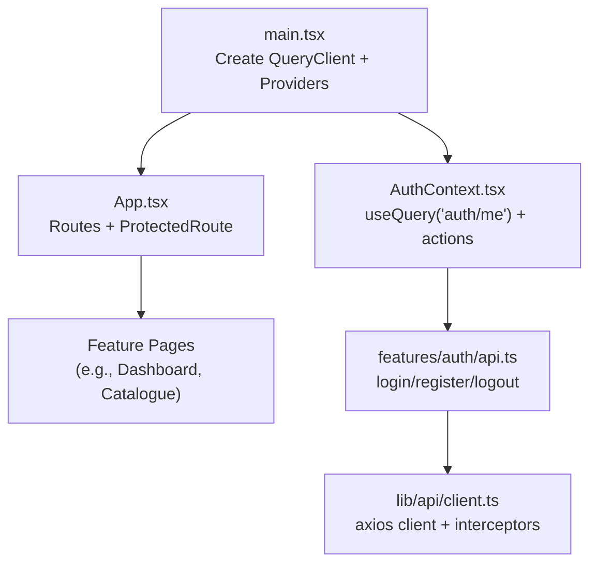
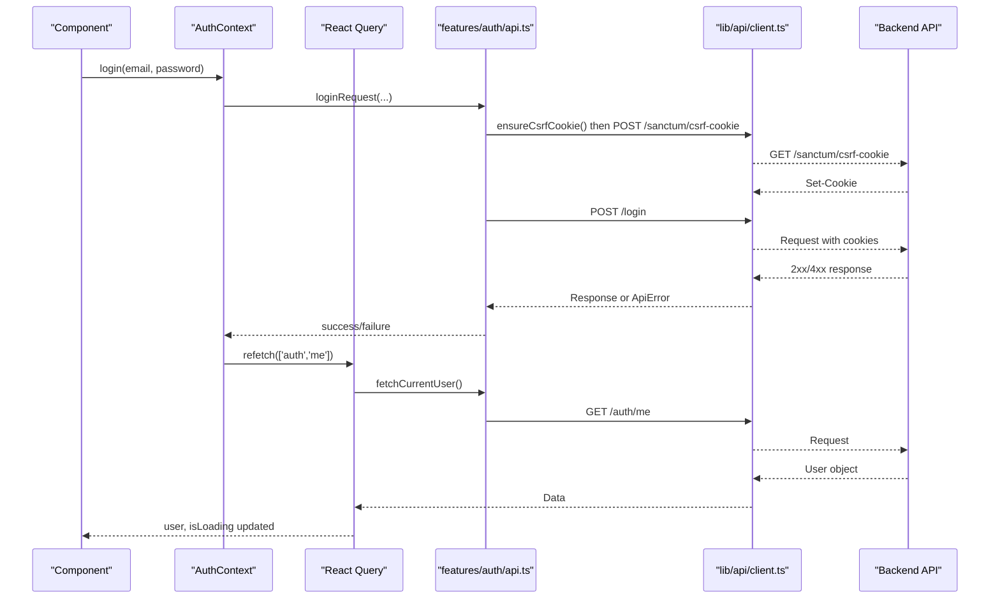
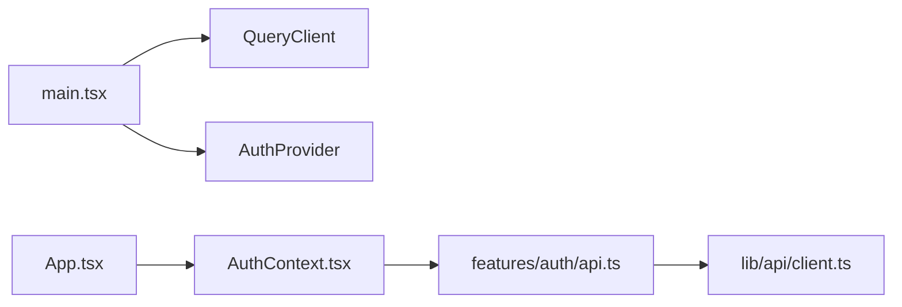
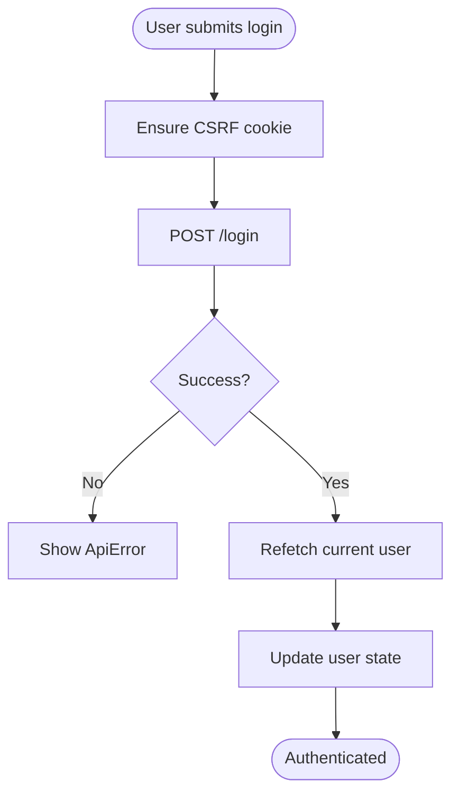
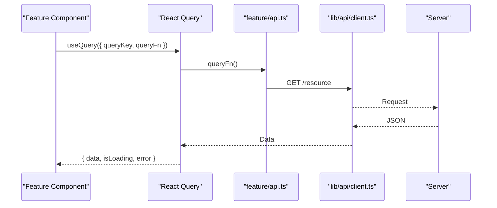

# State Management

<cite>
**Referenced Files in This Document**
- [main.tsx](file://frontend/src/main.tsx)
- [App.tsx](file://frontend/src/App.tsx)
- [AuthContext.tsx](file://frontend/src/lib/auth/AuthContext.tsx)
- [client.ts](file://frontend/src/lib/api/client.ts)
- [api.ts](file://frontend/src/features/auth/api.ts)
</cite>

## Table of Contents
1. [Introduction](#introduction)
2. [Project Structure](#project-structure)
3. [Core Components](#core-components)
4. [Architecture Overview](#architecture-overview)
5. [Detailed Component Analysis](#detailed-component-analysis)
6. [Dependency Analysis](#dependency-analysis)
7. [Performance Considerations](#performance-considerations)
8. [Troubleshooting Guide](#troubleshooting-guide)
9. [Conclusion](#conclusion)
10. [Appendices](#appendices)

## Introduction
This document explains the application’s state management strategy, focusing on server state with React Query (TanStack Query), authentication and global user state via React Context, and patterns for data fetching, caching, error handling, and loading states. It also provides guidance on when to use local component state versus global state, and how form state is typically handled within this architecture.

## Project Structure
The frontend bootstraps a React application that:
- Configures a single QueryClient instance for all server-state queries and mutations.
- Wraps the app with QueryClientProvider to enable React Query across components.
- Provides an AuthContext that exposes current user, loading state, and auth actions.
- Uses React Router to render pages and enforce protected routes based on authentication.

**Diagram sources**
- [main.tsx:4-16](file://frontend/src/main.tsx#L4-L16)
- [main.tsx:48-60](file://frontend/src/main.tsx#L48-L60)
- [App.tsx:1-10](file://frontend/src/App.tsx#L1-L10)
- [AuthContext.tsx:1-10](file://frontend/src/lib/auth/AuthContext.tsx#L1-L10)
- [client.ts:1-13](file://frontend/src/lib/api/client.ts#L1-L13)

**Section sources**
- [main.tsx:4-16](file://frontend/src/main.tsx#L4-L16)
- [main.tsx:48-60](file://frontend/src/main.tsx#L48-L60)
- [App.tsx:1-10](file://frontend/src/App.tsx#L1-L10)

## Core Components
- QueryClient configuration: Centralized setup with retry policy and refetch behavior to control network requests globally.
- Authentication context: Encapsulates current user state, loading, and auth actions; uses React Query to fetch and cache the current user.
- API client: Axios-based HTTP client with CSRF cookie handling, consistent error mapping, and response interception.

Key responsibilities:
- Server state: Managed by React Query through useQuery and useMutation (used by feature modules).
- Global UI state: User identity and auth actions exposed via AuthContext.
- Error handling: Centralized mapping from Axios errors to typed ApiError objects.

**Section sources**
- [main.tsx:9-16](file://frontend/src/main.tsx#L9-L16)
- [AuthContext.tsx:21-53](file://frontend/src/lib/auth/AuthContext.tsx#L21-L53)
- [client.ts:15-68](file://frontend/src/lib/api/client.ts#L15-L68)

## Architecture Overview
The application follows a layered approach:
- Presentation layer (pages/components) consumes React Query hooks and AuthContext.
- Feature APIs encapsulate domain-specific endpoints.
- Shared API client handles HTTP concerns (base URL, credentials, CSRF, error mapping).
- React Query manages caching, background updates, and optimistic updates where appropriate.

**Diagram sources**
- [AuthContext.tsx:38-53](file://frontend/src/lib/auth/AuthContext.tsx#L38-L53)
- [client.ts:22-33](file://frontend/src/lib/api/client.ts#L22-L33)
- [client.ts:65-68](file://frontend/src/lib/api/client.ts#L65-L68)

## Detailed Component Analysis

### QueryClient Configuration and Caching Strategy
- A single QueryClient is created at app bootstrap and provided globally.
- Default query options include limited retries and disabled refetch on window focus to reduce unnecessary network traffic.
- Per-query settings can override defaults (e.g., staleTime, retry) where needed.

Benefits:
- Predictable caching behavior across the app.
- Reduced network load and improved perceived performance.
- Consistent error and loading semantics via React Query.

**Section sources**
- [main.tsx:9-16](file://frontend/src/main.tsx#L9-L16)

### Authentication Context and Global User State
- The AuthContext uses React Query to fetch the current user with a dedicated query key and a reasonable stale time.
- Login and register trigger a refetch to refresh the user state after successful mutation.
- Logout clears session UI flags and explicitly nullifies the cached user to ensure clean state transitions.

Patterns:
- Use React Query for server-backed user state rather than ad-hoc local state.
- Expose minimal, focused actions (login, register, logout, refetch) to keep UI logic simple.

**Section sources**
- [AuthContext.tsx:21-53](file://frontend/src/lib/auth/AuthContext.tsx#L21-L53)

### API Client, CSRF Handling, and Error Mapping
- Axios client is configured with base URL, credentials, and XSRF token support.
- A one-time CSRF cookie fetch ensures subsequent mutating requests are authenticated correctly.
- All Axios errors are transformed into a typed ApiError with status, code, message, and optional field-level errors.
- A response interceptor standardizes error propagation to callers.

Usage guidance:
- Always call ensureCsrfCookie before any mutating request during a page load.
- Catch ApiError in components or features to display user-friendly messages.

**Section sources**
- [client.ts:1-13](file://frontend/src/lib/api/client.ts#L1-L13)
- [client.ts:22-33](file://frontend/src/lib/api/client.ts#L22-L33)
- [client.ts:35-68](file://frontend/src/lib/api/client.ts#L35-L68)

### Custom Hooks for API Integration, Errors, and Loading
- The AuthContext itself acts as a custom hook provider exposing user, isLoading, and auth actions.
- Features should create their own hooks around React Query to encapsulate query keys, query functions, and mutation logic for specific domains (e.g., courses, assignments).
- Recommended pattern:
  - Define a stable query key per resource.
  - Wrap useQuery/useMutation in a feature-specific hook to centralize error handling and loading states.
  - Use invalidateQueries or setQueryData for optimistic updates where appropriate.

Note: Replace generic references to “custom hooks” with your feature-specific hooks (e.g., useCourses, useAssignments) following the same pattern demonstrated in the authentication flow.

**Section sources**
- [AuthContext.tsx:21-53](file://frontend/src/lib/auth/AuthContext.tsx#L21-L53)

### Form State Handling
- Prefer local component state for transient form inputs (controlled inputs) to avoid unnecessary re-renders and global state pollution.
- Validate locally before submitting; map backend field errors to form fields using ApiError.fieldError.
- On success, leverage React Query mutations to update server state and invalidate dependent queries.

Guidelines:
- Keep form values local until submission.
- Persist draft forms only if necessary (e.g., long editing sessions) using sessionStorage or localStorage.
- Debounce search inputs and large text areas to minimize network calls.

[No sources needed since this section provides general guidance]

### When to Use Local vs. Global State
- Use local component state for:
  - UI-only toggles (modals, tabs).
  - Temporary form inputs before submission.
  - Derived values computed from props/state within a component.
- Use React Query for server state:
  - Any data fetched from the backend (lists, details, mutations).
  - Data shared across multiple components or needing caching and background updates.
- Use React Context for:
  - App-wide concerns like authentication, theme, or language preferences.
  - Avoid overusing Context for frequently changing data; prefer React Query for those cases.

[No sources needed since this section provides general guidance]

## Dependency Analysis
The following diagram shows the runtime dependencies between core files involved in state management and data fetching.

**Diagram sources**
- [main.tsx:4-16](file://frontend/src/main.tsx#L4-L16)
- [main.tsx:48-60](file://frontend/src/main.tsx#L48-L60)
- [App.tsx:1-10](file://frontend/src/App.tsx#L1-L10)
- [AuthContext.tsx:1-10](file://frontend/src/lib/auth/AuthContext.tsx#L1-L10)
- [client.ts:1-13](file://frontend/src/lib/api/client.ts#L1-L13)

**Section sources**
- [main.tsx:4-16](file://frontend/src/main.tsx#L4-L16)
- [App.tsx:1-10](file://frontend/src/App.tsx#L1-L10)
- [AuthContext.tsx:1-10](file://frontend/src/lib/auth/AuthContext.tsx#L1-L10)
- [client.ts:1-13](file://frontend/src/lib/api/client.ts#L1-L13)

## Performance Considerations
- Leverage React Query’s caching:
  - Use staleTime to avoid immediate refetches for relatively static data.
  - Enable background refetching selectively; disable refetchOnWindowFocus globally to reduce noise.
- Minimize re-renders:
  - Keep heavy computations inside useMemo/useCallback where appropriate.
  - Avoid placing frequently changing data in global contexts; prefer React Query for such data.
- Network efficiency:
  - Ensure CSRF cookie is fetched once per page load.
  - Batch related mutations and invalidate only affected queries.
- Error resilience:
  - Configure retry policies per query/mutation based on idempotency and criticality.

[No sources needed since this section provides general guidance]

## Troubleshooting Guide
Common issues and resolutions:
- Authentication not persisting:
  - Verify ensureCsrfCookie is called before mutating requests.
  - Confirm withCredentials and XSRF token headers are enabled on the axios client.
- Unexpected refetches:
  - Check defaultOptions.refetchOnWindowFocus and staleTime settings.
  - Review query keys for accidental changes causing cache misses.
- Field validation errors not displayed:
  - Map ApiError.fieldError to form fields in the UI layer.
  - Ensure backend returns structured error payloads matching the expected shape.

**Section sources**
- [client.ts:22-33](file://frontend/src/lib/api/client.ts#L22-L33)
- [client.ts:35-68](file://frontend/src/lib/api/client.ts#L35-L68)
- [AuthContext.tsx:38-53](file://frontend/src/lib/auth/AuthContext.tsx#L38-L53)

## Conclusion
The application adopts a robust separation of concerns:
- React Query for server state, caching, and background updates.
- React Context for global authentication and app-wide concerns.
- A centralized API client for consistent HTTP behavior and error handling.
This combination yields predictable data flows, efficient caching, and maintainable code. Follow the patterns shown here to extend state management consistently across new features.

[No sources needed since this section summarizes without analyzing specific files]

## Appendices

### Example Flows

#### Authentication Flow

**Diagram sources**
- [AuthContext.tsx:38-53](file://frontend/src/lib/auth/AuthContext.tsx#L38-L53)
- [client.ts:22-33](file://frontend/src/lib/api/client.ts#L22-L33)

#### Data Fetching Pattern with React Query

**Diagram sources**
- [client.ts:1-13](file://frontend/src/lib/api/client.ts#L1-L13)
- [client.ts:65-68](file://frontend/src/lib/api/client.ts#L65-L68)