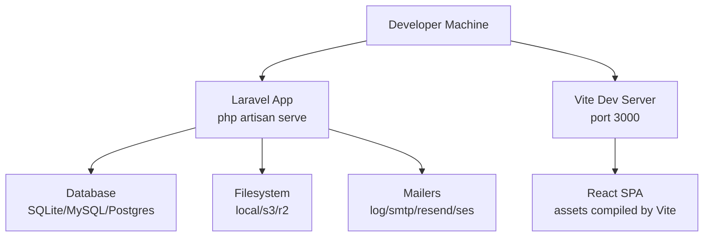
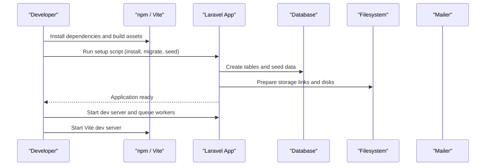
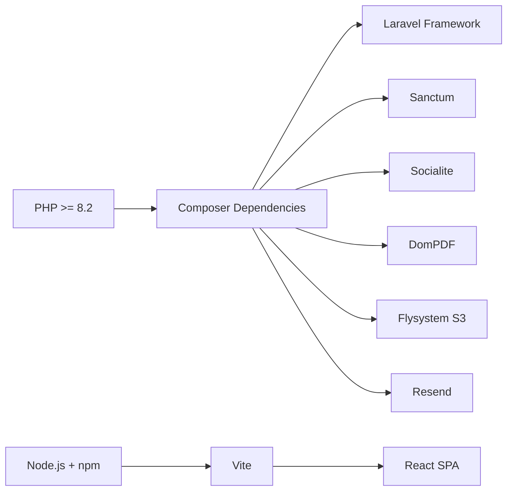

# Getting Started

<cite>
**Referenced Files in This Document**
- [composer.json](file://composer.json)
- [frontend/package.json](file://frontend/package.json)
- [config/app.php](file://config/app.php)
- [config/database.php](file://config/database.php)
- [config/mail.php](file://config/mail.php)
- [config/filesystems.php](file://config/filesystems.php)
- [config/services.php](file://config/services.php)
- [config/session.php](file://config/session.php)
- [database/seeders/DatabaseSeeder.php](file://database/seeders/DatabaseSeeder.php)
- [frontend/vite.config.ts](file://frontend/vite.config.ts)
</cite>

## Table of Contents
1. Introduction
2. Project Structure
3. Core Components
4. Architecture Overview
5. Detailed Component Analysis
6. Dependency Analysis
7. Performance Considerations
8. Troubleshooting Guide
9. Conclusion

## Introduction
This guide helps you install and run ResNet Academy LMS for both development and production. It covers PHP 8.2+ requirements, Node.js setup, database configuration, environment variables, migrations, seeders, asset compilation, running the development server, accessing the app, creating your first admin user, troubleshooting common issues, and verification steps.

## Project Structure
ResNet Academy is a Laravel 12 application with a React frontend built via Vite:
- Backend: Laravel (PHP 8.2+) with Artisan commands for setup, migrations, seeding, queues, and serving.
- Frontend: React + TypeScript + Tailwind CSS, served by Vite during development.
- Database: SQLite by default; MySQL/MariaDB/PostgreSQL supported via configuration.
- Storage: Local disk by default; S3/R2 configured for production.
- Mail: Log driver by default; SMTP/SendGrid/Resend/SES configurable.

**Diagram sources**
- [composer.json:45-57](file://composer.json#L45-L57)
- [frontend/vite.config.ts:15-18](file://frontend/vite.config.ts#L15-L18)
- [config/database.php:20-117](file://config/database.php#L20-L117)
- [config/filesystems.php:16-88](file://config/filesystems.php#L16-L88)
- [config/mail.php:17-100](file://config/mail.php#L17-L100)

**Section sources**
- [composer.json:8-18](file://composer.json#L8-L18)
- [frontend/package.json:6-16](file://frontend/package.json#L6-L16)
- [config/app.php:16-68](file://config/app.php#L16-L68)
- [config/database.php:20-117](file://config/database.php#L20-L117)
- [config/filesystems.php:16-88](file://config/filesystems.php#L16-L88)
- [config/mail.php:17-100](file://config/mail.php#L17-L100)
- [config/services.php:17-42](file://config/services.php#L17-L42)
- [config/session.php:21-202](file://config/session.php#L21-L202)
- [frontend/vite.config.ts:15-18](file://frontend/vite.config.ts#L15-L18)

## Core Components
- PHP runtime: Requires PHP 8.2+.
- Composer dependencies: Laravel framework, Sanctum, Socialite, DomPDF, Scramble, Flysystem S3, Resend.
- Node.js dependencies: React, Vite, Tailwind, testing tooling.
- Database: SQLite by default; MySQL/MariaDB/PostgreSQL available.
- File storage: Local by default; S3/R2 available.
- Mail: Log by default; SMTP/Resend/SES available.
- Sessions: Database driver by default.

Key scripts and defaults:
- Composer setup script installs deps, copies .env.example to .env, generates key, runs migrations, installs npm packages, and builds assets.
- Development script starts the Laravel server, queue listener, log tailer, and Vite dev server concurrently.
- Frontend dev server runs on port 3000.

**Section sources**
- [composer.json:8-18](file://composer.json#L8-L18)
- [composer.json:45-57](file://composer.json#L45-L57)
- [frontend/package.json:6-16](file://frontend/package.json#L6-L16)
- [frontend/vite.config.ts:15-18](file://frontend/vite.config.ts#L15-L18)
- [config/database.php:20-117](file://config/database.php#L20-L117)
- [config/filesystems.php:16-88](file://config/filesystems.php#L16-L88)
- [config/mail.php:17-100](file://config/mail.php#L17-L100)
- [config/session.php:21-202](file://config/session.php#L21-L202)

## Architecture Overview
The application follows a standard Laravel + React SPA architecture:
- The backend serves API endpoints and renders Blade views where needed.
- The frontend is a React SPA served by Vite during development and built for production.
- Configuration files centralize environment-driven behavior for database, mail, filesystems, sessions, and third-party services.

**Diagram sources**
- [composer.json:45-57](file://composer.json#L45-L57)
- [frontend/package.json:6-16](file://frontend/package.json#L6-L16)
- [config/database.php:20-117](file://config/database.php#L20-L117)
- [config/filesystems.php:16-88](file://config/filesystems.php#L16-L88)
- [config/mail.php:17-100](file://config/mail.php#L17-L100)

## Detailed Component Analysis

### Environment Variables and Configuration
- Application name, environment, debug mode, URL, and frontend URL are read from environment variables.
- Database connections support SQLite, MySQL/MariaDB, PostgreSQL, SQL Server, with Redis options for cache/queue.
- Filesystem supports local, S3, and R2 disks; public disk URL uses APP_URL.
- Mail supports multiple transports including log, smtp, resend, ses.
- Services include Postmark, Resend, SES, Slack, and Google OAuth settings.
- Session defaults to database driver with configurable lifetime and cookie settings.

Important notes:
- Ensure APP_KEY is generated before starting the app.
- For production, set APP_ENV=production, APP_DEBUG=false, and secure session cookies.
- Configure FRONTEND_URL if browser-based flows need to redirect back to the SPA.

**Section sources**
- [config/app.php:16-68](file://config/app.php#L16-L68)
- [config/database.php:20-117](file://config/database.php#L20-L117)
- [config/filesystems.php:16-88](file://config/filesystems.php#L16-L88)
- [config/mail.php:17-100](file://config/mail.php#L17-L100)
- [config/services.php:17-42](file://config/services.php#L17-L42)
- [config/session.php:21-202](file://config/session.php#L21-L202)

### Database Setup and Migrations
- Default connection is SQLite; ensure the SQLite file exists or configure MySQL/PostgreSQL via environment variables.
- Migrations create all required tables for users, courses, modules, assignments, evaluations, forums, tickets, etc.
- Use the provided setup script to run migrations automatically after installation.

Verification:
- After migration, confirm that core tables exist and that the migrations table is populated.

**Section sources**
- [config/database.php:20-117](file://config/database.php#L20-L117)
- [composer.json:45-57](file://composer.json#L45-L57)

### Seeders and Demo Data
- The seeder creates demo users across roles (admin, instructor, student), courses, modules, resources, assignments, evaluations, forum posts, tickets, and more.
- Running the seeder populates realistic data for development and testing.

Admin accounts:
- The seeder provisions admin users. You can use one of these credentials after seeding to access the application.

**Section sources**
- [database/seeders/DatabaseSeeder.php:84-136](file://database/seeders/DatabaseSeeder.php#L84-L136)

### Asset Compilation and Frontend Build
- Frontend dependencies are managed via npm.
- Development server runs on port 3000 using Vite.
- Production builds compile TypeScript and assets for deployment.

Build commands:
- Development: run the frontend dev server.
- Production: build optimized assets.

**Section sources**
- [frontend/package.json:6-16](file://frontend/package.json#L6-L16)
- [frontend/vite.config.ts:15-18](file://frontend/vite.config.ts#L15-L18)

### Queues and Background Jobs
- The development script starts a queue worker to process background jobs (e.g., emails, certificate generation).
- Ensure the queue listener is running for features like email notifications and job processing.

**Section sources**
- [composer.json:45-57](file://composer.json#L45-L57)

## Dependency Analysis
- PHP version constraint requires 8.2+.
- Laravel framework and related packages are installed via Composer.
- Frontend uses Vite, React, Tailwind, and testing libraries.

**Diagram sources**
- [composer.json:8-18](file://composer.json#L8-L18)
- [frontend/package.json:18-88](file://frontend/package.json#L18-L88)

**Section sources**
- [composer.json:8-18](file://composer.json#L8-L18)
- [frontend/package.json:18-88](file://frontend/package.json#L18-L88)

## Performance Considerations
- Use a proper database (MySQL/PostgreSQL) for production instead of SQLite.
- Configure an appropriate session driver (database or cache-backed) and consider Redis for high concurrency.
- Set up a production-grade file storage (S3/R2) for scalability and reliability.
- Enable caching and optimize asset delivery in production builds.
- Ensure queue workers are scaled appropriately for email and background tasks.

[No sources needed since this section provides general guidance]

## Troubleshooting Guide

Common issues and resolutions:
- Missing .env or APP_KEY:
  - Copy .env.example to .env and generate the application key before starting the server.
- Database connection errors:
  - Verify DB_CONNECTION and credentials. For SQLite, ensure the database file exists. For MySQL/PostgreSQL, check host, port, username, password, and database name.
- Migration failures:
  - Check database permissions and schema compatibility. Re-run migrations if necessary.
- Queue worker not processing jobs:
  - Start the queue listener and ensure environment variables for mailers/storage are correct.
- Assets not loading:
  - Ensure Vite dev server is running on port 3000 and assets are built for production.
- Email not sending:
  - Configure MAIL_MAILER and relevant credentials (SMTP/Resend/SES). In development, the log driver writes emails to logs.

Verification steps:
- Confirm the application responds at the configured APP_URL.
- Access the frontend dev server at http://localhost:3000 during development.
- Log in with an admin account created by the seeder.
- Check that storage links exist for public assets.
- Validate that migrations have run and seed data is present.

**Section sources**
- [config/app.php:16-68](file://config/app.php#L16-L68)
- [config/database.php:20-117](file://config/database.php#L20-L117)
- [config/mail.php:17-100](file://config/mail.php#L17-L100)
- [config/filesystems.php:16-88](file://config/filesystems.php#L16-L88)
- [frontend/vite.config.ts:15-18](file://frontend/vite.config.ts#L15-L18)
- [composer.json:45-57](file://composer.json#L45-L57)
- [database/seeders/DatabaseSeeder.php:84-136](file://database/seeders/DatabaseSeeder.php#L84-L136)

## Conclusion
You now have the essentials to install, configure, and run ResNet Academy LMS in both development and production environments. Follow the steps above to set up dependencies, configure environment variables, run migrations and seeders, compile assets, start servers, and verify functionality. Use the troubleshooting guide to resolve common issues and ensure a smooth setup experience.

[No sources needed since this section summarizes without analyzing specific files]