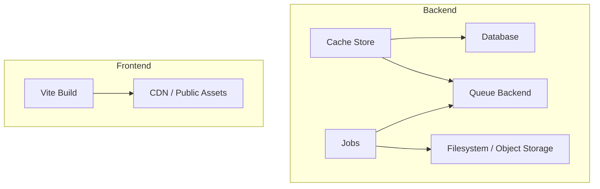
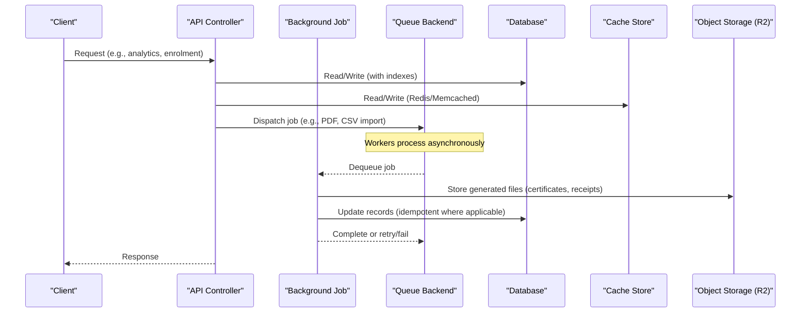
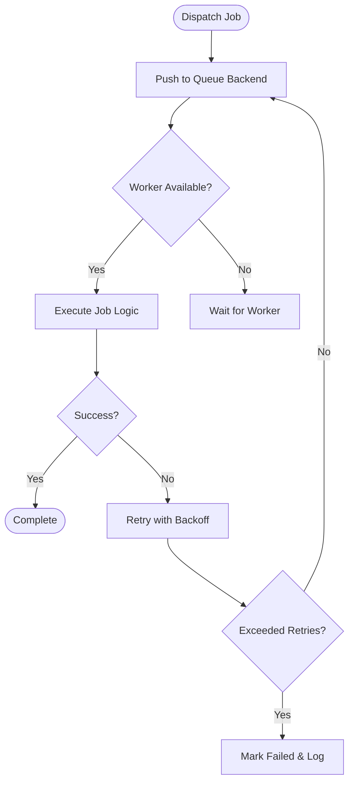
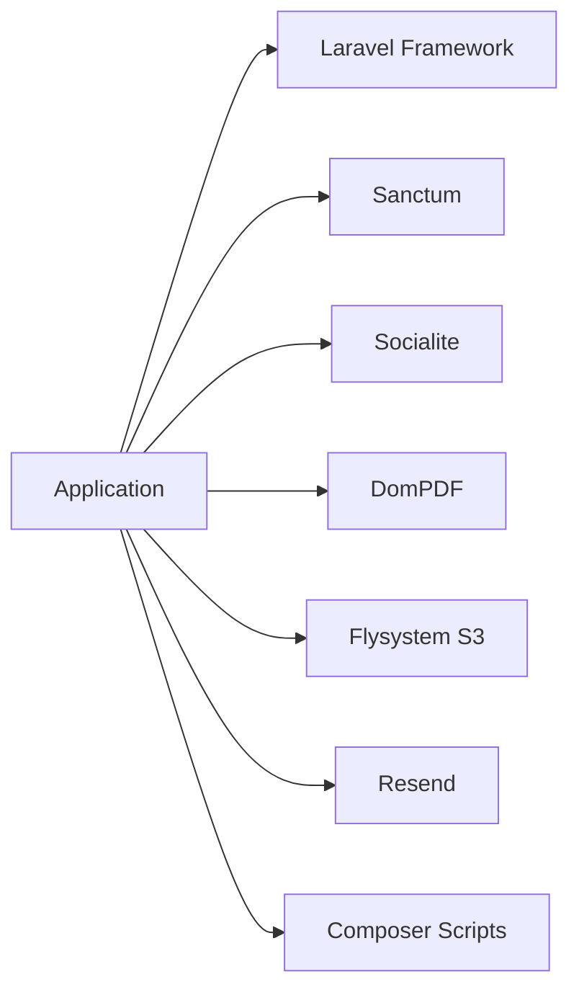

# Performance Optimization

<cite>
**Referenced Files in This Document**
- [database.php](file://config/database.php)
- [cache.php](file://config/cache.php)
- [queue.php](file://config/queue.php)
- [filesystems.php](file://config/filesystems.php)
- [vite.config.ts](file://frontend/vite.config.ts)
- [composer.json](file://composer.json)
- [GenerateCertificatePdf.php](file://app/Jobs/GenerateCertificatePdf.php)
- [ImportEnrolmentsFromCsv.php](file://app/Jobs/ImportEnrolmentsFromCsv.php)
- [MediaStorageService.php](file://app/Services/Storage/MediaStorageService.php)
- [EngagementTracker.php](file://app/Services/Analytics/EngagementTracker.php)
- [User.php](file://app/Models/User.php)
- [Course.php](file://app/Models/Course.php)
- [Module.php](file://app/Models/Module.php)
- [2024_01_01_000190_create_engagement_events_table.php](file://database/migrations/2024_01_01_000190_create_engagement_events_table.php)
- [2024_01_01_000152_create_video_watch_pings_table.php](file://database/migrations/2024_01_01_000152_create_video_watch_pings_table.php)
- [AnalyticsController.php](file://app/Http/Controllers/Api/V1/AnalyticsController.php)
</cite>

## Table of Contents
1. Introduction
2. Project Structure
3. Core Components
4. Architecture Overview
5. Detailed Component Analysis
6. Dependency Analysis
7. Performance Considerations
8. Troubleshooting Guide
9. Conclusion
10. Appendices

## Introduction
This document provides a comprehensive performance optimization guide for the ResNet Academy LMS. It focuses on database optimization, caching strategies, background job processing, and asset optimization. It also covers query optimization, indexing strategies, connection pooling considerations, queue worker configuration, job patterns, memory management, frontend bundle optimization, CDN usage, monitoring, profiling, and scalability for high-traffic scenarios.

## Project Structure
The application is a Laravel-based backend with a React/Vite frontend:
- Backend configuration for database, cache, queues, and storage is centralized under config/.
- Background jobs live under app/Jobs/ and are processed via Laravel queues.
- Storage uses Cloudflare R2 (S3-compatible) through a unified service layer.
- Frontend build tooling is configured via Vite.

**Diagram sources**
- [database.php:146-182](file://config/database.php#L146-L182)
- [cache.php:35-100](file://config/cache.php#L35-L100)
- [queue.php:32-92](file://config/queue.php#L32-L92)
- [filesystems.php:31-88](file://config/filesystems.php#L31-L88)
- [vite.config.ts:8-18](file://frontend/vite.config.ts#L8-L18)

**Section sources**
- [database.php:1-185](file://config/database.php#L1-L185)
- [cache.php:1-118](file://config/cache.php#L1-L118)
- [queue.php:1-130](file://config/queue.php#L1-L130)
- [filesystems.php:1-106](file://config/filesystems.php#L1-L106)
- [vite.config.ts:1-30](file://frontend/vite.config.ts#L1-L30)

## Core Components
- Database connections and Redis integration for cache and queues.
- Multiple cache stores including Redis, Memcached, DynamoDB, and failover.
- Queue backends including database, Redis, SQS, and failover.
- Unified media storage abstraction over Cloudflare R2.
- Background jobs for PDF generation and bulk CSV enrolment import.
- Analytics event tracking with indexed tables for efficient queries.
- Eloquent models with relationships and casts that influence query behavior.

Key areas to optimize:
- Use Redis or Memcached for cache and queues in production.
- Ensure proper indexing on high-write tables like engagement events and video watch pings.
- Offload heavy work (PDF rendering, CSV imports) to background jobs.
- Streamline frontend assets using Vite and serve via CDN.

**Section sources**
- [database.php:47-117](file://config/database.php#L47-L117)
- [database.php:146-182](file://config/database.php#L146-L182)
- [cache.php:35-100](file://config/cache.php#L35-L100)
- [queue.php:32-92](file://config/queue.php#L32-L92)
- [filesystems.php:50-88](file://config/filesystems.php#L50-L88)
- [GenerateCertificatePdf.php:1-67](file://app/Jobs/GenerateCertificatePdf.php#L1-L67)
- [ImportEnrolmentsFromCsv.php:1-51](file://app/Jobs/ImportEnrolmentsFromCsv.php#L1-L51)
- [MediaStorageService.php:1-86](file://app/Services/Storage/MediaStorageService.php#L1-L86)
- [EngagementTracker.php:1-36](file://app/Services/Analytics/EngagementTracker.php#L1-L36)
- [User.php:1-100](file://app/Models/User.php#L1-L100)
- [Course.php:1-180](file://app/Models/Course.php#L1-L180)
- [Module.php:1-86](file://app/Models/Module.php#L1-L86)

## Architecture Overview
High-level data flow across performance-critical paths:

**Diagram sources**
- [AnalyticsController.php:13-39](file://app/Http/Controllers/Api/V1/AnalyticsController.php#L13-L39)
- [GenerateCertificatePdf.php:21-67](file://app/Jobs/GenerateCertificatePdf.php#L21-L67)
- [ImportEnrolmentsFromCsv.php:21-51](file://app/Jobs/ImportEnrolmentsFromCsv.php#L21-L51)
- [queue.php:32-92](file://config/queue.php#L32-L92)
- [cache.php:35-100](file://config/cache.php#L35-L100)
- [filesystems.php:50-88](file://config/filesystems.php#L50-L88)

## Detailed Component Analysis

### Database Optimization
- Connection drivers and options:
  - MySQL/MariaDB/PgSQL/SQLSRV configurations available; ensure strict mode and appropriate charset/collation.
  - Redis connections defined for both default and cache databases with retry/backoff settings.
- Indexing strategy:
  - Engagement events table includes composite index on course_id + event_type and an index on student_id for fast analytics queries.
  - Video watch pings include composite index on student_id + resource_id for progress tracking.
- Query patterns:
  - Use eager loading to avoid N+1 queries when traversing relationships (e.g., Course -> Modules, Users -> Enrolments).
  - Prefer exists/count operations where only presence or counts are needed.
  - Use chunking/lazy collections for large datasets to reduce memory pressure.

Recommendations:
- Enable Redis-backed cache store for hot reads (course catalog, user sessions).
- For write-heavy analytics, consider batching inserts or using a dedicated analytics sink if traffic grows significantly.
- Monitor slow queries and add targeted indexes based on actual query plans.

**Section sources**
- [database.php:47-117](file://config/database.php#L47-L117)
- [database.php:146-182](file://config/database.php#L146-L182)
- [2024_01_01_000190_create_engagement_events_table.php:11-24](file://database/migrations/2024_01_01_000190_create_engagement_events_table.php#L11-L24)
- [2024_01_01_000152_create_video_watch_pings_table.php:11-20](file://database/migrations/2024_01_01_000152_create_video_watch_pings_table.php#L11-L20)
- [Course.php:115-145](file://app/Models/Course.php#L115-L145)
- [User.php:74-99](file://app/Models/User.php#L74-L99)

### Caching Strategies
- Default cache store can be set to database, file, memcached, redis, dynamodb, octane, or null.
- Redis cache connection is preconfigured with separate database for cache vs default.
- Failover store allows graceful degradation from database to array cache in development.

Recommendations:
- Switch default cache to Redis or Memcached in production for lower latency and higher throughput.
- Prefix keys per environment to avoid collisions.
- Use cache tags or namespacing by feature (e.g., course catalog, user profile) to manage invalidation.

**Section sources**
- [cache.php:18-100](file://config/cache.php#L18-L100)
- [cache.php:115-116](file://config/cache.php#L115-L116)
- [database.php:146-182](file://config/database.php#L146-L182)

### Background Job Processing
- Queue backends supported include sync, database, beanstalkd, sqs, redis, deferred, background, and failover.
- Failed jobs are persisted to database with UUIDs for inspection and replay.
- Job batching metadata stored in a dedicated table.

Recommended patterns:
- Use ShouldQueue for long-running tasks (PDF generation, CSV imports).
- Implement idempotency (e.g., unique IDs) to prevent duplicate processing on retries.
- Configure retry_after and backoff appropriately for your workload.
- Scale workers horizontally based on queue depth and job duration.

**Diagram sources**
- [queue.php:32-127](file://config/queue.php#L32-L127)
- [GenerateCertificatePdf.php:21-67](file://app/Jobs/GenerateCertificatePdf.php#L21-L67)
- [ImportEnrolmentsFromCsv.php:21-51](file://app/Jobs/ImportEnrolmentsFromCsv.php#L21-L51)

**Section sources**
- [queue.php:1-130](file://config/queue.php#L1-L130)
- [GenerateCertificatePdf.php:1-67](file://app/Jobs/GenerateCertificatePdf.php#L1-L67)
- [ImportEnrolmentsFromCsv.php:1-51](file://app/Jobs/ImportEnrolmentsFromCsv.php#L1-L51)

### Asset Optimization and CDN Usage
- Filesystem disks include local, public, S3, and R2 (Cloudflare).
- MediaStorageService centralizes uploads and URL resolution, enabling consistent CDN delivery via R2’s public URL configuration.
- Videos are hosted externally (Bunny Stream), avoiding server bandwidth costs.

Recommendations:
- Serve static assets via CDN (R2 bucket domain or custom domain).
- Use signed URLs for sensitive assets when necessary.
- Leverage browser caching headers at the CDN level for immutable assets.

**Section sources**
- [filesystems.php:31-88](file://config/filesystems.php#L31-L88)
- [MediaStorageService.php:1-86](file://app/Services/Storage/MediaStorageService.php#L1-L86)

### Frontend Performance Optimization
- Vite configuration sets up React and Tailwind plugins, aliases, dev server, and test environment.
- Production builds should be optimized (minification, code splitting) and served via CDN.

Recommendations:
- Enable production builds with minification and tree-shaking.
- Split vendor bundles and lazy-load routes/components.
- Use CDN for static assets and enable compression.

**Section sources**
- [vite.config.ts:8-28](file://frontend/vite.config.ts#L8-L28)

### Memory Management and Large Data Handling
- Use chunked processing and lazy collections for large datasets to avoid memory spikes.
- Avoid loading entire result sets into memory; stream results where possible.
- For batch operations (e.g., CSV imports), process in batches and commit incrementally.

**Section sources**
- [ImportEnrolmentsFromCsv.php:21-51](file://app/Jobs/ImportEnrolmentsFromCsv.php#L21-L51)

### Monitoring Tools and Profiling
- Logging: Jobs log failures with context for quick triage.
- Metrics: Track queue lengths, job durations, and error rates.
- Profiling: Use database query logs and APM tools to identify slow endpoints and N+1 queries.

**Section sources**
- [GenerateCertificatePdf.php:59-67](file://app/Jobs/GenerateCertificatePdf.php#L59-L67)
- [ImportEnrolmentsFromCsv.php:43-51](file://app/Jobs/ImportEnrolmentsFromCsv.php#L43-L51)

### Scalability Considerations for High Traffic
- Horizontal scaling:
  - Run multiple web servers behind a load balancer.
  - Scale queue workers independently based on queue depth.
- Statelessness:
  - Store sessions and cache in Redis/Memcached.
  - Use object storage for files instead of local disk.
- Database:
  - Use read replicas for read-heavy endpoints.
  - Partition or archive high-volume tables (e.g., engagement events) as needed.
- CDN:
  - Offload static assets and media to CDN to reduce origin load.

[No sources needed since this section provides general guidance]

## Dependency Analysis
Key runtime dependencies influencing performance:
- Framework and packages: Laravel framework, Sanctum, Socialite, DomPDF, Scramble, Flysystem AWS S3, Resend.
- Autoloader optimizations enabled.
- Composer scripts orchestrate setup, dev server, queue listener, logging, and frontend build.

**Diagram sources**
- [composer.json:8-18](file://composer.json#L8-L18)
- [composer.json:45-76](file://composer.json#L45-L76)
- [composer.json:86-96](file://composer.json#L86-L96)

**Section sources**
- [composer.json:1-98](file://composer.json#L1-L98)

## Performance Considerations
- Database:
  - Prefer Redis/Memcached cache stores.
  - Add indexes for frequent filters/joins; monitor query plans.
  - Use transactions and locking where necessary to prevent race conditions.
- Queues:
  - Choose Redis/SQS for high-throughput environments.
  - Tune retry_after and concurrency per worker type.
- Storage:
  - Centralize uploads via MediaStorageService; use CDN-backed R2 buckets.
- Frontend:
  - Optimize bundles with Vite; lazy-load heavy components.
  - Serve assets via CDN with caching headers.
- Observability:
  - Log errors with context; track queue metrics; profile slow queries.

[No sources needed since this section provides general guidance]

## Troubleshooting Guide
Common issues and resolutions:
- Slow analytics queries:
  - Verify indexes on engagement_events and video_watch_pings.
  - Check for N+1 queries in analytics endpoints.
- Queue bottlenecks:
  - Inspect failed_jobs table; adjust retry policies and worker count.
  - Consider switching to Redis/SQS for better throughput.
- Storage failures:
  - Validate R2 credentials and endpoint configuration.
  - Ensure MediaStorageService is used consistently for path-to-URL resolution.
- Frontend build timeouts:
  - Adjust test worker execTimeout if needed; ensure CI caches node_modules.

**Section sources**
- [2024_01_01_000190_create_engagement_events_table.php:11-24](file://database/migrations/2024_01_01_000190_create_engagement_events_table.php#L11-L24)
- [2024_01_01_000152_create_video_watch_pings_table.php:11-20](file://database/migrations/2024_01_01_000152_create_video_watch_pings_table.php#L11-L20)
- [queue.php:123-127](file://config/queue.php#L123-L127)
- [filesystems.php:50-88](file://config/filesystems.php#L50-L88)
- [MediaStorageService.php:32-79](file://app/Services/Storage/MediaStorageService.php#L32-L79)
- [vite.config.ts:19-28](file://frontend/vite.config.ts#L19-L28)

## Conclusion
By leveraging Redis-backed cache and queues, optimizing database indexes, offloading heavy tasks to background jobs, centralizing storage via a CDN-ready service, and optimizing frontend builds, the ResNet Academy LMS can achieve strong performance and scalability. Continuous monitoring and profiling will help maintain optimal performance as traffic grows.

[No sources needed since this section summarizes without analyzing specific files]

## Appendices

### Key Configuration Reference
- Database:
  - Drivers: sqlite, mysql, mariadb, pgsql, sqlsrv.
  - Redis: default and cache connections with retry/backoff.
- Cache:
  - Stores: array, database, file, memcached, redis, dynamodb, octane, failover.
  - Key prefix per application name.
- Queue:
  - Connections: sync, database, beanstalkd, sqs, redis, deferred, background, failover.
  - Batching and failed job storage.
- Filesystems:
  - Disks: local, public, s3, r2 (Cloudflare R2).
  - Symbolic link for public storage.

**Section sources**
- [database.php:33-117](file://config/database.php#L33-L117)
- [database.php:146-182](file://config/database.php#L146-L182)
- [cache.php:35-116](file://config/cache.php#L35-L116)
- [queue.php:32-127](file://config/queue.php#L32-L127)
- [filesystems.php:31-103](file://config/filesystems.php#L31-L103)