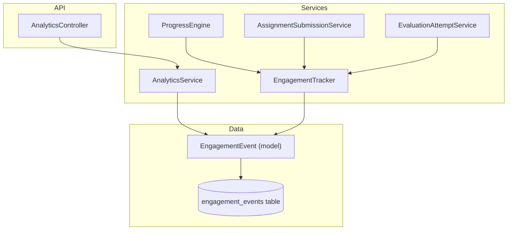
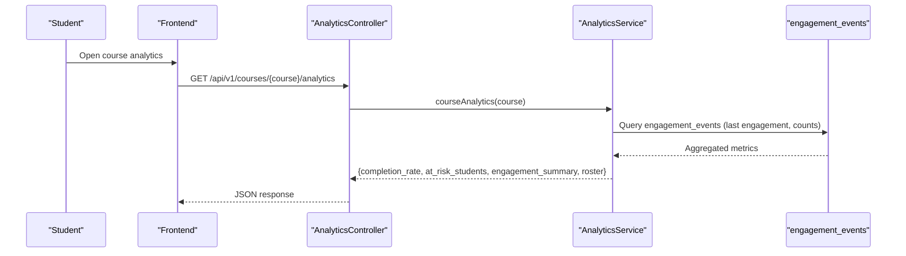
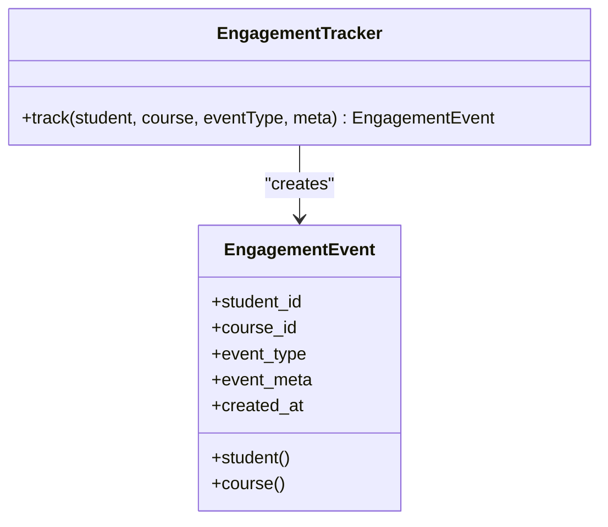
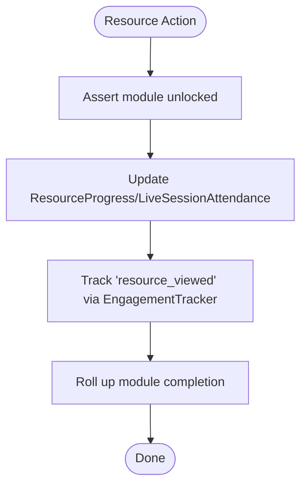
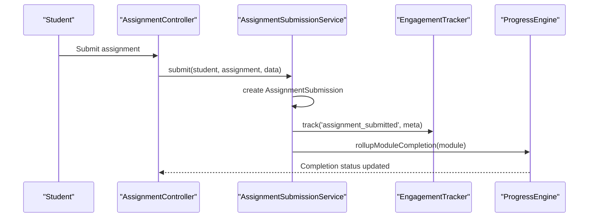
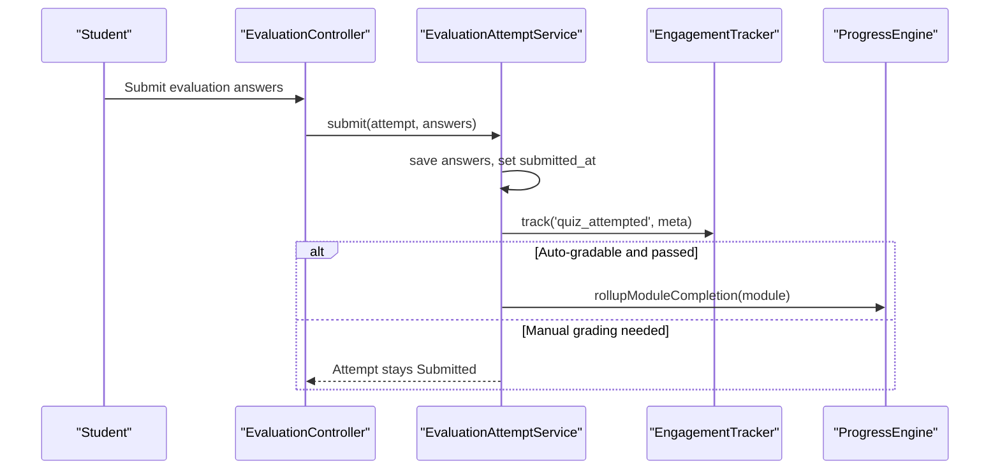
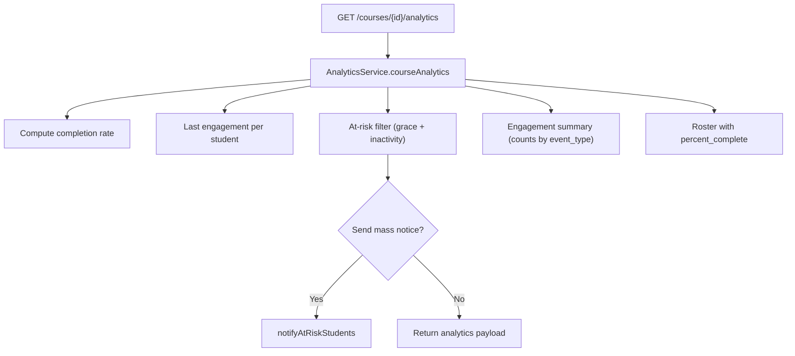
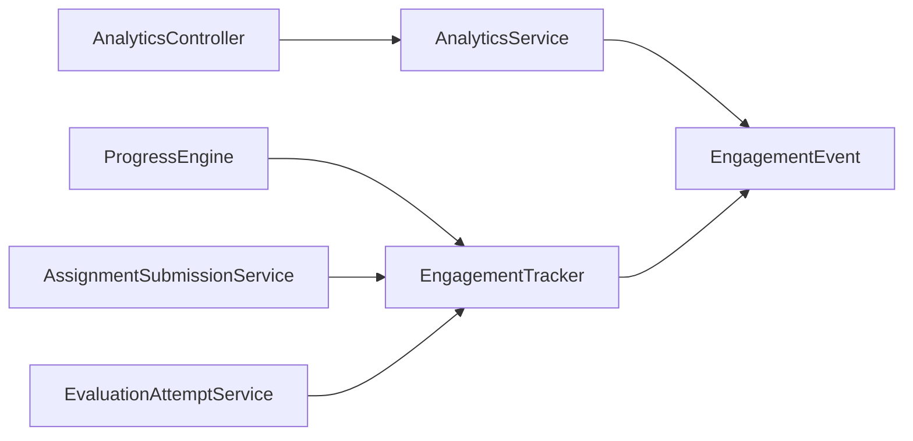

# Engagement Tracking System

<cite>
**Referenced Files in This Document**
- [EngagementTracker.php](file://app/Services/Analytics/EngagementTracker.php)
- [EngagementEvent.php](file://app/Models/EngagementEvent.php)
- [ProgressEngine.php](file://app/services/Progress/ProgressEngine.php)
- [AssignmentSubmissionService.php](file://app/Services/Assessment/AssignmentSubmissionService.php)
- [EvaluationAttemptService.php](file://app/Services/Assessment/EvaluationAttemptService.php)
- [AnalyticsController.php](file://app/Http/Controllers/Api/V1/AnalyticsController.php)
- [AnalyticsService.php](file://app/Services/Analytics/AnalyticsService.php)
- [create_engagement_events_table.php](file://database/migrations/2024_01_01_000190_create_engagement_events_table.php)
- [EngagementTrackingTest.php](file://tests/Feature/Analytics/EngagementTrackingTest.php)
</cite>

## Table of Contents
1. [Introduction](#introduction)
2. [Project Structure](#project-structure)
3. [Core Components](#core-components)
4. [Architecture Overview](#architecture-overview)
5. [Detailed Component Analysis](#detailed-component-analysis)
6. [Dependency Analysis](#dependency-analysis)
7. [Performance Considerations](#performance-considerations)
8. [Troubleshooting Guide](#troubleshooting-guide)
9. [Conclusion](#conclusion)

## Introduction
This document explains how the Engagement Tracking System records user interactions and learning activities across the platform, how engagement data integrates with the progress system, and how it powers analytics reporting and at-risk student detection. It focuses on:
- The single write path for engagement events
- Event types tracked and their metadata
- How progress actions automatically trigger engagement tracking
- How engagement data feeds analytics dashboards and at-risk notifications
- How this supports learning analytics and early intervention

## Project Structure
The engagement tracking feature spans services, models, controllers, migrations, and tests:
- Services:
  - Analytics: EngagementTracker (write path), AnalyticsService (read path and at-risk logic)
  - Progress: ProgressEngine (progress updates that also emit engagement events)
  - Assessment: AssignmentSubmissionService and EvaluationAttemptService (assessment flows that emit engagement events)
- Models:
  - EngagementEvent (Eloquent model for the engagement_events table)
- API:
  - AnalyticsController exposes course analytics and at-risk notification endpoints
- Database:
  - Migration defines the engagement_events schema
- Tests:
  - Feature tests verify engagement event creation during resource and assignment interactions

**Diagram sources**
- [EngagementTracker.php:21-34](file://app/Services/Analytics/EngagementTracker.php#L21-L34)
- [ProgressEngine.php:218-286](file://app/Services/Progress/ProgressEngine.php#L218-L286)
- [AssignmentSubmissionService.php:37-67](file://app/Services/Assessment/AssignmentSubmissionService.php#L37-L67)
- [EvaluationAttemptService.php:102-149](file://app/Services/Assessment/EvaluationAttemptService.php#L102-L149)
- [AnalyticsController.php:17-37](file://app/Http/Controllers/Api/V1/AnalyticsController.php#L17-L37)
- [AnalyticsService.php:56-117](file://app/Services/Analytics/AnalyticsService.php#L56-L117)
- [EngagementEvent.php:12-45](file://app/Models/EngagementEvent.php#L12-L45)
- [create_engagement_events_table.php:11-23](file://database/migrations/2024_01_01_000190_create_engagement_events_table.php#L11-L23)

**Section sources**
- [EngagementTracker.php:21-34](file://app/Services/Analytics/EngagementTracker.php#L21-L34)
- [ProgressEngine.php:218-286](file://app/Services/Progress/ProgressEngine.php#L218-L286)
- [AssignmentSubmissionService.php:37-67](file://app/Services/Assessment/AssignmentSubmissionService.php#L37-L67)
- [EvaluationAttemptService.php:102-149](file://app/Services/Assessment/EvaluationAttemptService.php#L102-L149)
- [AnalyticsController.php:17-37](file://app/Http/Controllers/Api/V1/AnalyticsController.php#L17-L37)
- [AnalyticsService.php:56-117](file://app/Services/Analytics/AnalyticsService.php#L56-L117)
- [EngagementEvent.php:12-45](file://app/Models/EngagementEvent.php#L12-L45)
- [create_engagement_events_table.php:11-23](file://database/migrations/2024_01_01_000190_create_engagement_events_table.php#L11-L23)

## Core Components
- EngagementTracker: Single write path to persist engagement events with student, course, event_type, and event_meta.
- EngagementEvent: Eloquent model backed by the engagement_events table; stores JSON metadata and relationships to User and Course.
- ProgressEngine: Emits resource_viewed engagement events when students interact with resources (video pings, mark-read, mark-opened, attendance). Also rolls up module completion and unlocks next modules.
- AssignmentSubmissionService: Emits assignment_submitted when a student submits an assignment; triggers module completion rollup.
- EvaluationAttemptService: Emits quiz_attempted when a student submits an evaluation attempt; if passed, triggers module completion rollup.
- AnalyticsService: Reads engagement data to compute engagement summaries, last engagement per student, at-risk flags, and provides a “send mass notice” action.
- AnalyticsController: Exposes endpoints for course analytics and at-risk notifications.

Key responsibilities:
- Recording: Only EngagementTracker writes engagement events.
- Triggering: ProgressEngine and assessment services call EngagementTracker at key moments.
- Reading: AnalyticsService queries engagement_events for analytics and at-risk detection.

**Section sources**
- [EngagementTracker.php:21-34](file://app/Services/Analytics/EngagementTracker.php#L21-L34)
- [EngagementEvent.php:12-45](file://app/Models/EngagementEvent.php#L12-L45)
- [ProgressEngine.php:218-286](file://app/Services/Progress/ProgressEngine.php#L218-L286)
- [AssignmentSubmissionService.php:37-67](file://app/Services/Assessment/AssignmentSubmissionService.php#L37-L67)
- [EvaluationAttemptService.php:102-149](file://app/Services/Assessment/EvaluationAttemptService.php#L102-L149)
- [AnalyticsService.php:56-117](file://app/Services/Analytics/AnalyticsService.php#L56-L117)
- [AnalyticsController.php:17-37](file://app/Http/Controllers/Api/V1/AnalyticsController.php#L17-L37)

## Architecture Overview
The system follows a clear separation between recording and reading:
- Recording:
  - Resource consumption (video, documents, links, live sessions) goes through ProgressEngine, which calls EngagementTracker to record resource_viewed.
  - Assignments go through AssignmentSubmissionService, which records assignment_submitted.
  - Evaluations go through EvaluationAttemptService, which records quiz_attempted.
- Reading:
  - AnalyticsController delegates to AnalyticsService, which aggregates engagement_events and other data to produce course analytics and at-risk lists.

**Diagram sources**
- [AnalyticsController.php:17-22](file://app/Http/Controllers/Api/V1/AnalyticsController.php#L17-L22)
- [AnalyticsService.php:56-117](file://app/Services/Analytics/AnalyticsService.php#L56-L117)
- [create_engagement_events_table.php:11-23](file://database/migrations/2024_01_01_000190_create_engagement_events_table.php#L11-L23)

## Detailed Component Analysis

### EngagementTracker
- Purpose: Centralized writer for engagement events.
- Inputs: student, course, event_type, optional meta array.
- Output: persisted EngagementEvent row.
- Notes: The tracker comment clarifies that only course-scoped signals are recorded here (resource_viewed, assignment_submitted, quiz_attempted).

**Diagram sources**
- [EngagementTracker.php:21-34](file://app/Services/Analytics/EngagementTracker.php#L21-L34)
- [EngagementEvent.php:12-45](file://app/Models/EngagementEvent.php#L12-L45)

**Section sources**
- [EngagementTracker.php:21-34](file://app/Services/Analytics/EngagementTracker.php#L21-L34)
- [EngagementEvent.php:12-45](file://app/Models/EngagementEvent.php#L12-L45)

### ProgressEngine and Resource Engagement
- Triggers:
  - Video watch pings update watch percentage and record resource_viewed.
  - Mark-as-read for documents/readings records resource_viewed.
  - Opening external links or downloadable files records resource_viewed.
  - Live session attendance records resource_viewed.
- Each trigger also updates ResourceProgress and may roll up module completion.

**Diagram sources**
- [ProgressEngine.php:218-286](file://app/Services/Progress/ProgressEngine.php#L218-L286)

**Section sources**
- [ProgressEngine.php:218-286](file://app/Services/Progress/ProgressEngine.php#L218-L286)

### Assignment Submission Engagement
- Trigger: AssignmentSubmissionService::submit creates a submission and records assignment_submitted with assignment context in meta.
- Side effect: Immediately triggers module completion rollup (module completion counts on submission, not grading).

**Diagram sources**
- [AssignmentSubmissionService.php:37-67](file://app/Services/Assessment/AssignmentSubmissionService.php#L37-L67)

**Section sources**
- [AssignmentSubmissionService.php:37-67](file://app/Services/Assessment/AssignmentSubmissionService.php#L37-L67)

### Evaluation Attempt Engagement
- Trigger: EvaluationAttemptService::submit records quiz_attempted with evaluation and attempt context in meta.
- If auto-graded and passed, module completion is rolled up; otherwise manual grading queue remains until graded.

**Diagram sources**
- [EvaluationAttemptService.php:102-149](file://app/Services/Assessment/EvaluationAttemptService.php#L102-L149)
- [EvaluationAttemptService.php:183-206](file://app/Services/Assessment/EvaluationAttemptService.php#L183-L206)

**Section sources**
- [EvaluationAttemptService.php:102-149](file://app/Services/Assessment/EvaluationAttemptService.php#L102-L149)
- [EvaluationAttemptService.php:183-206](file://app/Services/Assessment/EvaluationAttemptService.php#L183-L206)

### Analytics and At-Risk Detection
- Course analytics endpoint returns:
  - Total/completed students and completion rate
  - At-risk students list with last engagement time, final grade percent, and risk factor
  - Engagement summary counts by event type over a recent window
  - Roster with per-student percent complete and status
- At-risk rule:
  - Grace period after enrollment
  - Inactivity window based on last engagement timestamp
  - Risk factors include no activity, assignment backlog, or inactive
- Mass notice:
  - Sends in-app reminders to all currently at-risk students

**Diagram sources**
- [AnalyticsController.php:17-37](file://app/Http/Controllers/Api/V1/AnalyticsController.php#L17-L37)
- [AnalyticsService.php:56-142](file://app/Services/Analytics/AnalyticsService.php#L56-L142)
- [AnalyticsService.php:147-213](file://app/Services/Analytics/AnalyticsService.php#L147-L213)

**Section sources**
- [AnalyticsController.php:17-37](file://app/Http/Controllers/Api/V1/AnalyticsController.php#L17-L37)
- [AnalyticsService.php:56-142](file://app/Services/Analytics/AnalyticsService.php#L56-L142)
- [AnalyticsService.php:147-213](file://app/Services/Analytics/AnalyticsService.php#L147-L213)

## Dependency Analysis
- EngagementTracker depends on EngagementEvent model and Course/User entities to persist events.
- ProgressEngine depends on EngagementTracker to emit resource_viewed events and on ProgressEngine’s own rollup logic to update module states.
- AssignmentSubmissionService and EvaluationAttemptService depend on both EngagementTracker and ProgressEngine to record engagement and update progress.
- AnalyticsController depends on AnalyticsService to read engagement data and provide analytics and at-risk notifications.
- AnalyticsService reads from engagement_events and other tables to compute metrics and at-risk flags.

**Diagram sources**
- [ProgressEngine.php:218-286](file://app/Services/Progress/ProgressEngine.php#L218-L286)
- [AssignmentSubmissionService.php:37-67](file://app/Services/Assessment/AssignmentSubmissionService.php#L37-L67)
- [EvaluationAttemptService.php:102-149](file://app/Services/Assessment/EvaluationAttemptService.php#L102-L149)
- [AnalyticsController.php:17-37](file://app/Http/Controllers/Api/V1/AnalyticsController.php#L17-L37)
- [AnalyticsService.php:56-117](file://app/Services/Analytics/AnalyticsService.php#L56-L117)
- [EngagementEvent.php:12-45](file://app/Models/EngagementEvent.php#L12-L45)

**Section sources**
- [ProgressEngine.php:218-286](file://app/Services/Progress/ProgressEngine.php#L218-L286)
- [AssignmentSubmissionService.php:37-67](file://app/Services/Assessment/AssignmentSubmissionService.php#L37-L67)
- [EvaluationAttemptService.php:102-149](file://app/Services/Assessment/EvaluationAttemptService.php#L102-L149)
- [AnalyticsController.php:17-37](file://app/Http/Controllers/Api/V1/AnalyticsController.php#L17-L37)
- [AnalyticsService.php:56-117](file://app/Services/Analytics/AnalyticsService.php#L56-L117)
- [EngagementEvent.php:12-45](file://app/Models/EngagementEvent.php#L12-L45)

## Performance Considerations
- Write path: EngagementTracker performs a single insert per event; ensure indexes on course_id and student_id are used for analytics queries.
- Read path: AnalyticsService uses grouped queries and aggregation over engagement_events; consider caching frequently accessed course analytics if traffic increases.
- Module rollups: ProgressEngine computes completion based on required items; keep queries efficient and avoid unnecessary recomputation.
- At-risk computation: Uses last engagement timestamps and grace/inactivity windows; precompute or cache per-course where appropriate.

## Troubleshooting Guide
- Missing engagement events:
  - Verify that resource actions go through ProgressEngine methods (recordVideoPing, markRead, markOpened, markAttendance).
  - Confirm assignments are submitted via AssignmentSubmissionService::submit.
  - Confirm evaluations are submitted via EvaluationAttemptService::submit.
- Incorrect event_type:
  - Ensure event_type values match documented ones: resource_viewed, assignment_submitted, quiz_attempted.
- Analytics not reflecting latest engagement:
  - Check that created_at is populated and indexes are effective.
  - Validate that AnalyticsService queries use the correct course scope and time window.
- At-risk detection issues:
  - Review grace period and inactivity thresholds in AnalyticsService constants.
  - Ensure last engagement timestamps are present for active students.

**Section sources**
- [ProgressEngine.php:218-286](file://app/Services/Progress/ProgressEngine.php#L218-L286)
- [AssignmentSubmissionService.php:37-67](file://app/Services/Assessment/AssignmentSubmissionService.php#L37-L67)
- [EvaluationAttemptService.php:102-149](file://app/Services/Assessment/EvaluationAttemptService.php#L102-L149)
- [AnalyticsService.php:56-117](file://app/Services/Analytics/AnalyticsService.php#L56-L117)
- [create_engagement_events_table.php:11-23](file://database/migrations/2024_01_01_000190_create_engagement_events_table.php#L11-L23)

## Conclusion
The Engagement Tracking System provides a centralized, reliable mechanism to record meaningful learning interactions and integrate them with progress and analytics. By emitting resource_viewed, assignment_submitted, and quiz_attempted events at key points in the user journey, the system enables accurate engagement summaries, at-risk student detection, and actionable insights for instructors and administrators. The clear separation between recording (EngagementTracker) and reading (AnalyticsService) ensures maintainability and scalability.