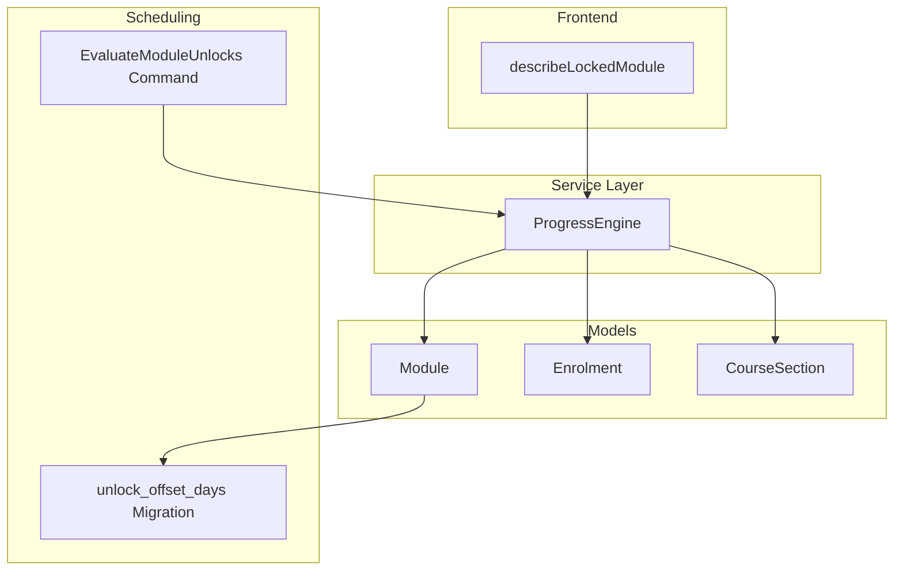
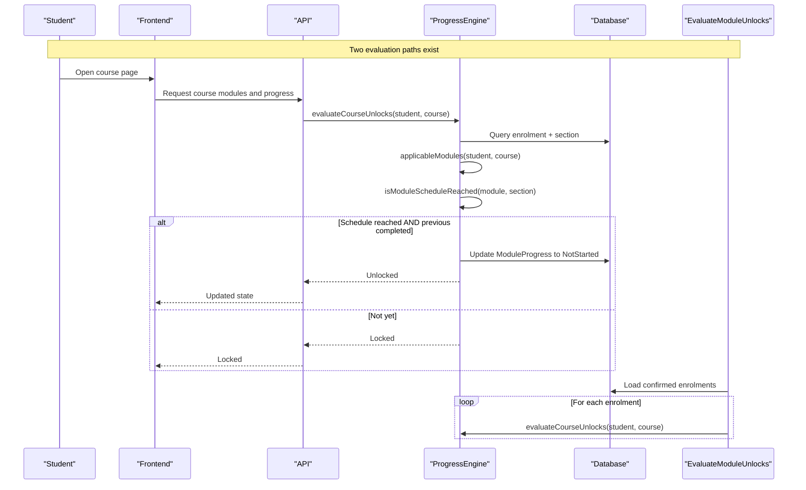
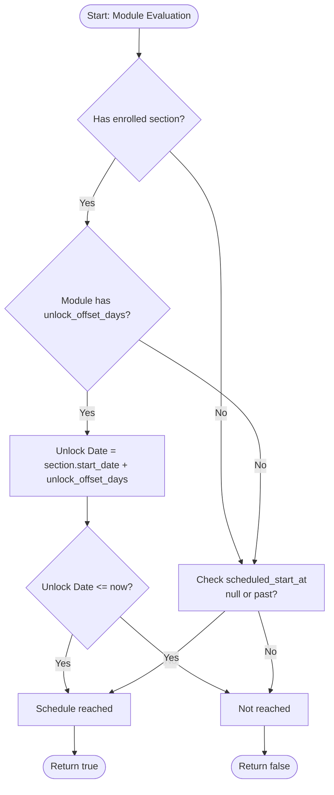
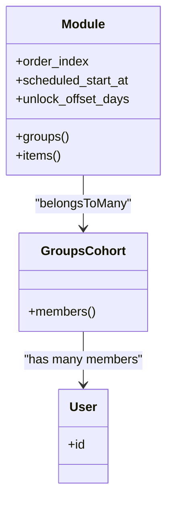
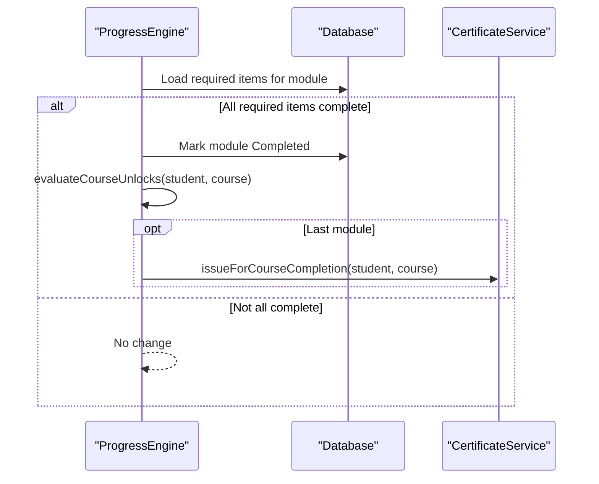
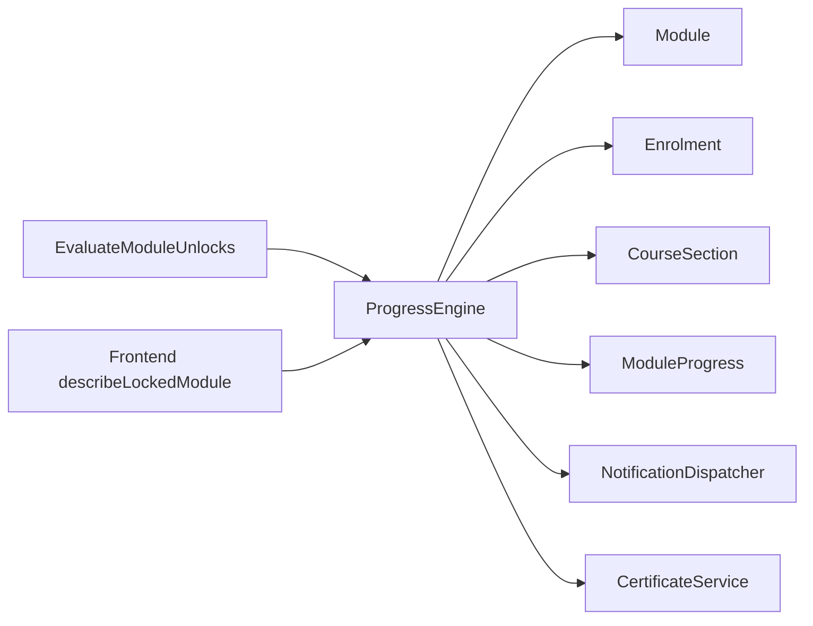
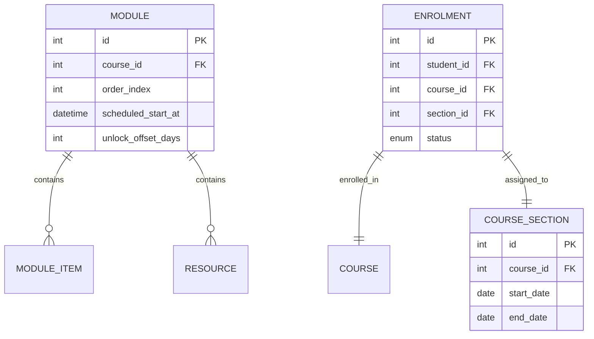

# Module Unlocking System

<cite>
**Referenced Files in This Document**
- [ProgressEngine.php](file://app/Services/Progress/ProgressEngine.php)
- [Module.php](file://app/Models/Module.php)
- [Enrolment.php](file://app/Models/Enrolment.php)
- [CourseSection.php](file://app/Models/CourseSection.php)
- [EvaluateModuleUnlocks.php](file://app/Console/Commands/EvaluateModuleUnlocks.php)
- [2026_08_10_060000_add_unlock_offset_days_to_modules_table.php](file://database/migrations/2026_08_10_060000_add_unlock_offset_days_to_modules_table.php)
- [ModuleLockingTest.php](file://tests/Feature/Progress/ModuleLockingTest.php)
- [COURSE_SECTIONS_TEST_RESULTS.md](file://COURSE_SECTIONS_TEST_RESULTS.md)
- [courseSequence.ts](file://frontend/src/lib/courseSequence.ts)
</cite>

## Table of Contents
1. [Introduction](#introduction)
2. [Project Structure](#project-structure)
3. [Core Components](#core-components)
4. [Architecture Overview](#architecture-overview)
5. [Detailed Component Analysis](#detailed-component-analysis)
6. [Dependency Analysis](#dependency-analysis)
7. [Performance Considerations](#performance-considerations)
8. [Troubleshooting Guide](#troubleshooting-guide)
9. [Conclusion](#conclusion)
10. [Appendices](#appendices)

## Introduction
This document explains the Module Unlocking System that controls when students can access course modules. It covers:
- Dual scheduling logic for unlocking modules: absolute scheduling via scheduled_start_at for self-paced courses and relative scheduling via unlock_offset_days combined with a cohort section’s start date for cohort-based learning.
- The applicableModules method that filters modules by group membership so only relevant modules appear in a student’s sequence.
- The isModuleScheduleReached method that evaluates timing conditions based on section context or absolute schedule.
- How completing required module items cascades to unlock subsequent modules.
- Practical enrollment scenarios demonstrating how these rules affect module availability.

## Project Structure
The system spans models, services, console commands, migrations, tests, and frontend helpers:
- Service layer owns unlock and completion logic (ProgressEngine).
- Models define entities and relationships (Module, Enrolment, CourseSection).
- Console command periodically re-evaluates unlocks for all confirmed enrolments.
- Migration adds the unlock_offset_days field to support cohort-relative scheduling.
- Tests validate behavior across self-paced and cohort contexts.
- Frontend mirrors server-side locking reasons for user feedback.

**Diagram sources**
- [ProgressEngine.php:50-118](file://app/Services/Progress/ProgressEngine.php#L50-L118)
- [Module.php:22-34](file://app/Models/Module.php#L22-L34)
- [Enrolment.php:53-64](file://app/Models/Enrolment.php#L53-L64)
- [CourseSection.php:19-38](file://app/Models/CourseSection.php#L19-L38)
- [EvaluateModuleUnlocks.php:22-39](file://app/Console/Commands/EvaluateModuleUnlocks.php#L22-L39)
- [2026_08_10_060000_add_unlock_offset_days_to_modules_table.php:16-21](file://database/migrations/2026_08_10_060000_add_unlock_offset_days_to_modules_table.php#L16-L21)
- [courseSequence.ts:66-88](file://frontend/src/lib/courseSequence.ts#L66-L88)

**Section sources**
- [ProgressEngine.php:50-118](file://app/Services/Progress/ProgressEngine.php#L50-L118)
- [Module.php:22-34](file://app/Models/Module.php#L22-L34)
- [Enrolment.php:53-64](file://app/Models/Enrolment.php#L53-L64)
- [CourseSection.php:19-38](file://app/Models/CourseSection.php#L19-L38)
- [EvaluateModuleUnlocks.php:22-39](file://app/Console/Commands/EvaluateModuleUnlocks.php#L22-L39)
- [2026_08_10_060000_add_unlock_offset_days_to_modules_table.php:16-21](file://database/migrations/2026_08_10_060000_add_unlock_offset_days_to_modules_table.php#L16-L21)
- [courseSequence.ts:66-88](file://frontend/src/lib/courseSequence.ts#L66-L88)

## Core Components
- ProgressEngine: Central orchestrator for evaluating unlocks, computing completion rollups, and gating progress actions.
- Module: Defines ordering, absolute schedule (scheduled_start_at), and cohort offset (unlock_offset_days).
- Enrolment: Links a student to a course and optionally a specific section (cohort).
- CourseSection: Provides the cohort start_date used for relative scheduling.
- EvaluateModuleUnlocks: Scheduled task to ensure time-based unlocks are applied even without active browsing.
- Frontend describeLockedModule: Mirrors server-side lock reasons for UI messaging.

Key responsibilities:
- Filter visible modules per group membership.
- Determine if a module’s schedule has been reached using either cohort-relative or absolute timing.
- Transition locked modules to not started when both schedule and prerequisite conditions are met.
- Cascade completion from required items to unlock the next module.

**Section sources**
- [ProgressEngine.php:50-118](file://app/Services/Progress/ProgressEngine.php#L50-L118)
- [Module.php:22-34](file://app/Models/Module.php#L22-L34)
- [Enrolment.php:53-64](file://app/Models/Enrolment.php#L53-L64)
- [CourseSection.php:19-38](file://app/Models/CourseSection.php#L19-L38)
- [EvaluateModuleUnlocks.php:22-39](file://app/Console/Commands/EvaluateModuleUnlocks.php#L22-L39)
- [courseSequence.ts:66-88](file://frontend/src/lib/courseSequence.ts#L66-L88)

## Architecture Overview
The unlocking flow runs in two modes:
- On-demand: When a student views their course or interacts with content, the engine evaluates unlocks.
- Scheduled: A background command iterates confirmed enrolments and evaluates unlocks to catch time-based transitions.

**Diagram sources**
- [ProgressEngine.php:50-118](file://app/Services/Progress/ProgressEngine.php#L50-L118)
- [EvaluateModuleUnlocks.php:22-39](file://app/Console/Commands/EvaluateModuleUnlocks.php#L22-L39)

## Detailed Component Analysis

### Scheduling Logic: Absolute vs Relative
- Absolute scheduling (self-paced): A module unlocks when its scheduled_start_at is null or in the past.
- Relative scheduling (cohort-based): If the student is enrolled in a section and the module has unlock_offset_days, the unlock date is section.start_date + unlock_offset_days. Section-relative scheduling takes precedence when both apply.

**Diagram sources**
- [ProgressEngine.php:89-99](file://app/Services/Progress/ProgressEngine.php#L89-L99)
- [CourseSection.php:19-38](file://app/Models/CourseSection.php#L19-L38)
- [Module.php:22-34](file://app/Models/Module.php#L22-L34)

**Section sources**
- [ProgressEngine.php:89-99](file://app/Services/Progress/ProgressEngine.php#L89-L99)
- [Module.php:22-34](file://app/Models/Module.php#L22-L34)
- [CourseSection.php:19-38](file://app/Models/CourseSection.php#L19-L38)

### Group Membership Filtering: applicableModules
- Modules without groups apply to every student.
- Modules with groups apply only to students who are members of at least one linked group.
- Non-applicable modules are excluded from the sequence and do not block progression.

**Diagram sources**
- [Module.php:44-52](file://app/Models/Module.php#L44-L52)

**Section sources**
- [ProgressEngine.php:101-118](file://app/Services/Progress/ProgressEngine.php#L101-L118)
- [Module.php:44-52](file://app/Models/Module.php#L44-L52)

### Timing Evaluation: isModuleScheduleReached
- If enrolled in a section and module has unlock_offset_days: compare section.start_date + offset against current time.
- Otherwise: fall back to checking scheduled_start_at (null or past means unlocked).

**Section sources**
- [ProgressEngine.php:89-99](file://app/Services/Progress/ProgressEngine.php#L89-L99)

### Completion Cascade: Rollup and Unlock Next Module
- Required items must be complete for a module to be marked completed.
- Upon completion, the engine re-evaluates unlocks for the course, potentially unlocking the next applicable module.
- If the last module completes, certificate issuance is triggered.

**Diagram sources**
- [ProgressEngine.php:126-152](file://app/Services/Progress/ProgressEngine.php#L126-L152)

**Section sources**
- [ProgressEngine.php:126-152](file://app/Services/Progress/ProgressEngine.php#L126-L152)

### Enrollment Scenarios and Impact on Availability
- Self-paced course (no section): Modules unlock based solely on scheduled_start_at.
- Cohort course (with section): Modules unlock based on section.start_date + unlock_offset_days; if no offset set, falls back to scheduled_start_at.
- Group-scoped modules: Only visible to members; non-members skip them in sequence.
- Prerequisite enforcement: Even if schedule allows, a module remains locked until the previous applicable module is completed.

Practical examples:
- Scenario A: Self-paced with future scheduled_start_at → module stays locked until date passes.
- Scenario B: Cohort with unlock_offset_days = 0 → module unlocks on section start date.
- Scenario C: Cohort with unlock_offset_days = 3 → module unlocks three days after section start.
- Scenario D: Group-scoped module not visible to student → does not block sequence; next applicable module may unlock once prerequisites are met.

**Section sources**
- [ProgressEngine.php:50-118](file://app/Services/Progress/ProgressEngine.php#L50-L118)
- [ModuleLockingTest.php:42-108](file://tests/Feature/Progress/ModuleLockingTest.php#L42-L108)
- [COURSE_SECTIONS_TEST_RESULTS.md:94-117](file://COURSE_SECTIONS_TEST_RESULTS.md#L94-L117)

## Dependency Analysis
- ProgressEngine depends on:
  - Module model for order and scheduling fields.
  - Enrolment and CourseSection to determine cohort context.
  - ModuleProgress to track status and timestamps.
  - NotificationDispatcher to alert on unlocks.
  - CertificateService to issue certificates upon final module completion.
- EvaluateModuleUnlocks depends on ProgressEngine to process all confirmed enrolments.
- Frontend describeLockedModule mirrors server-side logic for user-facing explanations.

**Diagram sources**
- [EvaluateModuleUnlocks.php:22-39](file://app/Console/Commands/EvaluateModuleUnlocks.php#L22-L39)
- [ProgressEngine.php:50-152](file://app/Services/Progress/ProgressEngine.php#L50-L152)
- [courseSequence.ts:66-88](file://frontend/src/lib/courseSequence.ts#L66-L88)

**Section sources**
- [EvaluateModuleUnlocks.php:22-39](file://app/Console/Commands/EvaluateModuleUnlocks.php#L22-L39)
- [ProgressEngine.php:50-152](file://app/Services/Progress/ProgressEngine.php#L50-L152)
- [courseSequence.ts:66-88](file://frontend/src/lib/courseSequence.ts#L66-L88)

## Performance Considerations
- Chunked processing: The scheduled command processes enrolments in chunks to avoid memory spikes.
- Idempotency: evaluateCourseUnlocks is safe to call repeatedly; it only transitions states when needed and avoids duplicate notifications.
- Minimal queries: Applicable modules are filtered efficiently by group membership and ordered by index.
- Frontend mirroring: describeLockedModule reduces server round-trips for lock reasons by computing client-side where possible.

[No sources needed since this section provides general guidance]

## Troubleshooting Guide
Common issues and resolutions:
- Module remains locked despite schedule passing:
  - Verify whether the student is enrolled in a section and if unlock_offset_days is set; section-relative scheduling takes precedence.
  - Ensure the previous applicable module is completed; prerequisites still apply.
- Group-scoped module not appearing:
  - Confirm the student is a member of at least one linked group; otherwise, the module is excluded from the sequence.
- Notifications not sent:
  - Notifications are sent only on transition from Locked to NotStarted; re-running evaluations will not resend.
- Content actions blocked:
  - assertModuleUnlocked prevents progress actions on locked modules; ensure the module is unlocked before recording progress.

**Section sources**
- [ProgressEngine.php:89-99](file://app/Services/Progress/ProgressEngine.php#L89-L99)
- [ProgressEngine.php:101-118](file://app/Services/Progress/ProgressEngine.php#L101-L118)
- [ProgressEngine.php:211-216](file://app/Services/Progress/ProgressEngine.php#L211-L216)
- [ModuleLockingTest.php:122-134](file://tests/Feature/Progress/ModuleLockingTest.php#L122-L134)

## Conclusion
The Module Unlocking System provides robust control over module availability through:
- Dual scheduling supporting both self-paced and cohort-based learning.
- Precise group scoping ensuring only relevant modules appear in a student’s sequence.
- Reliable prerequisite enforcement and cascade unlocking upon completion.
- Scheduled evaluation to ensure time-based unlocks occur even without active browsing.

This design ensures predictable, fair, and scalable module access aligned with course structure and learner context.

[No sources needed since this section summarizes without analyzing specific files]

## Appendices

### Data Model Relationships Relevant to Unlocking

**Diagram sources**
- [Module.php:22-34](file://app/Models/Module.php#L22-L34)
- [Enrolment.php:22-40](file://app/Models/Enrolment.php#L22-L40)
- [CourseSection.php:19-38](file://app/Models/CourseSection.php#L19-L38)

### Practical Examples Reference
- Verified behaviors include section-relative unlock, fallback to absolute scheduling, zero-offset immediate unlock, and sequential prerequisite enforcement.

**Section sources**
- [COURSE_SECTIONS_TEST_RESULTS.md:94-117](file://COURSE_SECTIONS_TEST_RESULTS.md#L94-L117)