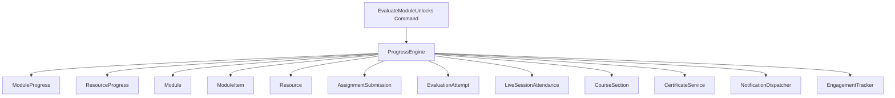
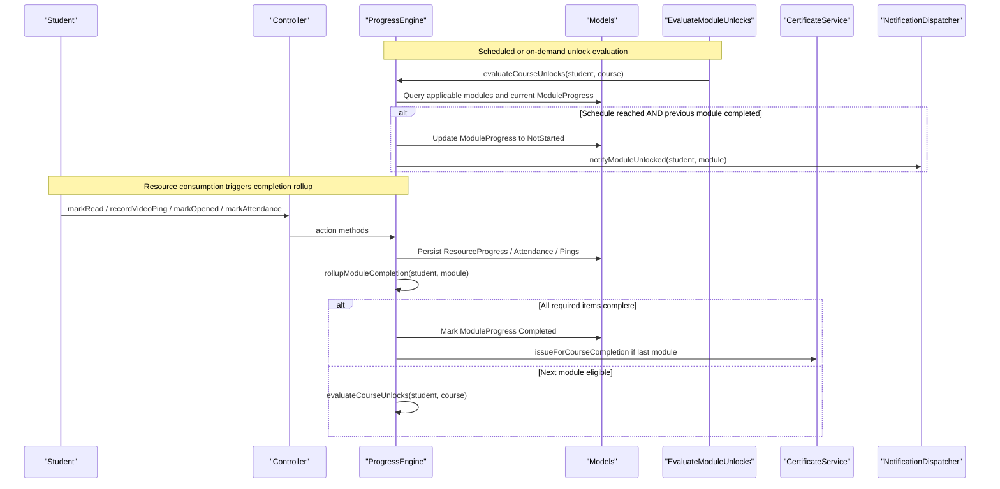
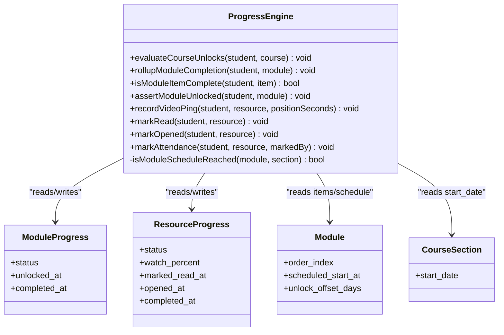
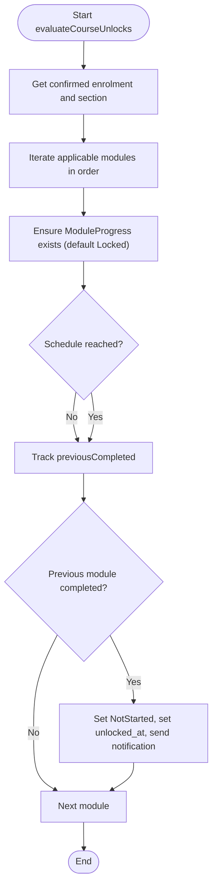
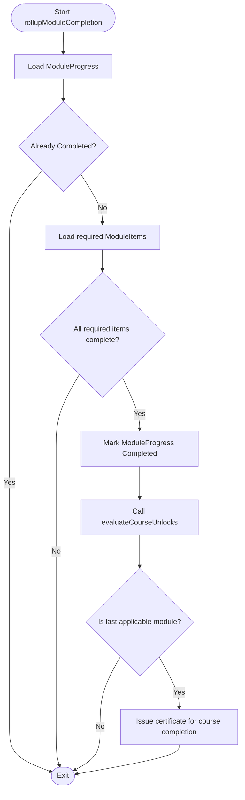
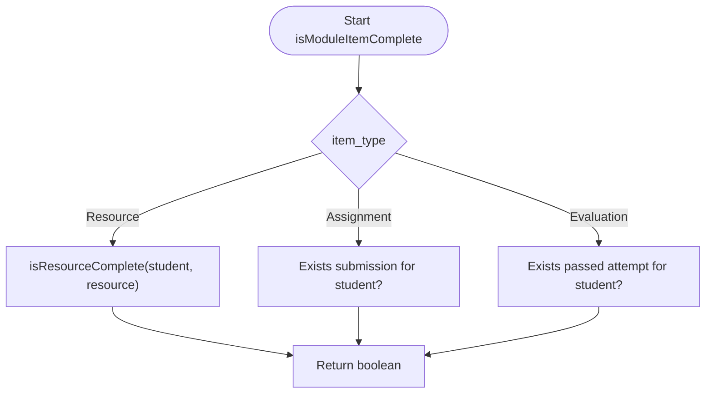
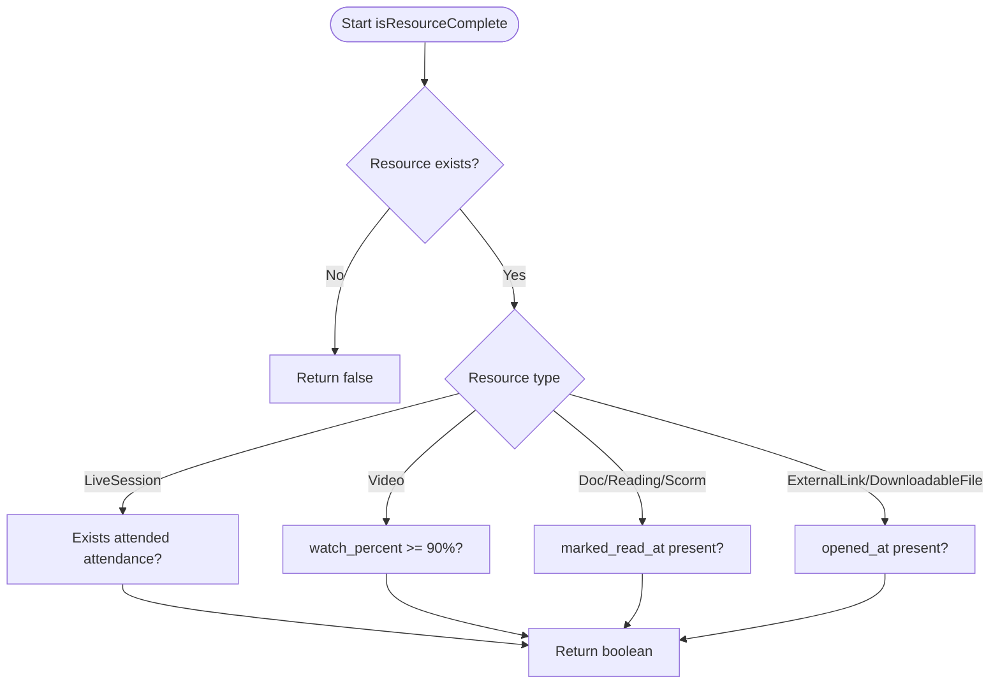
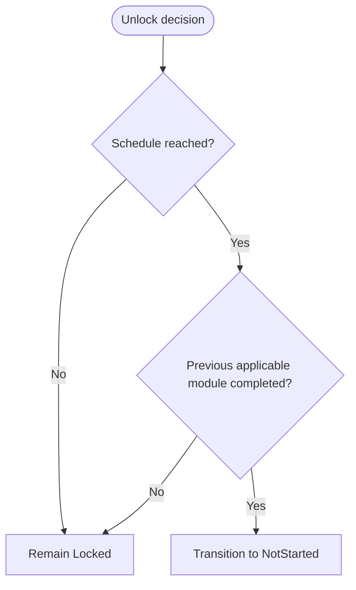
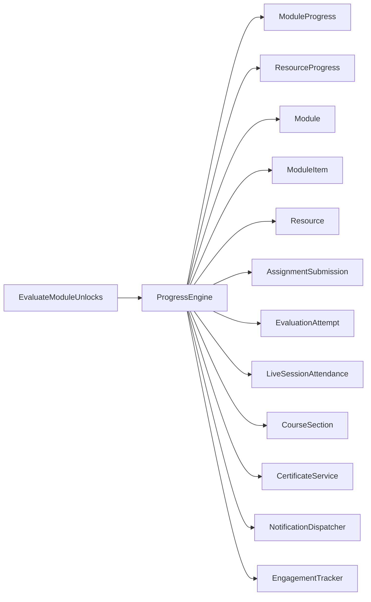

# Progress Engine Core

<cite>
**Referenced Files in This Document**
- [ProgressEngine.php](file://app/Services/Progress/ProgressEngine.php)
- [ModuleProgressStatus.php](file://app/Enums/ModuleProgressStatus.php)
- [ResourceProgressStatus.php](file://app/Enums/ResourceProgressStatus.php)
- [ModuleItemType.php](file://app/Enums/ModuleItemType.php)
- [ModuleProgress.php](file://app/Models/ModuleProgress.php)
- [ResourceProgress.php](file://app/Models/ResourceProgress.php)
- [Module.php](file://app/Models/Module.php)
- [CourseSection.php](file://app/Models/CourseSection.php)
- [EvaluateModuleUnlocks.php](file://app/Console/Commands/EvaluateModuleUnlocks.php)
- [ModuleLockingTest.php](file://tests/Feature/Progress/ModuleLockingTest.php)
- [CompletionTest.php](file://tests/Feature/Progress/CompletionTest.php)
</cite>

## Table of Contents
1. [Introduction](#introduction)
2. [Project Structure](#project-structure)
3. [Core Components](#core-components)
4. [Architecture Overview](#architecture-overview)
5. [Detailed Component Analysis](#detailed-component-analysis)
6. [Dependency Analysis](#dependency-analysis)
7. [Performance Considerations](#performance-considerations)
8. [Troubleshooting Guide](#troubleshooting-guide)
9. [Conclusion](#conclusion)

## Introduction
This document explains the Progress Engine Core that owns module completion and unlocking logic for courses. The central class, ProgressEngine, is the single source of truth for:
- Determining when a module unlocks based on schedule or section-based offsets
- Rolling up resource-level signals into module completion
- Evaluating whether individual items (resources, assignments, evaluations) are complete
- Enforcing that progress actions can only occur on unlocked modules

It supports both self-paced courses (using scheduled_start_at) and cohort-style sections (using unlock_offset_days relative to a section’s start_date). It also integrates with notifications, certificate issuance, and engagement tracking.

## Project Structure
The Progress Engine lives under app/Services/Progress and interacts with models, enums, console commands, and tests to implement end-to-end unlocking and completion flows.

**Diagram sources**
- [ProgressEngine.php:35-39](file://app/Services/Progress/ProgressEngine.php#L35-L39)
- [ProgressEngine.php:50-81](file://app/Services/Progress/ProgressEngine.php#L50-L81)
- [ProgressEngine.php:126-152](file://app/Services/Progress/ProgressEngine.php#L126-L152)
- [ProgressEngine.php:154-205](file://app/Services/Progress/ProgressEngine.php#L154-L205)
- [EvaluateModuleUnlocks.php:22-38](file://app/Console/Commands/EvaluateModuleUnlocks.php#L22-L38)

**Section sources**
- [ProgressEngine.php:27-39](file://app/Services/Progress/ProgressEngine.php#L27-L39)
- [EvaluateModuleUnlocks.php:12-39](file://app/Console/Commands/EvaluateModuleUnlocks.php#L12-L39)

## Core Components
- ProgressEngine: Central orchestrator for unlocking and completion rollups.
- ModuleProgress: Per-student per-module state (Locked, NotStarted, InProgress, Completed).
- ResourceProgress: Per-student per-resource state and timestamps (watch percent, marked read, opened).
- Enums: ModuleProgressStatus, ResourceProgressStatus, ModuleItemType define allowed states and item types.
- Models: Module, CourseSection provide scheduling context; AssignmentSubmission, EvaluationAttempt, LiveSessionAttendance provide completion signals.

Key responsibilities:
- evaluateCourseUnlocks: Iterates applicable modules and transitions Locked to NotStarted when schedule is reached and previous module is completed.
- rollupModuleCompletion: Marks a module Completed when all required items are complete and triggers next unlock.
- isModuleItemComplete: Determines completion for resources, assignments, and evaluations.
- assertModuleUnlocked: Guards progress actions on locked modules.

**Section sources**
- [ProgressEngine.php:50-81](file://app/Services/Progress/ProgressEngine.php#L50-L81)
- [ProgressEngine.php:126-152](file://app/Services/Progress/ProgressEngine.php#L126-L152)
- [ProgressEngine.php:154-205](file://app/Services/Progress/ProgressEngine.php#L154-L205)
- [ModuleProgressStatus.php:7-13](file://app/Enums/ModuleProgressStatus.php#L7-L13)
- [ResourceProgressStatus.php:7-12](file://app/Enums/ResourceProgressStatus.php#L7-L12)
- [ModuleItemType.php:7-12](file://app/Enums/ModuleItemType.php#L7-L12)

## Architecture Overview
The engine follows a clear separation of concerns:
- Scheduling/unlocking: evaluateCourseUnlocks uses either absolute schedules (scheduled_start_at) or section-relative schedules (section.start_date + unlock_offset_days).
- Completion rollup: Any change to a resource, assignment, or evaluation triggers rollupModuleCompletion, which checks required items and marks the module Completed if all are satisfied.
- Item completion: isModuleItemComplete delegates to resource-specific rules or existence checks for assignments and evaluations.
- Guardrails: assertModuleUnlocked prevents progress updates on locked modules.

**Diagram sources**
- [ProgressEngine.php:50-81](file://app/Services/Progress/ProgressEngine.php#L50-L81)
- [ProgressEngine.php:126-152](file://app/Services/Progress/ProgressEngine.php#L126-L152)
- [ProgressEngine.php:218-286](file://app/Services/Progress/ProgressEngine.php#L218-L286)
- [EvaluateModuleUnlocks.php:22-38](file://app/Console/Commands/EvaluateModuleUnlocks.php#L22-L38)

## Detailed Component Analysis

### ProgressEngine class architecture
ProgressEngine is the single owner of module completion and unlocking logic. It coordinates:
- Unlock decisions using schedule or section offset
- Completion rollups from multiple resource types
- State transitions guarded by module unlock status
- Side effects like notifications and certificates

**Diagram sources**
- [ProgressEngine.php:35-39](file://app/Services/Progress/ProgressEngine.php#L35-L39)
- [ProgressEngine.php:50-81](file://app/Services/Progress/ProgressEngine.php#L50-L81)
- [ProgressEngine.php:126-152](file://app/Services/Progress/ProgressEngine.php#L126-L152)
- [ProgressEngine.php:154-205](file://app/Services/Progress/ProgressEngine.php#L154-L205)
- [ModuleProgress.php:11-44](file://app/Models/ModuleProgress.php#L11-L44)
- [ResourceProgress.php:11-49](file://app/Models/ResourceProgress.php#L11-L49)
- [Module.php:15-86](file://app/Models/Module.php#L15-L86)
- [CourseSection.php:14-119](file://app/Models/CourseSection.php#L14-L119)

**Section sources**
- [ProgressEngine.php:27-39](file://app/Services/Progress/ProgressEngine.php#L27-L39)
- [ModuleProgress.php:11-44](file://app/Models/ModuleProgress.php#L11-L44)
- [ResourceProgress.php:11-49](file://app/Models/ResourceProgress.php#L11-L49)
- [Module.php:15-86](file://app/Models/Module.php#L15-L86)
- [CourseSection.php:14-119](file://app/Models/CourseSection.php#L14-L119)

### evaluateCourseUnlocks method
Responsibilities:
- Ensures each applicable module has a ModuleProgress row initialized to Locked.
- Computes whether the schedule has been reached:
  - If enrolled in a section and module has unlock_offset_days, use section.start_date + offset.
  - Otherwise, use module.scheduled_start_at (null means immediately available).
- Transitions Locked to NotStarted when schedule is reached and the previous applicable module is completed.
- Sends a notification exactly once per transition.

Algorithm highlights:
- Applicable modules exclude those scoped to groups the student is not part of.
- Sequence is ordered by order_index; the “previous” module is determined by iteration order.
- Idempotent: safe to run repeatedly without duplicate notifications.

**Diagram sources**
- [ProgressEngine.php:50-81](file://app/Services/Progress/ProgressEngine.php#L50-L81)
- [ProgressEngine.php:89-99](file://app/Services/Progress/ProgressEngine.php#L89-L99)
- [ProgressEngine.php:109-118](file://app/Services/Progress/ProgressEngine.php#L109-L118)

**Section sources**
- [ProgressEngine.php:50-81](file://app/Services/Progress/ProgressEngine.php#L50-L81)
- [ProgressEngine.php:89-99](file://app/Services/Progress/ProgressEngine.php#L89-L99)
- [ProgressEngine.php:109-118](file://app/Services/Progress/ProgressEngine.php#L109-L118)

### rollupModuleCompletion method
Responsibilities:
- When any completing signal occurs (resource watched/read/opened, attendance recorded, assignment submitted, evaluation passed), re-evaluate whether the module should be marked Completed.
- A module becomes Completed only when every required item is complete.
- After marking Completed, it triggers evaluateCourseUnlocks to potentially unlock the next module.
- If this was the last applicable module, issues a certificate.

**Diagram sources**
- [ProgressEngine.php:126-152](file://app/Services/Progress/ProgressEngine.php#L126-L152)

**Section sources**
- [ProgressEngine.php:126-152](file://app/Services/Progress/ProgressEngine.php#L126-L152)

### isModuleItemComplete method
Determines completion for different item types:
- Resource: delegates to isResourceComplete with specific rules per resource type.
- Assignment: completion if an assignment submission exists for the student.
- Evaluation: completion if a passed attempt exists for the student.

**Diagram sources**
- [ProgressEngine.php:154-168](file://app/Services/Progress/ProgressEngine.php#L154-L168)

**Section sources**
- [ProgressEngine.php:154-168](file://app/Services/Progress/ProgressEngine.php#L154-L168)

### Resource completion rules (isResourceComplete)
Per resource type:
- Video: watch_percent >= 90%
- Document/Reading/Scorm: marked_read_at present
- ExternalLink/DownloadableFile: opened_at present
- LiveSession: attended = true

These rules are applied after asserting the module is unlocked.

**Diagram sources**
- [ProgressEngine.php:180-205](file://app/Services/Progress/ProgressEngine.php#L180-L205)

**Section sources**
- [ProgressEngine.php:180-205](file://app/Services/Progress/ProgressEngine.php#L180-L205)

### Module unlocking algorithm and schedule-based releases
Unlock conditions:
- Schedule reached:
  - Section-based: if enrolled in a section and module.unlock_offset_days is set, unlock at section.start_date + offset.
  - Self-paced: if module.scheduled_start_at is null or in the past.
- Previous module completed: Only the first applicable module can unlock immediately; subsequent modules require their predecessor to be Completed.

Group scoping:
- Modules without group associations apply to all students.
- Modules associated with groups only apply to students who are members; non-member modules do not block progression.

**Diagram sources**
- [ProgressEngine.php:50-81](file://app/Services/Progress/ProgressEngine.php#L50-L81)
- [ProgressEngine.php:89-99](file://app/Services/Progress/ProgressEngine.php#L89-L99)
- [ProgressEngine.php:109-118](file://app/Services/Progress/ProgressEngine.php#L109-L118)

**Section sources**
- [ProgressEngine.php:50-81](file://app/Services/Progress/ProgressEngine.php#L50-L81)
- [ProgressEngine.php:89-99](file://app/Services/Progress/ProgressEngine.php#L89-L99)
- [ProgressEngine.php:109-118](file://app/Services/Progress/ProgressEngine.php#L109-L118)

### Relationship between course sections and module progression
- When a student is enrolled in a section and a module has unlock_offset_days, the unlock date is computed as section.start_date + offset days.
- If no section or no offset, the engine falls back to module.scheduled_start_at.
- This allows cohort-style pacing while preserving self-paced behavior.

**Section sources**
- [ProgressEngine.php:50-81](file://app/Services/Progress/ProgressEngine.php#L50-L81)
- [ProgressEngine.php:89-99](file://app/Services/Progress/ProgressEngine.php#L89-L99)
- [CourseSection.php:14-119](file://app/Models/CourseSection.php#L14-L119)

### Progress state transitions: examples from tests
- Immediate unlock when no schedule is set:
  - Enrolling a student creates NotStarted for the first module.
- Sequential unlocking:
  - Module 2 remains Locked until Module 1 completes, even if its own schedule has passed.
- Group-scoped modules do not block sequence:
  - Non-member modules are skipped; the next applicable module can unlock.
- Locked guard:
  - Attempting to mark a resource as read on a locked module throws a 403.

These behaviors validate the Locked → NotStarted → Completed transitions and the sequencing rules enforced by the engine.

**Section sources**
- [ModuleLockingTest.php:42-134](file://tests/Feature/Progress/ModuleLockingTest.php#L42-L134)
- [CompletionTest.php:21-79](file://tests/Feature/Progress/CompletionTest.php#L21-L79)

## Dependency Analysis
ProgressEngine depends on:
- Models: Module, ModuleProgress, ResourceProgress, ModuleItem, Resource, AssignmentSubmission, EvaluationAttempt, LiveSessionAttendance, CourseSection.
- Services: CertificateService (course completion), NotificationDispatcher (module unlock notifications), EngagementTracker (analytics).
- Console command: EvaluateModuleUnlocks runs periodically to catch time-based unlocks.

**Diagram sources**
- [ProgressEngine.php:35-39](file://app/Services/Progress/ProgressEngine.php#L35-L39)
- [ProgressEngine.php:50-81](file://app/Services/Progress/ProgressEngine.php#L50-L81)
- [ProgressEngine.php:126-152](file://app/Services/Progress/ProgressEngine.php#L126-L152)
- [EvaluateModuleUnlocks.php:22-38](file://app/Console/Commands/EvaluateModuleUnlocks.php#L22-L38)

**Section sources**
- [ProgressEngine.php:35-39](file://app/Services/Progress/ProgressEngine.php#L35-L39)
- [EvaluateModuleUnlocks.php:22-38](file://app/Console/Commands/EvaluateModuleUnlocks.php#L22-L38)

## Performance Considerations
- evaluateCourseUnlocks iterates applicable modules per student/course; ensure queries are indexed on student_id, module_id, and order_index for efficient lookups.
- rollupModuleCompletion loads required items and evaluates completion; consider caching or batching where appropriate to avoid repeated heavy queries.
- Video watch percent calculations are O(1) per ping; persisting ResourceProgress is lightweight.
- Notifications and certificates are side effects; ensure they are idempotent and queued if necessary to avoid blocking.

[No sources needed since this section provides general guidance]

## Troubleshooting Guide
Common issues and diagnostics:
- Module remains Locked despite schedule passing:
  - Verify applicableModules excludes group-scoped modules the student is not part of.
  - Confirm previous module is Completed before expecting next unlock.
- Module does not become Completed after consuming resources:
  - Ensure the item is marked is_required and that the correct completion signal occurred (e.g., video watch percent >= 90%).
- Progress action blocked on locked module:
  - assertModuleUnlocked will throw a 403; check unlock status and schedule configuration.
- Duplicate notifications:
  - evaluateCourseUnlocks is idempotent; ensure it is not notifying on already-unlocked modules.

**Section sources**
- [ProgressEngine.php:211-216](file://app/Services/Progress/ProgressEngine.php#L211-L216)
- [ModuleLockingTest.php:89-134](file://tests/Feature/Progress/ModuleLockingTest.php#L89-L134)
- [CompletionTest.php:21-79](file://tests/Feature/Progress/CompletionTest.php#L21-L79)

## Conclusion
The Progress Engine Core centralizes module unlocking and completion logic, ensuring consistent, testable behavior across resource types and scheduling modes. It supports both self-paced and cohort-based courses through flexible schedule resolution and enforces strict sequencing via prerequisite completion. By owning all unlock and completion decisions, it provides a reliable foundation for course progression, notifications, and certification.

[No sources needed since this section summarizes without analyzing specific files]