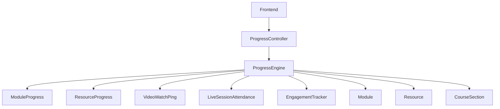
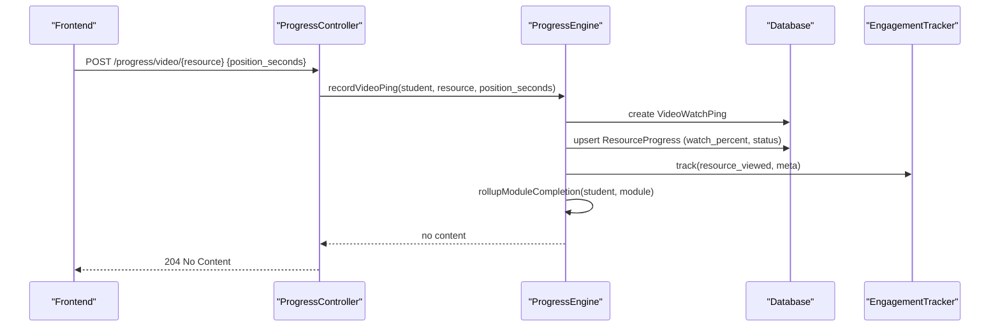
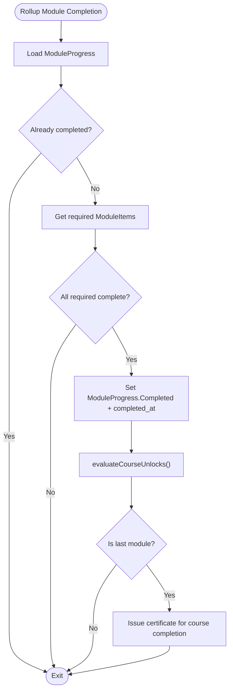
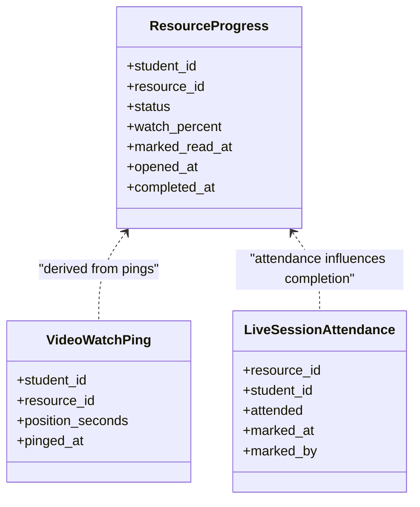
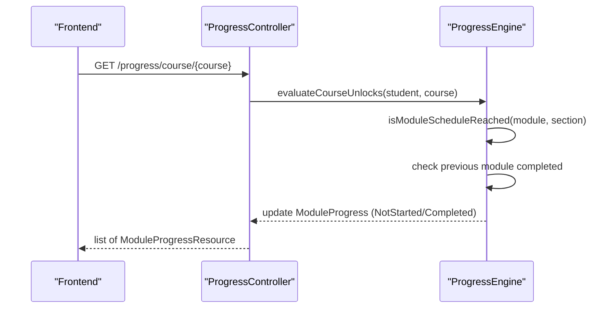
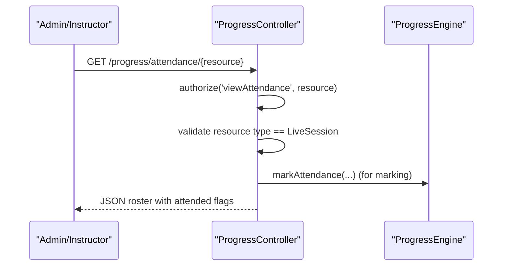
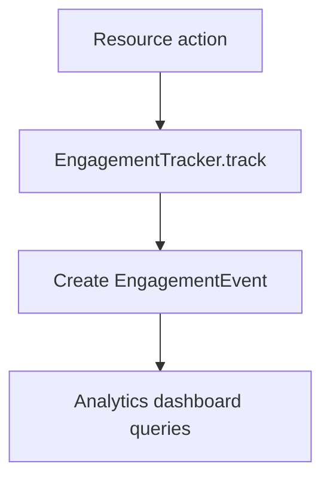
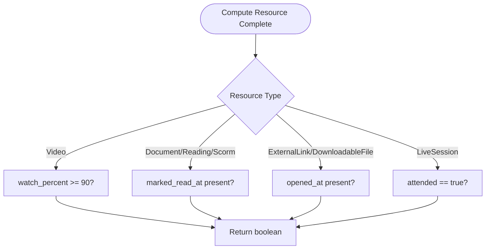
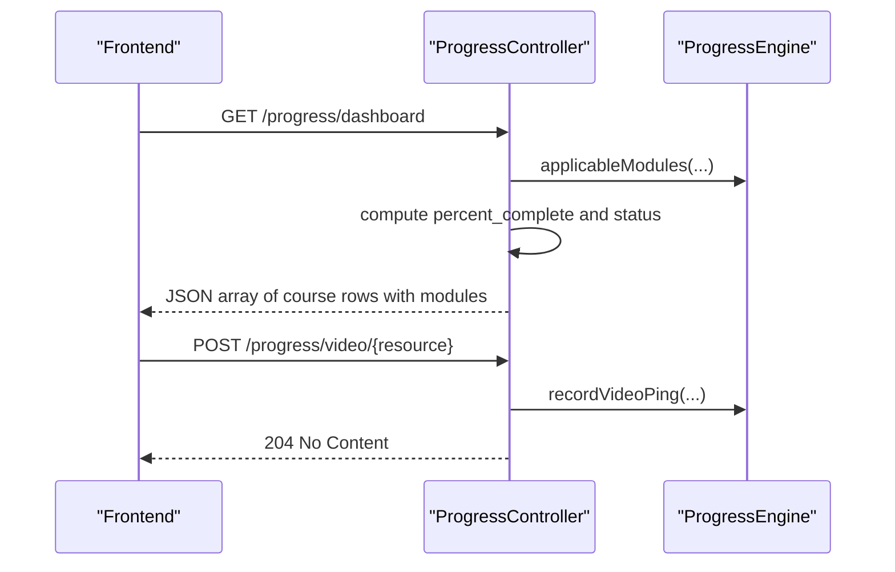
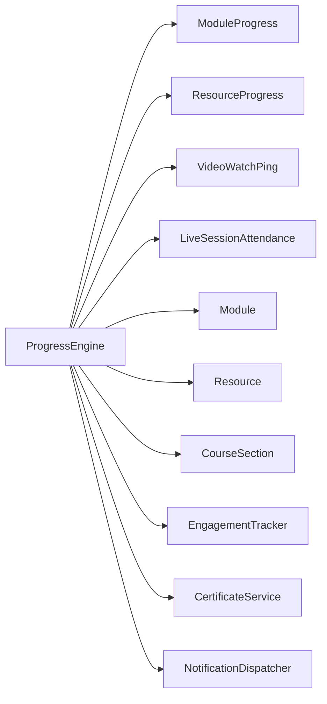

# Progress Tracking System

<cite>
**Referenced Files in This Document**
- [ProgressEngine.php](file://app/Services/Progress/ProgressEngine.php)
- [ProgressController.php](file://app/Http/Controllers/Api/V1/ProgressController.php)
- [ModuleProgress.php](file://app/Models/ModuleProgress.php)
- [ResourceProgress.php](file://app/Models/ResourceProgress.php)
- [VideoWatchPing.php](file://app/Models/VideoWatchPing.php)
- [LiveSessionAttendance.php](file://app/Models/LiveSessionAttendance.php)
- [Module.php](file://app/Models/Module.php)
- [Resource.php](file://app/Models/Resource.php)
- [CourseSection.php](file://app/Models/CourseSection.php)
- [ModuleProgressStatus.php](file://app/Enums/ModuleProgressStatus.php)
- [ResourceProgressStatus.php](file://app/Enums/ResourceProgressStatus.php)
- [ModuleItemType.php](file://app/Enums/ModuleItemType.php)
- [EngagementTracker.php](file://app/Services/Analytics/EngagementTracker.php)
- [ModuleProgressResource.php](file://app/Http/Resources/ModuleProgressResource.php)
- [CompletionTest.php](file://tests/Feature/Progress/CompletionTest.php)
- [ModuleLockingTest.php](file://tests/Feature/Progress/ModuleLockingTest.php)
</cite>

## Table of Contents
1. [Introduction](#introduction)
2. [Project Structure](#project-structure)
3. [Core Components](#core-components)
4. [Architecture Overview](#architecture-overview)
5. [Detailed Component Analysis](#detailed-component-analysis)
6. [Dependency Analysis](#dependency-analysis)
7. [Performance Considerations](#performance-considerations)
8. [Troubleshooting Guide](#troubleshooting-guide)
9. [Conclusion](#conclusion)

## Introduction
This document explains the Progress Tracking System sub-feature, focusing on how module unlocking, resource progress, video watch tracking, attendance management, and engagement analytics are implemented and synchronized between frontend and backend. It details the ProgressEngine architecture, completion calculation algorithms, and how these pieces integrate with course completion and analytics reporting.

## Project Structure
The progress feature is centered around a service that owns all lock/completion logic, a controller that exposes API endpoints for progress actions and dashboard data, models that persist progress states, and enums that define statuses. Frontend components call these APIs to record progress and display module status.

**Diagram sources**
- [ProgressController.php:44-149](file://app/Http/Controllers/Api/V1/ProgressController.php#L44-L149)
- [ProgressEngine.php:50-286](file://app/Services/Progress/ProgressEngine.php#L50-L286)
- [ModuleProgress.php:11-44](file://app/Models/ModuleProgress.php#L11-L44)
- [ResourceProgress.php:11-48](file://app/Models/ResourceProgress.php#L11-L48)
- [VideoWatchPing.php:10-35](file://app/Models/VideoWatchPing.php#L10-L35)
- [LiveSessionAttendance.php:12-57](file://app/Models/LiveSessionAttendance.php#L12-L57)
- [EngagementTracker.php:21-35](file://app/Services/Analytics/EngagementTracker.php#L21-L35)
- [Module.php:15-85](file://app/Models/Module.php#L15-L85)
- [Resource.php:15-102](file://app/Models/Resource.php#L15-L102)
- [CourseSection.php:14-118](file://app/Models/CourseSection.php#L14-L118)

**Section sources**
- [ProgressController.php:44-149](file://app/Http/Controllers/Api/V1/ProgressController.php#L44-L149)
- [ProgressEngine.php:50-286](file://app/Services/Progress/ProgressEngine.php#L50-L286)

## Core Components
- ProgressEngine: Central orchestrator for unlocking modules, computing completion, recording resource progress, and rolling up module completion.
- ProgressController: Thin API layer delegating writes to ProgressEngine and exposing read endpoints for course progress and dashboard.
- Models: ModuleProgress, ResourceProgress, VideoWatchPing, LiveSessionAttendance store per-student progress and events.
- Enums: ModuleProgressStatus and ResourceProgressStatus define state machines; ModuleItemType defines item types contributing to completion.
- EngagementTracker: Records course-scoped engagement events used by analytics dashboards.
- Resources: ModuleProgressResource serializes module progress for the frontend.

Key behaviors:
- Module unlock requires schedule reachability and previous module completion.
- Resource completion rules vary by type (video ≥ 90% watched, documents/readings marked as read, external links/downloadable files opened, live sessions attended).
- Assignment submissions and passed evaluation attempts count as required items.
- On completion, the next module may unlock and certificates can be issued upon course completion.

**Section sources**
- [ProgressEngine.php:50-286](file://app/Services/Progress/ProgressEngine.php#L50-L286)
- [ProgressController.php:44-149](file://app/Http/Controllers/Api/V1/ProgressController.php#L44-L149)
- [ModuleProgressStatus.php:7-13](file://app/Enums/ModuleProgressStatus.php#L7-L13)
- [ResourceProgressStatus.php:7-12](file://app/Enums/ResourceProgressStatus.php#L7-L12)
- [ModuleItemType.php:7-12](file://app/Enums/ModuleItemType.php#L7-L12)
- [EngagementTracker.php:21-35](file://app/Services/Analytics/EngagementTracker.php#L21-L35)
- [ModuleProgressResource.php:15-25](file://app/Http/Resources/ModuleProgressResource.php#L15-L25)

## Architecture Overview
The system follows a clear separation of concerns:
- Controllers handle HTTP requests and delegate business logic to services.
- ProgressEngine encapsulates all progress and unlocking rules.
- Models persist state and relationships.
- Analytics are recorded via a dedicated tracker.

**Diagram sources**
- [ProgressController.php:123-128](file://app/Http/Controllers/Api/V1/ProgressController.php#L123-L128)
- [ProgressEngine.php:218-244](file://app/Services/Progress/ProgressEngine.php#L218-L244)
- [VideoWatchPing.php:10-35](file://app/Models/VideoWatchPing.php#L10-L35)
- [ResourceProgress.php:11-48](file://app/Models/ResourceProgress.php#L11-L48)
- [EngagementTracker.php:21-35](file://app/Services/Analytics/EngagementTracker.php#L21-L35)

## Detailed Component Analysis

### ProgressEngine: Unlocking and Completion Logic
- evaluateCourseUnlocks: For each applicable module, ensures schedule reachability and previous module completion before transitioning from Locked to NotStarted and notifying the student.
- isModuleScheduleReached: Supports section-based scheduling using CourseSection.start_date plus Module.unlock_offset_days when available; otherwise falls back to Module.scheduled_start_at.
- applicableModules: Filters modules visible to the student based on group membership or absence of groups.
- rollupModuleCompletion: Marks a module Completed when all required items are complete, then triggers unlock evaluation and certificate issuance if it is the last module.
- isModuleItemComplete: Delegates to resource completion checks or existence of assignment submission/passed evaluation attempt.
- isResourceComplete: Implements per-type rules:
  - Video: watch_percent ≥ 90
  - Document/Reading/Scorm: marked_read_at present
  - ExternalLink/DownloadableFile: opened_at present
  - LiveSession: attended = true
- assertModuleUnlocked: Guards write operations on locked modules.

**Diagram sources**
- [ProgressEngine.php:126-152](file://app/Services/Progress/ProgressEngine.php#L126-L152)
- [ProgressEngine.php:50-81](file://app/Services/Progress/ProgressEngine.php#L50-L81)

**Section sources**
- [ProgressEngine.php:50-286](file://app/Services/Progress/ProgressEngine.php#L50-L286)

### Resource Progress Tracking
- Video watch tracking:
  - recordVideoPing persists a VideoWatchPing and updates ResourceProgress.watch_percent based on position_seconds and resource duration.
  - Sets ResourceProgress.status to Completed when watch_percent reaches 90%, records completed_at, tracks engagement, and rolls up module completion.
- Read/Open tracking:
  - markRead sets ResourceProgress.marked_read_at and completed_at for documents/readings/scorm.
  - markOpened sets ResourceProgress.opened_at and completed_at for external links/downloadable files.
  - Both trigger engagement tracking and module rollup.
- Attendance tracking:
  - markAttendance creates/updates LiveSessionAttendance.attended and triggers engagement tracking and module rollup.

**Diagram sources**
- [ResourceProgress.php:11-48](file://app/Models/ResourceProgress.php#L11-L48)
- [VideoWatchPing.php:10-35](file://app/Models/VideoWatchPing.php#L10-L35)
- [LiveSessionAttendance.php:12-57](file://app/Models/LiveSessionAttendance.php#L12-L57)

**Section sources**
- [ProgressEngine.php:218-286](file://app/Services/Progress/ProgressEngine.php#L218-L286)
- [ResourceProgress.php:11-48](file://app/Models/ResourceProgress.php#L11-L48)
- [VideoWatchPing.php:10-35](file://app/Models/VideoWatchPing.php#L10-L35)
- [LiveSessionAttendance.php:12-57](file://app/Models/LiveSessionAttendance.php#L12-L57)

### Module Unlocking and Sequence Control
- Applicable modules are filtered by group membership.
- A module unlocks only when:
  - Its schedule is reached (section-based offset or scheduled_start_at), and
  - The previous applicable module is completed.
- Upon unlock, a notification is sent exactly once per transition.
- Group-scoped modules not visible to a student do not block their sequence.

**Diagram sources**
- [ProgressController.php:44-60](file://app/Http/Controllers/Api/V1/ProgressController.php#L44-L60)
- [ProgressEngine.php:50-99](file://app/Services/Progress/ProgressEngine.php#L50-L99)

**Section sources**
- [ProgressEngine.php:50-118](file://app/Services/Progress/ProgressEngine.php#L50-L118)
- [ModuleLockingTest.php:42-134](file://tests/Feature/Progress/ModuleLockingTest.php#L42-L134)

### Attendance Management
- markAttendance records attendance for live session resources and marks the resource complete for the student.
- attendanceRoster endpoint returns an admin-only roster of students and their attendance status for a live session resource.

**Diagram sources**
- [ProgressController.php:155-181](file://app/Http/Controllers/Api/V1/ProgressController.php#L155-L181)
- [ProgressEngine.php:274-286](file://app/Services/Progress/ProgressEngine.php#L274-L286)

**Section sources**
- [ProgressController.php:155-181](file://app/Http/Controllers/Api/V1/ProgressController.php#L155-L181)
- [ProgressEngine.php:274-286](file://app/Services/Progress/ProgressEngine.php#L274-L286)

### Engagement Tracking and Analytics Reporting
- Every resource consumption action (video ping, mark read, mark opened, attendance) calls EngagementTracker.track with event_type resource_viewed and metadata including resource_id and resource_type.
- These events feed analytics dashboards for completion rates, at-risk flags, and engagement metrics.

**Diagram sources**
- [ProgressEngine.php:241-286](file://app/Services/Progress/ProgressEngine.php#L241-L286)
- [EngagementTracker.php:21-35](file://app/Services/Analytics/EngagementTracker.php#L21-L35)

**Section sources**
- [EngagementTracker.php:21-35](file://app/Services/Analytics/EngagementTracker.php#L21-L35)
- [ProgressEngine.php:241-286](file://app/Services/Progress/ProgressEngine.php#L241-L286)

### Completion Calculation Algorithms
- Video: watch_percent computed as min(100, round(position_seconds / duration * 100)). Completion threshold is 90%.
- Documents/Readings/SCORM: marked_read_at present indicates completion.
- External Links/Downloadable Files: opened_at present indicates completion.
- Live Sessions: attended = true indicates completion.
- Assignments/Evaluations: submission exists or passed evaluation attempt exists.
- Module completion: all required items must be complete; optional items do not block completion.

**Diagram sources**
- [ProgressEngine.php:180-205](file://app/Services/Progress/ProgressEngine.php#L180-L205)
- [ProgressEngine.php:218-244](file://app/Services/Progress/ProgressEngine.php#L218-L244)

**Section sources**
- [ProgressEngine.php:180-205](file://app/Services/Progress/ProgressEngine.php#L180-L205)
- [CompletionTest.php:21-79](file://tests/Feature/Progress/CompletionTest.php#L21-L79)

### Progress Synchronization Between Frontend and Backend
- Frontend reads current progress via courseProgress and dashboard endpoints, which compute applicable modules and return serialized ModuleProgressResource entries.
- Frontend writes progress via watchVideo, markRead, markOpened, and markAttendance endpoints; these delegate to ProgressEngine and return minimal responses.
- ModuleProgressResource provides module_id, title, order_index, status, unlocked_at, and completed_at for UI rendering.

**Diagram sources**
- [ProgressController.php:67-121](file://app/Http/Controllers/Api/V1/ProgressController.php#L67-L121)
- [ProgressController.php:123-149](file://app/Http/Controllers/Api/V1/ProgressController.php#L123-L149)
- [ModuleProgressResource.php:15-25](file://app/Http/Resources/ModuleProgressResource.php#L15-L25)

**Section sources**
- [ProgressController.php:44-149](file://app/Http/Controllers/Api/V1/ProgressController.php#L44-L149)
- [ModuleProgressResource.php:15-25](file://app/Http/Resources/ModuleProgressResource.php#L15-L25)

### Relationship with Module Unlocking, Course Completion, and Analytics
- Module unlocking depends on schedule reachability and prior module completion; notifications are sent on unlock transitions.
- Course completion triggers certificate issuance when the last applicable module completes.
- Engagement events are recorded for every resource interaction, enabling analytics reporting.

**Section sources**
- [ProgressEngine.php:50-152](file://app/Services/Progress/ProgressEngine.php#L50-L152)
- [ModuleLockingTest.php:122-134](file://tests/Feature/Progress/ModuleLockingTest.php#L122-L134)
- [EngagementTracker.php:21-35](file://app/Services/Analytics/EngagementTracker.php#L21-L35)

## Dependency Analysis
ProgressEngine depends on:
- Models: Module, Resource, ModuleProgress, ResourceProgress, VideoWatchPing, LiveSessionAttendance, User, Course.
- Services: CertificateService (for issuing certificates), NotificationDispatcher (for unlock notifications), EngagementTracker (for analytics).
- Enums: ModuleItemType, ModuleProgressStatus, ResourceProgressStatus, ResourceType.

**Diagram sources**
- [ProgressEngine.php:35-39](file://app/Services/Progress/ProgressEngine.php#L35-L39)
- [ProgressEngine.php:50-286](file://app/Services/Progress/ProgressEngine.php#L50-L286)

**Section sources**
- [ProgressEngine.php:35-39](file://app/Services/Progress/ProgressEngine.php#L35-L39)
- [ProgressEngine.php:50-286](file://app/Services/Progress/ProgressEngine.php#L50-L286)

## Performance Considerations
- Idempotency: evaluateCourseUnlocks and rollupModuleCompletion are designed to be safely called repeatedly without side effects beyond necessary transitions.
- Minimal writes: ProgressEngine uses firstOrCreate/updateOrCreate patterns to avoid redundant updates.
- Efficient queries: applicableModules filters by group membership and orders by order_index to minimize overhead.
- Watch percent computation is O(1) per ping; aggregation for dashboards relies on indexed queries over ModuleProgress and ResourceProgress.

[No sources needed since this section provides general guidance]

## Troubleshooting Guide
Common issues and diagnostics:
- Module remains locked:
  - Verify schedule reachability (section start date + unlock_offset_days or scheduled_start_at) and that the previous applicable module is completed.
  - Confirm the module is applicable to the student (group membership).
- Resource does not complete:
  - Ensure correct thresholds (e.g., video watch_percent ≥ 90%).
  - Check that markRead/markOpened/attendance were called and timestamps are set.
- Progress action rejected:
  - assertModuleUnlocked will abort if the module is locked; ensure the module has been unlocked before attempting progress writes.
- Notifications duplicated:
  - Notifications are sent only on unlock transitions; re-evaluating unlocks should not duplicate them.

**Section sources**
- [ProgressEngine.php:211-216](file://app/Services/Progress/ProgressEngine.php#L211-L216)
- [ModuleLockingTest.php:110-134](file://tests/Feature/Progress/ModuleLockingTest.php#L110-L134)

## Conclusion
The Progress Tracking System centralizes all progress-related logic in ProgressEngine, ensuring consistent unlocking, completion, and analytics across the platform. It supports flexible scheduling, per-resource completion rules, robust attendance tracking, and seamless synchronization between frontend and backend. Tests validate core behaviors such as video completion thresholds, optional item handling, locking sequences, and notification idempotency.