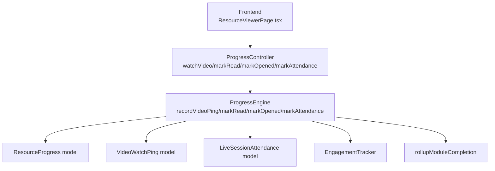
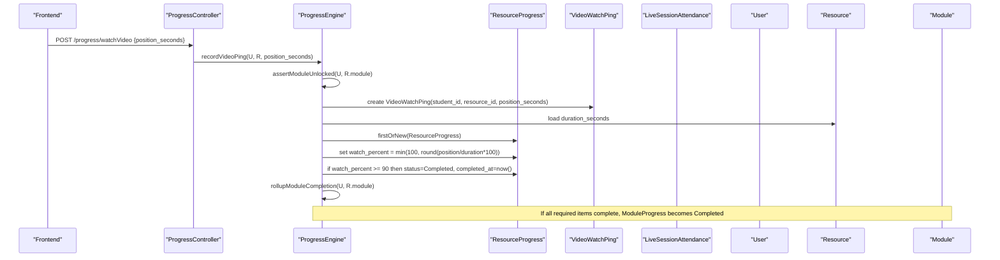
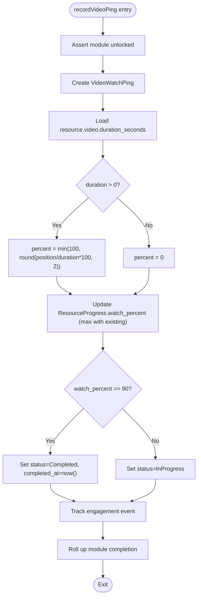
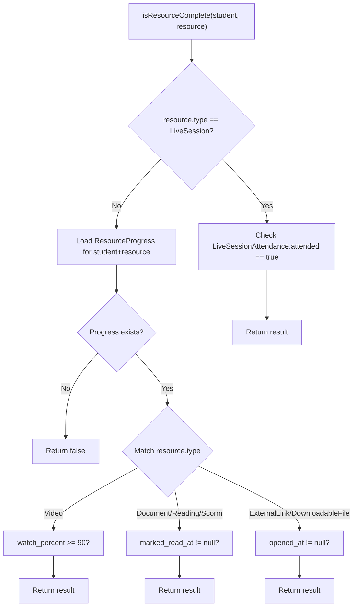
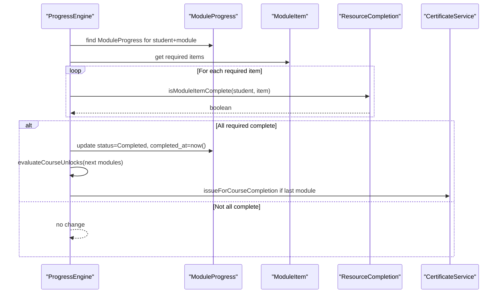
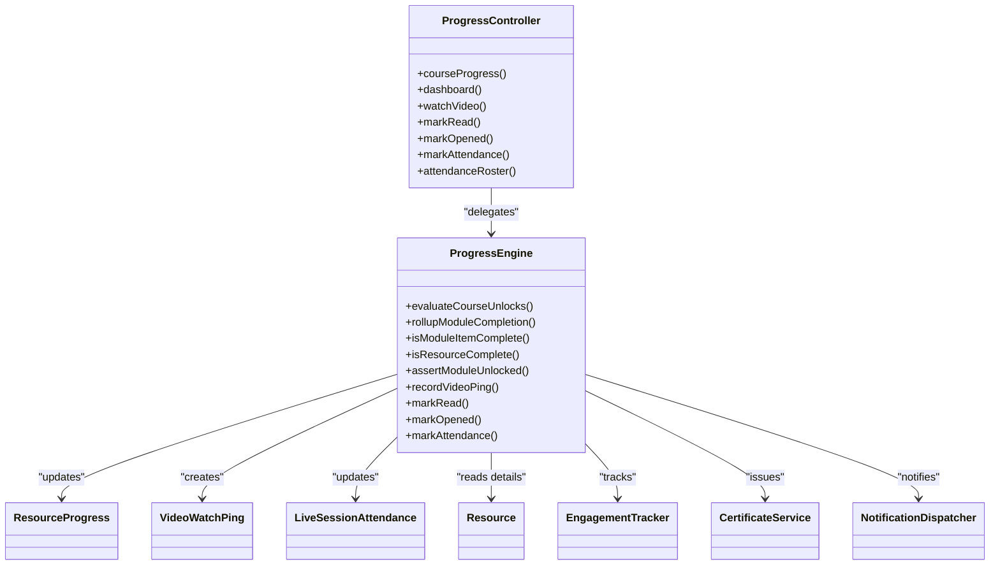

# Resource Progress Tracking

<cite>
**Referenced Files in This Document**
- [ProgressEngine.php](file://app/Services/Progress/ProgressEngine.php)
- [ResourceProgress.php](file://app/Models/ResourceProgress.php)
- [VideoWatchPing.php](file://app/Models/VideoWatchPing.php)
- [ProgressController.php](file://app/Http/Controllers/Api/V1/ProgressController.php)
- [RecordVideoProgressRequest.php](file://app/Http/Requests/Api/V1/RecordVideoProgressRequest.php)
- [ResourceType.php](file://app/Enums/ResourceType.php)
- [ResourceProgressStatus.php](file://app/Enums/ResourceProgressStatus.php)
- [Resource.php](file://app/Models/Resource.php)
- [LiveSessionAttendance.php](file://app/Models/LiveSessionAttendance.php)
- [2024_01_01_000151_create_resource_progress_table.php](file://database/migrations/2024_01_01_000151_create_resource_progress_table.php)
- [2024_01_01_000152_create_video_watch_pings_table.php](file://database/migrations/2024_01_01_000152_create_video_watch_pings_table.php)
- [2024_01_01_000128_create_live_session_attendance_table.php](file://database/migrations/2024_01_01_000128_create_live_session_attendance_table.php)
- [ResourceViewerPage.tsx](file://frontend/src/features/learning\ResourceViewerPage.tsx)
</cite>

## Table of Contents
1. [Introduction](#introduction)
2. [Project Structure](#project-structure)
3. [Core Components](#core-components)
4. [Architecture Overview](#architecture-overview)
5. [Detailed Component Analysis](#detailed-component-analysis)
6. [Dependency Analysis](#dependency-analysis)
7. [Performance Considerations](#performance-considerations)
8. [Troubleshooting Guide](#troubleshooting-guide)
9. [Conclusion](#conclusion)

## Introduction
This document explains the Resource Progress Tracking sub-feature: how different resource types record and evaluate completion, how video watch progress is captured and converted into a percentage, and how completion signals roll up to mark modules complete. It focuses on the ResourceProgress model structure, VideoWatchPing recording mechanism, and the isResourceComplete method that evaluates completion based on resource type.

## Project Structure
The progress tracking feature spans models, services, controllers, enums, migrations, and frontend components:
- Models store per-student progress and attendance events.
- The ProgressEngine centralizes all completion logic and module rollups.
- The ProgressController exposes API endpoints for recording progress.
- Enums define resource types and progress statuses.
- Migrations define database schema for progress and pings.
- Frontend triggers progress recording (video pings, mark-as-read, mark-as-opened, mark attendance).

**Diagram sources**
- [ProgressController.php:123-149](file://app/Http/Controllers/Api/V1/ProgressController.php#L123-L149)
- [ProgressEngine.php:218-286](file://app/Services/Progress/ProgressEngine.php#L218-L286)
- [ResourceProgress.php:11-48](file://app/Models/ResourceProgress.php#L11-L48)
- [VideoWatchPing.php:10-35](file://app/Models/VideoWatchPing.php#L10-L35)
- [LiveSessionAttendance.php:12-57](file://app/Models/LiveSessionAttendance.php#L12-L57)

**Section sources**
- [ProgressController.php:123-149](file://app/Http/Controllers/Api/V1/ProgressController.php#L123-L149)
- [ProgressEngine.php:218-286](file://app/Services/Progress/ProgressEngine.php#L218-L286)
- [ResourceProgress.php:11-48](file://app/Models/ResourceProgress.php#L11-L48)
- [VideoWatchPing.php:10-35](file://app/Models/VideoWatchPing.php#L10-L35)
- [LiveSessionAttendance.php:12-57](file://app/Models/LiveSessionAttendance.php#L12-L57)

## Core Components
- ResourceProgress: Per-student/per-resource progress state with status, watch_percent, marked_read_at, opened_at, completed_at.
- VideoWatchPing: Time-series ping of video position_seconds for analytics and progress calculation.
- LiveSessionAttendance: Records whether a student attended a live session.
- ProgressEngine: Central service that records progress, computes percentages, determines completion by resource type, and rolls up module completion.
- ProgressController: Thin API layer delegating to ProgressEngine.

Key behaviors:
- Video: watch ≥ 90% completes the resource.
- Document/Reading/Scorm: “Mark as read” completes the resource.
- ExternalLink/DownloadableFile: “Mark as opened” completes the resource.
- LiveSession: Attendance recorded completes the resource.

**Section sources**
- [ResourceProgress.php:11-48](file://app/Models/ResourceProgress.php#L11-L48)
- [VideoWatchPing.php:10-35](file://app/Models/VideoWatchPing.php#L10-L35)
- [LiveSessionAttendance.php:12-57](file://app/Models/LiveSessionAttendance.php#L12-L57)
- [ProgressEngine.php:170-205](file://app/Services/Progress/ProgressEngine.php#L170-L205)
- [ProgressEngine.php:218-286](file://app/Services/Progress/ProgressEngine.php#L218-L286)
- [ResourceType.php:7-16](file://app/Enums/ResourceType.php#L7-L16)
- [ResourceProgressStatus.php:7-12](file://app/Enums/ResourceProgressStatus.php#L7-L12)

## Architecture Overview
The system enforces a single source of truth for completion: ProgressEngine. Controllers accept requests, validate inputs, and delegate to engine methods. Engine methods update progress tables, track engagement, and trigger module rollups when required items are complete.

**Diagram sources**
- [ProgressController.php:123-128](file://app/Http/Controllers/Api/V1/ProgressController.php#L123-L128)
- [ProgressEngine.php:218-244](file://app/Services/Progress/ProgressEngine.php#L218-L244)
- [ProgressEngine.php:126-152](file://app/Services/Progress/ProgressEngine.php#L126-L152)
- [VideoWatchPing.php:10-35](file://app/Models/VideoWatchPing.php#L10-L35)
- [ResourceProgress.php:11-48](file://app/Models/ResourceProgress.php#L11-L48)

## Detailed Component Analysis

### ResourceProgress Model Structure
- Fields: student_id, resource_id, status, watch_percent, marked_read_at, opened_at, completed_at.
- Status enum values: not_started, in_progress, completed.
- watch_percent is decimal; timestamps for marking read/opened/completed.
- Unique constraint per student/resource ensures one progress row per pair.

How it’s used:
- Video: watch_percent updated from pings; completion at ≥ 90%.
- Documents/Readings/SCORM: marked_read_at set to complete.
- External links/Downloadable files: opened_at set to complete.

**Section sources**
- [ResourceProgress.php:11-48](file://app/Models/ResourceProgress.php#L11-L48)
- [ResourceProgressStatus.php:7-12](file://app/Enums/ResourceProgressStatus.php#L7-L12)
- [2024_01_01_000151_create_resource_progress_table.php:11-24](file://database/migrations/2024_01_01_000151_create_resource_progress_table.php#L11-L24)

### VideoWatchPing Recording Mechanism
- Each ping stores student_id, resource_id, position_seconds, and timestamp.
- Indexes optimize queries by student and resource.
- Pings are created regardless of completion; they support analytics and can be used to recompute watch percent if needed.

Recording flow:
- Controller validates position_seconds (non-negative integer).
- Engine asserts module unlocked, creates ping, calculates percentage, updates ResourceProgress, tracks engagement, and rolls up module completion.

Percentage calculation:
- percent = min(100, round(position_seconds / duration_seconds * 100, 2)).
- watch_percent is only increased (max with existing value).
- When watch_percent reaches ≥ 90%, status becomes completed and completed_at is set.

**Diagram sources**
- [ProgressEngine.php:218-244](file://app/Services/Progress/ProgressEngine.php#L218-L244)
- [RecordVideoProgressRequest.php:16-21](file://app/Http/Requests/Api/V1/RecordVideoProgressRequest.php#L16-L21)
- [2024_01_01_000152_create_video_watch_pings_table.php:11-20](file://database/migrations/2024_01_01_000152_create_video_watch_pings_table.php#L11-L20)

**Section sources**
- [ProgressEngine.php:218-244](file://app/Services/Progress/ProgressEngine.php#L218-L244)
- [RecordVideoProgressRequest.php:16-21](file://app/Http/Requests/Api/V1/RecordVideoProgressRequest.php#L16-L21)
- [2024_01_01_000152_create_video_watch_pings_table.php:11-20](file://database/migrations/2024_01_01_000152_create_video_watch_pings_table.php#L11-L20)

### Completion Evaluation: isResourceComplete Method
Determines whether a resource is complete for a student:
- LiveSession: checks LiveSessionAttendance.attended == true.
- Other resources: loads ResourceProgress and applies rules:
  - Video: watch_percent ≥ 90.
  - Document/Reading/Scorm: marked_read_at is not null.
  - ExternalLink/DownloadableFile: opened_at is not null.

**Diagram sources**
- [ProgressEngine.php:170-205](file://app/Services/Progress/ProgressEngine.php#L170-L205)
- [ResourceType.php:7-16](file://app/Enums/ResourceType.php#L7-L16)

**Section sources**
- [ProgressEngine.php:170-205](file://app/Services/Progress/ProgressEngine.php#L170-L205)

### Mark-as-Read and Mark-as-Opened
- markRead: Sets ResourceProgress.status to completed, sets marked_read_at and completed_at timestamps. Used for documents, readings, and SCORM packages.
- markOpened: Sets ResourceProgress.status to completed, sets opened_at and completed_at timestamps. Used for external links and downloadable files.

Both methods:
- Assert module unlocked.
- Track engagement event.
- Roll up module completion.

**Section sources**
- [ProgressEngine.php:246-272](file://app/Services/Progress/ProgressEngine.php#L246-L272)

### Live Session Attendance Recording
- markAttendance: Creates or updates LiveSessionAttendance with attended=true and marks_at timestamp. Supports optional instructor marking via marked_by.
- Completion rule: A live session resource is complete when attendance.attended is true for the student.

**Section sources**
- [ProgressEngine.php:274-286](file://app/Services/Progress/ProgressEngine.php#L274-L286)
- [LiveSessionAttendance.php:12-57](file://app/Models/LiveSessionAttendance.php#L12-L57)
- [2024_01_01_000128_create_live_session_attendance_table.php:11-21](file://database/migrations/2024_01_01_000128_create_live_session_attendance_table.php#L11-L21)

### Module Completion Rollups
- rollupModuleCompletion: Checks all required module items; if all are complete, sets ModuleProgress to completed and unlocks subsequent modules. On final module completion, issues a certificate.
- isModuleItemComplete: Delegates to isResourceComplete for resource items, checks assignment submissions, and evaluation attempts.

**Diagram sources**
- [ProgressEngine.php:126-152](file://app/Services/Progress/ProgressEngine.php#L126-L152)
- [ProgressEngine.php:154-168](file://app/Services/Progress/ProgressEngine.php#L154-L168)

**Section sources**
- [ProgressEngine.php:126-152](file://app/Services/Progress/ProgressEngine.php#L126-L152)
- [ProgressEngine.php:154-168](file://app/Services/Progress/ProgressEngine.php#L154-L168)

### Frontend Integration Examples
- Video player simulates playback and sends periodic progress pings every 10 seconds or at finish, using the same backend logic that completes at 90%.
- SCORM package provides a link to open and a “Mark as read” button to complete.
- Live session shows join link and “Mark as attended” button to complete.

These interactions call the corresponding controller endpoints which delegate to ProgressEngine.

**Section sources**
- [ResourceViewerPage.tsx:65-138](file://frontend/src/features/learning\ResourceViewerPage.tsx#L65-L138)
- [ResourceViewerPage.tsx:197-217](file://frontend/src/features/learning\ResourceViewerPage.tsx#L197-L217)
- [ResourceViewerPage.tsx:242-269](file://frontend/src/features/learning\ResourceViewerPage.tsx#L242-L269)

## Dependency Analysis
- ProgressController depends on ProgressEngine and MediaStorageService.
- ProgressEngine depends on:
  - ResourceProgress, VideoWatchPing, LiveSessionAttendance models.
  - EngagementTracker for analytics.
  - CertificateService for issuing certificates.
  - NotificationDispatcher for unlock notifications.
- Resource model relates to specific detail types (video, document, reading, external link, scorm package, live session, downloadable file).

**Diagram sources**
- [ProgressController.php:32-183](file://app/Http/Controllers/Api/V1/ProgressController.php#L32-L183)
- [ProgressEngine.php:33-288](file://app/Services/Progress/ProgressEngine.php#L33-L288)
- [Resource.php:15-103](file://app/Models/Resource.php#L15-L103)

**Section sources**
- [ProgressController.php:32-183](file://app/Http/Controllers/Api/V1/ProgressController.php#L32-L183)
- [ProgressEngine.php:33-288](file://app/Services/Progress/ProgressEngine.php#L33-L288)
- [Resource.php:15-103](file://app/Models/Resource.php#L15-L103)

## Performance Considerations
- VideoWatchPing table uses indexes on student_id and resource_id to optimize frequent writes and queries.
- ResourceProgress has a unique constraint on (student_id, resource_id), preventing duplicate rows and ensuring efficient updates.
- Percentage calculations are simple arithmetic; ensure duration_seconds is available to avoid division by zero.
- Frequent pings should be rate-limited on the client side to reduce write load.
- Engagement tracking and module rollups run per progress event; consider batching or queuing if high volume.

[No sources needed since this section provides general guidance]

## Troubleshooting Guide
Common issues and resolutions:
- Module locked: ProgressEngine.assertModuleUnlocked will abort if the module is locked. Ensure schedule reached and previous module completed before recording progress.
- Video not completing: Verify duration_seconds is set on the video resource; without it, percent remains 0. Also confirm pings reach ≥ 90% of duration.
- Duplicate progress: ResourceProgress unique constraint prevents duplicates; use updateOrCreate patterns where appropriate.
- Live session not marking complete: Ensure attendance record exists with attended=true; check roster endpoint for verification.

Relevant code paths:
- Module unlock assertion and progress recording.
- Attendance roster retrieval and filtering.

**Section sources**
- [ProgressEngine.php:211-216](file://app/Services/Progress/ProgressEngine.php#L211-L216)
- [ProgressEngine.php:218-244](file://app/Services/Progress/ProgressEngine.php#L218-L244)
- [ProgressController.php:155-181](file://app/Http/Controllers/Api/V1/ProgressController.php#L155-L181)

## Conclusion
Resource Progress Tracking centralizes completion logic in ProgressEngine, providing consistent behavior across resource types. Video progress is captured via pings and converted to a percentage, completing at 90%. Documents/readings/SCORM complete on “mark as read,” external links/downloadable files complete on “mark as opened,” and live sessions complete on attendance. Completion signals roll up to mark modules complete and unlock subsequent content, enabling a coherent learning progression.

[No sources needed since this section summarizes without analyzing specific files]