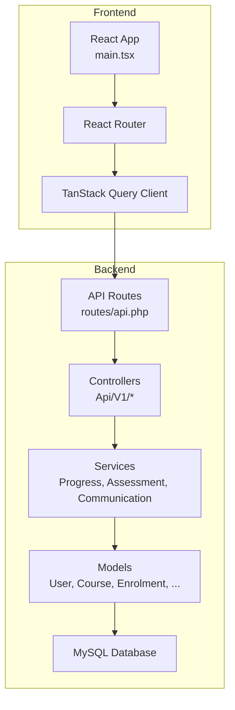
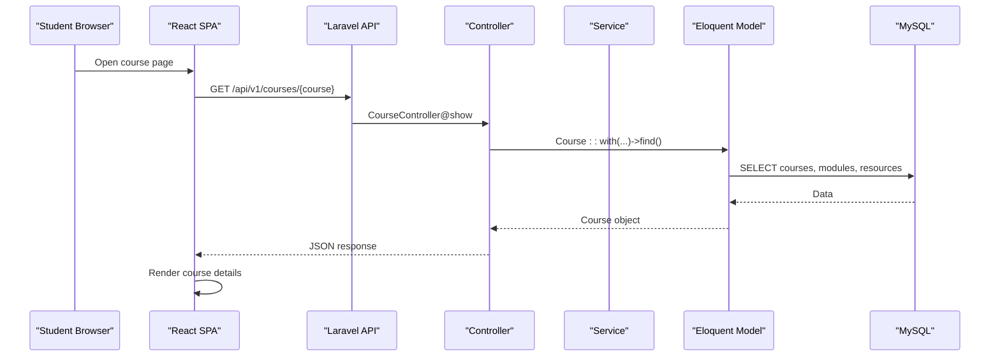
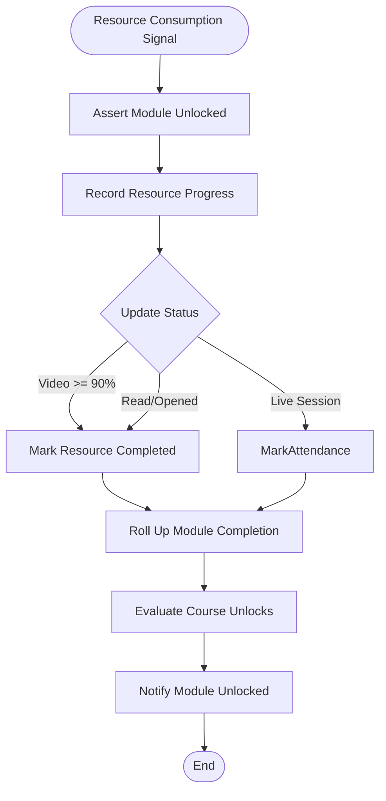
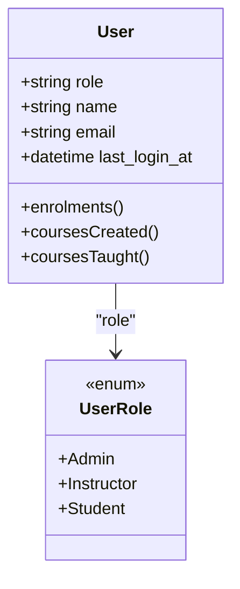
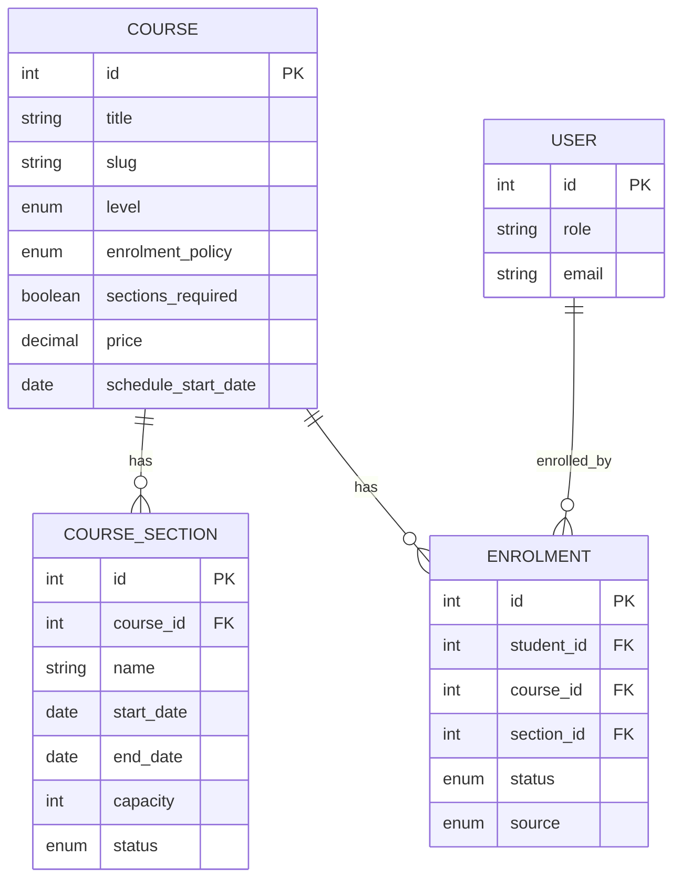
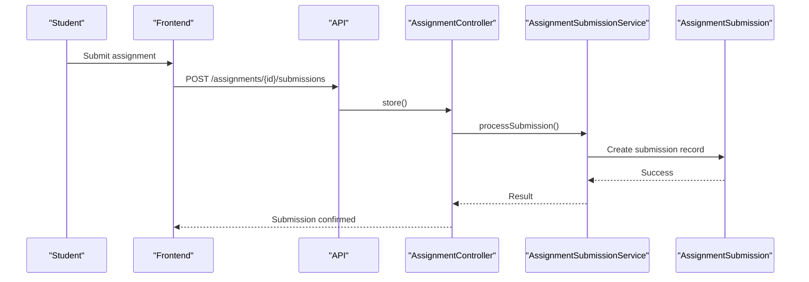
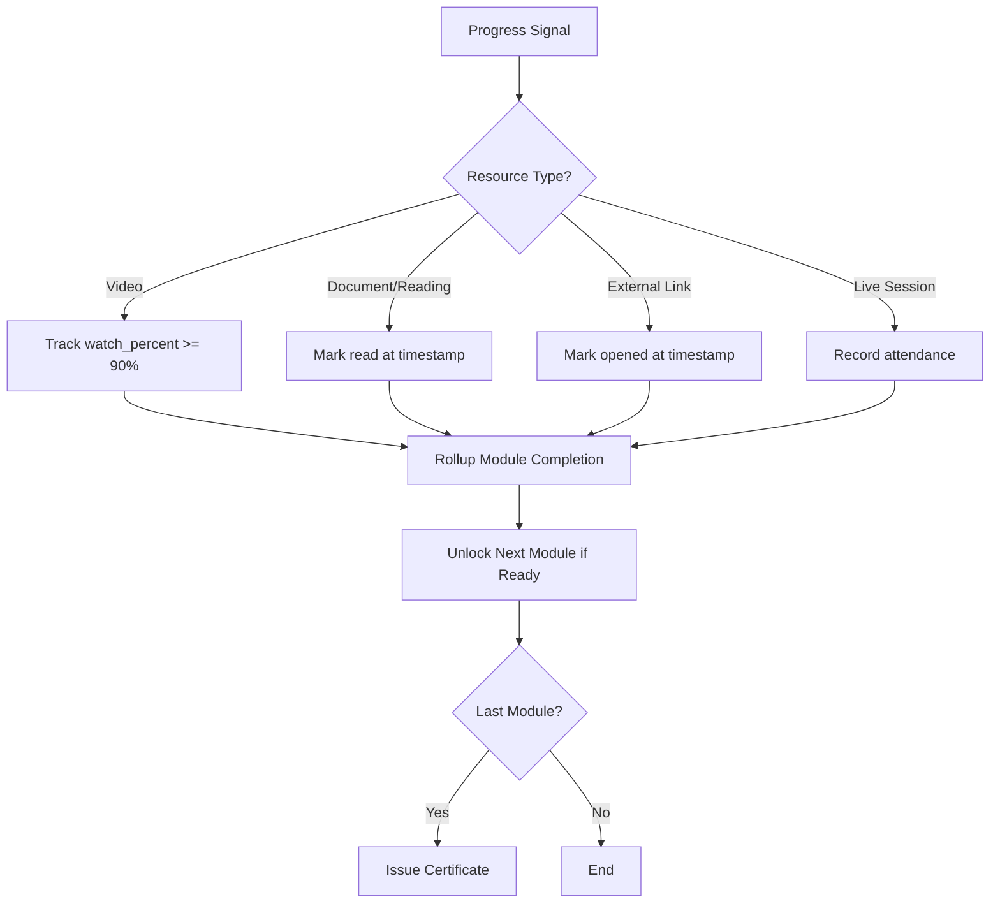
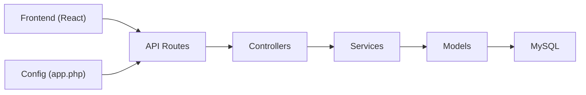

# Project Overview

<cite>
**Referenced Files in This Document**
- [README.md](file://README.md)
- [composer.json](file://composer.json)
- [frontend/package.json](file://frontend/package.json)
- [routes/api.php](file://routes/api.php)
- [config/app.php](file://config/app.php)
- [app/Models/User.php](file://app/Models/User.php)
- [app/Models/Course.php](file://app/Models/Course.php)
- [app/Enums/UserRole.php](file://app/Enums/UserRole.php)
- [app/Services/Progress/ProgressEngine.php](file://app/Services/Progress/ProgressEngine.php)
- [app/Models/Enrolment.php](file://app/Models/Enrolment.php)
- [frontend/src/main.tsx](file://frontend/src/main.tsx)
- [PRODUCTION_READINESS.md](file://PRODUCTION_READINESS.md)
</cite>

## Table of Contents
1. [Introduction](#introduction)
2. [Project Structure](#project-structure)
3. [Core Components](#core-components)
4. [Architecture Overview](#architecture-overview)
5. [Detailed Component Analysis](#detailed-component-analysis)
6. [Dependency Analysis](#dependency-analysis)
7. [Performance Considerations](#performance-considerations)
8. [Troubleshooting Guide](#troubleshooting-guide)
9. [Conclusion](#conclusion)

## Introduction
ResNet Academy is a full-stack Learning Management System (LMS) designed to help institutions publish courses, manage cohorts, deliver structured content, assess learners, track progress, and facilitate communication between students, instructors, and administrators. The system supports cohort-based learning with scheduled modules, enrollment workflows, assignments and evaluations, certificates upon completion, and rich communication tools such as messaging, tickets, forums, and announcements. It targets educational use cases where guided learning paths, accountability, and measurable outcomes are important—such as professional training programs, bootcamps, university courses, and corporate academies.

The platform serves three primary user roles:
- Students: browse catalogs, apply/enroll in courses or cohorts, consume content, submit assessments, track progress, communicate with peers and staff, and receive certificates.
- Instructors: create and manage course structure, resources, assignments, evaluations, grade submissions, monitor analytics, and engage with students via messaging and forums.
- Administrators: oversee users, orders, payments, audits, reviews, and platform-wide settings; manage cohorts and access controls.

**Section sources**
- [README.md:10-22](file://README.md#L10-L22)
- [PRODUCTION_READINESS.md:167-183](file://PRODUCTION_READINESS.md#L167-L183)

## Project Structure
The repository follows a clear separation between backend (Laravel API) and frontend (React SPA):
- Backend: Laravel 12 application exposing a versioned REST API under /api/v1, with controllers, models, services, enums, policies, jobs, mail, notifications, and configuration files.
- Frontend: React + TypeScript SPA built with Vite, using TanStack Query for data fetching, React Router for navigation, and Tailwind CSS for styling.

Key structural highlights:
- API routes define public endpoints for catalog browsing and certificate verification, and protected endpoints for enrollment, content management, assessment, progress tracking, communication, and admin operations.
- Models represent core entities like User, Course, Enrolment, Modules, Resources, Assignments, Evaluations, Forums, Tickets, and more.
- Services encapsulate complex business logic, notably the Progress Engine that computes module unlocks and completions.
- Frontend entry initializes routing, authentication context, and global query client.

**Diagram sources**
- [frontend/src/main.tsx:1-61](file://frontend/src/main.tsx#L1-L61)
- [routes/api.php:49-241](file://routes/api.php#L49-L241)
- [app/Services/Progress/ProgressEngine.php:27-39](file://app/Services/Progress/ProgressEngine.php#L27-L39)
- [app/Models/User.php:19-99](file://app/Models/User.php#L19-L99)
- [app/Models/Course.php:17-179](file://app/Models/Course.php#L17-L179)

**Section sources**
- [composer.json:8-18](file://composer.json#L8-L18)
- [frontend/package.json:18-61](file://frontend/package.json#L18-L61)
- [routes/api.php:49-241](file://routes/api.php#L49-L241)
- [frontend/src/main.tsx:1-61](file://frontend/src/main.tsx#L1-L61)

## Core Components
This LMS centers around several core components that enable course delivery, cohort management, assessment, progress tracking, and communication:

- Course Management: Courses, categories, modules, and resources form the backbone of content organization. Instructors can create and update courses and their structures; students can browse and enroll.
- Cohort-Based Learning: Course sections (cohorts) provide scheduled learning experiences with capacity limits, statuses (open/in_progress), and enrollment flows. Public section listings support landing pages and catalogs.
- Assessment Systems: Assignments and evaluations allow students to submit work and take tests; instructors grade submissions and attempts, with late penalty policies and rubrics.
- Progress Tracking: A centralized Progress Engine computes module unlocks and completions based on resource consumption signals (video watch percent, mark-as-read/opened, live session attendance) and assessment outcomes.
- Communication Platforms: Messaging conversations, support tickets, forums with threads/posts/tags/reports, and announcements enable multi-directional communication among students, instructors, and admins.
- Enrollment and Payments: Students apply or enroll in courses/sections; orders and payment submissions capture transactions, with manual confirmation flows in the current implementation.
- Certificates: Automatic issuance upon course completion via the Progress Engine and Certificate Service.

Technology stack:
- Backend: PHP 8.2+, Laravel 12, Sanctum for API auth, Socialite for OAuth, Resend for email, AWS S3 storage integration, PDF generation for certificates.
- Frontend: React 19, TypeScript, Vite, Tailwind CSS, Radix UI, TipTap editor, TanStack Query, Axios, Zod validation.
- Database: MySQL via Laravel migrations and Eloquent ORM.

**Section sources**
- [routes/api.php:52-241](file://routes/api.php#L52-L241)
- [app/Models/Course.php:22-179](file://app/Models/Course.php#L22-L179)
- [app/Models/Enrolment.php:22-74](file://app/Models/Enrolment.php#L22-L74)
- [app/Services/Progress/ProgressEngine.php:27-288](file://app/Services/Progress/ProgressEngine.php#L27-L288)
- [composer.json:8-18](file://composer.json#L8-L18)
- [frontend/package.json:18-61](file://frontend/package.json#L18-L61)

## Architecture Overview
The system follows a modern full-stack architecture:
- Frontend SPA communicates with a versioned REST API secured by Sanctum tokens.
- Controllers handle HTTP requests, delegate to domain services for business logic, and return JSON responses.
- Services encapsulate complex workflows (progress computation, assessment grading, communication dispatch).
- Models interact with MySQL through Eloquent relationships and casts.
- Configuration centralizes app settings including frontend URL for redirects after auth flows.

**Diagram sources**
- [routes/api.php:52-60](file://routes/api.php#L52-L60)
- [app/Models/Course.php:116-145](file://app/Models/Course.php#L116-L145)

**Diagram sources**
- [app/Services/Progress/ProgressEngine.php:207-286](file://app/Services/Progress/ProgressEngine.php#L207-L286)

**Section sources**
- [config/app.php:57-68](file://config/app.php#L57-L68)
- [routes/api.php:49-241](file://routes/api.php#L49-L241)
- [app/Services/Progress/ProgressEngine.php:27-288](file://app/Services/Progress/ProgressEngine.php#L27-L288)

## Detailed Component Analysis

### User Roles and Access Control
Users have distinct roles that determine permissions across the platform:
- Admin: Full platform oversight, user management, audit logs, order/payment administration.
- Instructor: Course creation and management, module/resource authoring, assignment/evaluation management, grading, analytics, student communication.
- Student: Enrollment, content consumption, assessment submission, progress tracking, communication, certificate retrieval.

Access control is enforced via Policies and Sanctum middleware on API routes.

**Diagram sources**
- [app/Models/User.php:24-55](file://app/Models/User.php#L24-L55)
- [app/Enums/UserRole.php:7-12](file://app/Enums/UserRole.php#L7-L12)

**Section sources**
- [app/Models/User.php:19-99](file://app/Models/User.php#L19-L99)
- [app/Enums/UserRole.php:7-12](file://app/Enums/UserRole.php#L7-L12)
- [routes/api.php:68-241](file://routes/api.php#L68-L241)

### Course and Cohort Management
Courses organize learning content into modules and resources. Cohorts (course sections) introduce scheduling, capacity, and enrollment policies:
- Courses have categories, levels, pricing, status, and optional sections_required flag.
- Sections define start/end dates, capacity, status (open/in_progress), and link to courses and instructors.
- Enrollment records tie students to courses and optionally to specific sections, with source and status tracking.

**Diagram sources**
- [app/Models/Course.php:22-179](file://app/Models/Course.php#L22-L179)
- [app/Models/Enrolment.php:22-74](file://app/Models/Enrolment.php#L22-L74)

**Section sources**
- [app/Models/Course.php:22-179](file://app/Models/Course.php#L22-L179)
- [app/Models/Enrolment.php:22-74](file://app/Models/Enrolment.php#L22-L74)
- [routes/api.php:52-82](file://routes/api.php#L52-L82)

### Assessment Systems
Assessments include assignments and evaluations:
- Assignments: Instructors create assignments within modules; students submit work; instructors grade submissions with rubric scores and late penalties.
- Evaluations: Instructors build question banks and questions; students attempt evaluations; attempts are graded and tracked.

API endpoints cover CRUD for assignments and evaluations, submission handling, attempt lifecycle, and gradebook aggregation.

**Diagram sources**
- [routes/api.php:159-168](file://routes/api.php#L159-L168)

**Section sources**
- [routes/api.php:159-191](file://routes/api.php#L159-L191)

### Progress Tracking
The Progress Engine is the single owner of module unlock and completion logic:
- Evaluates course unlocks based on schedule and previous module completion.
- Computes resource completion per type (video watch percent, read/opened, live session attendance).
- Rolls up module completion when all required items are done, unlocking subsequent modules and issuing certificates upon course completion.

**Diagram sources**
- [app/Services/Progress/ProgressEngine.php:120-205](file://app/Services/Progress/ProgressEngine.php#L120-L205)
- [app/Services/Progress/ProgressEngine.php:218-286](file://app/Services/Progress/ProgressEngine.php#L218-L286)

**Section sources**
- [app/Services/Progress/ProgressEngine.php:27-288](file://app/Services/Progress/ProgressEngine.php#L27-L288)

### Communication Platforms
Communication features include:
- Conversations and messages for direct messaging between users.
- Support tickets for structured student assistance.
- Forums with threads, posts, tags, reports, and moderation capabilities.
- Announcements broadcast from instructors/admins to enrolled students.
- Notifications inbox for in-app alerts.

API endpoints cover indexing, creation, updates, and moderation actions for each feature.

**Section sources**
- [routes/api.php:198-241](file://routes/api.php#L198-L241)

## Dependency Analysis
The system exhibits clear layering and separation of concerns:
- Frontend depends on API routes for data and actions.
- Controllers depend on services for business logic.
- Services depend on models for data persistence.
- Models depend on database schema defined by migrations.
- Configuration drives behavior like frontend URL for redirects.

**Diagram sources**
- [routes/api.php:49-241](file://routes/api.php#L49-L241)
- [config/app.php:57-68](file://config/app.php#L57-L68)

**Section sources**
- [routes/api.php:49-241](file://routes/api.php#L49-L241)
- [config/app.php:57-68](file://config/app.php#L57-L68)

## Performance Considerations
- Use efficient queries with eager loading to reduce N+1 problems when fetching course structures and related data.
- Cache frequently accessed catalog data (categories, courses, public sections) where appropriate.
- Offload heavy tasks (certificate PDF generation, bulk enrolment imports, email sending) to background jobs.
- Monitor video watch pings and engagement events to avoid excessive writes; batch or throttle as needed.
- Ensure database indexes on foreign keys and frequently filtered columns (e.g., enrolment status, section status).

[No sources needed since this section provides general guidance]

## Troubleshooting Guide
Common issues and debugging strategies:
- Authentication failures: Verify Sanctum token setup and CORS configuration; check frontend URL in config for redirect flows.
- Progress not updating: Ensure module is unlocked before recording progress; validate resource type-specific completion rules.
- Enrollment errors: Confirm course capacity and section status; verify application workflow and approval steps.
- Communication delays: Check queue workers for message/ticket processing; ensure notification dispatcher is configured.

**Section sources**
- [config/app.php:57-68](file://config/app.php#L57-L68)
- [app/Services/Progress/ProgressEngine.php:207-216](file://app/Services/Progress/ProgressEngine.php#L207-L216)

## Conclusion
ResNet Academy provides a comprehensive LMS tailored for cohort-based education with robust course management, assessment systems, progress tracking, and communication tools. Built on Laravel 12 and React with TypeScript, it offers a scalable foundation for educational institutions seeking structured learning experiences, measurable outcomes, and effective instructor-student interaction. The architecture emphasizes clear separation of concerns, centralized business logic, and extensible APIs to support future enhancements such as real-time features, payment gateway integration, and advanced analytics.

[No sources needed since this section summarizes without analyzing specific files]