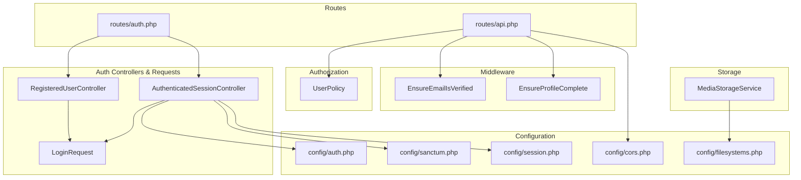
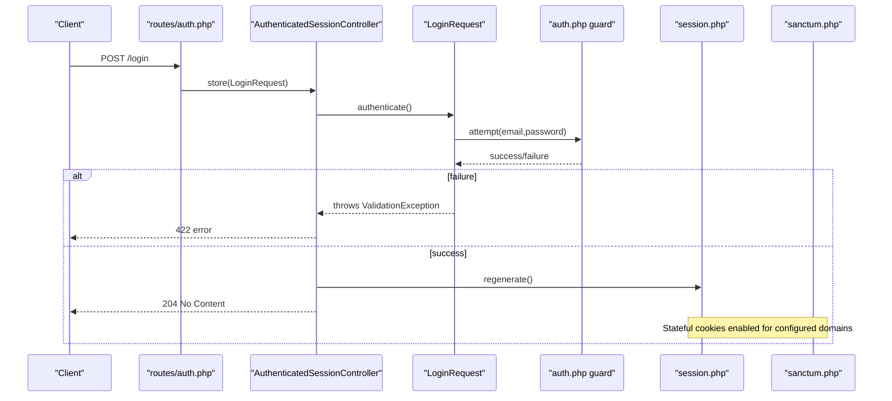
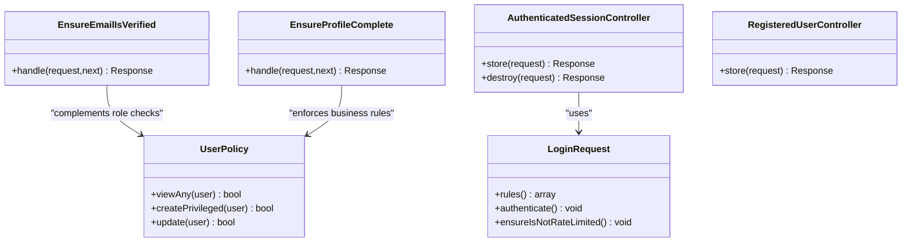
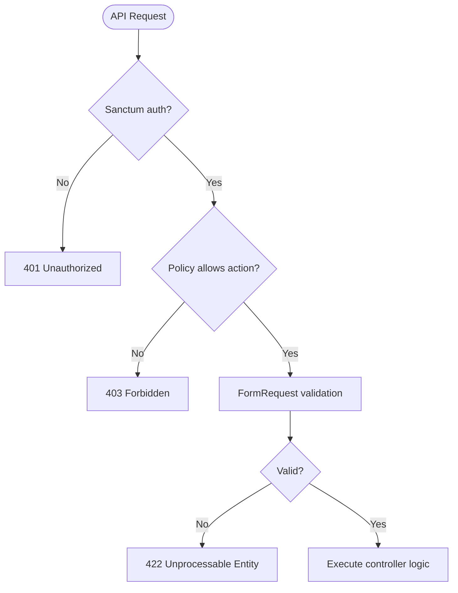
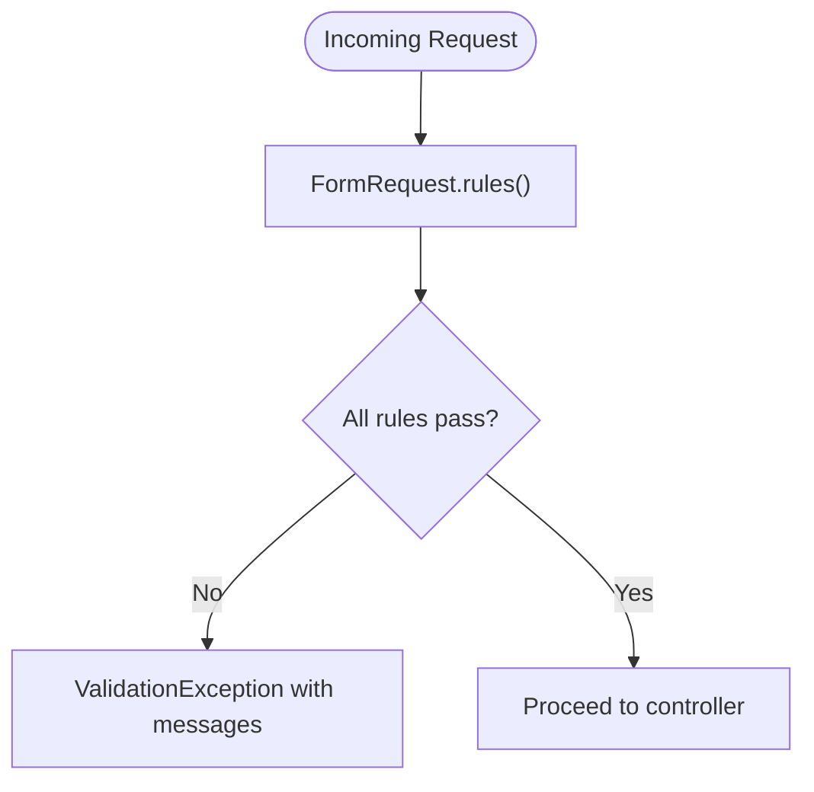
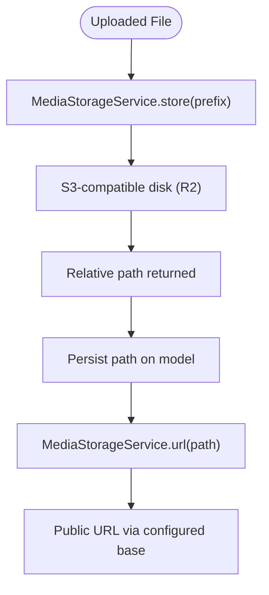
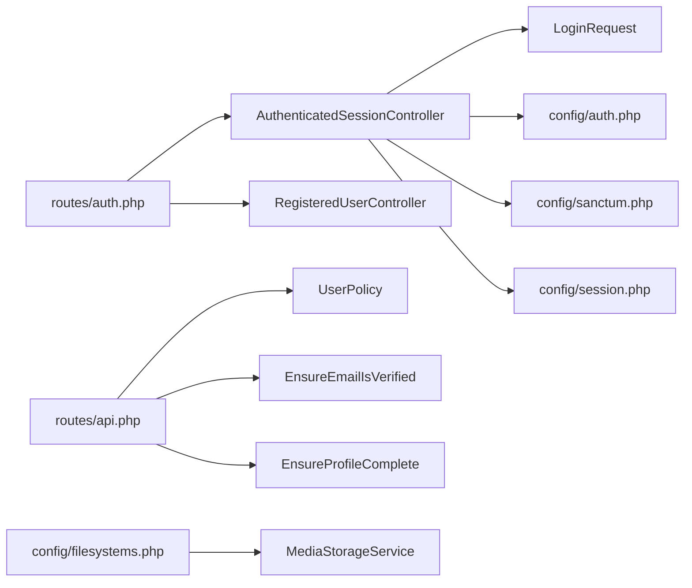

# Security Considerations

<cite>
**Referenced Files in This Document**
- [config/sanctum.php](file://config/sanctum.php)
- [config/auth.php](file://config/auth.php)
- [config/cors.php](file://config/cors.php)
- [config/session.php](file://config/session.php)
- [config/filesystems.php](file://config/filesystems.php)
- [app/Http/Middleware/EnsureEmailIsVerified.php](file://app/Http/Middleware/EnsureEmailIsVerified.php)
- [app/Http/Middleware/EnsureProfileComplete.php](file://app/Http/Middleware/EnsureProfileComplete.php)
- [app/Http/Controllers/Auth/AuthenticatedSessionController.php](file://app/Http/Controllers/Auth/AuthenticatedSessionController.php)
- [app/Http/Controllers/Auth/RegisteredUserController.php](file://app/Http/Controllers/Auth/RegisteredUserController.php)
- [app/Http/Requests/Auth/LoginRequest.php](file://app/Http/Requests/Auth/LoginRequest.php)
- [app/Policies/UserPolicy.php](file://app/Policies/UserPolicy.php)
- [routes/auth.php](file://routes/auth.php)
- [routes/api.php](file://routes/api.php)
- [app/Services/Storage/MediaStorageService.php](file://app/Services/Storage/MediaStorageService.php)
- [bootstrap/app.php](file://bootstrap/app.php)
</cite>

## Table of Contents
1. Introduction
2. Project Structure
3. Core Components
4. Architecture Overview
5. Detailed Component Analysis
6. Dependency Analysis
7. Performance Considerations
8. Troubleshooting Guide
9. Conclusion
10. Appendices

## Introduction
This document provides comprehensive security guidance for the ResNet Academy LMS. It covers authentication and authorization, data protection, API security, input validation, policy-based access control, middleware configurations, Sanctum setup, session management, CSRF/XSS protections, secure file uploads, and operational practices such as auditing, penetration testing, and incident response. The goal is to help developers and operators understand how the system enforces security and where to focus hardening efforts.

## Project Structure
Security-relevant configuration and code are organized across:
- Configuration files for authentication, sessions, CORS, and storage
- Authentication controllers and request classes for login/logout and registration
- Middleware for email verification and profile completion enforcement
- Policy classes for role-based authorization
- Route definitions that gate endpoints with auth and policies
- A centralized media storage service for secure upload handling

**Diagram sources**
- [config/auth.php:1-118](file://config/auth.php#L1-L118)
- [config/sanctum.php:1-88](file://config/sanctum.php#L1-L88)
- [config/session.php:1-218](file://config/session.php#L1-L218)
- [config/cors.php:1-39](file://config/cors.php#L1-L39)
- [config/filesystems.php:1-106](file://config/filesystems.php#L1-L106)
- [app/Http/Controllers/Auth/AuthenticatedSessionController.php:1-43](file://app/Http/Controllers/Auth/AuthenticatedSessionController.php#L1-L43)
- [app/Http/Controllers/Auth/RegisteredUserController.php:1-48](file://app/Http/Controllers/Auth/RegisteredUserController.php#L1-L48)
- [app/Http/Requests/Auth/LoginRequest.php:1-89](file://app/Http/Requests/Auth/LoginRequest.php#L1-L89)
- [app/Http/Middleware/EnsureEmailIsVerified.php:1-28](file://app/Http/Middleware/EnsureEmailIsVerified.php#L1-L28)
- [app/Http/Middleware/EnsureProfileComplete.php:1-60](file://app/Http/Middleware/EnsureProfileComplete.php#L1-L60)
- [app/Policies/UserPolicy.php:1-31](file://app/Policies/UserPolicy.php#L1-L31)
- [routes/auth.php:1-38](file://routes/auth.php#L1-L38)
- [routes/api.php:1-243](file://routes/api.php#L1-L243)
- [app/Services/Storage/MediaStorageService.php:1-86](file://app/Services/Storage/MediaStorageService.php#L1-L86)

**Section sources**
- [config/auth.php:1-118](file://config/auth.php#L1-L118)
- [config/sanctum.php:1-88](file://config/sanctum.php#L1-L88)
- [config/session.php:1-218](file://config/session.php#L1-L218)
- [config/cors.php:1-39](file://config/cors.php#L1-L39)
- [config/filesystems.php:1-106](file://config/filesystems.php#L1-L106)
- [routes/auth.php:1-38](file://routes/auth.php#L1-L38)
- [routes/api.php:1-243](file://routes/api.php#L1-L243)

## Core Components
- Authentication guards and providers define session-based web authentication backed by Eloquent.
- Sanctum is configured for stateful SPA cookies and supports token prefixing; it references session encryption and CSRF validation middleware.
- Session configuration uses database driver, configurable lifetime, cookie flags (secure, http_only, same_site), and optional partitioned cookies.
- CORS allows credentials and restricts allowed origins via environment variables.
- Filesystem disks include local/public and an S3-compatible disk for Cloudflare R2 used by a centralized storage service.
- Auth controllers implement login/logout with session regeneration and logout invalidation.
- Registration validates inputs, hashes passwords, assigns student role, triggers events, and logs in the user.
- Login requests enforce rate limiting and lockout handling.
- Middleware ensures verified email and complete profiles before sensitive actions.
- Policies enforce admin-only operations on privileged user management.
- Routes apply guest/auth middleware and Sanctum guards to protect endpoints.

**Section sources**
- [config/auth.php:18-74](file://config/auth.php#L18-L74)
- [config/sanctum.php:21-85](file://config/sanctum.php#L21-L85)
- [config/session.php:21-215](file://config/session.php#L21-L215)
- [config/cors.php:18-36](file://config/cors.php#L18-L36)
- [config/filesystems.php:31-86](file://config/filesystems.php#L31-L86)
- [app/Http/Controllers/Auth/AuthenticatedSessionController.php:15-41](file://app/Http/Controllers/Auth/AuthenticatedSessionController.php#L15-L41)
- [app/Http/Controllers/Auth/RegisteredUserController.php:20-46](file://app/Http/Controllers/Auth/RegisteredUserController.php#L20-L46)
- [app/Http/Requests/Auth/LoginRequest.php:30-87](file://app/Http/Requests/Auth/LoginRequest.php#L30-L87)
- [app/Http/Middleware/EnsureEmailIsVerified.php:17-26](file://app/Http/Middleware/EnsureEmailIsVerified.php#L17-L26)
- [app/Http/Middleware/EnsureProfileComplete.php:42-57](file://app/Http/Middleware/EnsureProfileComplete.php#L42-L57)
- [app/Policies/UserPolicy.php:12-29](file://app/Policies/UserPolicy.php#L12-L29)
- [routes/auth.php:11-37](file://routes/auth.php#L11-L37)
- [routes/api.php:49-241](file://routes/api.php#L49-L241)

## Architecture Overview
The application secures both web and API flows:
- Web routes use session-based auth with guest/auth middleware and CSRF protection via Sanctum’s referenced middleware.
- API routes under v1 require Sanctum authentication; many write endpoints are further protected by policies and custom middleware.
- Input validation is enforced through FormRequest classes and controller-level validation.
- Storage operations go through a single service that abstracts disk usage and URL resolution.

**Diagram sources**
- [routes/auth.php:15-17](file://routes/auth.php#L15-L17)
- [app/Http/Controllers/Auth/AuthenticatedSessionController.php:18-27](file://app/Http/Controllers/Auth/AuthenticatedSessionController.php#L18-L27)
- [app/Http/Requests/Auth/LoginRequest.php:43-56](file://app/Http/Requests/Auth/LoginRequest.php#L43-L56)
- [config/auth.php:40-45](file://config/auth.php#L40-L45)
- [config/session.php:21-37](file://config/session.php#L21-L37)
- [config/sanctum.php:21-26](file://config/sanctum.php#L21-L26)

**Section sources**
- [routes/auth.php:11-37](file://routes/auth.php#L11-L37)
- [routes/api.php:49-241](file://routes/api.php#L49-L241)
- [config/sanctum.php:21-85](file://config/sanctum.php#L21-L85)
- [config/session.php:21-215](file://config/session.php#L21-L215)

## Detailed Component Analysis

### Authentication and Authorization
- Web authentication uses the session guard with Eloquent provider. Password reset tokens have expiration and throttling configured.
- Sanctum is configured for stateful SPA cookies and references session encryption and CSRF validation middleware. Token prefixing can be set via environment.
- API routes under v1 are protected by Sanctum middleware; some endpoints additionally require verified email or complete profile via middleware.
- Role-based authorization is enforced via policies; privileged user creation and updates are restricted to admins.

**Diagram sources**
- [app/Policies/UserPolicy.php:12-29](file://app/Policies/UserPolicy.php#L12-L29)
- [app/Http/Middleware/EnsureEmailIsVerified.php:17-26](file://app/Http/Middleware/EnsureEmailIsVerified.php#L17-L26)
- [app/Http/Middleware/EnsureProfileComplete.php:42-57](file://app/Http/Middleware/EnsureProfileComplete.php#L42-L57)
- [app/Http/Controllers/Auth/AuthenticatedSessionController.php:18-41](file://app/Http/Controllers/Auth/AuthenticatedSessionController.php#L18-L41)
- [app/Http/Controllers/Auth/RegisteredUserController.php:26-46](file://app/Http/Controllers/Auth/RegisteredUserController.php#L26-L46)
- [app/Http/Requests/Auth/LoginRequest.php:30-87](file://app/Http/Requests/Auth/LoginRequest.php#L30-L87)

**Section sources**
- [config/auth.php:18-116](file://config/auth.php#L18-L116)
- [config/sanctum.php:21-85](file://config/sanctum.php#L21-L85)
- [routes/api.php:68-241](file://routes/api.php#L68-L241)
- [app/Policies/UserPolicy.php:12-29](file://app/Policies/UserPolicy.php#L12-L29)

### API Security Practices
- All API routes are namespaced under v1 and protected by Sanctum middleware for authenticated access.
- Public read endpoints exist for catalogue and certificate verification; writes require authentication and often additional policy checks.
- Rate limiting is applied to sensitive endpoints like email verification and notification resend.

**Diagram sources**
- [routes/api.php:49-241](file://routes/api.php#L49-L241)
- [app/Http/Requests/Auth/LoginRequest.php:30-87](file://app/Http/Requests/Auth/LoginRequest.php#L30-L87)

**Section sources**
- [routes/api.php:49-241](file://routes/api.php#L49-L241)

### Data Protection Measures
- Passwords are hashed using framework defaults during registration.
- Session cookies support secure flag, http_only, and same_site settings to mitigate interception and CSRF risks.
- CORS is configured to allow credentials and restrict origins to known frontend URLs.
- Storage uses an S3-compatible disk for object storage; local disks are available for private/public assets.

**Section sources**
- [config/session.php:172-202](file://config/session.php#L172-L202)
- [config/cors.php:22-36](file://config/cors.php#L22-L36)
- [config/filesystems.php:31-86](file://config/filesystems.php#L31-L86)
- [app/Http/Controllers/Auth/RegisteredUserController.php:28-46](file://app/Http/Controllers/Auth/RegisteredUserController.php#L28-L46)

### Input Validation Strategies
- Login requests validate email/password and enforce rate limiting with lockout events.
- Registration validates name, email uniqueness, and password strength with confirmation.
- Feature-specific requests enforce domain constraints (e.g., course application answers length, portfolio URL format).

**Diagram sources**
- [app/Http/Requests/Auth/LoginRequest.php:30-87](file://app/Http/Requests/Auth/LoginRequest.php#L30-L87)
- [app/Http/Controllers/Auth/RegisteredUserController.php:28-46](file://app/Http/Controllers/Auth/RegisteredUserController.php#L28-L46)

**Section sources**
- [app/Http/Requests/Auth/LoginRequest.php:30-87](file://app/Http/Requests/Auth/LoginRequest.php#L30-L87)
- [app/Http/Controllers/Auth/RegisteredUserController.php:28-46](file://app/Http/Controllers/Auth/RegisteredUserController.php#L28-L46)

### Policy-Based Authorization System
- Admin-only operations are enforced via policies for privileged user management.
- Additional policies exist across the application to govern resource-level permissions (not detailed here).

**Section sources**
- [app/Policies/UserPolicy.php:12-29](file://app/Policies/UserPolicy.php#L12-L29)

### Middleware Security Configurations
- Email verification middleware blocks unverified users from protected routes.
- Profile completion middleware enforces business requirements before allowing sensitive actions.
- Sanctum configuration references session encryption and CSRF validation middleware for stateful SPAs.

**Section sources**
- [app/Http/Middleware/EnsureEmailIsVerified.php:17-26](file://app/Http/Middleware/EnsureEmailIsVerified.php#L17-L26)
- [app/Http/Middleware/EnsureProfileComplete.php:42-57](file://app/Http/Middleware/EnsureProfileComplete.php#L42-L57)
- [config/sanctum.php:81-85](file://config/sanctum.php#L81-L85)

### Sanctum Authentication Setup
- Sanctum is configured for stateful domains derived from environment and current app URL.
- The web guard is used for session-based authentication; token expiration is not enforced when null.
- Token prefixing is supported to aid secret scanning tools.

**Section sources**
- [config/sanctum.php:21-68](file://config/sanctum.php#L21-L68)

### Session Management
- Sessions are stored in the database by default with configurable lifetime and cookie attributes.
- Logout invalidates the session and regenerates the CSRF token to prevent reuse.

**Section sources**
- [config/session.php:21-215](file://config/session.php#L21-L215)
- [app/Http/Controllers/Auth/AuthenticatedSessionController.php:32-41](file://app/Http/Controllers/Auth/AuthenticatedSessionController.php#L32-L41)

### CSRF Protection
- CSRF validation is included in Sanctum’s middleware stack for stateful requests.
- Logout regenerates the token to mitigate replay attacks.

**Section sources**
- [config/sanctum.php:81-85](file://config/sanctum.php#L81-L85)
- [app/Http/Controllers/Auth/AuthenticatedSessionController.php:36-39](file://app/Http/Controllers/Auth/AuthenticatedSessionController.php#L36-L39)

### XSS Prevention
- Frontend sanitization is implemented for lesson content rendering using a narrow allowlist and link hardening.
- Backend does not directly render HTML; content is validated and stored, then sanitized at render time.

**Section sources**
- [frontend/src/features/learning/LessonRenderer.tsx:61-99](file://frontend/src/features/learning/LessonRenderer.tsx#L61-L99)

### Secure File Uploads
- All uploads route through a centralized storage service that stores to an S3-compatible disk and resolves public URLs safely.
- External URLs are passed through without deletion or modification; only owned relative paths are managed.

**Diagram sources**
- [app/Services/Storage/MediaStorageService.php:32-79](file://app/Services/Storage/MediaStorageService.php#L32-L79)
- [config/filesystems.php:75-86](file://config/filesystems.php#L75-L86)

**Section sources**
- [app/Services/Storage/MediaStorageService.php:11-84](file://app/Services/Storage/MediaStorageService.php#L11-L84)
- [config/filesystems.php:31-86](file://config/filesystems.php#L31-L86)

### Compliance and Auditing
- Audit logging infrastructure exists; sensitive mutations should be logged for compliance.
- Frontend utilities describe audit log entries for human-readable reporting.

**Section sources**
- [frontend/src/lib/auditLog.ts:85-100](file://frontend/src/lib/auditLog.ts#L85-L100)

## Dependency Analysis
Authentication and authorization dependencies flow from routes through controllers, requests, middleware, policies, and configuration.

**Diagram sources**
- [routes/auth.php:11-37](file://routes/auth.php#L11-L37)
- [routes/api.php:68-241](file://routes/api.php#L68-L241)
- [app/Http/Controllers/Auth/AuthenticatedSessionController.php:18-41](file://app/Http/Controllers/Auth/AuthenticatedSessionController.php#L18-L41)
- [app/Http/Controllers/Auth/RegisteredUserController.php:26-46](file://app/Http/Controllers/Auth/RegisteredUserController.php#L26-L46)
- [app/Http/Requests/Auth/LoginRequest.php:30-87](file://app/Http/Requests/Auth/LoginRequest.php#L30-L87)
- [config/auth.php:40-45](file://config/auth.php#L40-L45)
- [config/sanctum.php:21-85](file://config/sanctum.php#L21-L85)
- [config/session.php:21-215](file://config/session.php#L21-L215)
- [app/Policies/UserPolicy.php:12-29](file://app/Policies/UserPolicy.php#L12-L29)
- [app/Http/Middleware/EnsureEmailIsVerified.php:17-26](file://app/Http/Middleware/EnsureEmailIsVerified.php#L17-L26)
- [app/Http/Middleware/EnsureProfileComplete.php:42-57](file://app/Http/Middleware/EnsureProfileComplete.php#L42-L57)
- [config/filesystems.php:75-86](file://config/filesystems.php#L75-L86)
- [app/Services/Storage/MediaStorageService.php:32-79](file://app/Services/Storage/MediaStorageService.php#L32-L79)

**Section sources**
- [routes/auth.php:11-37](file://routes/auth.php#L11-L37)
- [routes/api.php:68-241](file://routes/api.php#L68-L241)
- [config/auth.php:40-45](file://config/auth.php#L40-L45)
- [config/sanctum.php:21-85](file://config/sanctum.php#L21-L85)
- [config/session.php:21-215](file://config/session.php#L21-L215)
- [config/filesystems.php:75-86](file://config/filesystems.php#L75-L86)

## Performance Considerations
- Rate limiting on login attempts prevents brute-force attacks and reduces server load.
- Database-backed sessions scale better than file-based sessions in multi-instance deployments.
- Object storage offloads large files from application servers, improving performance and reliability.

[No sources needed since this section provides general guidance]

## Troubleshooting Guide
- If login fails repeatedly, check rate limiting and lockout behavior in the login request handler.
- If protected routes return 403, verify policy checks and middleware conditions (email verified, profile complete).
- For session-related issues, review session driver, cookie flags, and Sanctum stateful domains.
- For CORS errors, ensure allowed origins match the frontend URL and credentials are supported.

**Section sources**
- [app/Http/Requests/Auth/LoginRequest.php:63-87](file://app/Http/Requests/Auth/LoginRequest.php#L63-L87)
- [app/Http/Middleware/EnsureEmailIsVerified.php:17-26](file://app/Http/Middleware/EnsureEmailIsVerified.php#L17-L26)
- [app/Http/Middleware/EnsureProfileComplete.php:42-57](file://app/Http/Middleware/EnsureProfileComplete.php#L42-L57)
- [config/session.php:172-202](file://config/session.php#L172-L202)
- [config/sanctum.php:21-26](file://config/sanctum.php#L21-L26)
- [config/cors.php:22-36](file://config/cors.php#L22-L36)

## Conclusion
ResNet Academy LMS employs a layered security approach: robust authentication via session and Sanctum, strict input validation, policy-based authorization, secure session and CORS configuration, and centralized file storage. These measures collectively mitigate common threats such as unauthorized access, CSRF, XSS, and insecure uploads. Ongoing audits, penetration testing, and incident response planning will further strengthen the system’s resilience.

[No sources needed since this section summarizes without analyzing specific files]

## Appendices

### Security Best Practices Checklist
- Enforce HTTPS and secure session cookies in production.
- Restrict CORS origins to known frontends and enable credentials only when necessary.
- Use rate limiting on authentication and sensitive endpoints.
- Apply policy checks for all privileged operations.
- Centralize file uploads and sanitize content at render time.
- Log sensitive mutations for auditability.

[No sources needed since this section provides general guidance]

### Penetration Testing Guidance
- Focus on authentication bypass, privilege escalation, and policy enforcement gaps.
- Test CSRF protection on stateful endpoints and session fixation scenarios.
- Validate input validation boundaries and file upload restrictions.
- Inspect CORS misconfigurations and credential leakage risks.

[No sources needed since this section provides general guidance]

### Incident Response Procedures
- Detect anomalies via audit logs and error responses.
- Isolate affected accounts or endpoints quickly.
- Rotate secrets and revoke tokens if compromised.
- Review and update policies/middleware based on findings.

[No sources needed since this section provides general guidance]