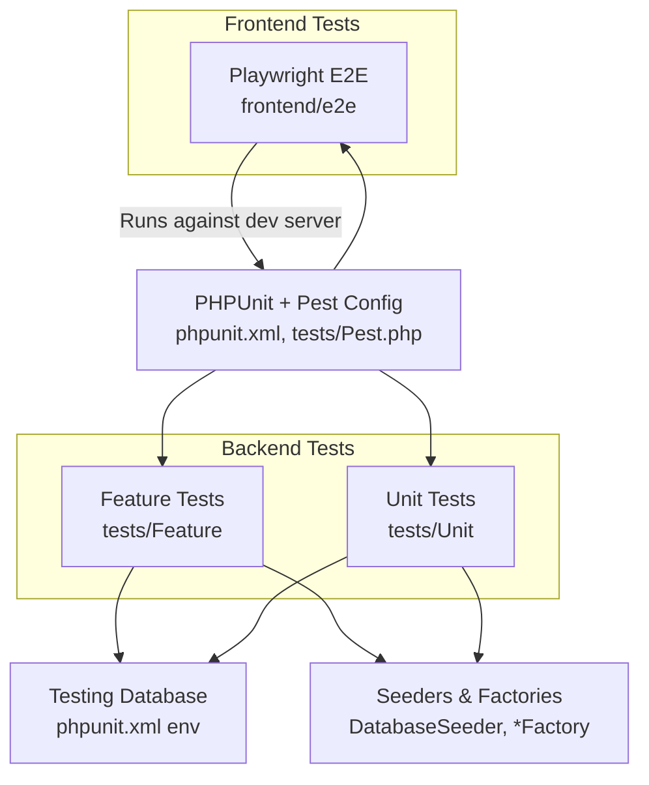
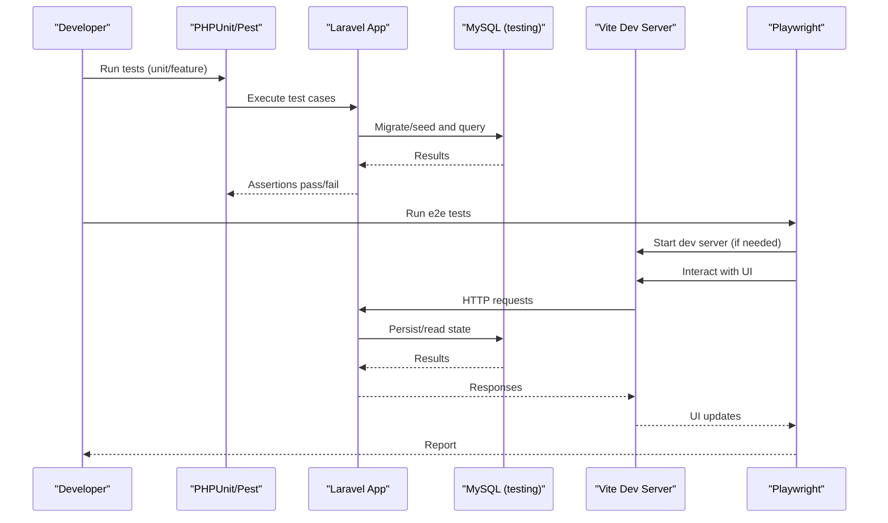
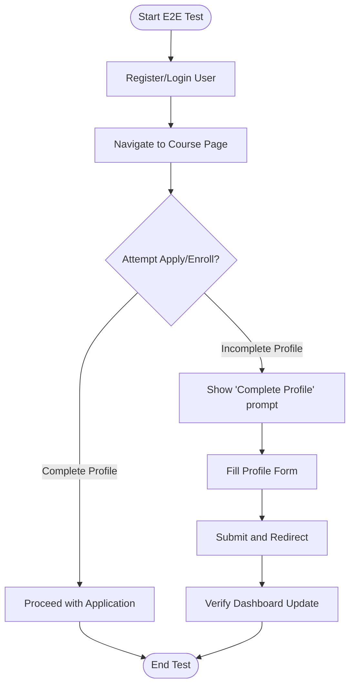
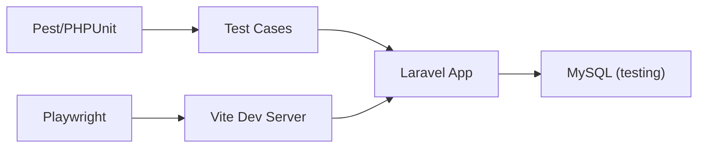

# Testing Strategy

<cite>
**Referenced Files in This Document**
- [phpunit.xml](file://phpunit.xml)
- [tests/TestCase.php](file://tests/TestCase.php)
- [tests/Pest.php](file://tests/Pest.php)
- [database/factories/UserFactory.php](file://database/factories/UserFactory.php)
- [database/seeders/DatabaseSeeder.php](file://database/seeders/DatabaseSeeder.php)
- [tests/Feature/Auth/AuthenticationTest.php](file://tests/Feature/Auth/AuthenticationTest.php)
- [tests/Feature/Assessment/AssignmentTest.php](file://tests/Feature/Assessment/AssignmentTest.php)
- [tests/Unit/Models/CourseSectionTest.php](file://tests/Unit/Models/CourseSectionTest.php)
- [tests/Unit/Services/Profile/ProfileServiceTest.php](file://tests/Unit/Services/Profile/ProfileServiceTest.php)
- [frontend/playwright.config.ts](file://frontend/playwright.config.ts)
- [frontend/e2e/profile-completion.spec.ts](file://frontend/e2e/profile-completion.spec.ts)
</cite>

## Table of Contents
1. [Introduction](#introduction)
2. [Project Structure](#project-structure)
3. [Core Components](#core-components)
4. [Architecture Overview](#architecture-overview)
5. [Detailed Component Analysis](#detailed-component-analysis)
6. [Dependency Analysis](#dependency-analysis)
7. [Performance Considerations](#performance-considerations)
8. [Troubleshooting Guide](#troubleshooting-guide)
9. [Conclusion](#conclusion)
10. [Appendices](#appendices)

## Introduction
This document explains the testing strategy for the ResNet Academy LMS across unit, feature, and end-to-end layers. It covers how tests are organized, how to write effective tests for controllers, services, models, and frontend components, and how to manage test data using factories and seeders. It also outlines mocking strategies, continuous integration considerations, and performance testing guidance tailored to this codebase.

## Project Structure
The repository uses a layered testing approach:
- Unit tests under tests/Unit for isolated logic (models, services, HTTP requests/middleware).
- Feature tests under tests/Feature for API endpoints and business workflows.
- End-to-end tests under frontend/e2e using Playwright for user interaction flows.
- Test configuration via PHPUnit and Pest, with environment settings for a dedicated testing database.
- Frontend E2E configured via Playwright with a local dev server managed by the test runner.

**Diagram sources**
- [phpunit.xml:1-41](file://phpunit.xml#L1-L41)
- [tests/Pest.php:1-30](file://tests/Pest.php#L1-L30)
- [database/seeders/DatabaseSeeder.php:1-136](file://database/seeders/DatabaseSeeder.php#L1-L136)
- [database/factories/UserFactory.php:1-79](file://database/factories/UserFactory.php#L1-L79)
- [frontend/playwright.config.ts:1-49](file://frontend/playwright.config.ts#L1-L49)

**Section sources**
- [phpunit.xml:1-41](file://phpunit.xml#L1-L41)
- [tests/Pest.php:1-30](file://tests/Pest.php#L1-L30)

## Core Components
- Test base class and extensions: TestCase provides the foundation; Pest extends it per directory and enables RefreshDatabase for feature tests.
- Environment and suites: phpunit.xml defines Unit and Feature suites and sets a dedicated MySQL database for tests.
- Data generation: Factories create realistic entities; seeders build comprehensive datasets for complex scenarios.
- E2E runtime: Playwright config runs the Vite dev server and executes browser-based tests against the running application.

Key responsibilities:
- Isolation: Each test runs against a fresh in-memory or transactional database state where applicable.
- Realism: Seeders provide rich relational data for feature tests that span multiple domains.
- Stability: Playwright retries on CI and captures traces on first retry for debugging.

**Section sources**
- [tests/TestCase.php:1-11](file://tests/TestCase.php#L1-L11)
- [tests/Pest.php:1-30](file://tests/Pest.php#L1-L30)
- [phpunit.xml:1-41](file://phpunit.xml#L1-L41)
- [database/seeders/DatabaseSeeder.php:1-136](file://database/seeders/DatabaseSeeder.php#L1-L136)
- [database/factories/UserFactory.php:1-79](file://database/factories/UserFactory.php#L1-L79)
- [frontend/playwright.config.ts:1-49](file://frontend/playwright.config.ts#L1-L49)

## Architecture Overview
The testing architecture spans three layers:

**Diagram sources**
- [phpunit.xml:1-41](file://phpunit.xml#L1-L41)
- [tests/Pest.php:1-30](file://tests/Pest.php#L1-L30)
- [frontend/playwright.config.ts:1-49](file://frontend/playwright.config.ts#L1-L49)

## Detailed Component Analysis

### Unit Testing with PHPUnit/Pest
- Organization: Unit tests live under tests/Unit, grouped by domain (Models, Services, Http).
- Execution: Pest extends TestCase for Unit scope without RefreshDatabase by default; use explicit traits when needed.
- Example patterns:
  - Model behavior validation (relationships, casts, enums, computed methods).
  - Service logic verification (pure functions, calculations, stateless helpers).
  - Request validation and middleware behavior.

Best practices:
- Keep tests deterministic and fast; avoid heavy I/O.
- Use factories to construct minimal valid objects.
- Assert both positive and negative paths.

**Section sources**
- [tests/Unit/Models/CourseSectionTest.php:1-122](file://tests/Unit/Models/CourseSectionTest.php#L1-L122)
- [tests/Unit/Services/Profile/ProfileServiceTest.php:1-568](file://tests/Unit/Services/Profile/ProfileServiceTest.php#L1-L568)

### Feature Testing API Endpoints and Business Logic
- Organization: Feature tests under tests/Feature mirror functional areas (Auth, Assessment, Enrolment, etc.).
- Execution: Pest extends TestCase with RefreshDatabase for Feature scope to ensure isolation.
- Examples:
  - Authentication flow assertions (login/logout, last login update).
  - Authorization checks (admin vs instructor vs student).
  - CRUD operations with database assertions.

Mocking strategies:
- For external services or slow dependencies, prefer isolating via service boundaries and asserting outcomes rather than deep mocks.
- When necessary, use Laravel’s built-in mocking facilities (e.g., fake queues, events, mailers) to keep tests fast and reliable.

Data management:
- Use factories to create users, courses, modules, assignments.
- Use seeders for complex multi-entity scenarios when feature tests require rich context.

**Section sources**
- [tests/Feature/Auth/AuthenticationTest.php:1-50](file://tests/Feature/Auth/AuthenticationTest.php#L1-L50)
- [tests/Feature/Assessment/AssignmentTest.php:1-89](file://tests/Feature/Assessment/AssignmentTest.php#L1-L89)
- [database/factories/UserFactory.php:1-79](file://database/factories/UserFactory.php#L1-L79)
- [database/seeders/DatabaseSeeder.php:1-136](file://database/seeders/DatabaseSeeder.php#L1-L136)

### End-to-End Testing with Playwright
- Configuration: Playwright runs against a Vite dev server at http://localhost:5173, with parallel execution locally and controlled concurrency on CI.
- Test structure: Scenarios cover registration/login, profile completion, validation, navigation, and guards.
- Reliability: Retries on CI, trace capture on first retry, and explicit waits for navigations and network responses.

Example coverage:
- New user sees profile completion card and progress indicators.
- Form validation errors surface correctly.
- Successful submission updates profile and redirects.
- Application guard blocks incomplete profiles and allows complete ones.
- Return-to-context flow after completing profile from a blocked action.

**Diagram sources**
- [frontend/e2e/profile-completion.spec.ts:1-442](file://frontend/e2e/profile-completion.spec.ts#L1-L442)
- [frontend/playwright.config.ts:1-49](file://frontend/playwright.config.ts#L1-L49)

**Section sources**
- [frontend/playwright.config.ts:1-49](file://frontend/playwright.config.ts#L1-L49)
- [frontend/e2e/profile-completion.spec.ts:1-442](file://frontend/e2e/profile-completion.spec.ts#L1-L442)

### Test Data Management: Factories and Seeders
- Factories: Provide concise builders for single entities with sensible defaults and role/state modifiers (e.g., admin, instructor, student, unverified, incompleteProfile).
- Seeders: Build realistic, interconnected datasets across many tables for feature tests requiring rich context (courses, modules, resources, assignments, evaluations, messages, tickets, forums).

Guidelines:
- Prefer factories for simple, focused tests.
- Use seeders when tests depend on multiple related records or when you need consistent baseline data.
- Avoid over-seeding in unit tests; keep them lean and fast.

**Section sources**
- [database/factories/UserFactory.php:1-79](file://database/factories/UserFactory.php#L1-L79)
- [database/seeders/DatabaseSeeder.php:1-136](file://database/seeders/DatabaseSeeder.php#L1-L136)

### Writing Effective Tests: Controllers, Services, Models, Frontend Components
- Controllers/API:
  - Assert status codes, JSON shape, and side effects (database changes, queued jobs, notifications).
  - Cover authorization paths (roles, policies) and input validation failures.
  - Reference examples: authentication and assignment creation/deletion flows.
- Services:
  - Focus on pure logic and state transitions; assert outputs and side effects deterministically.
  - Use property-based or randomized inputs to stress edge conditions.
- Models:
  - Validate relationships, casts, accessors/mutators, and computed methods.
  - Ensure enum casting and date handling behave as expected.
- Frontend Components:
  - Use Playwright to assert visible UI states, form validations, and navigation flows.
  - Leverage semantic selectors and roles for robustness.

**Section sources**
- [tests/Feature/Auth/AuthenticationTest.php:1-50](file://tests/Feature/Auth/AuthenticationTest.php#L1-L50)
- [tests/Feature/Assessment/AssignmentTest.php:1-89](file://tests/Feature/Assessment/AssignmentTest.php#L1-L89)
- [tests/Unit/Models/CourseSectionTest.php:1-122](file://tests/Unit/Models/CourseSectionTest.php#L1-L122)
- [tests/Unit/Services/Profile/ProfileServiceTest.php:1-568](file://tests/Unit/Services/Profile/ProfileServiceTest.php#L1-L568)
- [frontend/e2e/profile-completion.spec.ts:1-442](file://frontend/e2e/profile-completion.spec.ts#L1-L442)

## Dependency Analysis
Tests rely on:
- PHPUnit/Pest for orchestration and assertions.
- Laravel’s testing utilities (RefreshDatabase, request helpers, auth helpers).
- MySQL for persistent state during tests.
- Playwright for browser automation against the running frontend.

**Diagram sources**
- [phpunit.xml:1-41](file://phpunit.xml#L1-L41)
- [tests/Pest.php:1-30](file://tests/Pest.php#L1-L30)
- [frontend/playwright.config.ts:1-49](file://frontend/playwright.config.ts#L1-L49)

**Section sources**
- [phpunit.xml:1-41](file://phpunit.xml#L1-L41)
- [tests/Pest.php:1-30](file://tests/Pest.php#L1-L30)
- [frontend/playwright.config.ts:1-49](file://frontend/playwright.config.ts#L1-L49)

## Performance Considerations
- Keep unit tests fast and isolated; avoid unnecessary DB calls unless required.
- Use RefreshDatabase judiciously; consider transactions or SQLite in-memory for speed if compatible.
- Limit seeder usage in feature tests to only what is needed; prefer targeted factories.
- For E2E:
  - Run tests in parallel locally; limit workers on CI to reduce flakiness.
  - Use retries and traces to diagnose intermittent issues.
  - Minimize sleeps; rely on explicit waits and assertions.

[No sources needed since this section provides general guidance]

## Troubleshooting Guide
Common issues and remedies:
- Database connectivity: Ensure phpunit.xml points to a reachable MySQL instance and credentials are correct.
- Missing migrations: Confirm migrations run before tests; Pest’s RefreshDatabase handles this for Feature tests.
- Flaky E2E tests: Increase timeouts, add explicit waits, and enable trace collection on first retry.
- File uploads in tests: Use a real minimal image helper to satisfy strict MIME checks instead of relying on GD-dependent fakes.

**Section sources**
- [phpunit.xml:20-39](file://phpunit.xml#L20-L39)
- [tests/Pest.php:16-29](file://tests/Pest.php#L16-L29)
- [frontend/playwright.config.ts:24-47](file://frontend/playwright.config.ts#L24-L47)

## Conclusion
The ResNet Academy LMS employs a comprehensive, layered testing strategy:
- Unit tests validate core logic and model behavior.
- Feature tests verify API contracts, authorization, and business workflows with realistic data.
- Playwright E2E tests ensure end-user journeys work as intended across the full stack.
By combining factories, seeders, and robust configurations, the suite balances reliability, speed, and coverage. Adopt the best practices outlined here to maintain high-quality, maintainable tests as the system evolves.

[No sources needed since this section summarizes without analyzing specific files]

## Appendices

### Running Tests
- Backend:
  - Unit: Run the Unit suite via the test runner configured in phpunit.xml.
  - Feature: Run the Feature suite; RefreshDatabase ensures isolation.
- Frontend:
  - E2E: Playwright starts the Vite dev server automatically and runs browser tests.

**Section sources**
- [phpunit.xml:7-14](file://phpunit.xml#L7-L14)
- [frontend/playwright.config.ts:41-47](file://frontend/playwright.config.ts#L41-L47)

### Continuous Integration Notes
- Enforce forbidOnly on CI to prevent accidental .only usage.
- Use retries and limited workers on CI for stability.
- Capture traces on first retry to aid debugging.

**Section sources**
- [frontend/playwright.config.ts:12-19](file://frontend/playwright.config.ts#L12-L19)