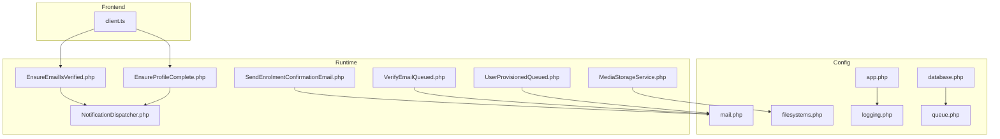
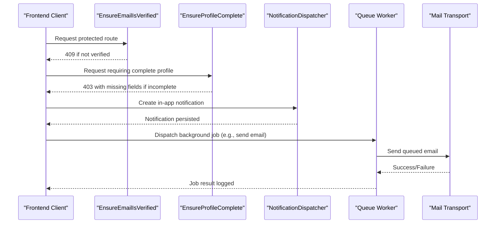
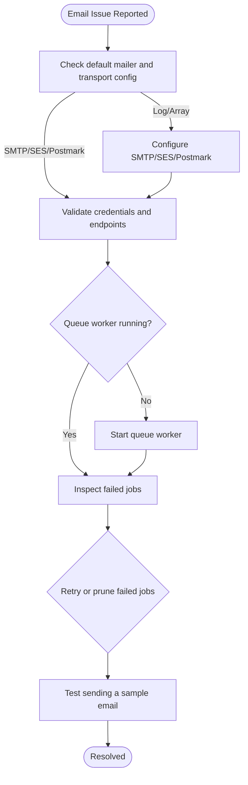
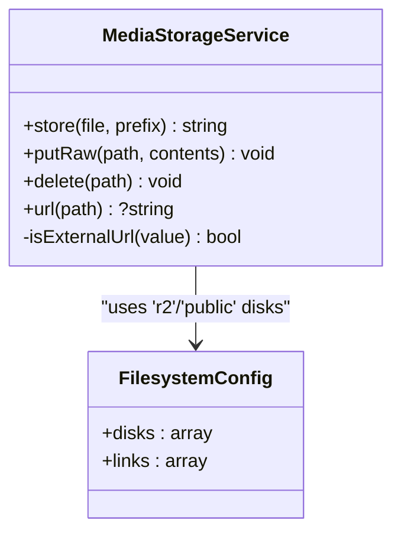
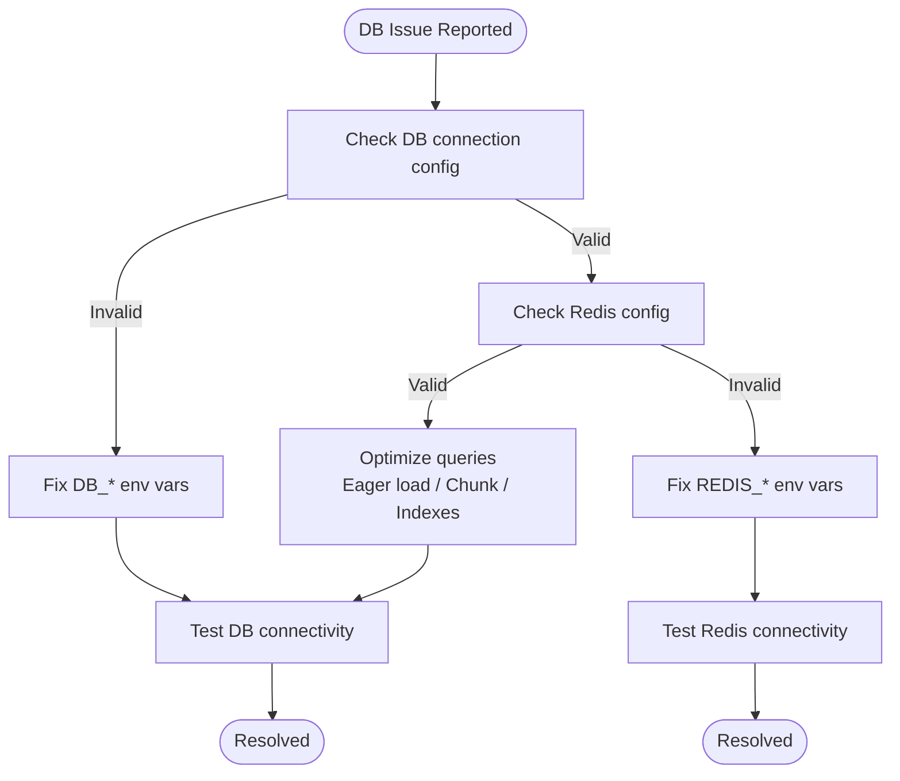
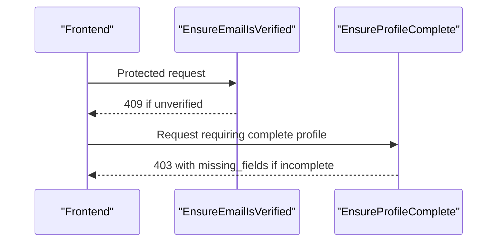
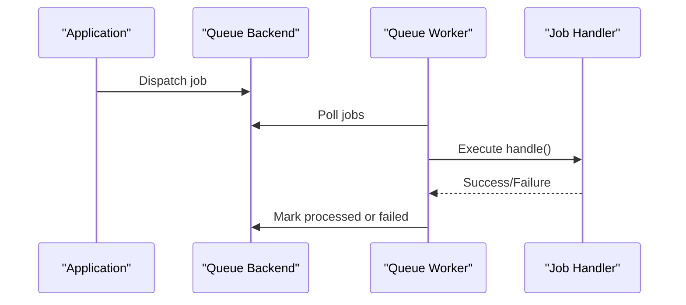
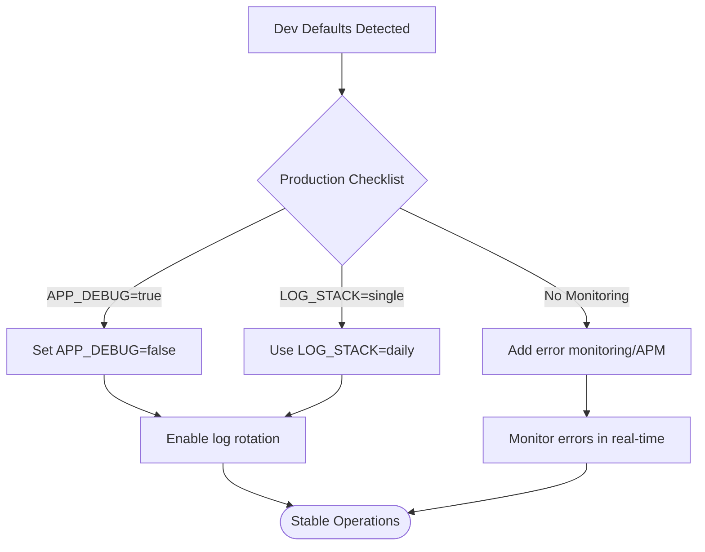
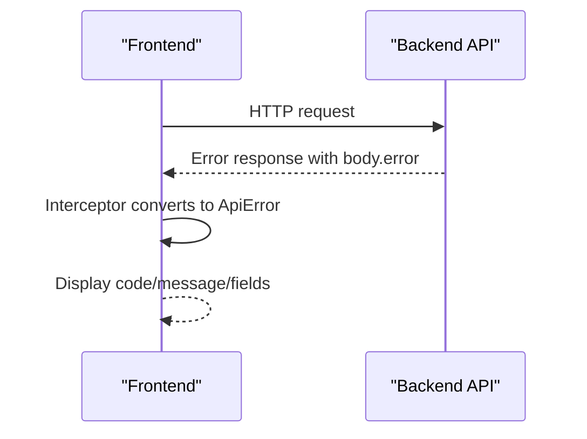
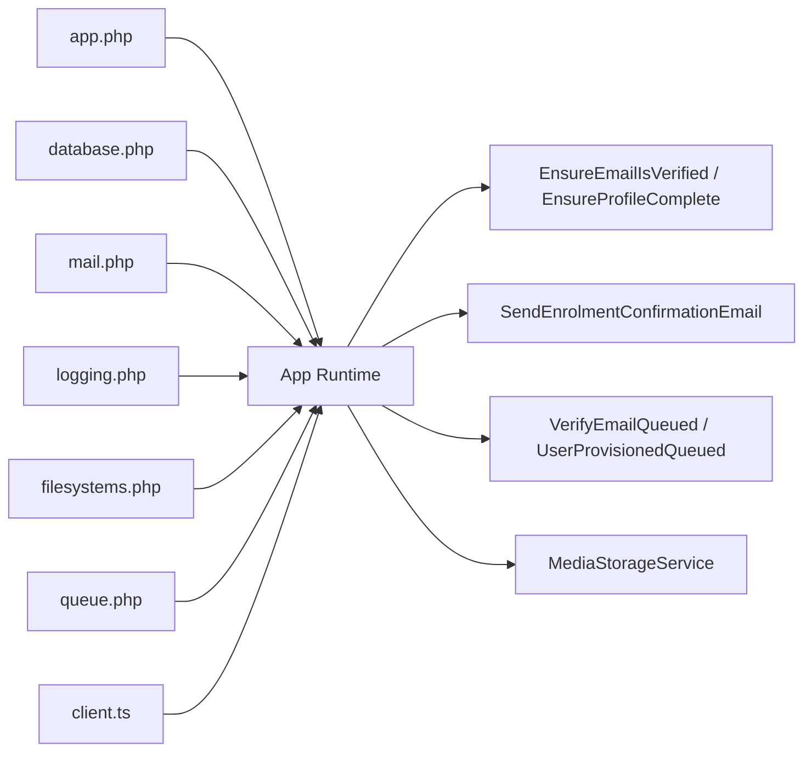

# Troubleshooting & FAQ

<cite>
**Referenced Files in This Document**
- [app.php](file://config/app.php)
- [database.php](file://config/database.php)
- [mail.php](file://config/mail.php)
- [logging.php](file://config/logging.php)
- [filesystems.php](file://config/filesystems.php)
- [queue.php](file://config/queue.php)
- [EnsureEmailIsVerified.php](file://app/Http/Middleware/EnsureEmailIsVerified.php)
- [EnsureProfileComplete.php](file://app/Http/Middleware/EnsureProfileComplete.php)
- [MediaStorageService.php](file://app/Services/Storage/MediaStorageService.php)
- [SendEnrolmentConfirmationEmail.php](file://app/Jobs/SendEnrolmentConfirmationEmail.php)
- [VerifyEmailQueued.php](file://app/Notifications/VerifyEmailQueued.php)
- [UserProvisionedQueued.php](file://app/Notifications/UserProvisionedQueued.php)
- [NotificationDispatcher.php](file://app/Services/Notifications/NotificationDispatcher.php)
- [client.ts](file://frontend/src/lib/api/client.ts)
- [PRODUCTION_READINESS.md](file://PRODUCTION_READINESS.md)
</cite>

## Table of Contents
1. [Introduction](#introduction)
2. [Project Structure](#project-structure)
3. [Core Components](#core-components)
4. [Architecture Overview](#architecture-overview)
5. [Detailed Component Analysis](#detailed-component-analysis)
6. [Dependency Analysis](#dependency-analysis)
7. [Performance Considerations](#performance-considerations)
8. [Troubleshooting Guide](#troubleshooting-guide)
9. [Conclusion](#conclusion)
10. [Appendices](#appendices)

## Introduction
This document provides a comprehensive troubleshooting and FAQ guide for the ResNet Academy LMS. It focuses on common issues, debugging techniques, log analysis, performance diagnostics, database connectivity problems, file upload failures, and email delivery issues. It also includes diagnostic commands, step-by-step error resolution steps, configuration guidance, deployment considerations, escalation procedures, and community support resources.

## Project Structure
The application is a Laravel-based backend with a React frontend. Key areas relevant to troubleshooting include:
- Configuration files for app behavior, logging, mail, queues, filesystems, and database connections
- Middleware that enforces user state (email verification, profile completion)
- Queued jobs and notifications for asynchronous operations
- Centralized storage service for uploads and media URLs
- Frontend API client error handling

**Diagram sources**
- [app.php:1-140](file://config/app.php#L1-L140)
- [database.php:1-185](file://config/database.php#L1-L185)
- [mail.php:1-119](file://config/mail.php#L1-L119)
- [logging.php:1-133](file://config/logging.php#L1-L133)
- [filesystems.php:1-106](file://config/filesystems.php#L1-L106)
- [queue.php:1-130](file://config/queue.php#L1-L130)
- [EnsureEmailIsVerified.php:1-28](file://app/Http/Middleware/EnsureEmailIsVerified.php#L1-L28)
- [EnsureProfileComplete.php:1-60](file://app/Http/Middleware/EnsureProfileComplete.php#L1-L60)
- [MediaStorageService.php:1-85](file://app/Services/Storage/MediaStorageService.php#L1-L85)
- [SendEnrolmentConfirmationEmail.php:1-58](file://app/Jobs/SendEnrolmentConfirmationEmail.php#L1-L58)
- [VerifyEmailQueued.php:1-21](file://app/Notifications/VerifyEmailQueued.php#L1-L21)
- [UserProvisionedQueued.php:1-48](file://app/Notifications/UserProvisionedQueued.php#L1-L48)
- [NotificationDispatcher.php:1-107](file://app/Services/Notifications/NotificationDispatcher.php#L1-L107)
- [client.ts:49-68](file://frontend/src/lib/api/client.ts#L49-L68)

**Section sources**
- [app.php:1-140](file://config/app.php#L1-L140)
- [database.php:1-185](file://config/database.php#L1-L185)
- [mail.php:1-119](file://config/mail.php#L1-L119)
- [logging.php:1-133](file://config/logging.php#L1-L133)
- [filesystems.php:1-106](file://config/filesystems.php#L1-L106)
- [queue.php:1-130](file://config/queue.php#L1-L130)
- [EnsureEmailIsVerified.php:1-28](file://app/Http/Middleware/EnsureEmailIsVerified.php#L1-L28)
- [EnsureProfileComplete.php:1-60](file://app/Http/Middleware/EnsureProfileComplete.php#L1-L60)
- [MediaStorageService.php:1-85](file://app/Services/Storage/MediaStorageService.php#L1-L85)
- [SendEnrolmentConfirmationEmail.php:1-58](file://app/Jobs/SendEnrolmentConfirmationEmail.php#L1-L58)
- [VerifyEmailQueued.php:1-21](file://app/Notifications/VerifyEmailQueued.php#L1-L21)
- [UserProvisionedQueued.php:1-48](file://app/Notifications/UserProvisionedQueued.php#L1-L48)
- [NotificationDispatcher.php:1-107](file://app/Services/Notifications/NotificationDispatcher.php#L1-L107)
- [client.ts:49-68](file://frontend/src/lib/api/client.ts#L49-L68)

## Core Components
- Logging stack and channels: centralizes where logs are written and how they rotate or stream.
- Mail configuration: defines default mailer and transports including SMTP, SES, Postmark, Sendmail, Log, Array, Failover, Roundrobin.
- Queue system: default connection, backends (sync, database, redis, sqs), failed job handling, batching.
- Filesystem disks: local/public, S3, Cloudflare R2; public URL generation and symbolic link mapping.
- Database connections: sqlite, mysql, mariadb, pgsql, sqlsrv; Redis integration for cache and queue.
- Middleware: email verification enforcement and profile completeness checks returning structured errors.
- Jobs and notifications: queued email sending for enrolment confirmation and account provisioning; in-app notification dispatcher.
- Frontend API client: standardized error parsing for network and API responses.

**Section sources**
- [logging.php:1-133](file://config/logging.php#L1-L133)
- [mail.php:1-119](file://config/mail.php#L1-L119)
- [queue.php:1-130](file://config/queue.php#L1-L130)
- [filesystems.php:1-106](file://config/filesystems.php#L1-L106)
- [database.php:1-185](file://config/database.php#L1-L185)
- [EnsureEmailIsVerified.php:1-28](file://app/Http/Middleware/EnsureEmailIsVerified.php#L1-L28)
- [EnsureProfileComplete.php:1-60](file://app/Http/Middleware/EnsureProfileComplete.php#L1-L60)
- [SendEnrolmentConfirmationEmail.php:1-58](file://app/Jobs/SendEnrolmentConfirmationEmail.php#L1-L58)
- [VerifyEmailQueued.php:1-21](file://app/Notifications/VerifyEmailQueued.php#L1-L21)
- [UserProvisionedQueued.php:1-48](file://app/Notifications/UserProvisionedQueued.php#L1-L48)
- [NotificationDispatcher.php:1-107](file://app/Services/Notifications/NotificationDispatcher.php#L1-L107)
- [client.ts:49-68](file://frontend/src/lib/api/client.ts#L49-L68)

## Architecture Overview
The LMS uses middleware to gate access based on user state, services to handle business logic, and queues to offload long-running tasks like emails. Storage is centralized through a dedicated service that abstracts disk details and URL generation. The frontend consumes a consistent API error format.

**Diagram sources**
- [EnsureEmailIsVerified.php:1-28](file://app/Http/Middleware/EnsureEmailIsVerified.php#L1-L28)
- [EnsureProfileComplete.php:1-60](file://app/Http/Middleware/EnsureProfileComplete.php#L1-L60)
- [NotificationDispatcher.php:1-107](file://app/Services/Notifications/NotificationDispatcher.php#L1-L107)
- [SendEnrolmentConfirmationEmail.php:1-58](file://app/Jobs/SendEnrolmentConfirmationEmail.php#L1-L58)
- [VerifyEmailQueued.php:1-21](file://app/Notifications/VerifyEmailQueued.php#L1-L21)
- [mail.php:1-119](file://config/mail.php#L1-L119)

## Detailed Component Analysis

### Email Delivery Troubleshooting
- Symptoms: No verification or enrolment confirmation emails; delayed delivery; bounce errors.
- Root causes to check:
  - Default mailer set to log/array in development vs production SMTP/SES/Postmark.
  - Missing or incorrect SMTP credentials, host, port, scheme, or domain.
  - Queues not running so queued notifications/jobs never process.
  - Failed jobs accumulating due to transient mail provider errors.
- Diagnostic steps:
  - Verify default mailer and transport settings.
  - Confirm queue worker is running and processing the correct queue.
  - Inspect failed jobs table and retry or prune as needed.
  - Temporarily switch mailer to log to confirm message creation.
- Resolution steps:
  - Set appropriate MAIL_* environment variables for production.
  - Start queue workers and ensure retries/backoff are configured.
  - Use failover or round-robin mailers for resilience.
  - Investigate specific job failure logs for exact error messages.

**Diagram sources**
- [mail.php:1-119](file://config/mail.php#L1-L119)
- [queue.php:1-130](file://config/queue.php#L1-L130)
- [SendEnrolmentConfirmationEmail.php:1-58](file://app/Jobs/SendEnrolmentConfirmationEmail.php#L1-L58)
- [VerifyEmailQueued.php:1-21](file://app/Notifications/VerifyEmailQueued.php#L1-L21)
- [UserProvisionedQueued.php:1-48](file://app/Notifications/UserProvisionedQueued.php#L1-L48)

**Section sources**
- [mail.php:1-119](file://config/mail.php#L1-L119)
- [queue.php:1-130](file://config/queue.php#L1-L130)
- [SendEnrolmentConfirmationEmail.php:1-58](file://app/Jobs/SendEnrolmentConfirmationEmail.php#L1-L58)
- [VerifyEmailQueued.php:1-21](file://app/Notifications/VerifyEmailQueued.php#L1-L21)
- [UserProvisionedQueued.php:1-48](file://app/Notifications/UserProvisionedQueued.php#L1-L48)

### File Upload and Media Access Issues
- Symptoms: Upload fails; stored files not accessible; certificate PDFs missing; forum attachments broken.
- Root causes to check:
  - Incorrect filesystem disk configuration (local vs S3/R2).
  - Missing or invalid R2/AWS credentials, bucket, endpoint, or URL.
  - Public storage symlink not created or misconfigured.
  - External URLs mixed with relative paths causing incorrect resolution.
- Diagnostic steps:
  - Validate disk selection and root paths.
  - Confirm R2/AWS environment variables and endpoint settings.
  - Ensure storage link exists and points to the correct directory.
  - Use the centralized storage service to verify URL generation and deletion behavior.
- Resolution steps:
  - Fix credentials and bucket configuration.
  - Recreate storage links if necessary.
  - Prefer using the storage service for all uploads and URL generation.

**Diagram sources**
- [MediaStorageService.php:1-85](file://app/Services/Storage/MediaStorageService.php#L1-L85)
- [filesystems.php:1-106](file://config/filesystems.php#L1-L106)

**Section sources**
- [filesystems.php:1-106](file://config/filesystems.php#L1-L106)
- [MediaStorageService.php:1-85](file://app/Services/Storage/MediaStorageService.php#L1-L85)

### Database Connectivity and Performance
- Symptoms: Timeouts, connection refused, slow queries, migration errors.
- Root causes to check:
  - Wrong DB driver/host/port/database credentials.
  - SSL/TLS options not set when required by managed databases.
  - Redis connectivity issues affecting cache/queues.
  - Excessive N+1 queries or missing indexes.
- Diagnostic steps:
  - Verify database connection parameters and SSL mode.
  - Test Redis connectivity and backoff settings.
  - Enable query logging temporarily to identify slow queries.
  - Use chunking and eager loading patterns for large datasets.
- Resolution steps:
  - Correct DB and Redis environment variables.
  - Apply proper indexing and optimize queries.
  - Adjust retry/backoff and timeouts for resilient connections.

**Diagram sources**
- [database.php:1-185](file://config/database.php#L1-L185)

**Section sources**
- [database.php:1-185](file://config/database.php#L1-L185)

### Authentication and Profile Completion Errors
- Symptoms: Requests blocked with 409 or 403; users unable to apply for courses; missing field prompts.
- Root causes to check:
  - User email not verified.
  - Incomplete profile fields enforced by middleware.
- Diagnostic steps:
  - Inspect middleware responses for structured error codes and missing fields.
  - Verify user verification status and profile completeness.
- Resolution steps:
  - Complete required profile fields.
  - Verify email via provided flow.
  - Reattempt protected actions after compliance.

**Diagram sources**
- [EnsureEmailIsVerified.php:1-28](file://app/Http/Middleware/EnsureEmailIsVerified.php#L1-L28)
- [EnsureProfileComplete.php:1-60](file://app/Http/Middleware/EnsureProfileComplete.php#L1-L60)

**Section sources**
- [EnsureEmailIsVerified.php:1-28](file://app/Http/Middleware/EnsureEmailIsVerified.php#L1-L28)
- [EnsureProfileComplete.php:1-60](file://app/Http/Middleware/EnsureProfileComplete.php#L1-L60)

### Queue and Background Job Failures
- Symptoms: Emails not sent; certificates not generated; bulk imports stuck.
- Root causes to check:
  - Queue worker not running or stopped.
  - Wrong queue connection or table.
  - Failed jobs accumulated due to transient errors.
  - Job-specific exceptions (e.g., storage write failures).
- Diagnostic steps:
  - Confirm queue connection and worker processes.
  - Inspect failed jobs and retry or prune as needed.
  - Review job logs for specific exception details.
- Resolution steps:
  - Restart workers with appropriate timeouts and memory limits.
  - Configure retries/backoff and unique job constraints where applicable.
  - Address underlying resource failures (storage, external APIs).

**Diagram sources**
- [queue.php:1-130](file://config/queue.php#L1-L130)
- [SendEnrolmentConfirmationEmail.php:1-58](file://app/Jobs/SendEnrolmentConfirmationEmail.php#L1-L58)

**Section sources**
- [queue.php:1-130](file://config/queue.php#L1-L130)
- [SendEnrolmentConfirmationEmail.php:1-58](file://app/Jobs/SendEnrolmentConfirmationEmail.php#L1-L58)

### Logging and Error Visibility
- Symptoms: Hard-to-find errors; no visibility into failures; oversized log files.
- Root causes to check:
  - Development defaults left in production (debug enabled, single-channel logging).
  - Missing log rotation or retention policy.
  - No error monitoring or APM integrated.
- Diagnostic steps:
  - Check LOG_CHANNEL and LOG_LEVEL.
  - Ensure daily rotation and retention configured.
  - Add error monitoring and frontend error boundaries.
- Resolution steps:
  - Disable debug in production; use daily channel with retention.
  - Integrate error tracking tools and frontend error boundaries.
  - Stream logs to stderr/syslog for containerized environments.

**Diagram sources**
- [logging.php:1-133](file://config/logging.php#L1-L133)
- [PRODUCTION_READINESS.md:126-144](file://PRODUCTION_READINESS.md#L126-L144)

**Section sources**
- [logging.php:1-133](file://config/logging.php#L1-L133)
- [PRODUCTION_READINESS.md:126-144](file://PRODUCTION_READINESS.md#L126-L144)

### Frontend API Error Handling
- Symptoms: Generic network errors; unclear validation feedback; inconsistent error display.
- Root causes to check:
  - Axios interceptor converting server errors to a unified ApiError structure.
  - Missing field-level error mapping in UI components.
- Diagnostic steps:
  - Inspect response interceptors for error transformation.
  - Validate that API returns structured error payloads with codes and fields.
- Resolution steps:
  - Ensure backend returns consistent error structures.
  - Map field errors to UI form fields for actionable feedback.

**Diagram sources**
- [client.ts:49-68](file://frontend/src/lib/api/client.ts#L49-L68)

**Section sources**
- [client.ts:49-68](file://frontend/src/lib/api/client.ts#L49-L68)

## Dependency Analysis
Key runtime dependencies and their roles:
- App config drives environment-sensitive behavior (debug, URL, timezone, locale).
- Database config supports multiple drivers and Redis for caching/queues.
- Mail config determines transport strategy and fallback mechanisms.
- Queue config controls job execution and failure persistence.
- Filesystem config centralizes storage backends and public URL generation.
- Middleware depends on user models and services to enforce policies.
- Jobs and notifications depend on mail and queue systems.
- Frontend client depends on consistent API error formats.

**Diagram sources**
- [app.php:1-140](file://config/app.php#L1-L140)
- [database.php:1-185](file://config/database.php#L1-L185)
- [mail.php:1-119](file://config/mail.php#L1-L119)
- [logging.php:1-133](file://config/logging.php#L1-L133)
- [filesystems.php:1-106](file://config/filesystems.php#L1-L106)
- [queue.php:1-130](file://config/queue.php#L1-L130)
- [EnsureEmailIsVerified.php:1-28](file://app/Http/Middleware/EnsureEmailIsVerified.php#L1-L28)
- [EnsureProfileComplete.php:1-60](file://app/Http/Middleware/EnsureProfileComplete.php#L1-L60)
- [SendEnrolmentConfirmationEmail.php:1-58](file://app/Jobs/SendEnrolmentConfirmationEmail.php#L1-L58)
- [VerifyEmailQueued.php:1-21](file://app/Notifications/VerifyEmailQueued.php#L1-L21)
- [UserProvisionedQueued.php:1-48](file://app/Notifications/UserProvisionedQueued.php#L1-L48)
- [MediaStorageService.php:1-85](file://app/Services/Storage/MediaStorageService.php#L1-L85)
- [client.ts:49-68](file://frontend/src/lib/api/client.ts#L49-L68)

**Section sources**
- [app.php:1-140](file://config/app.php#L1-L140)
- [database.php:1-185](file://config/database.php#L1-L185)
- [mail.php:1-119](file://config/mail.php#L1-L119)
- [logging.php:1-133](file://config/logging.php#L1-L133)
- [filesystems.php:1-106](file://config/filesystems.php#L1-L106)
- [queue.php:1-130](file://config/queue.php#L1-L130)
- [EnsureEmailIsVerified.php:1-28](file://app/Http/Middleware/EnsureEmailIsVerified.php#L1-L28)
- [EnsureProfileComplete.php:1-60](file://app/Http/Middleware/EnsureProfileComplete.php#L1-L60)
- [MediaStorageService.php:1-85](file://app/Services/Storage/MediaStorageService.php#L1-L85)
- [SendEnrolmentConfirmationEmail.php:1-58](file://app/Jobs/SendEnrolmentConfirmationEmail.php#L1-L58)
- [VerifyEmailQueued.php:1-21](file://app/Notifications/VerifyEmailQueued.php#L1-L21)
- [UserProvisionedQueued.php:1-48](file://app/Notifications/UserProvisionedQueued.php#L1-L48)
- [client.ts:49-68](file://frontend/src/lib/api/client.ts#L49-L68)

## Performance Considerations
- Use daily log rotation to prevent unbounded log growth.
- Avoid synchronous mail sends in high-traffic flows; rely on queues.
- Optimize database queries with eager loading and chunking for large datasets.
- Tune queue worker timeouts, memory limits, and max jobs per process.
- Use Redis-backed queues and caches for better throughput.
- Implement idempotent jobs and unique constraints to avoid duplicates.
- Monitor failed jobs and set up alerts for recurring failures.

[No sources needed since this section provides general guidance]

## Troubleshooting Guide

### Common Issues and Solutions
- Email not delivered:
  - Verify default mailer and transport settings.
  - Ensure queue worker is running and processing jobs.
  - Check failed jobs and retry or prune as needed.
  - Temporarily switch to log mailer to confirm message creation.
- File upload fails or inaccessible:
  - Confirm filesystem disk and credentials (R2/AWS).
  - Ensure storage link exists and points to the correct directory.
  - Use centralized storage service for consistent URL generation.
- Database connection errors:
  - Validate DB driver, host, port, database, username, password.
  - Check SSL/TLS options for managed databases.
  - Verify Redis connectivity for cache/queue.
- Authentication/profile blocks:
  - Complete required profile fields.
  - Verify email address via provided flow.
- Queue/job failures:
  - Start/restart queue workers with appropriate settings.
  - Inspect failed jobs and resolve underlying errors.
  - Configure retries/backoff and unique job constraints.

**Section sources**
- [mail.php:1-119](file://config/mail.php#L1-L119)
- [queue.php:1-130](file://config/queue.php#L1-L130)
- [filesystems.php:1-106](file://config/filesystems.php#L1-L106)
- [database.php:1-185](file://config/database.php#L1-L185)
- [EnsureEmailIsVerified.php:1-28](file://app/Http/Middleware/EnsureEmailIsVerified.php#L1-L28)
- [EnsureProfileComplete.php:1-60](file://app/Http/Middleware/EnsureProfileComplete.php#L1-L60)
- [MediaStorageService.php:1-85](file://app/Services/Storage/MediaStorageService.php#L1-L85)
- [SendEnrolmentConfirmationEmail.php:1-58](file://app/Jobs/SendEnrolmentConfirmationEmail.php#L1-L58)

### Debugging Techniques
- Enable detailed logging in development only; disable in production.
- Use daily log rotation with retention to manage log size.
- Stream logs to stderr/syslog for containerized deployments.
- Inspect failed jobs table and retry problematic jobs.
- Use the centralized storage service to validate upload and URL resolution.
- Leverage frontend API client error parsing to surface actionable messages.

**Section sources**
- [logging.php:1-133](file://config/logging.php#L1-L133)
- [PRODUCTION_READINESS.md:126-144](file://PRODUCTION_READINESS.md#L126-L144)
- [queue.php:1-130](file://config/queue.php#L1-L130)
- [MediaStorageService.php:1-85](file://app/Services/Storage/MediaStorageService.php#L1-L85)
- [client.ts:49-68](file://frontend/src/lib/api/client.ts#L49-L68)

### Log Analysis Procedures
- Identify the active log channel and level.
- Locate log files under storage/logs and inspect recent entries.
- Filter for critical errors and job failures.
- Correlate timestamps with user actions and API requests.
- For containerized setups, review stderr streams and syslog entries.

**Section sources**
- [logging.php:1-133](file://config/logging.php#L1-L133)

### Performance Troubleshooting
- Monitor queue worker metrics (jobs processed, failures, latency).
- Tune worker timeouts, memory limits, and max jobs per process.
- Optimize database queries and add indexes where necessary.
- Use Redis-backed queues and caches for improved throughput.
- Implement idempotent jobs and unique constraints to avoid duplicates.

**Section sources**
- [queue.php:1-130](file://config/queue.php#L1-L130)
- [database.php:1-185](file://config/database.php#L1-L185)

### Escalation Procedures
- If issues persist after basic troubleshooting:
  - Collect relevant logs, failed job records, and environment details.
  - Reproduce the issue in a staging environment with identical configuration.
  - Engage senior engineers or platform teams for infrastructure-level issues.
  - Document findings and share with the team for collaborative resolution.

[No sources needed since this section summarizes without analyzing specific files]

### Community Support Resources
- Consult official documentation for Laravel, database drivers, and mail providers.
- Search community forums and issue trackers for known problems and solutions.
- Engage with vendor support for managed services (e.g., cloud databases, object storage).
- Share anonymized logs and reproduction steps when seeking help.

[No sources needed since this section summarizes without analyzing specific files]

## Conclusion
This guide consolidates common issues, diagnostic steps, and resolutions across logging, mail, queues, storage, database, authentication, and frontend error handling. By following the outlined procedures and leveraging the centralized services and configurations, most operational issues can be identified and resolved efficiently. For persistent or complex problems, escalate with detailed context and collaborate with the community and vendors as needed.

[No sources needed since this section summarizes without analyzing specific files]

## Appendices

### Frequently Asked Questions
- Why are my emails not arriving?
  - Check default mailer and transport settings; ensure queue workers are running; inspect failed jobs.
- Why do uploads fail or files not load?
  - Verify filesystem disk configuration and credentials; ensure storage link exists; use centralized storage service.
- Why am I blocked from applying for courses?
  - Complete required profile fields and verify your email.
- How do I diagnose slow database queries?
  - Enable query logging temporarily; use eager loading and chunking; add indexes; monitor slow query logs.
- How do I manage queue workers?
  - Start workers with appropriate timeouts and memory limits; monitor failed jobs; configure retries/backoff.

**Section sources**
- [mail.php:1-119](file://config/mail.php#L1-L119)
- [queue.php:1-130](file://config/queue.php#L1-L130)
- [filesystems.php:1-106](file://config/filesystems.php#L1-L106)
- [database.php:1-185](file://config/database.php#L1-L185)
- [EnsureProfileComplete.php:1-60](file://app/Http/Middleware/EnsureProfileComplete.php#L1-L60)
- [EnsureEmailIsVerified.php:1-28](file://app/Http/Middleware/EnsureEmailIsVerified.php#L1-L28)