# Authentication Flows

<cite>
**Referenced Files in This Document**
- [routes/auth.php](file://routes/auth.php)
- [routes/web.php](file://routes/web.php)
- [routes/api.php](file://routes/api.php)
- [config/sanctum.php](file://config/sanctum.php)
- [config/session.php](file://config/session.php)
- [app/Http/Controllers/Auth/RegisteredUserController.php](file://app/Http/Controllers/Auth/RegisteredUserController.php)
- [app/Http/Controllers/Auth/AuthenticatedSessionController.php](file://app/Http/Controllers/Auth/AuthenticatedSessionController.php)
- [app/Http/Controllers/Auth/SocialAuthController.php](file://app/Http/Controllers/Auth/SocialAuthController.php)
- [app/Http/Controllers/Auth/VerifyEmailController.php](file://app/Http/Controllers/Auth/VerifyEmailController.php)
- [app/Http/Controllers/Auth/EmailVerificationNotificationController.php](file://app/Http/Controllers/Auth/EmailVerificationNotificationController.php)
- [app/Http/Controllers/Auth/PasswordResetLinkController.php](file://app/Http/Controllers/Auth/PasswordResetLinkController.php)
- [app/Http/Controllers/Auth/NewPasswordController.php](file://app/Http/Controllers/Auth/NewPasswordController.php)
- [app/Http/Middleware/EnsureEmailIsVerified.php](file://app/Http/Middleware/EnsureEmailIsVerified.php)
- [app/Http/Requests/Auth/LoginRequest.php](file://app/Http/Requests/Auth/LoginRequest.php)
- [app/Models/User.php](file://app/Models/User.php)
- [database/migrations/0001_01_01_000000_create_users_table.php](file://database/migrations/0001_01_01_000000_create_users_table.php)
- [database/migrations/2024_01_01_000010_create_oauth_accounts_table.php](file://database/migrations/2024_01_01_000010_create_oauth_accounts_table.php)
</cite>

## Table of Contents
1. Introduction
2. Project Structure
3. Core Components
4. Architecture Overview
5. Detailed Component Analysis
6. Dependency Analysis
7. Performance Considerations
8. Troubleshooting Guide
9. Conclusion

## Introduction
This document explains the authentication flows for ResNet Academy, covering user registration, login/logout, email verification, password reset, and social authentication with Google via Laravel Socialite. It also details how web session-based authentication and API token-based authentication (Laravel Sanctum) coexist, including CSRF protection, middleware, and security considerations.

## Project Structure
Authentication endpoints are split between:
- Web routes under a shared prefix to support session-based SPA auth with CSRF
- API routes protected by Sanctum for stateless token access

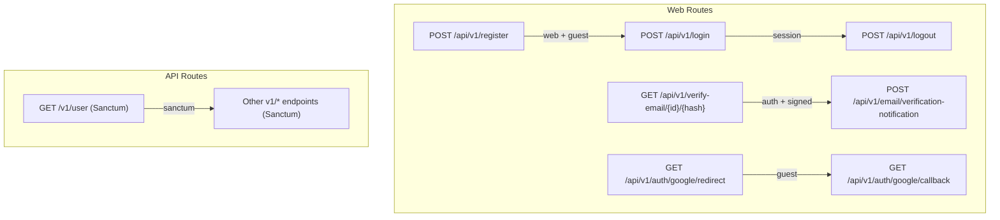

**Diagram sources**
- [routes/auth.php:11-37](file://routes/auth.php#L11-L37)
- [routes/web.php:23-46](file://routes/web.php#L23-L46)
- [routes/api.php:49-50](file://routes/api.php#L49-L50)

**Section sources**
- [routes/auth.php:11-37](file://routes/auth.php#L11-L37)
- [routes/web.php:23-46](file://routes/web.php#L23-L46)
- [routes/api.php:49-50](file://routes/api.php#L49-L50)

## Core Components
- Registration: Creates a student account, emits a registered event, logs the user in via session.
- Login: Validates credentials with rate limiting, regenerates session, updates last login timestamp.
- Logout: Logs out the web guard, invalidates session, regenerates CSRF token.
- Email Verification: Verifies email via signed link; re-sends verification notification when requested.
- Password Reset: Sends reset link; resets password and auto-verifies email if needed.
- Social Auth (Google): Redirects to provider, resolves or creates user on callback, logs in via session.
- Middleware: Ensures email is verified for protected features; Sanctum handles API token auth.
- Session & CSRF: Database-backed sessions with secure cookie settings; CSRF enforced for stateful requests.
- API Tokens: Sanctum configured with web guard and stateful domains for SPA cookies.

**Section sources**
- [app/Http/Controllers/Auth/RegisteredUserController.php:26-46](file://app/Http/Controllers/Auth/RegisteredUserController.php#L26-L46)
- [app/Http/Controllers/Auth/AuthenticatedSessionController.php:18-40](file://app/Http/Controllers/Auth/AuthenticatedSessionController.php#L18-L40)
- [app/Http/Controllers/Auth/VerifyEmailController.php:18-33](file://app/Http/Controllers/Auth/VerifyEmailController.php#L18-L33)
- [app/Http/Controllers/Auth/EmailVerificationNotificationController.php:13-22](file://app/Http/Controllers/Auth/EmailVerificationNotificationController.php#L13-L22)
- [app/Http/Controllers/Auth/PasswordResetLinkController.php:20-40](file://app/Http/Controllers/Auth/PasswordResetLinkController.php#L20-L40)
- [app/Http/Controllers/Auth/NewPasswordController.php:21-54](file://app/Http/Controllers/Auth/NewPasswordController.php#L21-L54)
- [app/Http/Controllers/Auth/SocialAuthController.php:27-74](file://app/Http/Controllers/Auth/SocialAuthController.php#L27-L74)
- [app/Http/Middleware/EnsureEmailIsVerified.php:17-26](file://app/Http/Middleware/EnsureEmailIsVerified.php#L17-L26)
- [config/sanctum.php:21-40](file://config/sanctum.php#L21-L40)
- [config/session.php:21-202](file://config/session.php#L21-L202)

## Architecture Overview
The application supports two authentication modes:
- Web (session-based) for SPA pages that need CSRF protection and server-rendered redirects
- API (token-based) for stateless client calls using Sanctum

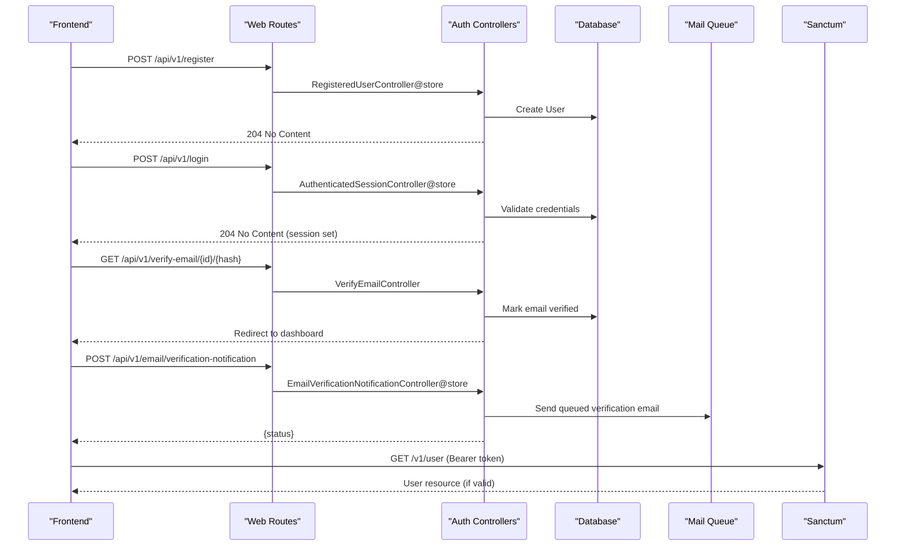

**Diagram sources**
- [routes/auth.php:11-37](file://routes/auth.php#L11-L37)
- [routes/api.php:49-50](file://routes/api.php#L49-L50)
- [app/Http/Controllers/Auth/RegisteredUserController.php:26-46](file://app/Http/Controllers/Auth/RegisteredUserController.php#L26-L46)
- [app/Http/Controllers/Auth/AuthenticatedSessionController.php:18-40](file://app/Http/Controllers/Auth/AuthenticatedSessionController.php#L18-L40)
- [app/Http/Controllers/Auth/VerifyEmailController.php:18-33](file://app/Http/Controllers/Auth/VerifyEmailController.php#L18-L33)
- [app/Http/Controllers/Auth/EmailVerificationNotificationController.php:13-22](file://app/Http/Controllers/Auth/EmailVerificationNotificationController.php#L13-L22)

## Detailed Component Analysis

### Registration Flow
- Endpoint: POST /api/v1/register (guest-only)
- Validation: name, email (unique), password (confirmed, strength rules)
- Behavior: Creates user with student role, hashes password, fires Registered event, logs in via session
- Response: 204 No Content

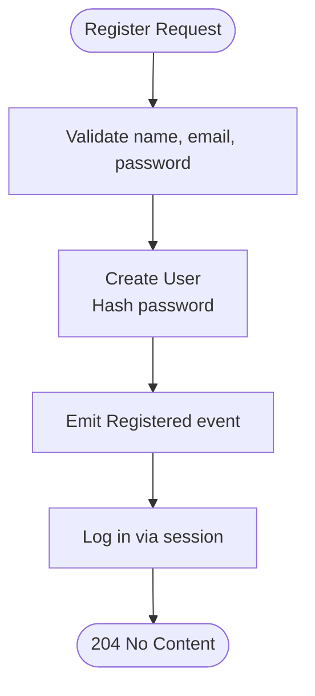

**Diagram sources**
- [app/Http/Controllers/Auth/RegisteredUserController.php:26-46](file://app/Http/Controllers/Auth/RegisteredUserController.php#L26-L46)
- [database/migrations/0001_01_01_000000_create_users_table.php:14-27](file://database/migrations/0001_01_01_000000_create_users_table.php#L14-L27)

**Section sources**
- [routes/auth.php:11-13](file://routes/auth.php#L11-L13)
- [app/Http/Controllers/Auth/RegisteredUserController.php:26-46](file://app/Http/Controllers/Auth/RegisteredUserController.php#L26-L46)
- [database/migrations/0001_01_01_000000_create_users_table.php:14-27](file://database/migrations/0001_01_01_000000_create_users_table.php#L14-L27)

### Login Flow
- Endpoint: POST /api/v1/login (guest-only)
- Validation: email, password
- Security: Rate limiting per email+IP; lockout event on too many attempts
- Behavior: Authenticates via web guard, regenerates session, updates last_login_at
- Response: 204 No Content

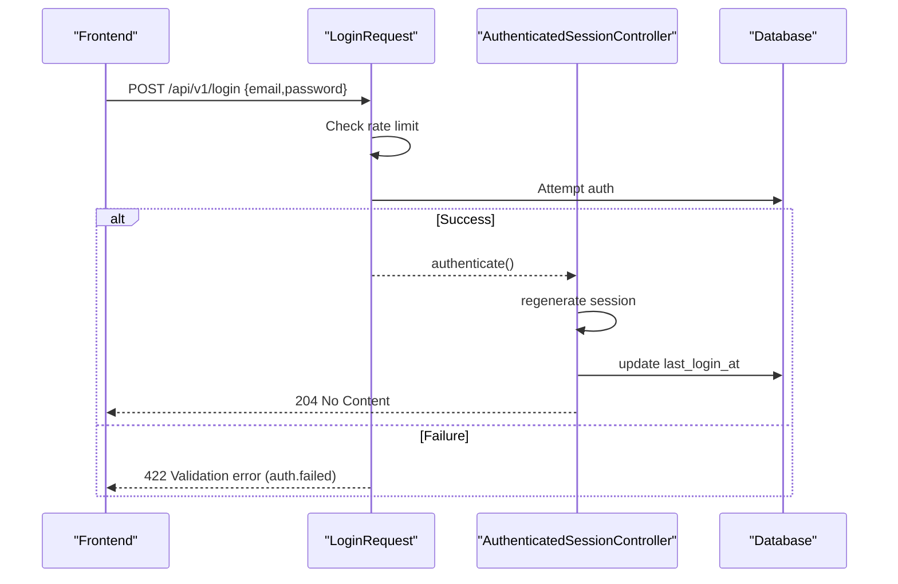

**Diagram sources**
- [app/Http/Requests/Auth/LoginRequest.php:30-87](file://app/Http/Requests/Auth/LoginRequest.php#L30-L87)
- [app/Http/Controllers/Auth/AuthenticatedSessionController.php:18-27](file://app/Http/Controllers/Auth/AuthenticatedSessionController.php#L18-L27)

**Section sources**
- [routes/auth.php:15-17](file://routes/auth.php#L15-L17)
- [app/Http/Requests/Auth/LoginRequest.php:30-87](file://app/Http/Requests/Auth/LoginRequest.php#L30-L87)
- [app/Http/Controllers/Auth/AuthenticatedSessionController.php:18-27](file://app/Http/Controllers/Auth/AuthenticatedSessionController.php#L18-L27)

### Logout Flow
- Endpoint: POST /api/v1/logout (auth required)
- Behavior: Logs out web guard, invalidates session, regenerates CSRF token
- Response: 204 No Content

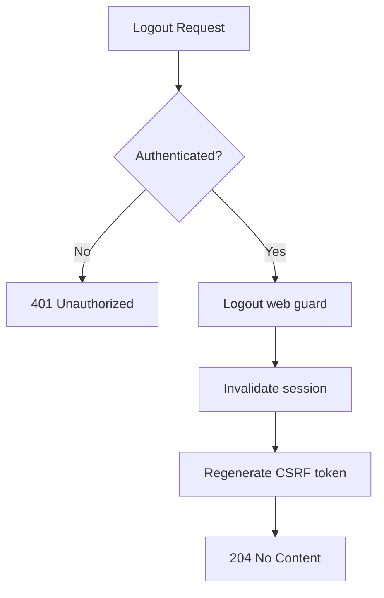

**Diagram sources**
- [app/Http/Controllers/Auth/AuthenticatedSessionController.php:32-40](file://app/Http/Controllers/Auth/AuthenticatedSessionController.php#L32-L40)

**Section sources**
- [routes/auth.php:35-37](file://routes/auth.php#L35-L37)
- [app/Http/Controllers/Auth/AuthenticatedSessionController.php:32-40](file://app/Http/Controllers/Auth/AuthenticatedSessionController.php#L32-L40)

### Email Verification Workflow
- Verify endpoint: GET /api/v1/verify-email/{id}/{hash} (auth + signed + throttle)
- Re-send notification: POST /api/v1/email/verification-notification (auth + throttle)
- Behavior: Marks email verified and fires Verified event; sends queued verification email on request
- Response: Redirect to dashboard with verified flag; JSON status for re-send

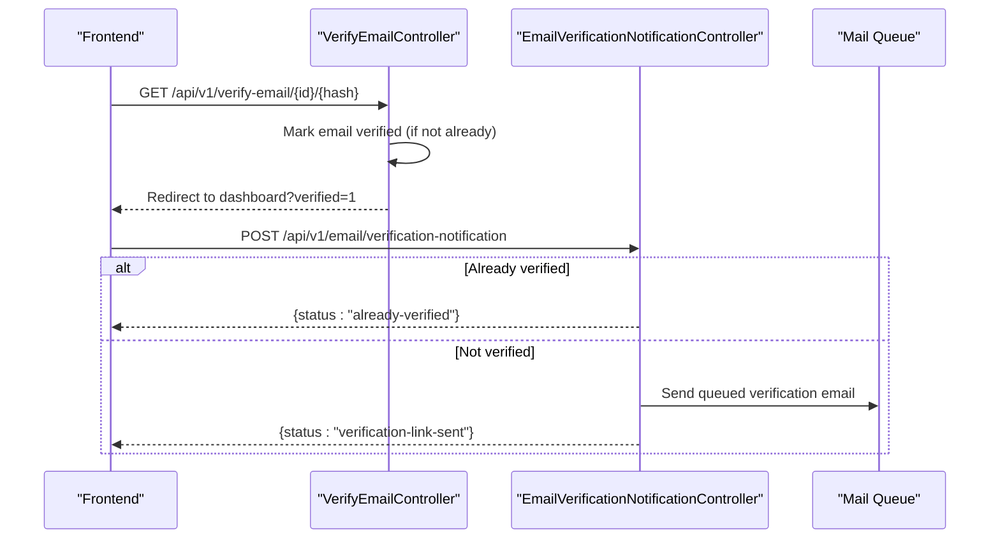

**Diagram sources**
- [app/Http/Controllers/Auth/VerifyEmailController.php:18-33](file://app/Http/Controllers/Auth/VerifyEmailController.php#L18-L33)
- [app/Http/Controllers/Auth/EmailVerificationNotificationController.php:13-22](file://app/Http/Controllers/Auth/EmailVerificationNotificationController.php#L13-L22)

**Section sources**
- [routes/auth.php:27-33](file://routes/auth.php#L27-L33)
- [app/Http/Controllers/Auth/VerifyEmailController.php:18-33](file://app/Http/Controllers/Auth/VerifyEmailController.php#L18-L33)
- [app/Http/Controllers/Auth/EmailVerificationNotificationController.php:13-22](file://app/Http/Controllers/Auth/EmailVerificationNotificationController.php#L13-L22)

### Password Reset Flow
- Send link: POST /api/v1/forgot-password (guest)
- Reset password: POST /api/v1/reset-password (guest)
- Behavior: Sends reset link; resets password and verifies email if needed; returns status messages

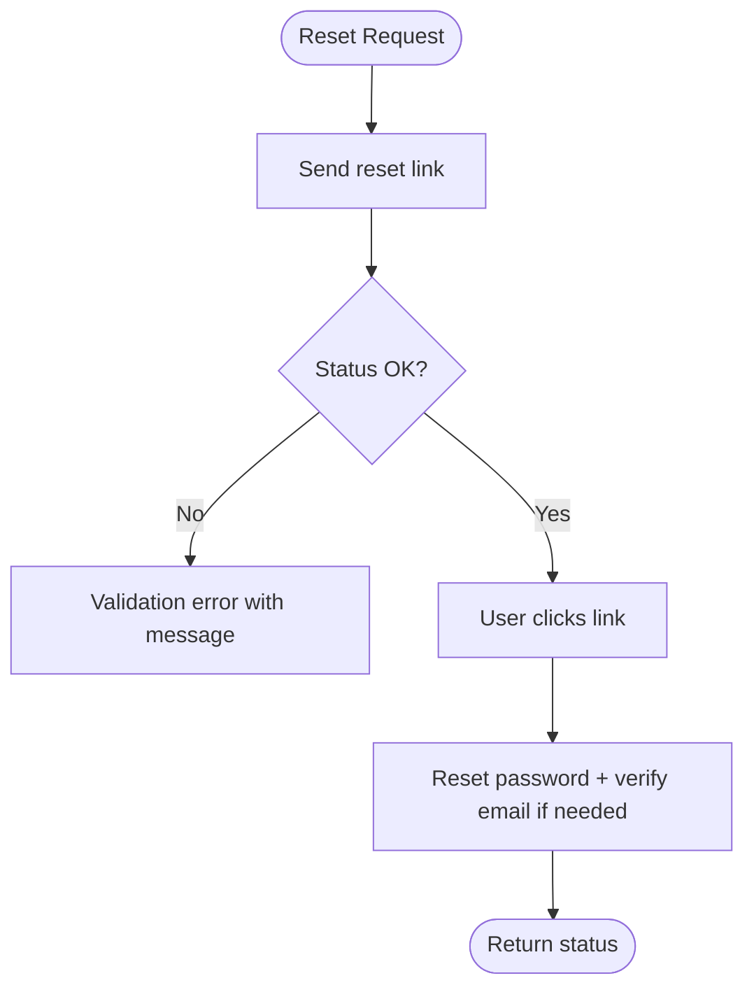

**Diagram sources**
- [app/Http/Controllers/Auth/PasswordResetLinkController.php:20-40](file://app/Http/Controllers/Auth/PasswordResetLinkController.php#L20-L40)
- [app/Http/Controllers/Auth/NewPasswordController.php:21-54](file://app/Http/Controllers/Auth/NewPasswordController.php#L21-L54)

**Section sources**
- [routes/auth.php:19-25](file://routes/auth.php#L19-L25)
- [app/Http/Controllers/Auth/PasswordResetLinkController.php:20-40](file://app/Http/Controllers/Auth/PasswordResetLinkController.php#L20-L40)
- [app/Http/Controllers/Auth/NewPasswordController.php:21-54](file://app/Http/Controllers/Auth/NewPasswordController.php#L21-L54)

### Social Authentication (Google)
- Redirect: GET /api/v1/auth/google/redirect (guest)
- Callback: GET /api/v1/auth/google/callback (guest)
- Behavior: Redirects to Google; on callback, matches existing user by provider or email; creates new user if needed; logs in via session

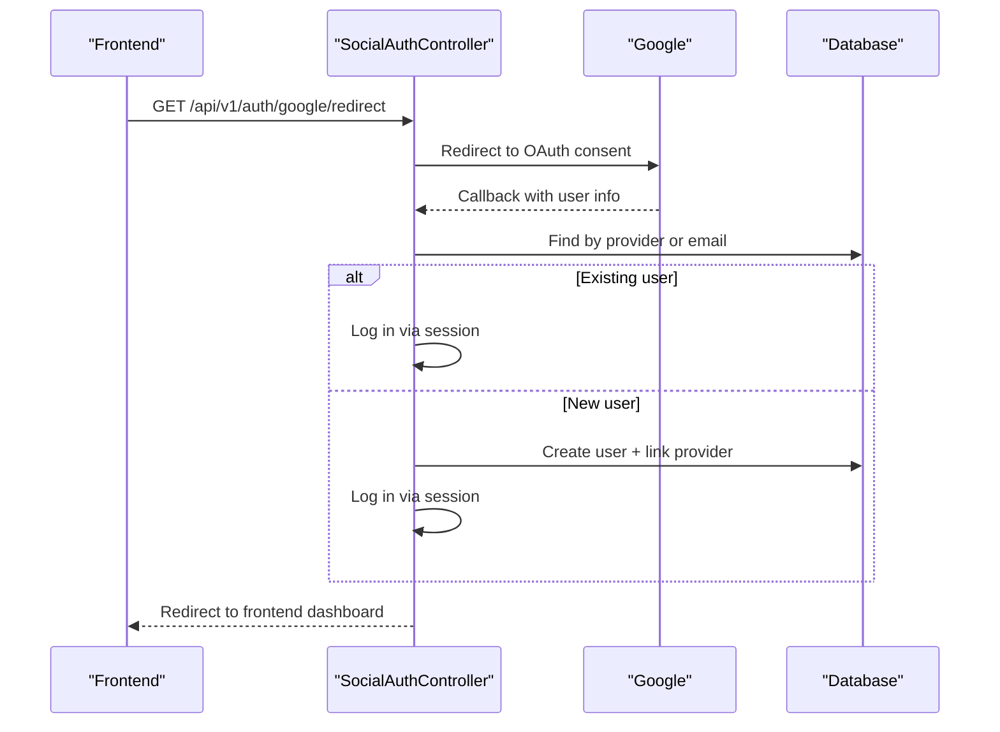

**Diagram sources**
- [app/Http/Controllers/Auth/SocialAuthController.php:27-74](file://app/Http/Controllers/Auth/SocialAuthController.php#L27-L74)
- [database/migrations/2024_01_01_000010_create_oauth_accounts_table.php:13-21](file://database/migrations/2024_01_01_000010_create_oauth_accounts_table.php#L13-L21)

**Section sources**
- [routes/web.php:26-32](file://routes/web.php#L26-L32)
- [app/Http/Controllers/Auth/SocialAuthController.php:27-74](file://app/Http/Controllers/Auth/SocialAuthController.php#L27-L74)
- [database/migrations/2024_01_01_000010_create_oauth_accounts_table.php:13-21](file://database/migrations/2024_01_01_000010_create_oauth_accounts_table.php#L13-L21)

### Middleware and Protection
- EnsureEmailIsVerified: Returns 409 JSON if user is unverified
- Sanctum: Protects API routes with bearer tokens; stateful domains enable SPA cookies
- Session: Database driver, configurable lifetime, secure cookies, SameSite lax

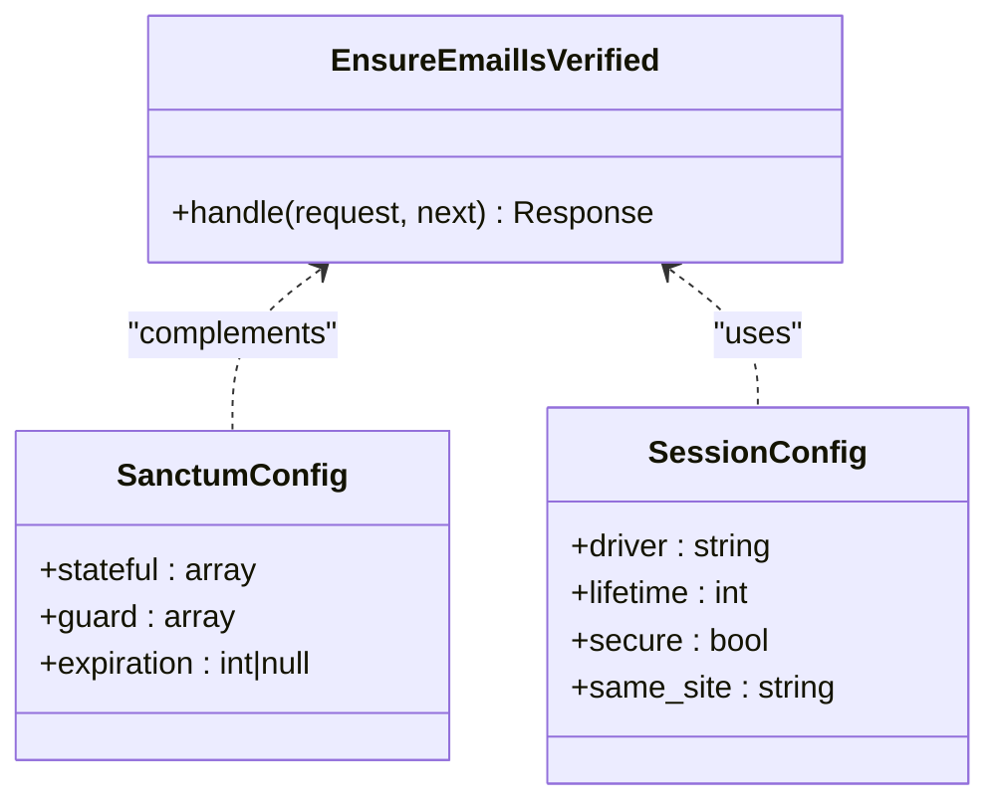

**Diagram sources**
- [app/Http/Middleware/EnsureEmailIsVerified.php:17-26](file://app/Http/Middleware/EnsureEmailIsVerified.php#L17-L26)
- [config/sanctum.php:21-40](file://config/sanctum.php#L21-L40)
- [config/session.php:21-202](file://config/session.php#L21-L202)

**Section sources**
- [app/Http/Middleware/EnsureEmailIsVerified.php:17-26](file://app/Http/Middleware/EnsureEmailIsVerified.php#L17-L26)
- [config/sanctum.php:21-40](file://config/sanctum.php#L21-L40)
- [config/session.php:21-202](file://config/session.php#L21-L202)

### Data Model Relationships
- Users store role, email, password_hash, timestamps, and optional profile fields
- OauthAccounts link users to external providers
- Sessions table persists web sessions

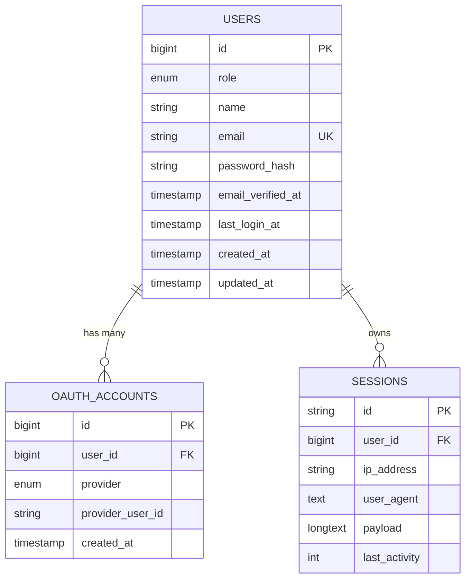

**Diagram sources**
- [database/migrations/0001_01_01_000000_create_users_table.php:14-42](file://database/migrations/0001_01_01_000000_create_users_table.php#L14-L42)
- [database/migrations/2024_01_01_000010_create_oauth_accounts_table.php:13-21](file://database/migrations/2024_01_01_000010_create_oauth_accounts_table.php#L13-L21)

**Section sources**
- [app/Models/User.php:24-55](file://app/Models/User.php#L24-L55)
- [database/migrations/0001_01_01_000000_create_users_table.php:14-42](file://database/migrations/0001_01_01_000000_create_users_table.php#L14-L42)
- [database/migrations/2024_01_01_000010_create_oauth_accounts_table.php:13-21](file://database/migrations/2024_01_01_000010_create_oauth_accounts_table.php#L13-L21)

## Dependency Analysis
- Controllers depend on models and framework services (Auth, Password, Socialite)
- Requests encapsulate validation and rate limiting logic
- Middleware enforces policy checks (email verification)
- Sanctum config ties into web guard and stateful domains
- Routes wire controllers to HTTP verbs and middleware groups

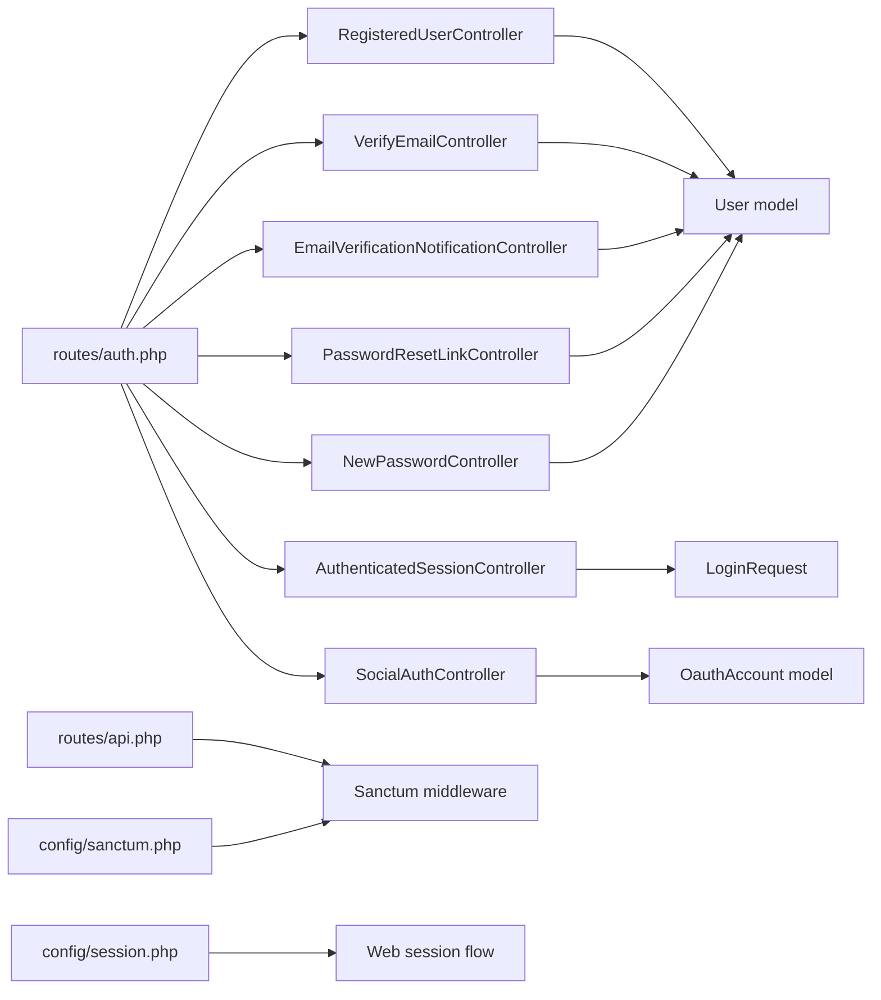

**Diagram sources**
- [routes/auth.php:11-37](file://routes/auth.php#L11-L37)
- [routes/api.php:49-50](file://routes/api.php#L49-L50)
- [config/sanctum.php:21-40](file://config/sanctum.php#L21-L40)
- [config/session.php:21-202](file://config/session.php#L21-L202)

**Section sources**
- [routes/auth.php:11-37](file://routes/auth.php#L11-L37)
- [routes/api.php:49-50](file://routes/api.php#L49-L50)
- [config/sanctum.php:21-40](file://config/sanctum.php#L21-L40)
- [config/session.php:21-202](file://config/session.php#L21-L202)

## Performance Considerations
- Use database-backed sessions for scalability; ensure proper indexing on sessions.user_id and last_activity
- Keep session lifetime reasonable; consider expire_on_close for sensitive environments
- Rate limiting on login prevents brute-force attacks; tune thresholds based on traffic
- Queued email notifications avoid blocking registration/login flows
- Sanctum token expiration can be configured if needed; otherwise rely on session-based SPA auth

[No sources needed since this section provides general guidance]

## Troubleshooting Guide
- Unverified email access: EnsureEmailIsVerified returns 409 with a message indicating email is not verified
- Login failures: LoginRequest throws validation errors with localized messages; check rate limiter throttling
- Password reset issues: PasswordResetLinkController and NewPasswordController return validation exceptions with status messages
- Social auth mismatches: SocialAuthController resolves users by provider or email; ensure unique constraints on oauth_accounts

**Section sources**
- [app/Http/Middleware/EnsureEmailIsVerified.php:17-26](file://app/Http/Middleware/EnsureEmailIsVerified.php#L17-L26)
- [app/Http/Requests/Auth/LoginRequest.php:43-87](file://app/Http/Requests/Auth/LoginRequest.php#L43-L87)
- [app/Http/Controllers/Auth/PasswordResetLinkController.php:20-40](file://app/Http/Controllers/Auth/PasswordResetLinkController.php#L20-L40)
- [app/Http/Controllers/Auth/NewPasswordController.php:21-54](file://app/Http/Controllers/Auth/NewPasswordController.php#L21-L54)
- [app/Http/Controllers/Auth/SocialAuthController.php:32-74](file://app/Http/Controllers/Auth/SocialAuthController.php#L32-L74)

## Conclusion
ResNet Academy implements a robust, layered authentication system combining session-based web flows with Sanctum’s token-based API access. Registration, login, logout, email verification, password reset, and social authentication are clearly separated into dedicated controllers and routes, with strong validation, rate limiting, and CSRF protections. The design ensures secure, scalable interactions for both SPA clients and API consumers while maintaining clear separation of concerns and predictable error handling.