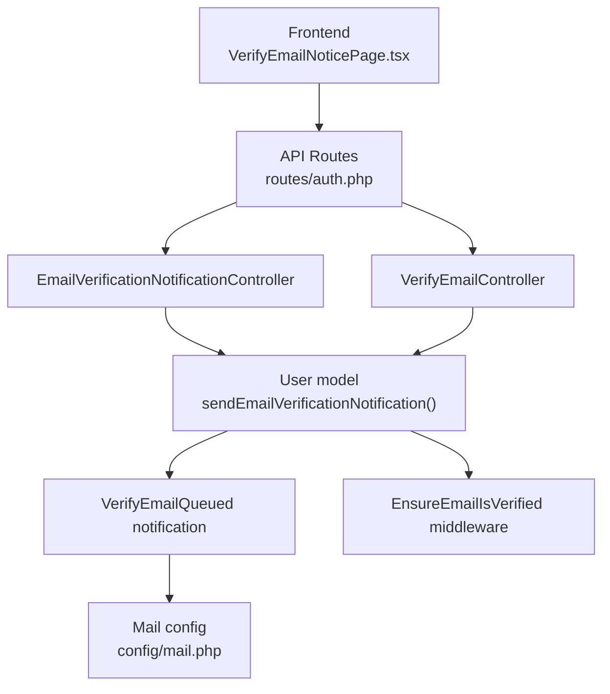
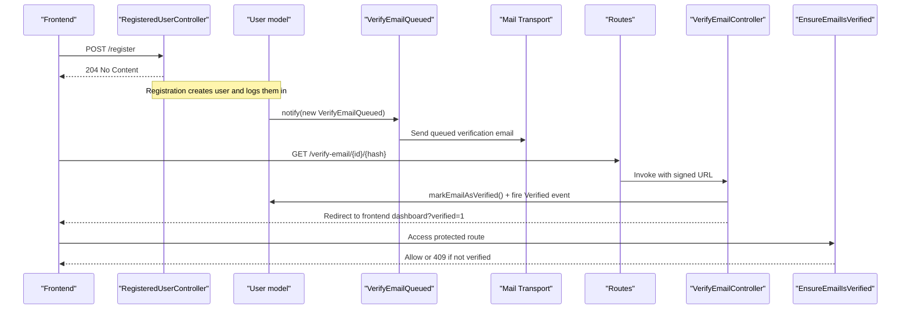
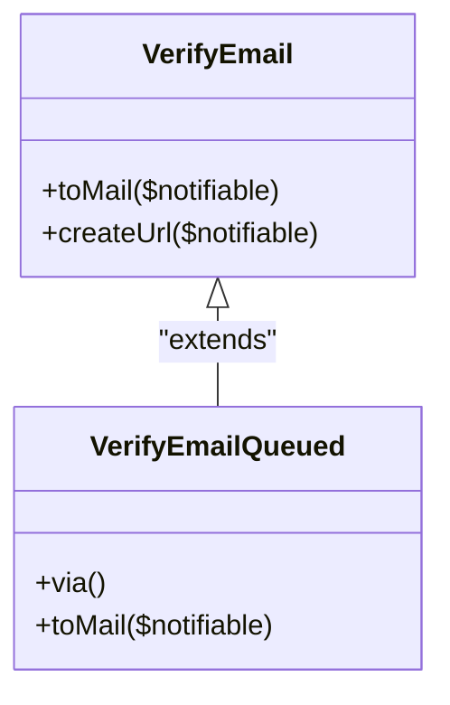
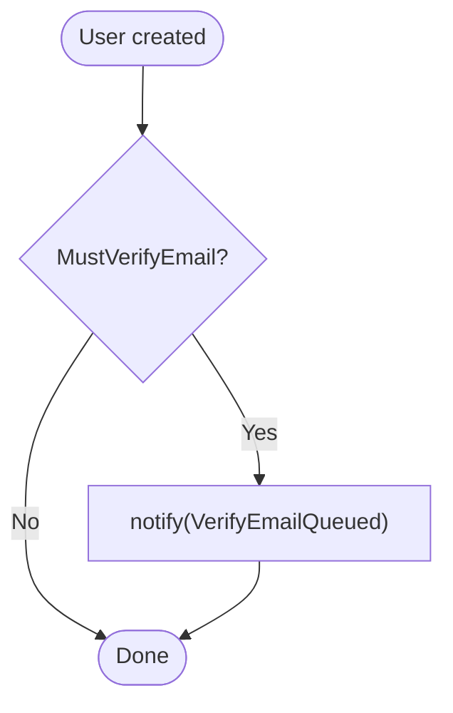
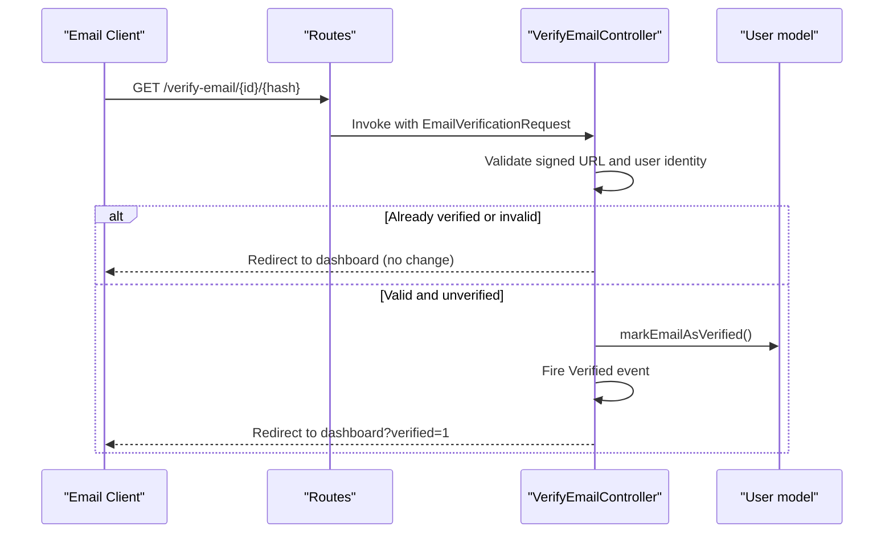
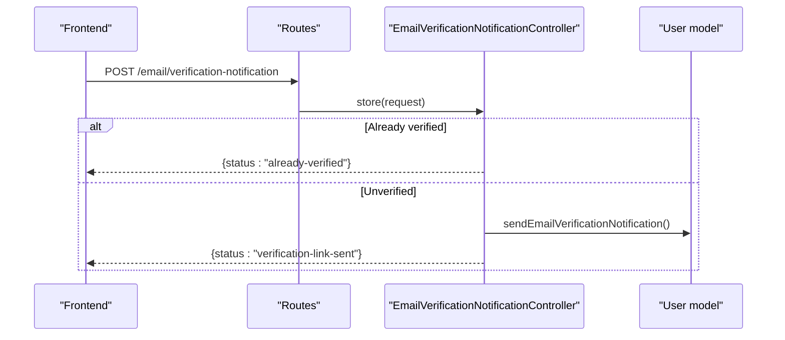
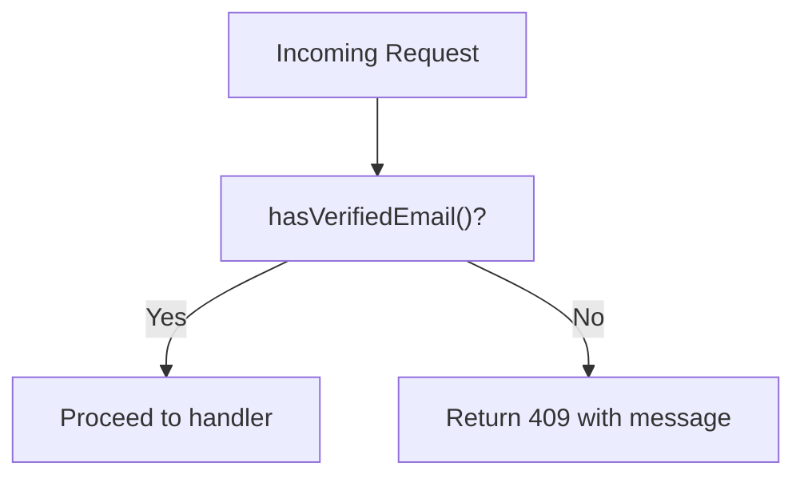
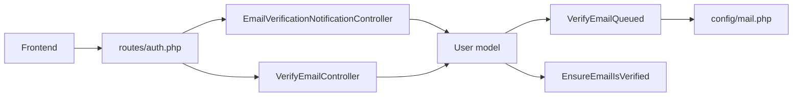

# Email Verification

<cite>
**Referenced Files in This Document**
- [VerifyEmailQueued.php](file://app/Notifications/VerifyEmailQueued.php)
- [User.php](file://app/Models/User.php)
- [VerifyEmailController.php](file://app/Http/Controllers/Auth/VerifyEmailController.php)
- [EmailVerificationNotificationController.php](file://app/Http/Controllers/Auth/EmailVerificationNotificationController.php)
- [auth.php](file://routes/auth.php)
- [EnsureEmailIsVerified.php](file://app/Http/Middleware/EnsureEmailIsVerified.php)
- [mail.php](file://config/mail.php)
- [RegisteredUserController.php](file://app/Http/Controllers/Auth/RegisteredUserController.php)
- [VerifyEmailNoticePage.tsx](file://frontend/src/features/auth/VerifyEmailNoticePage.tsx)
- [api.ts](file://frontend/src/features/auth/api.ts)
</cite>

## Table of Contents
1. Introduction
2. Project Structure
3. Core Components
4. Architecture Overview
5. Detailed Component Analysis
6. Dependency Analysis
7. Performance Considerations
8. Troubleshooting Guide
9. Conclusion

## Introduction
This document explains the email verification workflow in ResNet Academy, covering how verification emails are queued and sent, how verification links are generated and validated, and how verification status is tracked. It also documents the resend flow, frontend integration, security considerations (token expiration, single-use behavior, brute-force protection), and customization points for email templates.

## Project Structure
The email verification feature spans controllers, models, notifications, routes, middleware, configuration, and a small frontend page:
- Controllers handle verification link validation and resending notifications
- The User model implements Laravel’s MustVerifyEmail contract and overrides notification sending to use a queued notification
- A queued notification class extends Laravel’s default VerifyEmail to avoid synchronous mail failures during registration
- Routes define the verify endpoint and resend endpoint with throttling
- Middleware enforces verified status on protected endpoints
- Configuration controls mail transport and global sender settings
- Frontend provides a notice page and API helper to resend verification emails

**Diagram sources**
- [auth.php:27-33](file://routes/auth.php#L27-L33)
- [EmailVerificationNotificationController.php:13-22](file://app/Http/Controllers/Auth/EmailVerificationNotificationController.php#L13-L22)
- [VerifyEmailController.php:18-32](file://app/Http/Controllers/Auth/VerifyEmailController.php#L18-L32)
- [User.php:69-72](file://app/Models/User.php#L69-L72)
- [VerifyEmailQueued.php:18-20](file://app/Notifications/VerifyEmailQueued.php#L18-L20)
- [mail.php:17-116](file://config/mail.php#L17-L116)
- [EnsureEmailIsVerified.php:17-25](file://app/Http/Middleware/EnsureEmailIsVerified.php#L17-L25)

**Section sources**
- [auth.php:27-33](file://routes/auth.php#L27-L33)
- [EmailVerificationNotificationController.php:13-22](file://app/Http/Controllers/Auth/EmailVerificationNotificationController.php#L13-L22)
- [VerifyEmailController.php:18-32](file://app/Http/Controllers/Auth/VerifyEmailController.php#L18-L32)
- [User.php:69-72](file://app/Models/User.php#L69-L72)
- [VerifyEmailQueued.php:18-20](file://app/Notifications/VerifyEmailQueued.php#L18-L20)
- [mail.php:17-116](file://config/mail.php#L17-L116)
- [EnsureEmailIsVerified.php:17-25](file://app/Http/Middleware/EnsureEmailIsVerified.php#L17-L25)

## Core Components
- Queued verification notification: Extends Laravel’s built-in VerifyEmail and implements ShouldQueue so email delivery happens asynchronously. This prevents transient mail errors from failing the registration request after the user record is committed.
- User model: Implements MustVerifyEmail and overrides sendEmailVerificationNotification to dispatch the queued notification.
- Verification controller: Validates signed verification URLs, marks the email as verified if valid, fires the Verified event, and redirects to the frontend dashboard with a success flag.
- Resend notification controller: Returns early if already verified; otherwise triggers the queued verification email via the User model.
- Routes: Define GET /verify-email/{id}/{hash} with auth, signed, and throttle middleware; POST /email/verification-notification with auth and throttle middleware.
- Middleware: EnsureEmailIsVerified returns a 409 JSON error when an unverified user attempts to access protected routes.
- Mail configuration: Defines default mailer and available transports (smtp, ses, postmark, resend, log, array, failover, roundrobin).

**Section sources**
- [VerifyEmailQueued.php:11-20](file://app/Notifications/VerifyEmailQueued.php#L11-L20)
- [User.php:19-22](file://app/Models/User.php#L19-L22)
- [User.php:69-72](file://app/Models/User.php#L69-L72)
- [VerifyEmailController.php:18-32](file://app/Http/Controllers/Auth/VerifyEmailController.php#L18-L32)
- [EmailVerificationNotificationController.php:13-22](file://app/Http/Controllers/Auth/EmailVerificationNotificationController.php#L13-L22)
- [auth.php:27-33](file://routes/auth.php#L27-L33)
- [EnsureEmailIsVerified.php:17-25](file://app/Http/Middleware/EnsureEmailIsVerified.php#L17-L25)
- [mail.php:17-116](file://config/mail.php#L17-L116)

## Architecture Overview
The end-to-end flow includes registration-triggered queuing, email delivery, user clicking the link, backend validation, state update, and optional frontend handling.

**Diagram sources**
- [RegisteredUserController.php:26-45](file://app/Http/Controllers/Auth/RegisteredUserController.php#L26-L45)
- [User.php:69-72](file://app/Models/User.php#L69-L72)
- [VerifyEmailQueued.php:18-20](file://app/Notifications/VerifyEmailQueued.php#L18-L20)
- [mail.php:17-116](file://config/mail.php#L17-L116)
- [auth.php:27-33](file://routes/auth.php#L27-L33)
- [VerifyEmailController.php:18-32](file://app/Http/Controllers/Auth/VerifyEmailController.php#L18-L32)
- [EnsureEmailIsVerified.php:17-25](file://app/Http/Middleware/EnsureEmailIsVerified.php#L17-L25)

## Detailed Component Analysis

### VerifyEmailQueued Notification
- Purpose: Ensures verification emails are sent asynchronously to avoid blocking requests and to prevent transient mail failures from causing server errors after user creation.
- Behavior: Extends Laravel’s VerifyEmail and implements ShouldQueue, using Queueable to queue delivery.

**Diagram sources**
- [VerifyEmailQueued.php:18-20](file://app/Notifications/VerifyEmailQueued.php#L18-L20)

**Section sources**
- [VerifyEmailQueued.php:11-20](file://app/Notifications/VerifyEmailQueued.php#L11-L20)

### User Model Integration
- Implements MustVerifyEmail to integrate with Laravel’s email verification system.
- Overrides sendEmailVerificationNotification to dispatch the queued notification instead of the default synchronous one.

**Diagram sources**
- [User.php:19-22](file://app/Models/User.php#L19-L22)
- [User.php:69-72](file://app/Models/User.php#L69-L72)

**Section sources**
- [User.php:19-22](file://app/Models/User.php#L19-L22)
- [User.php:69-72](file://app/Models/User.php#L69-L72)

### Verification Link Generation and Handling
- Generation: Handled by Laravel’s base VerifyEmail notification used by VerifyEmailQueued. The notification builds a signed URL containing the user ID and hash.
- Handling: VerifyEmailController validates the signed URL, ensures the current authenticated user matches, marks the email as verified if needed, fires the Verified event, and redirects to the frontend dashboard with a query parameter indicating success.

**Diagram sources**
- [auth.php:27-29](file://routes/auth.php#L27-L29)
- [VerifyEmailController.php:18-32](file://app/Http/Controllers/Auth/VerifyEmailController.php#L18-L32)

**Section sources**
- [VerifyEmailController.php:18-32](file://app/Http/Controllers/Auth/VerifyEmailController.php#L18-L32)
- [auth.php:27-29](file://routes/auth.php#L27-L29)

### Resend Verification Email Endpoint
- Endpoint: POST /email/verification-notification
- Behavior: If the user is already verified, returns a JSON status indicating that. Otherwise, triggers the queued verification email via the User model and returns a success status.
- Frontend: VerifyEmailNoticePage calls the resend API helper to trigger this endpoint and shows a confirmation message.

**Diagram sources**
- [auth.php:31-33](file://routes/auth.php#L31-L33)
- [EmailVerificationNotificationController.php:13-22](file://app/Http/Controllers/Auth/EmailVerificationNotificationController.php#L13-L22)
- [User.php:69-72](file://app/Models/User.php#L69-L72)
- [VerifyEmailNoticePage.tsx:14-22](file://frontend/src/features/auth/VerifyEmailNoticePage.tsx#L14-L22)
- [api.ts:59-61](file://frontend/src/features/auth/api.ts#L59-L61)

**Section sources**
- [EmailVerificationNotificationController.php:13-22](file://app/Http/Controllers/Auth/EmailVerificationNotificationController.php#L13-L22)
- [VerifyEmailNoticePage.tsx:14-22](file://frontend/src/features/auth/VerifyEmailNoticePage.tsx#L14-L22)
- [api.ts:59-61](file://frontend/src/features/auth/api.ts#L59-L61)
- [auth.php:31-33](file://routes/auth.php#L31-L33)

### Email Template Customization
- The queued notification extends Laravel’s VerifyEmail, which uses a default template. To customize the verification email content, create a custom notification class that extends VerifyEmail and override the toMail method to return a customized MailMessage. Alternatively, publish and modify Laravel’s default verification email view.
- For other application emails (e.g., enrolment confirmation), the project demonstrates a dedicated Mailable class and Blade view pattern that can be replicated for verification emails if you choose a custom notification approach.

**Section sources**
- [VerifyEmailQueued.php:18-20](file://app/Notifications/VerifyEmailQueued.php#L18-L20)
- [EnrolmentConfirmed.php:14-30](file://app/Mail/EnrolmentConfirmed.php#L14-L30)
- [enrolment-confirmed.blade.php:1-17](file://resources/views/emails/enrolment-confirmed.blade.php#L1-L17)

### Verification Status Enforcement
- Middleware: EnsureEmailIsVerified checks whether the authenticated user has a verified email. If not, it returns a 409 JSON response with a message instructing the client to verify the email first.
- Usage: Apply this middleware to routes that require a verified account to protect sensitive operations.

**Diagram sources**
- [EnsureEmailIsVerified.php:17-25](file://app/Http/Middleware/EnsureEmailIsVerified.php#L17-L25)

**Section sources**
- [EnsureEmailIsVerified.php:17-25](file://app/Http/Middleware/EnsureEmailIsVerified.php#L17-L25)

## Dependency Analysis
- Controllers depend on routes for URL definitions and middleware for security and rate limiting.
- The User model depends on the notification system to send queued verification emails.
- The queued notification depends on Laravel’s mail transport configured in mail.php.
- Frontend components call API helpers that target the defined routes.

**Diagram sources**
- [auth.php:27-33](file://routes/auth.php#L27-L33)
- [EmailVerificationNotificationController.php:13-22](file://app/Http/Controllers/Auth/EmailVerificationNotificationController.php#L13-L22)
- [VerifyEmailController.php:18-32](file://app/Http/Controllers/Auth/VerifyEmailController.php#L18-L32)
- [User.php:69-72](file://app/Models/User.php#L69-L72)
- [VerifyEmailQueued.php:18-20](file://app/Notifications/VerifyEmailQueued.php#L18-L20)
- [mail.php:17-116](file://config/mail.php#L17-L116)
- [EnsureEmailIsVerified.php:17-25](file://app/Http/Middleware/EnsureEmailIsVerified.php#L17-L25)

**Section sources**
- [auth.php:27-33](file://routes/auth.php#L27-L33)
- [EmailVerificationNotificationController.php:13-22](file://app/Http/Controllers/Auth/EmailVerificationNotificationController.php#L13-L22)
- [VerifyEmailController.php:18-32](file://app/Http/Controllers/Auth/VerifyEmailController.php#L18-L32)
- [User.php:69-72](file://app/Models/User.php#L69-L72)
- [VerifyEmailQueued.php:18-20](file://app/Notifications/VerifyEmailQueued.php#L18-L20)
- [mail.php:17-116](file://config/mail.php#L17-L116)
- [EnsureEmailIsVerified.php:17-25](file://app/Http/Middleware/EnsureEmailIsVerified.php#L17-L25)

## Performance Considerations
- Asynchronous email delivery: Using a queued notification avoids blocking the registration request and protects against transient mail service issues.
- Throttling: Both verification endpoints are rate-limited to mitigate abuse and brute-force attempts.
- Minimal work per request: The verification controller performs only essential checks and updates before redirecting.

[No sources needed since this section provides general guidance]

## Troubleshooting Guide
- Invalid or expired verification link:
  - The verify endpoint validates the signed URL and user identity. If invalid or expired, no changes are made and the user is redirected without marking the email as verified.
- Already verified:
  - The resend endpoint returns a status indicating the user is already verified; no additional email is sent.
- Brute force protection:
  - Throttle middleware limits the number of requests to both verification endpoints within a time window.
- Mail delivery issues:
  - Configure the appropriate mailer in mail.php (smtp, ses, postmark, resend, etc.). Use the log or array mailers for local development to inspect queued messages.
- Enforcing verified status:
  - Apply EnsureEmailIsVerified middleware to routes that should only be accessible to verified users. Unverified requests receive a 409 response.

**Section sources**
- [VerifyEmailController.php:18-32](file://app/Http/Controllers/Auth/VerifyEmailController.php#L18-L32)
- [EmailVerificationNotificationController.php:13-22](file://app/Http/Controllers/Auth/EmailVerificationNotificationController.php#L13-L22)
- [auth.php:27-33](file://routes/auth.php#L27-L33)
- [mail.php:17-116](file://config/mail.php#L17-L116)
- [EnsureEmailIsVerified.php:17-25](file://app/Http/Middleware/EnsureEmailIsVerified.php#L17-L25)

## Conclusion
ResNet Academy’s email verification workflow leverages Laravel’s built-in verification system with a queued notification to ensure robustness and performance. Signed verification links are validated securely, user status is updated atomically, and frontend flows provide clear feedback. Rate limiting and middleware enforce security and access control. Customization points exist for email templates and further hardening if needed.

[No sources needed since this section summarizes without analyzing specific files]