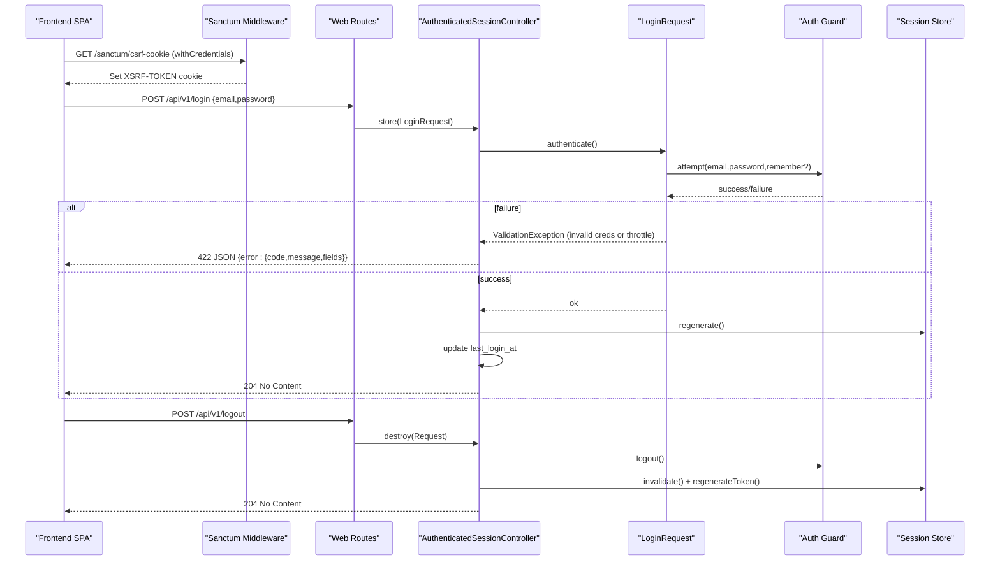
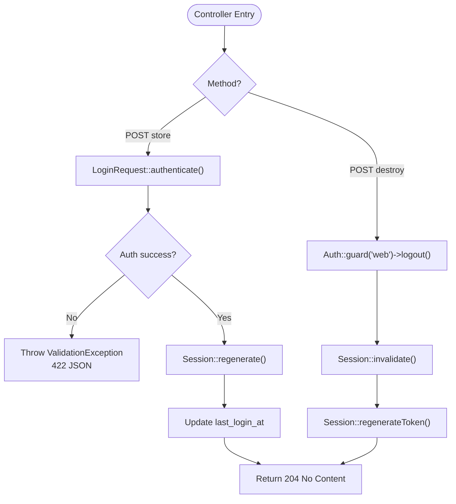
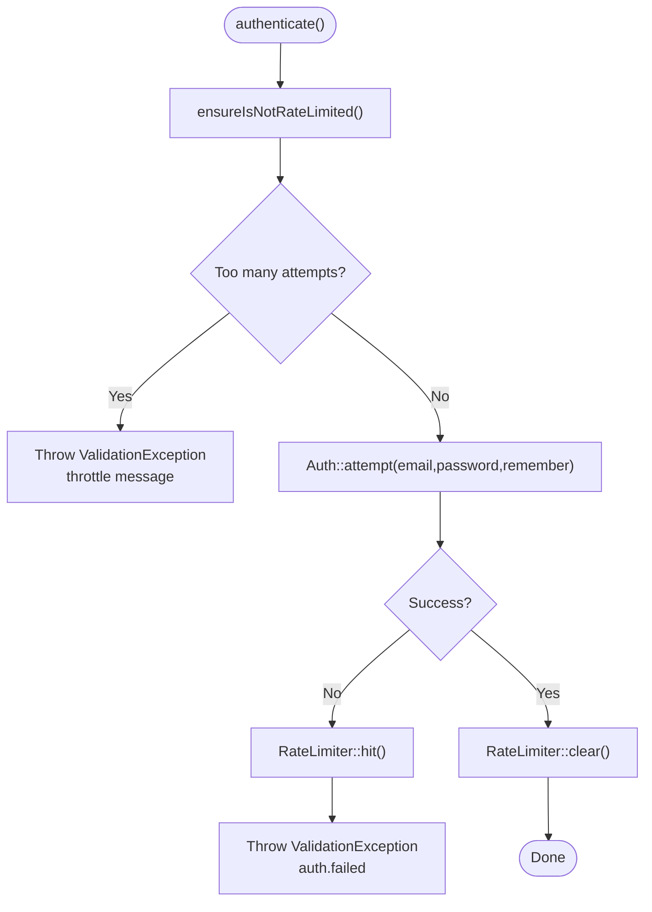
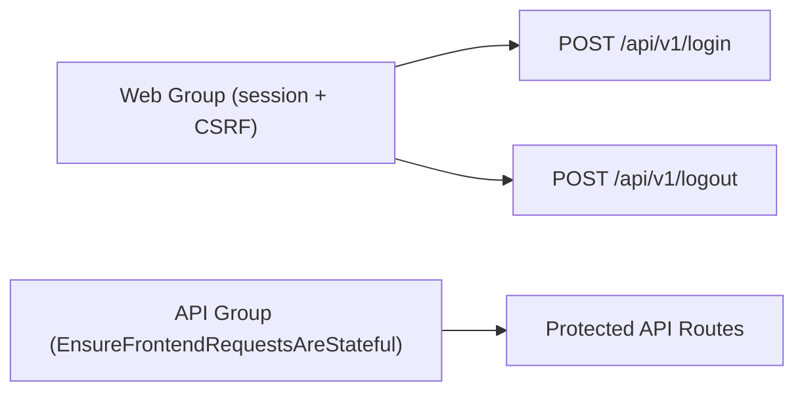
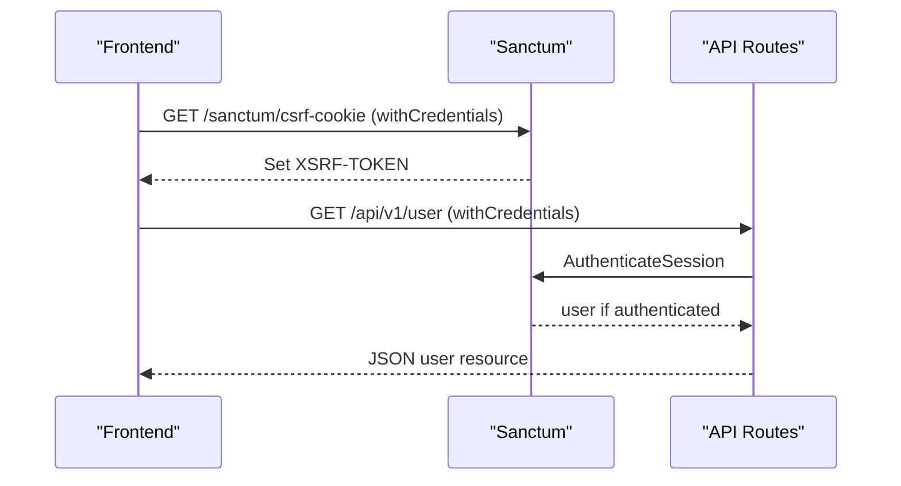
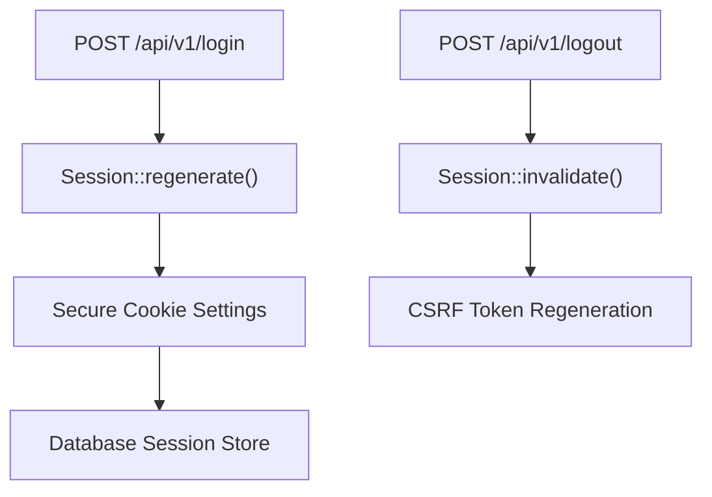
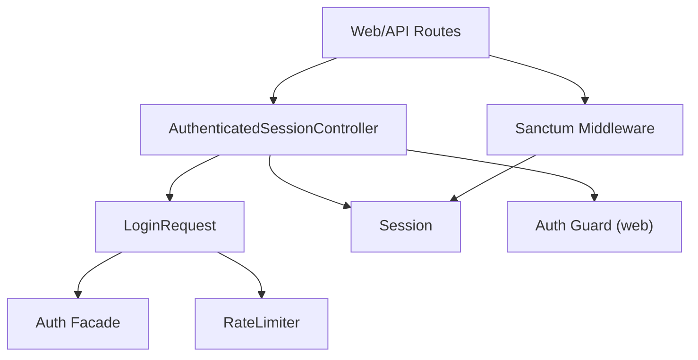

# Login & Logout

<cite>
**Referenced Files in This Document**
- [AuthenticatedSessionController.php](file://app/Http/Controllers/Auth/AuthenticatedSessionController.php)
- [LoginRequest.php](file://app/Http/Requests/Auth/LoginRequest.php)
- [auth.php (routes)](file://routes/auth.php)
- [web.php (routes)](file://routes/web.php)
- [api.php (routes)](file://routes/api.php)
- [sanctum.php](file://config/sanctum.php)
- [session.php](file://config/session.php)
- [auth.php (config)](file://config/auth.php)
- [User.php](file://app/Models/User.php)
- [client.ts (frontend API client)](file://frontend/src/lib/api/client.ts)
- [bootstrap/app.php](file://bootstrap/app.php)
</cite>

## Table of Contents
1. Introduction
2. Project Structure
3. Core Components
4. Architecture Overview
5. Detailed Component Analysis
6. Dependency Analysis
7. Performance Considerations
8. Troubleshooting Guide
9. Conclusion

## Introduction
This document explains the login and logout authentication flows, focusing on how the AuthenticatedSessionController processes login requests, manages sessions, integrates with Laravel Sanctum for stateful SPA authentication, and securely handles logout. It also covers CSRF protection, session regeneration, concurrent session handling, error handling for invalid credentials, and example request/response formats for the login/logout endpoints.

## Project Structure
The authentication system is centered around:
- Web routes under a shared /api/v1 prefix that use the web middleware group to enable sessions and CSRF protection for SPA auth.
- An Auth controller that authenticates users via the web guard and updates last login timestamps.
- A request class that validates input, rate-limits attempts, and throws structured validation errors.
- Sanctum configuration enabling stateful cookies for SPA domains and integrating CSRF validation.
- Session configuration using database-backed sessions with secure cookie settings.
- A frontend API client that ensures CSRF cookie seeding and sends credentials with requests.

```mermaid
graph TB
Client["Frontend SPA"] --> |POST /api/v1/login| WebRoutes["Web Routes (/api/v1)"]
WebRoutes --> Controller["AuthenticatedSessionController::store"]
Controller --> Request["LoginRequest::authenticate"]
Request --> Guard["Auth::attempt (web guard)"]
Controller --> Session["Session Regenerate + Save last_login_at"]
Client --> |POST /api/v1/logout| WebRoutes
WebRoutes --> Logout["AuthenticatedSessionController::destroy"]
Logout --> Guard
Logout --> Session
Client --> |GET /api/v1/* (stateful)| Sanctum["Sanctum EnsureFrontendRequestsAreStateful"]
```

**Diagram sources**
- [web.php:23-46](file://routes/web.php#L23-L46)
- [auth.php (routes):15-37](file://routes/auth.php#L15-L37)
- [AuthenticatedSessionController.php:18-40](file://app/Http/Controllers/Auth/AuthenticatedSessionController.php#L18-L40)
- [LoginRequest.php:43-56](file://app/Http/Requests/Auth/LoginRequest.php#L43-L56)
- [sanctum.php:21-26](file://config/sanctum.php#L21-L26)

**Section sources**
- [web.php:23-46](file://routes/web.php#L23-L46)
- [auth.php (routes):15-37](file://routes/auth.php#L15-L37)
- [sanctum.php:21-26](file://config/sanctum.php#L21-L26)
- [session.php:21-37](file://config/session.php#L21-L37)

## Core Components
- AuthenticatedSessionController: Handles login (store) and logout (destroy). On login, it authenticates via the web guard, regenerates the session, updates last login timestamp, and returns a 204 No Content. On logout, it logs out the web guard, invalidates the session, regenerates the CSRF token, and returns 204.
- LoginRequest: Validates email/password, enforces rate limiting, attempts authentication, and throws structured validation exceptions for failures or throttling.
- Routes: Login and logout are defined under /api/v1 but loaded from routes/auth.php within the web route group so they run with session and CSRF middleware.
- Sanctum: Configured to treat requests from configured stateful domains as stateful, enabling cookie-based authentication for SPAs.
- Session: Database driver with configurable lifetime, secure cookies, HTTP-only flags, and SameSite policy.
- User model: Uses HasApiTokens and custom password column mapping; includes last_login_at cast.

**Section sources**
- [AuthenticatedSessionController.php:18-40](file://app/Http/Controllers/Auth/AuthenticatedSessionController.php#L18-L40)
- [LoginRequest.php:30-56](file://app/Http/Requests/Auth/LoginRequest.php#L30-L56)
- [auth.php (routes):15-37](file://routes/auth.php#L15-L37)
- [sanctum.php:21-26](file://config/sanctum.php#L21-L26)
- [session.php:21-37](file://config/session.php#L21-L37)
- [User.php:19-22](file://app/Models/User.php#L19-L22)

## Architecture Overview
The application uses Laravel’s session-based authentication for SPA login/logout while leveraging Sanctum to ensure cross-origin requests from configured domains receive stateful cookies. The flow ensures CSRF protection, session fixation prevention via regeneration, and consistent JSON error responses for API clients.



**Diagram sources**
- [client.ts:22-33](file://frontend/src/lib/api/client.ts#L22-L33)
- [auth.php (routes):15-37](file://routes/auth.php#L15-L37)
- [AuthenticatedSessionController.php:18-40](file://app/Http/Controllers/Auth/AuthenticatedSessionController.php#L18-L40)
- [LoginRequest.php:43-56](file://app/Http/Requests/Auth/LoginRequest.php#L43-L56)
- [bootstrap/app.php:42-65](file://bootstrap/app.php#L42-L65)

## Detailed Component Analysis

### AuthenticatedSessionController
Responsibilities:
- Login processing: delegates to LoginRequest for validation and authentication, regenerates session to prevent fixation, updates last login timestamp, and returns 204.
- Logout processing: logs out the web guard, invalidates session, regenerates CSRF token, and returns 204.

Security notes:
- Session regeneration after successful login prevents session fixation attacks.
- Logout invalidates server-side session and rotates CSRF token to mitigate hijacking.



**Diagram sources**
- [AuthenticatedSessionController.php:18-40](file://app/Http/Controllers/Auth/AuthenticatedSessionController.php#L18-L40)
- [LoginRequest.php:43-56](file://app/Http/Requests/Auth/LoginRequest.php#L43-L56)

**Section sources**
- [AuthenticatedSessionController.php:18-40](file://app/Http/Controllers/Auth/AuthenticatedSessionController.php#L18-L40)

### LoginRequest
Responsibilities:
- Validates email and password fields.
- Enforces rate limiting per email+IP combination (5 attempts).
- Attempts authentication via Auth::attempt and clears rate limit on success.
- Throws ValidationException with standardized messages for both invalid credentials and throttling.

Error handling:
- Invalid credentials: 422 with field-level message indicating failure.
- Rate limited: 422 with throttle message including seconds/minutes.



**Diagram sources**
- [LoginRequest.php:43-56](file://app/Http/Requests/Auth/LoginRequest.php#L43-L56)
- [LoginRequest.php:63-79](file://app/Http/Requests/Auth/LoginRequest.php#L63-L79)

**Section sources**
- [LoginRequest.php:30-56](file://app/Http/Requests/Auth/LoginRequest.php#L30-L56)
- [LoginRequest.php:63-79](file://app/Http/Requests/Auth/LoginRequest.php#L63-L79)

### Routes and Middleware Stack
- Login and logout routes are defined in routes/auth.php and included under the web route group at /api/v1, ensuring session and CSRF middleware apply.
- The web group provides session start, CSRF validation, and guest redirect behavior.
- The api group prepends Sanctum’s EnsureFrontendRequestsAreStateful to allow stateful cookies for configured domains.



**Diagram sources**
- [web.php:23-46](file://routes/web.php#L23-L46)
- [auth.php (routes):15-37](file://routes/auth.php#L15-L37)
- [bootstrap/app.php:24-27](file://bootstrap/app.php#L24-L27)

**Section sources**
- [web.php:23-46](file://routes/web.php#L23-L46)
- [auth.php (routes):15-37](file://routes/auth.php#L15-L37)
- [bootstrap/app.php:24-27](file://bootstrap/app.php#L24-L27)

### Sanctum Integration and Stateful Sessions
- Sanctum is configured to treat requests from specific domains as stateful, enabling cookie-based authentication for SPAs.
- The frontend client fetches the CSRF cookie before mutating requests and sends credentials with requests.
- Protected API routes under /api/v1 use Sanctum’s auth:sanctum middleware for bearer or session-based authentication.



**Diagram sources**
- [sanctum.php:21-26](file://config/sanctum.php#L21-L26)
- [client.ts:22-33](file://frontend/src/lib/api/client.ts#L22-L33)
- [api.php:49-50](file://routes/api.php#L49-L50)

**Section sources**
- [sanctum.php:21-26](file://config/sanctum.php#L21-L26)
- [client.ts:22-33](file://frontend/src/lib/api/client.ts#L22-L33)
- [api.php:49-50](file://routes/api.php#L49-L50)

### Session Management and Security Measures
- Session driver: database-backed sessions with configurable lifetime and secure cookie options.
- CSRF protection: enabled via ValidateCsrfToken middleware; frontend seeds XSRF-TOKEN cookie before mutations.
- Session hijacking prevention: session regeneration on login and token regeneration on logout.
- Concurrent sessions: multiple browser tabs/devices can maintain separate sessions; logout-other-devices endpoint exists under web routes for managing sessions.



**Diagram sources**
- [session.php:21-37](file://config/session.php#L21-L37)
- [session.php:172-185](file://config/session.php#L172-L185)
- [AuthenticatedSessionController.php:18-40](file://app/Http/Controllers/Auth/AuthenticatedSessionController.php#L18-L40)

**Section sources**
- [session.php:21-37](file://config/session.php#L21-L37)
- [session.php:172-185](file://config/session.php#L172-L185)
- [AuthenticatedSessionController.php:18-40](file://app/Http/Controllers/Auth/AuthenticatedSessionController.php#L18-L40)

### Error Handling and Response Formats
- Validation errors: thrown by LoginRequest and rendered as JSON with code, message, and fields.
- Authentication errors: handled by bootstrap exception renderer returning 401 JSON for unauthenticated requests.
- Consistent shape: all API errors follow a unified structure for frontend consumption.

Example error response shape:
{
  "error": {
    "code": "validation_failed",
    "message": "...",
    "fields": { "email": ["..."] }
  }
}

**Section sources**
- [LoginRequest.php:43-56](file://app/Http/Requests/Auth/LoginRequest.php#L43-L56)
- [bootstrap/app.php:42-65](file://bootstrap/app.php#L42-L65)

## Dependency Analysis
Key dependencies and relationships:
- AuthenticatedSessionController depends on LoginRequest for validation/authentication and Laravel Auth facade for guard operations.
- LoginRequest depends on RateLimiter and Auth facade to enforce limits and attempt authentication.
- Routes depend on web and api middleware groups; web enables session/CSRF for auth endpoints, api enables Sanctum stateful handling.
- Sanctum config ties into session and CSRF middleware to support SPA authentication.
- User model integrates Sanctum tokens and custom password column mapping.



**Diagram sources**
- [AuthenticatedSessionController.php:18-40](file://app/Http/Controllers/Auth/AuthenticatedSessionController.php#L18-L40)
- [LoginRequest.php:43-56](file://app/Http/Requests/Auth/LoginRequest.php#L43-L56)
- [sanctum.php:21-26](file://config/sanctum.php#L21-L26)

**Section sources**
- [AuthenticatedSessionController.php:18-40](file://app/Http/Controllers/Auth/AuthenticatedSessionController.php#L18-L40)
- [LoginRequest.php:43-56](file://app/Http/Requests/Auth/LoginRequest.php#L43-L56)
- [sanctum.php:21-26](file://config/sanctum.php#L21-L26)

## Performance Considerations
- Rate limiting: Login attempts are limited to 5 per email+IP window to reduce brute-force risk and protect backend resources.
- Session storage: Database-backed sessions scale well with proper indexing; ensure sessions table is optimized for high concurrency.
- CSRF cookie seeding: Minimize extra round-trips by caching the CSRF cookie per page load in the frontend client.
- Last login updates: Lightweight timestamp update on login; consider batching or background jobs if login volume is extremely high.

[No sources needed since this section provides general guidance]

## Troubleshooting Guide
Common issues and resolutions:
- Invalid credentials:
  - Symptom: 422 JSON with auth.failed message on email field.
  - Cause: Incorrect email/password or account locked due to throttling.
  - Resolution: Verify credentials; check rate limit messages and wait for cooldown.
- CSRF errors:
  - Symptom: 419 or validation errors on login/logout.
  - Cause: Missing or stale XSRF-TOKEN cookie.
  - Resolution: Ensure frontend calls /sanctum/csrf-cookie with credentials before mutating requests.
- Unauthenticated access:
  - Symptom: 401 JSON for protected routes.
  - Cause: Missing or expired session/token.
  - Resolution: Re-authenticate via login; ensure withCredentials is enabled and domain is stateful.
- Session not persisting across tabs:
  - Symptom: Each tab behaves as separate session.
  - Cause: Cookies not shared or SameSite/secure misconfiguration.
  - Resolution: Verify session cookie settings and ensure same-site/secure flags match deployment environment.

**Section sources**
- [LoginRequest.php:43-56](file://app/Http/Requests/Auth/LoginRequest.php#L43-L56)
- [client.ts:22-33](file://frontend/src/lib/api/client.ts#L22-L33)
- [bootstrap/app.php:42-65](file://bootstrap/app.php#L42-L65)
- [session.php:172-185](file://config/session.php#L172-L185)

## Conclusion
The login/logout flows leverage Laravel’s session authentication with Sanctum for SPA integration, providing robust security through CSRF protection, session regeneration, rate limiting, and consistent JSON error handling. The design cleanly separates concerns between controllers, request validation, routing, and middleware, enabling scalable and maintainable authentication for both web and API contexts.

[No sources needed since this section summarizes without analyzing specific files]