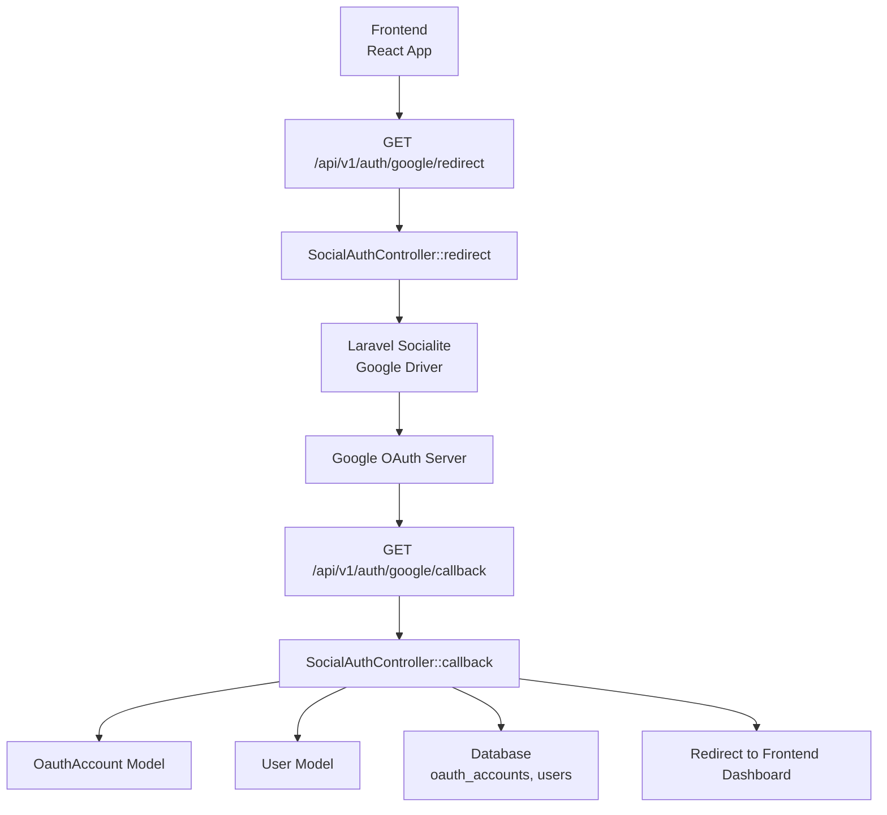
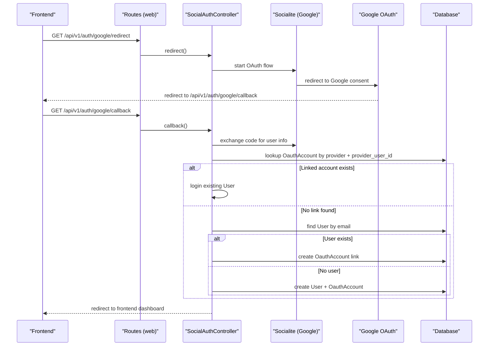
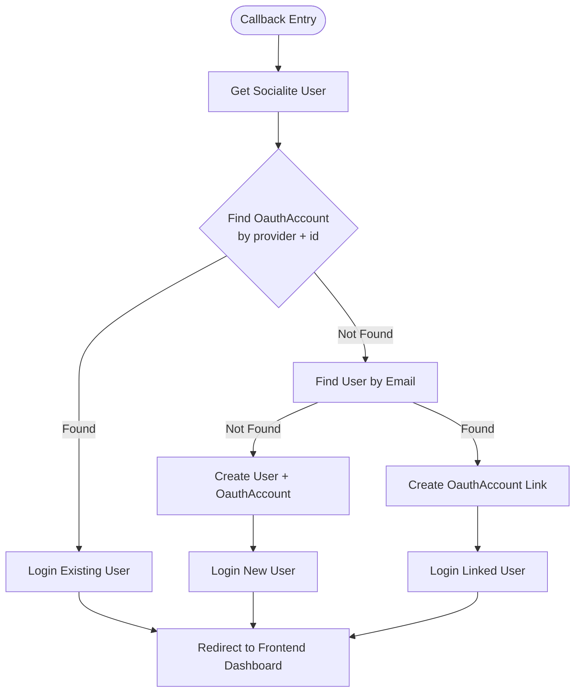
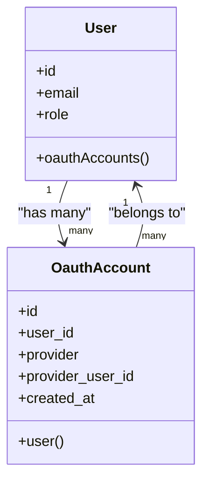
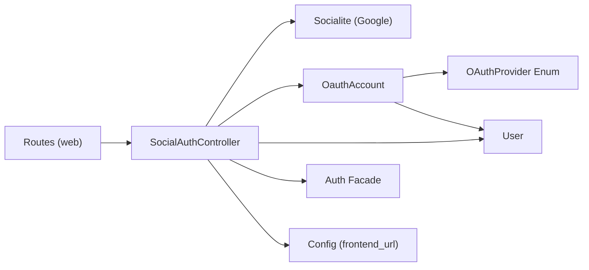

# Social Authentication

<cite>
**Referenced Files in This Document**
- [SocialAuthController.php](file://app/Http/Controllers/Auth/SocialAuthController.php)
- [OauthAccount.php](file://app/Models/OauthAccount.php)
- [User.php](file://app/Models/User.php)
- [OAuthProvider.php](file://app/Enums/OAuthProvider.php)
- [services.php](file://config/services.php)
- [web.php](file://routes/web.php)
- [2024_01_01_000010_create_oauth_accounts_table.php](file://database/migrations/2024_01_01_000010_create_oauth_accounts_table.php)
- [api.ts](file://frontend/src/features/auth/api.ts)
</cite>

## Table of Contents
1. [Introduction](#introduction)
2. [Project Structure](#project-structure)
3. [Core Components](#core-components)
4. [Architecture Overview](#architecture-overview)
5. [Detailed Component Analysis](#detailed-component-analysis)
6. [Dependency Analysis](#dependency-analysis)
7. [Performance Considerations](#performance-considerations)
8. [Troubleshooting Guide](#troubleshooting-guide)
9. [Conclusion](#conclusion)
10. [Appendices](#appendices)

## Introduction
This document explains the social authentication integration implemented with Laravel Socialite and Google OAuth. It covers the controller flow, provider configuration, user account linking via the OauthAccount model, and the database schema that supports multiple provider accounts per user. It also provides guidance for extending to additional providers (e.g., Facebook), handling callbacks, error scenarios, account merging strategies, and security considerations such as state validation, scope management, and CSRF protection.

## Project Structure
The social authentication feature spans controllers, models, enums, routes, configuration, migrations, and frontend integration:

- Controller: Handles redirect to the provider and callback processing
- Model: Stores provider-specific linkage to a user
- Enum: Type-safe provider identifiers
- Routes: Expose redirect and callback endpoints under a session-based group
- Configuration: Provider credentials and redirect URI
- Migration: Defines the oauth_accounts table structure
- Frontend: Builds the redirect URL used by the UI

**Diagram sources**
- [web.php:23-32](file://routes/web.php#L23-L32)
- [SocialAuthController.php:27-48](file://app/Http/Controllers/Auth/SocialAuthController.php#L27-L48)
- [services.php:38-42](file://config/services.php#L38-L42)
- [2024_01_01_000010_create_oauth_accounts_table.php:13-21](file://database/migrations/2024_01_01_000010_create_oauth_accounts_table.php#L13-L21)

**Section sources**
- [web.php:23-32](file://routes/web.php#L23-L32)
- [SocialAuthController.php:27-48](file://app/Http/Controllers/Auth/SocialAuthController.php#L27-L48)
- [services.php:38-42](file://config/services.php#L38-L42)
- [2024_01_01_000010_create_oauth_accounts_table.php:13-21](file://database/migrations/2024_01_01_000010_create_oauth_accounts_table.php#L13-L21)
- [api.ts:4](file://frontend/src/features/auth/api.ts#L4)

## Core Components
- SocialAuthController: Orchestrates Google OAuth redirect and callback, resolves or creates a local User, links provider identity, and logs the user in.
- OauthAccount: Represents a provider-linked account tied to a User; enforces uniqueness per provider and provider_user_id.
- User: The application’s user entity; includes a relationship to linked OAuth accounts.
- OAuthProvider enum: Centralizes supported provider identifiers.
- services.php: Holds Google client credentials and redirect URI.
- web.php: Registers guest-only routes for redirect and callback under the session middleware group.
- Migration: Creates the oauth_accounts table with foreign key constraints and indexes.

Key behaviors:
- Redirect initiates Google OAuth using Socialite’s driver.
- Callback retrieves the authenticated user from Google, finds or creates a local User by email, links the provider identity, and logs the user in.
- New users are created with a default role and verified email timestamp; a Registered event is fired.

**Section sources**
- [SocialAuthController.php:27-74](file://app/Http/Controllers/Auth/SocialAuthController.php#L27-L74)
- [OauthAccount.php:11-33](file://app/Models/OauthAccount.php#L11-L33)
- [User.php:74-77](file://app/Models/User.php#L74-L77)
- [OAuthProvider.php:7-10](file://app/Enums/OAuthProvider.php#L7-L10)
- [services.php:38-42](file://config/services.php#L38-L42)
- [web.php:26-32](file://routes/web.php#L26-L32)
- [2024_01_01_000010_create_oauth_accounts_table.php:13-21](file://database/migrations/2024_01_01_000010_create_oauth_accounts_table.php#L13-L21)

## Architecture Overview
The flow uses Laravel Socialite to delegate authentication to Google. After successful authorization, Google redirects back to the application’s callback endpoint. The controller then:
- Resolves an existing user by provider linkage if present
- Otherwise, matches by email to avoid duplicates
- Creates a new user if necessary
- Links the provider identity
- Logs the user into the session and redirects to the frontend dashboard

**Diagram sources**
- [web.php:26-32](file://routes/web.php#L26-L32)
- [SocialAuthController.php:27-74](file://app/Http/Controllers/Auth/SocialAuthController.php#L27-L74)
- [services.php:38-42](file://config/services.php#L38-L42)
- [2024_01_01_000010_create_oauth_accounts_table.php:13-21](file://database/migrations/2024_01_01_000010_create_oauth_accounts_table.php#L13-L21)

## Detailed Component Analysis

### SocialAuthController
Responsibilities:
- Initiate Google OAuth redirect
- Process callback, resolve or create user, link provider identity, and log in
- Redirect to the configured frontend URL after successful authentication

Flow highlights:
- Uses Socialite’s Google driver for both redirect and user retrieval
- Looks up an existing OauthAccount by provider and provider_user_id
- If not found, attempts to match by email to prevent duplicate accounts
- Creates a new User when none exists, sets a default role, marks email as verified, and fires a Registered event
- Always ensures an OauthAccount record exists for the provider and user

Security notes:
- Routes are protected by the guest middleware to prevent authenticated users from re-entering the flow unintentionally
- Session-based auth routes run under the web middleware group, enabling CSRF protection for session cookies

**Diagram sources**
- [SocialAuthController.php:32-74](file://app/Http/Controllers/Auth/SocialAuthController.php#L32-L74)

**Section sources**
- [SocialAuthController.php:27-74](file://app/Http/Controllers/Auth/SocialAuthController.php#L27-L74)

### OauthAccount Model and Relationships
- Stores provider identity linkage to a User
- Enforces uniqueness on (provider, provider_user_id) to prevent duplicate links
- Provides a belongsTo relationship to User
- The User model exposes a hasMany relationship to its linked OAuth accounts

Data integrity:
- Foreign key constraint on user_id with cascade delete
- Index on user_id for efficient lookups

**Diagram sources**
- [User.php:74-77](file://app/Models/User.php#L74-L77)
- [OauthAccount.php:11-33](file://app/Models/OauthAccount.php#L11-L33)
- [2024_01_01_000010_create_oauth_accounts_table.php:13-21](file://database/migrations/2024_01_01_000010_create_oauth_accounts_table.php#L13-L21)

**Section sources**
- [OauthAccount.php:11-33](file://app/Models/OauthAccount.php#L11-L33)
- [User.php:74-77](file://app/Models/User.php#L74-L77)
- [2024_01_01_000010_create_oauth_accounts_table.php:13-21](file://database/migrations/2024_01_01_000010_create_oauth_accounts_table.php#L13-L21)

### OAuth Provider Configuration
- Google credentials and redirect URI are stored in the services configuration
- Environment variables provide values for client ID, client secret, and redirect URI
- The controller uses the named driver “google” to interact with Socialite

Configuration references:
- Client ID, secret, and redirect URI are read from environment-backed config
- The frontend constructs the redirect URL using the API base URL

**Section sources**
- [services.php:38-42](file://config/services.php#L38-L42)
- [api.ts:4](file://frontend/src/features/auth/api.ts#L4)

### Routes and Middleware
- Redirect and callback routes are registered under a prefix and protected by guest middleware
- They reside in the web middleware group to enable session and CSRF protection for browser-based flows

**Section sources**
- [web.php:26-32](file://routes/web.php#L26-L32)

### Database Schema
- oauth_accounts table stores provider linkage
- Unique constraint prevents duplicate provider-user mappings
- Indexes optimize queries by user_id and provider+id combinations

**Section sources**
- [2024_01_01_000010_create_oauth_accounts_table.php:13-21](file://database/migrations/2024_01_01_000010_create_oauth_accounts_table.php#L13-L21)

## Dependency Analysis
High-level dependencies:
- SocialAuthController depends on:
  - Laravel Socialite (Google driver)
  - OauthAccount model
  - User model
  - Auth facade for session login
  - Config for frontend redirect URL
- OauthAccount depends on:
  - OAuthProvider enum
  - User model (relationship)
- Routes depend on:
  - SocialAuthController methods
  - Web middleware group for sessions and CSRF

**Diagram sources**
- [SocialAuthController.php:7-18](file://app/Http/Controllers/Auth/SocialAuthController.php#L7-L18)
- [OauthAccount.php:7-33](file://app/Models/OauthAccount.php#L7-L33)
- [web.php:26-32](file://routes/web.php#L26-L32)

**Section sources**
- [SocialAuthController.php:7-18](file://app/Http/Controllers/Auth/SocialAuthController.php#L7-L18)
- [OauthAccount.php:7-33](file://app/Models/OauthAccount.php#L7-L33)
- [web.php:26-32](file://routes/web.php#L26-L32)

## Performance Considerations
- Query efficiency:
  - Lookups use indexed columns (provider, provider_user_id unique index; user_id index)
  - Email-based user resolution is a single query; consider adding an index on email if not already present
- Minimize N+1:
  - The controller performs minimal queries; ensure no eager loading is needed beyond current logic
- Redirects:
  - Redirect to frontend avoids heavy server-side rendering
- Scalability:
  - For high traffic, consider caching provider user profiles briefly if repeated lookups occur

[No sources needed since this section provides general guidance]

## Troubleshooting Guide
Common issues and resolutions:
- Invalid or missing provider credentials:
  - Ensure GOOGLE_CLIENT_ID, GOOGLE_CLIENT_SECRET, and GOOGLE_REDIRECT_URI are set correctly in the environment and match the Google Console configuration
- Redirect mismatch:
  - The callback route must exactly match the redirect URI configured in Google Console
- Duplicate accounts:
  - The controller matches by email before creating a new user; verify email normalization and case sensitivity
- State parameter validation:
  - Socialite handles state validation internally; ensure your app does not bypass Socialite’s verification
- Scope mismatches:
  - If profile fields are missing, adjust requested scopes in Socialite configuration to include required data
- CSRF and session errors:
  - Routes are under the web middleware group; ensure cookies and sessions are enabled and CORS settings allow the SPA domain

**Section sources**
- [services.php:38-42](file://config/services.php#L38-L42)
- [web.php:26-32](file://routes/web.php#L26-L32)
- [SocialAuthController.php:32-74](file://app/Http/Controllers/Auth/SocialAuthController.php#L32-L74)

## Conclusion
The implementation provides a secure, extensible foundation for social authentication using Google OAuth. It centralizes provider configuration, enforces data integrity through unique constraints, and integrates cleanly with the application’s user model and session-based authentication. Extending to additional providers involves adding configuration entries, updating the controller to handle provider-specific flows, and ensuring proper account linking and merging strategies.

[No sources needed since this section summarizes without analyzing specific files]

## Appendices

### Adding a New Provider (e.g., Facebook)
Steps:
- Add provider entry in services configuration with client ID, secret, and redirect URI
- Extend the OAuthProvider enum to include the new provider
- Update the controller to support the new provider:
  - Provide a dedicated redirect method or parameterized redirect
  - Handle callback logic similar to Google, including user resolution and linking
- Register routes for the new provider’s redirect and callback endpoints
- Adjust scopes in Socialite configuration to request necessary profile data

**Section sources**
- [services.php:38-42](file://config/services.php#L38-L42)
- [OAuthProvider.php:7-10](file://app/Enums/OAuthProvider.php#L7-L10)
- [SocialAuthController.php:27-74](file://app/Http/Controllers/Auth/SocialAuthController.php#L27-L74)
- [web.php:26-32](file://routes/web.php#L26-L32)

### Security Considerations
- State parameter validation: Delegated to Socialite; do not bypass
- CSRF protection: Provided by web middleware group for session-based routes
- Scope management: Request only necessary scopes; validate returned data
- Account linking: Use unique constraints to prevent duplicate provider-user mappings
- Email verification: New users created via social login are marked as verified; consider aligning with your verification policy

**Section sources**
- [web.php:26-32](file://routes/web.php#L26-L32)
- [2024_01_01_000010_create_oauth_accounts_table.php:13-21](file://database/migrations/2024_01_01_000010_create_oauth_accounts_table.php#L13-L21)
- [SocialAuthController.php:50-74](file://app/Http/Controllers/Auth/SocialAuthController.php#L50-L74)