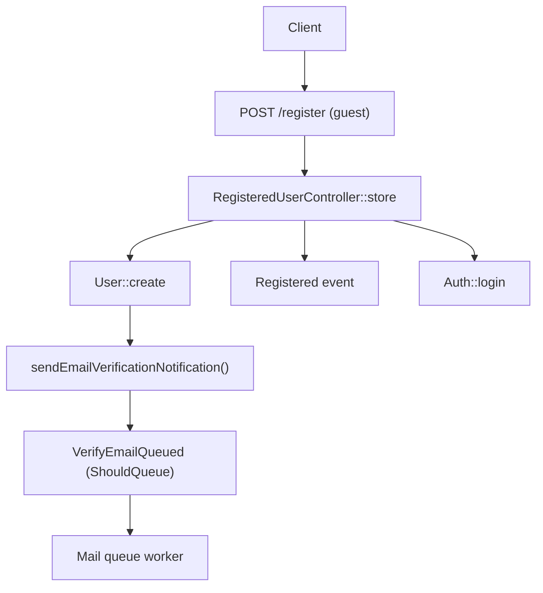
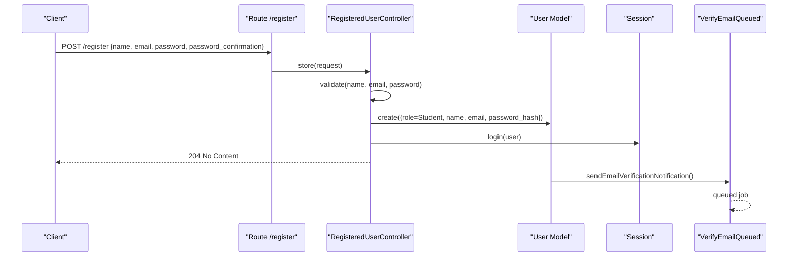
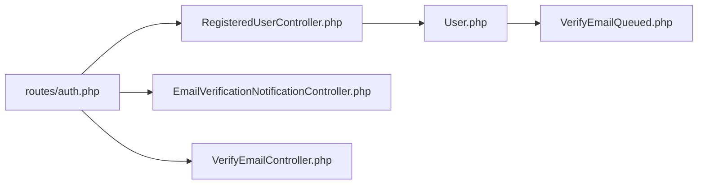

# User Registration

<cite>
**Referenced Files in This Document**
- [RegisteredUserController.php](file://app/Http/Controllers/Auth/RegisteredUserController.php)
- [User.php](file://app/Models/User.php)
- [auth.php](file://routes/auth.php)
- [api.php](file://routes/api.php)
- [EmailVerificationNotificationController.php](file://app/Http/Controllers/Auth/EmailVerificationNotificationController.php)
- [VerifyEmailController.php](file://app/Http/Controllers/Auth/VerifyEmailController.php)
- [VerifyEmailQueued.php](file://app/Notifications/VerifyEmailQueued.php)
- [RegistrationTest.php](file://tests/Feature/Auth/RegistrationTest.php)
- [EmailVerificationTest.php](file://tests/Feature/Auth/EmailVerificationTest.php)
- [session.php](file://config/session.php)
- [sanctum.php](file://config/sanctum.php)
- [app.php](file://config/app.php)
</cite>

## Table of Contents
1. [Introduction](#introduction)
2. [Project Structure](#project-structure)
3. [Core Components](#core-components)
4. [Architecture Overview](#architecture-overview)
5. [Detailed Component Analysis](#detailed-component-analysis)
6. [Dependency Analysis](#dependency-analysis)
7. [Performance Considerations](#performance-considerations)
8. [Troubleshooting Guide](#troubleshooting-guide)
9. [Conclusion](#conclusion)

## Introduction
This document explains the user registration flow in ResNet Academy, covering form validation, account creation, email verification initiation, and session setup. It focuses on the RegisteredUserController implementation, request validation rules, the User model relationships, API endpoints, request/response schemas, error handling patterns, and integration with the email verification system. Security measures such as password hashing, CSRF protection via Sanctum’s middleware, and rate limiting considerations are also addressed.

## Project Structure
The registration feature spans controllers, routes, models, notifications, configuration, and tests:
- Controller: Handles registration requests and creates users.
- Routes: Define public registration and email verification endpoints.
- Model: Defines user attributes, casts, and email verification behavior.
- Notifications: Queues verification emails to avoid failing the registration response.
- Configuration: Session and Sanctum settings for secure cookies and CSRF protection; frontend URL used for post-verification redirects.
- Tests: Validate registration behavior, role assignment, queued verification, and email verification redirect behavior.

**Diagram sources**
- [RegisteredUserController.php:26-46](file://app/Http/Controllers/Auth/RegisteredUserController.php#L26-L46)
- [User.php:69-72](file://app/Models/User.php#L69-L72)
- [VerifyEmailQueued.php:18-21](file://app/Notifications/VerifyEmailQueued.php#L18-L21)
- [auth.php:11-13](file://routes/auth.php#L11-L13)

**Section sources**
- [RegisteredUserController.php:26-46](file://app/Http/Controllers/Auth/RegisteredUserController.php#L26-L46)
- [auth.php:11-13](file://routes/auth.php#L11-L13)
- [User.php:24-55](file://app/Models/User.php#L24-L55)
- [VerifyEmailQueued.php:18-21](file://app/Notifications/VerifyEmailQueued.php#L18-L21)

## Core Components
- RegisteredUserController::store validates inputs, creates a student user, triggers the Registered event, logs the user in via session, and returns no content.
- User model implements MustVerifyEmail, overrides the password attribute name to password_hash, hides password_hash, casts role/status/email_verified_at/last_login_at/password_hash, and queues verification emails.
- Email verification flows include resending a verification notification and verifying via signed link with throttling.

Key responsibilities:
- Validation: name, email uniqueness, password strength and confirmation.
- Persistence: create user with role Student and hashed password.
- Post-create actions: fire Registered event, log in user, queue verification email.
- Verification: resend or verify via signed route with throttle.

**Section sources**
- [RegisteredUserController.php:26-46](file://app/Http/Controllers/Auth/RegisteredUserController.php#L26-L46)
- [User.php:19-72](file://app/Models/User.php#L19-L72)
- [EmailVerificationNotificationController.php:13-22](file://app/Http/Controllers/Auth/EmailVerificationNotificationController.php#L13-L22)
- [VerifyEmailController.php:18-33](file://app/Http/Controllers/Auth/VerifyEmailController.php#L18-L33)

## Architecture Overview
The registration architecture uses a guest-only POST endpoint that validates input, persists a new student user, starts a session, and queues an email verification. The email verification is decoupled via a queued notification so mail failures do not affect the registration response. A separate verified link flow marks the email verified and redirects to the frontend dashboard.

**Diagram sources**
- [auth.php:11-13](file://routes/auth.php#L11-L13)
- [RegisteredUserController.php:26-46](file://app/Http/Controllers/Auth/RegisteredUserController.php#L26-L46)
- [User.php:69-72](file://app/Models/User.php#L69-L72)
- [VerifyEmailQueued.php:18-21](file://app/Notifications/VerifyEmailQueued.php#L18-L21)

## Detailed Component Analysis

### RegisteredUserController Implementation
- Validates name, email (unique), and password (confirmed, defaults).
- Creates a user with role Student and hashed password.
- Fires the Registered event and logs the user in using the web guard session.
- Returns HTTP 204 No Content on success.

Request schema:
- name: string, required, max length enforced by validation rule.
- email: string, required, lowercase, valid email format, unique against users.
- password: string, required, confirmed, meets default password policy.

Response schema:
- Success: 204 No Content.
- Validation errors: standard Laravel validation exception with field-specific messages.

Security notes:
- Passwords are hashed before storage.
- Role is always set to Student; client-supplied roles are ignored.

**Section sources**
- [RegisteredUserController.php:26-46](file://app/Http/Controllers/Auth/RegisteredUserController.php#L26-L46)
- [RegistrationTest.php:11-22](file://tests/Feature/Auth/RegistrationTest.php#L11-L22)
- [RegistrationTest.php:24-34](file://tests/Feature/Auth/RegistrationTest.php#L24-L34)

### Request Validation Rules
- name: required string with a maximum length constraint.
- email: required, lowercase, valid email format, unique across users.
- password: required, confirmed, and must satisfy the application’s default password rules.

Validation failures result in a validation exception with per-field messages.

**Section sources**
- [RegisteredUserController.php:28-32](file://app/Http/Controllers/Auth/RegisteredUserController.php#L28-L32)

### User Model Relationships and Behavior
- Implements MustVerifyEmail and overrides the password attribute name to password_hash.
- Hides password_hash from array serialization.
- Casts role and status to enums, timestamps to datetime, and password_hash to hashed.
- Provides relationships for OAuth accounts, enrolments, courses created, courses taught, and orders.

Email verification behavior:
- sendEmailVerificationNotification dispatches a queued VerifyEmailQueued notification, ensuring mail issues do not fail the registration request.

**Section sources**
- [User.php:19-72](file://app/Models/User.php#L19-L72)
- [VerifyEmailQueued.php:11-21](file://app/Notifications/VerifyEmailQueued.php#L11-L21)

### Email Verification System Integration
- Resend verification: authenticated POST to /email/verification-notification returns either already verified or verification-link-sent.
- Verify email: GET /verify-email/{id}/{hash} with auth, signed, and throttle middleware verifies the email and redirects to the configured frontend dashboard with a verified flag.

Throttling:
- Verification link and resend endpoints are rate-limited to prevent abuse.

Redirect target:
- Redirects to the configured frontend_url + /dashboard?verified=1.

**Section sources**
- [EmailVerificationNotificationController.php:13-22](file://app/Http/Controllers/Auth/EmailVerificationNotificationController.php#L13-L22)
- [VerifyEmailController.php:18-33](file://app/Http/Controllers/Auth/VerifyEmailController.php#L18-L33)
- [auth.php:27-33](file://routes/auth.php#L27-L33)
- [app.php:57-68](file://config/app.php#L57-L68)

### API Endpoints and Schemas
- Register
  - Method: POST
  - Path: /register (guest only)
  - Request body: name, email, password, password_confirmation
  - Response: 204 No Content on success
  - Errors: 422 Unprocessable Entity for validation failures
- Resend verification
  - Method: POST
  - Path: /email/verification-notification (authenticated)
  - Response: JSON with status indicating already verified or verification link sent
  - Throttle: applied
- Verify email
  - Method: GET
  - Path: /verify-email/{id}/{hash} (authenticated, signed, throttled)
  - Response: Redirect to frontend dashboard with verified flag

Note: While the test file references /api/v1/register, the registered route definition shows /register under the web routes group. Use the route defined in the authentication routes file for registration.

**Section sources**
- [auth.php:11-13](file://routes/auth.php#L11-L13)
- [auth.php:27-33](file://routes/auth.php#L27-L33)
- [EmailVerificationNotificationController.php:13-22](file://app/Http/Controllers/Auth/EmailVerificationNotificationController.php#L13-L22)
- [VerifyEmailController.php:18-33](file://app/Http/Controllers/Auth/VerifyEmailController.php#L18-L33)
- [RegistrationTest.php:11-22](file://tests/Feature/Auth/RegistrationTest.php#L11-L22)

### Error Handling Patterns
- ValidationException thrown for invalid input during registration.
- Signed route verification enforces correct id/hash; invalid links do not mark the email as verified.
- Throttling protects verification endpoints from abuse.
- Queued verification ensures transient mail errors do not cause 500 responses during registration.

**Section sources**
- [RegisteredUserController.php:28-32](file://app/Http/Controllers/Auth/RegisteredUserController.php#L28-L32)
- [EmailVerificationTest.php:10-26](file://tests/Feature/Auth/EmailVerificationTest.php#L10-L26)
- [EmailVerificationTest.php:48-60](file://tests/Feature/Auth/EmailVerificationTest.php#L48-L60)
- [VerifyEmailQueued.php:11-21](file://app/Notifications/VerifyEmailQueued.php#L11-L21)

### Security Measures
- Password hashing: passwords are hashed before being stored in the password_hash column.
- CSRF protection: Sanctum’s middleware stack includes CSRF validation for stateful requests; session cookies are configured with http_only and same_site options.
- Rate limiting: verification endpoints are throttled; registration itself does not have explicit throttle middleware in the route definition.
- Session security: session driver, lifetime, encryption, cookie domain/path, secure flag, http_only, and same_site are configurable.

**Section sources**
- [RegisteredUserController.php:34-39](file://app/Http/Controllers/Auth/RegisteredUserController.php#L34-L39)
- [sanctum.php:81-85](file://config/sanctum.php#L81-L85)
- [session.php:120-202](file://config/session.php#L120-L202)
- [auth.php:27-33](file://routes/auth.php#L27-L33)

## Dependency Analysis
The registration flow depends on routing, controller logic, model behavior, and notification queuing.

**Diagram sources**
- [auth.php:11-13](file://routes/auth.php#L11-L13)
- [RegisteredUserController.php:26-46](file://app/Http/Controllers/Auth/RegisteredUserController.php#L26-L46)
- [User.php:69-72](file://app/Models/User.php#L69-L72)
- [VerifyEmailQueued.php:18-21](file://app/Notifications/VerifyEmailQueued.php#L18-L21)
- [EmailVerificationNotificationController.php:13-22](file://app/Http/Controllers/Auth/EmailVerificationNotificationController.php#L13-L22)
- [VerifyEmailController.php:18-33](file://app/Http/Controllers/Auth/VerifyEmailController.php#L18-L33)

**Section sources**
- [auth.php:11-13](file://routes/auth.php#L11-L13)
- [RegisteredUserController.php:26-46](file://app/Http/Controllers/Auth/RegisteredUserController.php#L26-L46)
- [User.php:69-72](file://app/Models/User.php#L69-L72)
- [VerifyEmailQueued.php:18-21](file://app/Notifications/VerifyEmailQueued.php#L18-L21)
- [EmailVerificationNotificationController.php:13-22](file://app/Http/Controllers/Auth/EmailVerificationNotificationController.php#L13-L22)
- [VerifyEmailController.php:18-33](file://app/Http/Controllers/Auth/VerifyEmailController.php#L18-L33)

## Performance Considerations
- Email verification is queued to avoid blocking the registration response on mail delivery. Ensure queue workers are running and properly configured.
- Throttling on verification endpoints reduces load from repeated attempts.
- Database-backed sessions and queues can introduce contention at scale; consider Redis for cache/session/queue if needed.

[No sources needed since this section provides general guidance]

## Troubleshooting Guide
Common issues and resolutions:
- Registration fails with validation errors: check name, email format/uniqueness, and password confirmation/strength.
- Email not received after registration: verify queue workers are running; queued verification may be delayed or failed.
- Email verification link does not work: ensure the link is valid and unexpired; invalid hashes will not mark the email as verified.
- Redirect after verification goes to unexpected page: the controller hard-codes redirect to the configured frontend URL plus /dashboard?verified=1.

**Section sources**
- [RegisteredUserController.php:28-32](file://app/Http/Controllers/Auth/RegisteredUserController.php#L28-L32)
- [VerifyEmailQueued.php:11-21](file://app/Notifications/VerifyEmailQueued.php#L11-L21)
- [EmailVerificationTest.php:10-26](file://tests/Feature/Auth/EmailVerificationTest.php#L10-L26)
- [EmailVerificationTest.php:48-60](file://tests/Feature/Auth/EmailVerificationTest.php#L48-L60)
- [VerifyEmailController.php:28-33](file://app/Http/Controllers/Auth/VerifyEmailController.php#L28-L33)

## Conclusion
ResNet Academy’s registration flow validates inputs securely, creates student accounts with hashed passwords, initiates a queued email verification, and establishes a session. Email verification is protected by signed routes and throttling, and redirects to the configured frontend dashboard. Security is reinforced through password hashing, CSRF protection via Sanctum middleware, and configurable session policies. For robust operation, ensure queue workers are running and consider adding explicit rate limiting to registration endpoints in production.

[No sources needed since this section summarizes without analyzing specific files]