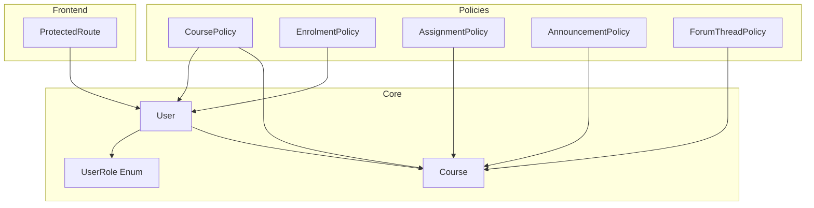
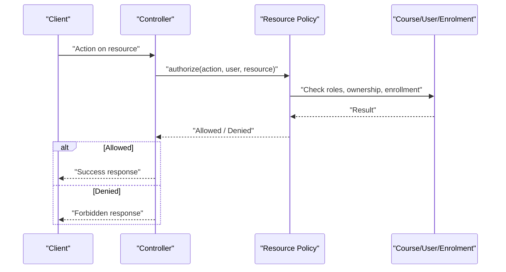
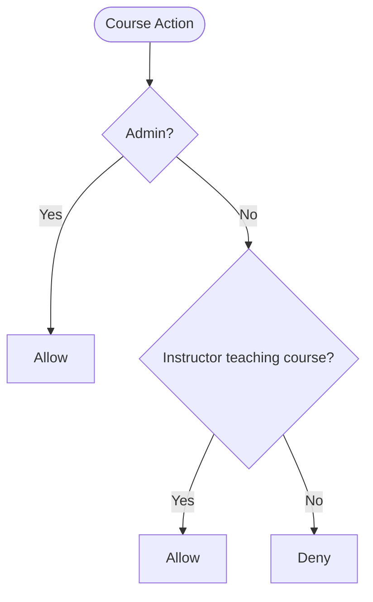
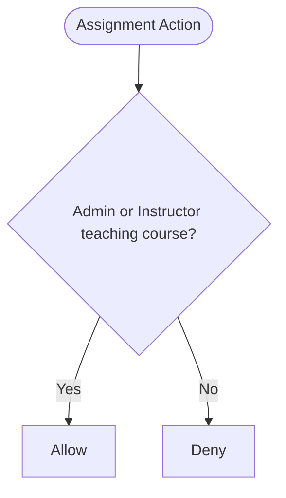
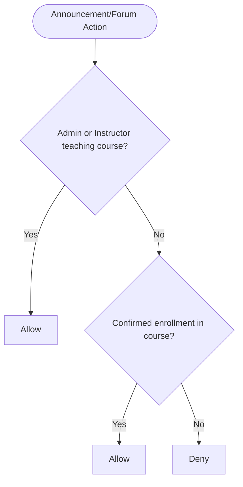
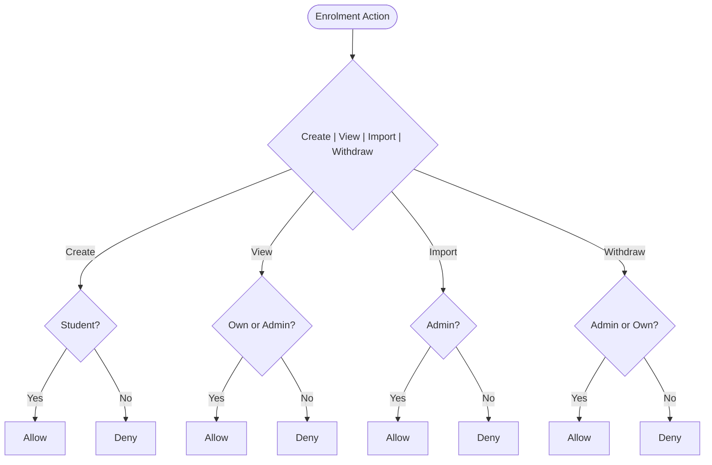
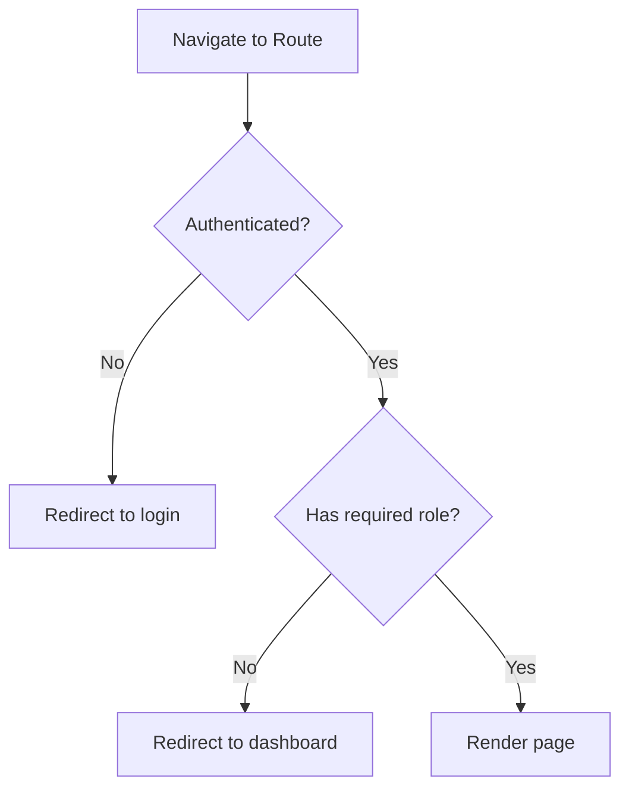
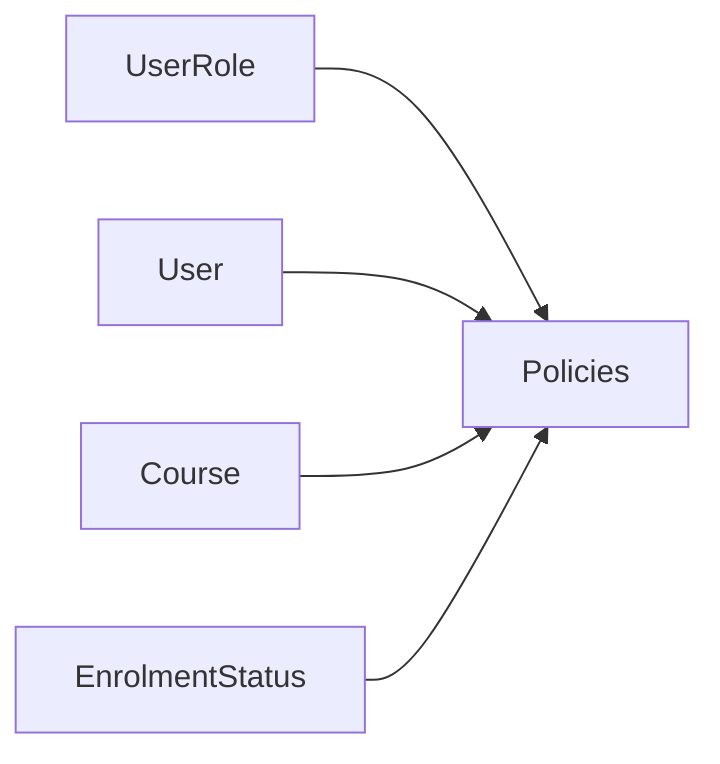

# Authorization & Policies

<cite>
**Referenced Files in This Document**
- [User.php](file://app/Models/User.php)
- [Course.php](file://app/Models/Course.php)
- [UserRole.php](file://app/Enums/UserRole.php)
- [auth.php](file://config/auth.php)
- [CoursePolicy.php](file://app/Policies/CoursePolicy.php)
- [EnrolmentPolicy.php](file://app/Policies/EnrolmentPolicy.php)
- [AssignmentPolicy.php](file://app/Policies/AssignmentPolicy.php)
- [AnnouncementPolicy.php](file://app/Policies/AnnouncementPolicy.php)
- [ForumThreadPolicy.php](file://app/Policies/ForumThreadPolicy.php)
- [ProtectedRoute.tsx](file://frontend/src/components/layout/ProtectedRoute.tsx)
</cite>

## Table of Contents
1. Introduction
2. Project Structure
3. Core Components
4. Architecture Overview
5. Detailed Component Analysis
6. Dependency Analysis
7. Performance Considerations
8. Troubleshooting Guide
9. Conclusion

## Introduction
This document explains the authorization and policy system that enforces role-based access control (RBAC) for students, instructors, and administrators. It covers how policies define fine-grained permissions on resources such as courses, assignments, announcements, forums, and enrolments; how role hierarchy is enforced; and how authorization integrates with course access control and enrollment validation. It also provides guidance for creating custom policies and extending the system safely.

## Project Structure
The authorization system is centered around:
- A User model with a role enum to identify Admin, Instructor, and Student.
- Policy classes per resource that encapsulate permission logic.
- Course-level relationships and helper methods used by policies to determine instructor ownership and student enrollment.
- Frontend route guards that provide UX-level protection while relying on server-side policies for real security.

**Diagram sources**
- [User.php:24-55](file://app/Models/User.php#L24-L55)
- [UserRole.php:7-12](file://app/Enums/UserRole.php#L7-L12)
- [Course.php:74-81](file://app/Models/Course.php#L74-L81)
- [CoursePolicy.php:11-49](file://app/Policies/CoursePolicy.php#L11-L49)
- [EnrolmentPolicy.php:11-43](file://app/Policies/EnrolmentPolicy.php#L11-L43)
- [AssignmentPolicy.php:13-43](file://app/Policies/AssignmentPolicy.php#L13-L43)
- [AnnouncementPolicy.php:13-35](file://app/Policies/AnnouncementPolicy.php#L13-L35)
- [ForumThreadPolicy.php:13-49](file://app/Policies/ForumThreadPolicy.php#L13-L49)
- [ProtectedRoute.tsx:17-33](file://frontend/src/components/layout/ProtectedRoute.tsx#L17-L33)

**Section sources**
- [User.php:24-55](file://app/Models/User.php#L24-L55)
- [UserRole.php:7-12](file://app/Enums/UserRole.php#L7-L12)
- [Course.php:74-81](file://app/Models/Course.php#L74-L81)
- [ProtectedRoute.tsx:17-33](file://frontend/src/components/layout/ProtectedRoute.tsx#L17-L33)

## Core Components
- Role model and enum: The User model casts its role to an enum defining Admin, Instructor, and Student. This enables strict, type-safe role checks across policies.
- Authentication provider: The auth configuration uses the Eloquent user provider backed by the User model, ensuring policies receive a fully loaded User instance.
- Resource models and helpers: Course exposes relationships to instructors and a helper method to check if a user teaches the course. Enrolments link students to courses with status tracking.
- Policies: Each resource has a policy class that centralizes permission rules, combining role checks with resource-specific context (e.g., course ownership or confirmed enrollment).

Key patterns:
- Admins have broad access where explicitly allowed.
- Instructors can manage resources within courses they teach.
- Students can act on their own data (e.g., view/withdraw their enrolments) and access resources tied to confirmed enrollment.

**Section sources**
- [User.php:24-55](file://app/Models/User.php#L24-L55)
- [auth.php:64-68](file://config/auth.php#L64-L68)
- [Course.php:74-81](file://app/Models/Course.php#L74-L81)
- [CoursePolicy.php:11-49](file://app/Policies/CoursePolicy.php#L11-L49)
- [EnrolmentPolicy.php:11-43](file://app/Policies/EnrolmentPolicy.php#L11-L43)

## Architecture Overview
Authorization flows through three layers:
- Request arrives at a controller/service.
- The request invokes a policy method to validate the action against the current user and resource context.
- If authorized, the operation proceeds; otherwise, it is denied.

[No sources needed since this diagram shows conceptual workflow, not actual code structure]

## Detailed Component Analysis

### Roles and Identity
- Roles are defined as an enum with values Admin, Instructor, Student.
- The User model casts the role field to this enum, enabling consistent comparisons in policies.
- Authentication uses the Eloquent provider configured to use the User model.

Practical implications:
- Policies can rely on $user->role being one of the defined enums.
- Admin privileges are explicit and limited to specific policy methods rather than implicit global access.

**Section sources**
- [UserRole.php:7-12](file://app/Enums/UserRole.php#L7-L12)
- [User.php:24-55](file://app/Models/User.php#L24-L55)
- [auth.php:64-68](file://config/auth.php#L64-L68)

### Course Access Control
- Creating/updating/deleting courses is restricted to Admins.
- Updating and viewing gradebook/analytics require Admin or an Instructor who teaches the course.
- The Course model provides a helper to check if a user teaches the course via the many-to-many relationship.

**Diagram sources**
- [CoursePolicy.php:13-48](file://app/Policies/CoursePolicy.php#L13-L48)
- [Course.php:74-81](file://app/Models/Course.php#L74-L81)

**Section sources**
- [CoursePolicy.php:13-48](file://app/Policies/CoursePolicy.php#L13-L48)
- [Course.php:74-81](file://app/Models/Course.php#L74-L81)

### Assignment Management and Grading
- Creating, updating, deleting assignments requires Admin or an Instructor who teaches the assignment’s course.
- Grading submissions follows the same “manage” rule, aligning grading with content ownership.

**Diagram sources**
- [AssignmentPolicy.php:15-42](file://app/Policies/AssignmentPolicy.php#L15-L42)

**Section sources**
- [AssignmentPolicy.php:15-42](file://app/Policies/AssignmentPolicy.php#L15-L42)

### Announcements and Forums
- Viewing announcements and forum threads requires Admin, an Instructor teaching the course, or a Student with confirmed enrollment in the course.
- Creating announcements is limited to Admin or Instructors teaching the course.
- Forum moderation (pinning/locking) is restricted to Admin or Instructors teaching the course.

**Diagram sources**
- [AnnouncementPolicy.php:15-30](file://app/Policies/AnnouncementPolicy.php#L15-L30)
- [ForumThreadPolicy.php:19-49](file://app/Policies/ForumThreadPolicy.php#L19-L49)

**Section sources**
- [AnnouncementPolicy.php:15-30](file://app/Policies/AnnouncementPolicy.php#L15-L30)
- [ForumThreadPolicy.php:19-49](file://app/Policies/ForumThreadPolicy.php#L19-L49)

### Enrolment Validation and Actions
- Students can create their own enrolments.
- Users can view their own enrolments; Admins can view any.
- Admins can import enrolments in bulk.
- Withdrawal is allowed for the student themselves or Admins.

**Diagram sources**
- [EnrolmentPolicy.php:13-42](file://app/Policies/EnrolmentPolicy.php#L13-L42)

**Section sources**
- [EnrolmentPolicy.php:13-42](file://app/Policies/EnrolmentPolicy.php#L13-L42)

### Frontend Route Protection
- ProtectedRoute ensures only authenticated users can access protected pages and optionally restricts by role for UX purposes.
- This is a convenience layer; all write operations must still be validated server-side via policies.

**Diagram sources**
- [ProtectedRoute.tsx:17-33](file://frontend/src/components/layout/ProtectedRoute.tsx#L17-L33)

**Section sources**
- [ProtectedRoute.tsx:17-33](file://frontend/src/components/layout/ProtectedRoute.tsx#L17-L33)

## Dependency Analysis
Policies depend on:
- UserRole enum for role checks.
- User model for identity and relationships (enrolments, courses taught).
- Course model for instructor membership and helper methods.
- EnrolmentStatus enum for confirming valid enrollment when required.

**Diagram sources**
- [UserRole.php:7-12](file://app/Enums/UserRole.php#L7-L12)
- [User.php:74-93](file://app/Models/User.php#L74-L93)
- [Course.php:74-81](file://app/Models/Course.php#L74-L81)
- [AnnouncementPolicy.php:7-8](file://app/Policies/AnnouncementPolicy.php#L7-L8)
- [ForumThreadPolicy.php:7-8](file://app/Policies/ForumThreadPolicy.php#L7-L8)

**Section sources**
- [UserRole.php:7-12](file://app/Enums/UserRole.php#L7-L12)
- [User.php:74-93](file://app/Models/User.php#L74-L93)
- [Course.php:74-81](file://app/Models/Course.php#L74-L81)
- [AnnouncementPolicy.php:7-8](file://app/Policies/AnnouncementPolicy.php#L7-L8)
- [ForumThreadPolicy.php:7-8](file://app/Policies/ForumThreadPolicy.php#L7-L8)

## Performance Considerations
- Prefer using existing model relationships and helper methods (e.g., checking instructor membership) to avoid N+1 queries.
- When verifying enrollment, scope queries to the relevant course and filter by confirmed status to minimize result sets.
- Cache expensive lookups (e.g., instructor memberships) at the service layer if called frequently within a single request.
- Keep policy methods small and focused to reduce complexity and improve readability and testability.

[No sources needed since this section provides general guidance]

## Troubleshooting Guide
Common issues and resolutions:
- Unauthorized access errors: Verify the policy method invoked matches the intended action and that the correct resource context is passed.
- Enrollment-dependent features blocked: Ensure the enrolment status is Confirmed and associated with the correct course before granting access.
- Instructor cannot manage resources: Confirm the instructor is linked to the course via the course-instructor relationship and that the policy checks the right course context.
- Frontend shows access but backend denies: Remember frontend guards are UX-only; always enforce server-side authorization in controllers/services.

**Section sources**
- [CoursePolicy.php:13-48](file://app/Policies/CoursePolicy.php#L13-L48)
- [AnnouncementPolicy.php:15-30](file://app/Policies/AnnouncementPolicy.php#L15-L30)
- [ForumThreadPolicy.php:19-49](file://app/Policies/ForumThreadPolicy.php#L19-L49)
- [ProtectedRoute.tsx:12-16](file://frontend/src/components/layout/ProtectedRoute.tsx#L12-L16)

## Conclusion
The authorization system combines a clear RBAC model with fine-grained, resource-specific policies. Admins have explicit administrative capabilities; instructors manage resources within their courses; students interact with their own data and resources tied to confirmed enrollment. Policies consistently leverage the User and Course models to enforce these rules. For new features, follow the established patterns: add a policy method, reuse model helpers, and ensure both frontend and backend enforce the intended boundaries.

[No sources needed since this section summarizes without analyzing specific files]