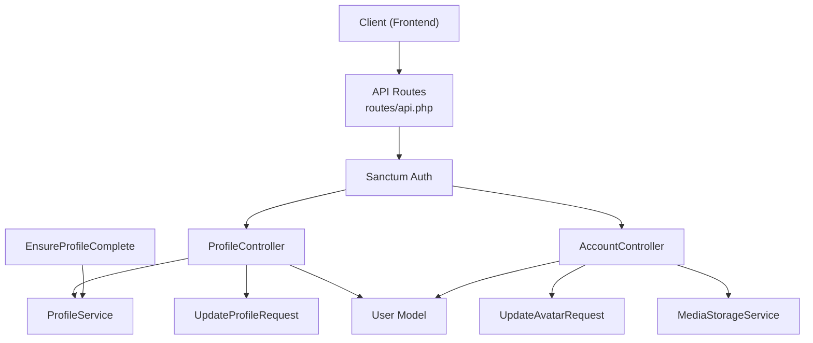
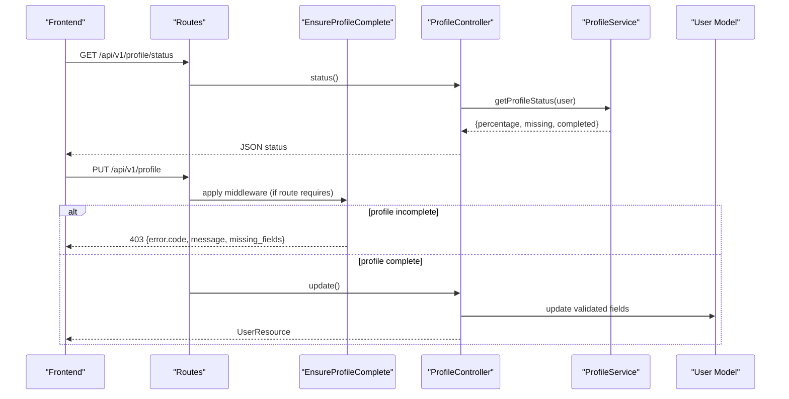
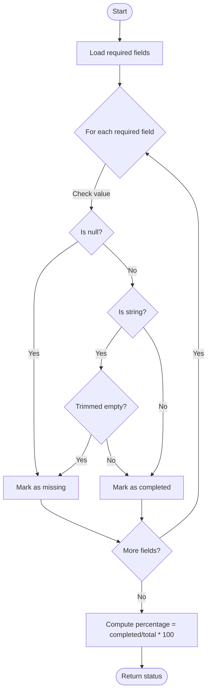
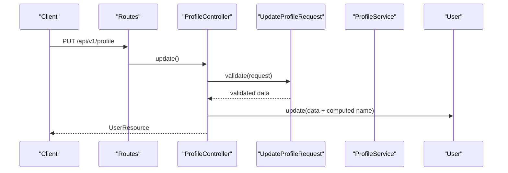
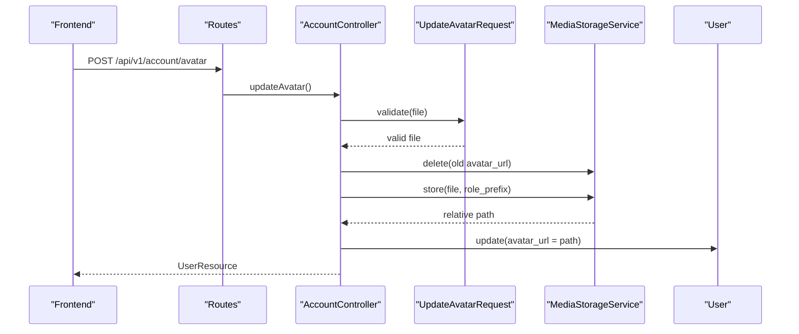
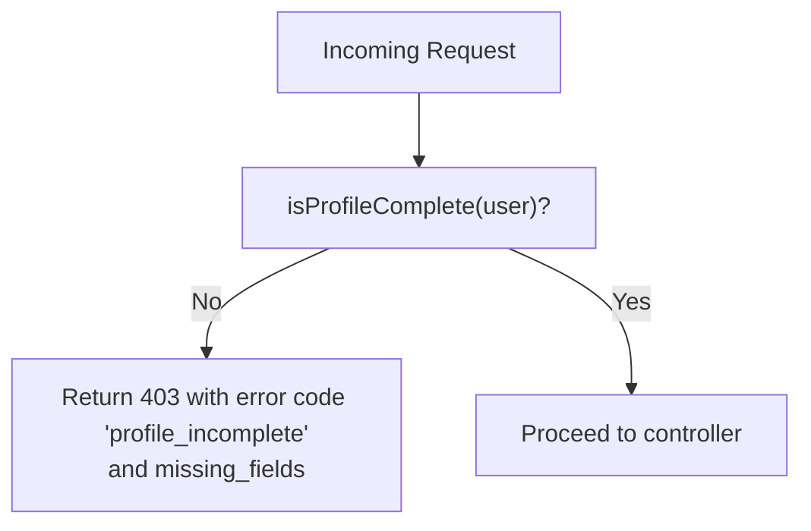
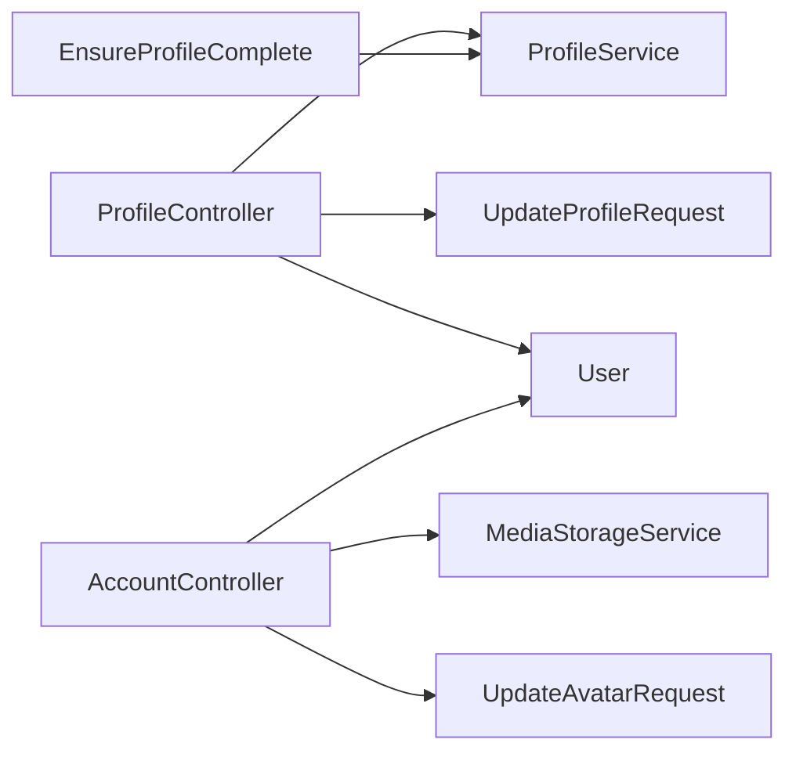

# Profile Management

<cite>
**Referenced Files in This Document**
- [ProfileService.php](file://app/Services/Profile/ProfileService.php)
- [ProfileController.php](file://app/Http/Controllers/Api/V1/ProfileController.php)
- [UpdateProfileRequest.php](file://app/Http/Requests/Api/V1/UpdateProfileRequest.php)
- [UpdateAvatarRequest.php](file://app/Http/Requests/Api/V1/UpdateAvatarRequest.php)
- [EnsureProfileComplete.php](file://app/Http/Middleware/EnsureProfileComplete.php)
- [AccountController.php](file://app/Http/Controllers/Api/V1/AccountController.php)
- [MediaStorageService.php](file://app/Services/Storage/MediaStorageService.php)
- [User.php](file://app/Models/User.php)
- [api.php](file://routes/api.php)
- [ProfileControllerTest.php](file://tests/Feature/Profile/ProfileControllerTest.php)
- [ProfileServiceTest.php](file://tests/Unit/Services/Profile/ProfileServiceTest.php)
</cite>

## Table of Contents
1. [Introduction](#introduction)
2. [Project Structure](#project-structure)
3. [Core Components](#core-components)
4. [Architecture Overview](#architecture-overview)
5. [Detailed Component Analysis](#detailed-component-analysis)
6. [Dependency Analysis](#dependency-analysis)
7. [Performance Considerations](#performance-considerations)
8. [Troubleshooting Guide](#troubleshooting-guide)
9. [Conclusion](#conclusion)
10. [Appendices](#appendices)

## Introduction
This document explains the user profile management functionality, focusing on profile creation and updates, avatar upload, and progressive profile completion tracking. It details the service layer logic, validation rules, data transformation, and how profile completion gates access to course applications. It also covers privacy considerations, security for file uploads, and integration points with storage and API responses.

## Project Structure
The profile feature spans controllers, request validators, a dedicated service, middleware, model fields, routes, and tests:
- Service: centralizes required fields and completion calculations
- Controller: exposes status and update endpoints
- Requests: validate profile and avatar inputs
- Middleware: enforces complete profiles on protected routes
- Model: defines fillable profile fields and casts
- Routes: register authenticated endpoints and aliases
- Tests: verify behavior across unit and feature layers

**Diagram sources**
- [api.php:84-92](file://routes/api.php#L84-L92)
- [ProfileController.php:21-71](file://app/Http/Controllers/Api/V1/ProfileController.php#L21-L71)
- [AccountController.php:61-92](file://app/Http/Controllers/Api/V1/AccountController.php#L61-L92)
- [ProfileService.php:16-175](file://app/Services/Profile/ProfileService.php#L16-L175)
- [EnsureProfileComplete.php:21-57](file://app/Http/Middleware/EnsureProfileComplete.php#L21-L57)
- [UpdateProfileRequest.php:9-37](file://app/Http/Requests/Api/V1/UpdateProfileRequest.php#L9-L37)
- [UpdateAvatarRequest.php:9-22](file://app/Http/Requests/Api/V1/UpdateAvatarRequest.php#L9-L22)
- [MediaStorageService.php:24-85](file://app/Services/Storage/MediaStorageService.php#L24-L85)
- [User.php:24-55](file://app/Models/User.php#L24-L55)

**Section sources**
- [api.php:84-92](file://routes/api.php#L84-L92)
- [ProfileController.php:21-71](file://app/Http/Controllers/Api/V1/ProfileController.php#L21-L71)
- [AccountController.php:61-92](file://app/Http/Controllers/Api/V1/AccountController.php#L61-L92)
- [ProfileService.php:16-175](file://app/Services/Profile/ProfileService.php#L16-L175)
- [EnsureProfileComplete.php:21-57](file://app/Http/Middleware/EnsureProfileComplete.php#L21-L57)
- [UpdateProfileRequest.php:9-37](file://app/Http/Requests/Api/V1/UpdateProfileRequest.php#L9-L37)
- [UpdateAvatarRequest.php:9-22](file://app/Http/Requests/Api/V1/UpdateAvatarRequest.php#L9-L22)
- [MediaStorageService.php:24-85](file://app/Services/Storage/MediaStorageService.php#L24-L85)
- [User.php:24-55](file://app/Models/User.php#L24-L55)

## Core Components
- ProfileService: single source of truth for required fields, completion percentage, missing/completed fields, and completeness checks.
- ProfileController: provides GET /profile/status and PUT /profile; recomputes display name from first/last when provided.
- UpdateProfileRequest: validates optional and required profile fields, including phone format, qualification enum, URLs, and text lengths.
- UpdateAvatarRequest: validates image type and size for avatar uploads.
- EnsureProfileComplete: blocks requests to protected routes if profile is incomplete, returning structured error with missing fields.
- AccountController: handles avatar upload and profile updates via existing account endpoints; integrates with MediaStorageService.
- MediaStorageService: centralizes cloud storage operations (store, delete, URL resolution) using role-based prefixes.
- User model: declares fillable profile fields and casts for enums and timestamps.

**Section sources**
- [ProfileService.php:16-175](file://app/Services/Profile/ProfileService.php#L16-L175)
- [ProfileController.php:21-71](file://app/Http/Controllers/Api/V1/ProfileController.php#L21-L71)
- [UpdateProfileRequest.php:9-37](file://app/Http/Requests/Api/V1/UpdateProfileRequest.php#L9-L37)
- [UpdateAvatarRequest.php:9-22](file://app/Http/Requests/Api/V1/UpdateAvatarRequest.php#L9-L22)
- [EnsureProfileComplete.php:21-57](file://app/Http/Middleware/EnsureProfileComplete.php#L21-L57)
- [AccountController.php:61-92](file://app/Http/Controllers/Api/V1/AccountController.php#L61-L92)
- [MediaStorageService.php:24-85](file://app/Services/Storage/MediaStorageService.php#L24-L85)
- [User.php:24-55](file://app/Models/User.php#L24-L55)

## Architecture Overview
The system enforces progressive profile completion through a service-driven approach:
- Clients query profile status and update fields via authenticated endpoints.
- Completion logic is centralized in ProfileService and reused by controllers and middleware.
- Protected actions (e.g., course applications) are guarded by EnsureProfileComplete middleware.
- Avatar uploads go through AccountController and MediaStorageService, updating the user’s avatar_url.

**Diagram sources**
- [api.php:84-92](file://routes/api.php#L84-L92)
- [ProfileController.php:21-71](file://app/Http/Controllers/Api/V1/ProfileController.php#L21-L71)
- [EnsureProfileComplete.php:21-57](file://app/Http/Middleware/EnsureProfileComplete.php#L21-L57)
- [ProfileService.php:16-175](file://app/Services/Profile/ProfileService.php#L16-L175)
- [User.php:24-55](file://app/Models/User.php#L24-L55)

## Detailed Component Analysis

### ProfileService: Completion Logic
- Required fields: name, email, phone, country, city, highest_qualification.
- Computes completion percentage based on non-null/non-empty values for required fields only.
- Provides missing/completed field lists and a boolean completeness check.
- Treats empty or whitespace-only strings as incomplete.

**Diagram sources**
- [ProfileService.php:16-175](file://app/Services/Profile/ProfileService.php#L16-L175)

**Section sources**
- [ProfileService.php:16-175](file://app/Services/Profile/ProfileService.php#L16-L175)
- [ProfileServiceTest.php:46-153](file://tests/Unit/Services/Profile/ProfileServiceTest.php#L46-L153)

### ProfileController: Status and Updates
- GET /api/v1/profile/status returns detailed profile status via ProfileService.
- PUT /api/v1/profile validates input via UpdateProfileRequest, recomputes display name from first/last, persists changes, and returns UserResource.

**Diagram sources**
- [ProfileController.php:21-71](file://app/Http/Controllers/Api/V1/ProfileController.php#L21-L71)
- [UpdateProfileRequest.php:9-37](file://app/Http/Requests/Api/V1/UpdateProfileRequest.php#L9-L37)
- [User.php:24-55](file://app/Models/User.php#L24-L55)

**Section sources**
- [ProfileController.php:21-71](file://app/Http/Controllers/Api/V1/ProfileController.php#L21-L71)
- [ProfileControllerTest.php:46-84](file://tests/Feature/Profile/ProfileControllerTest.php#L46-L84)

### Validation Rules: UpdateProfileRequest
- Phone: numeric-like characters, spaces, hyphens, plus; length constraints enforced.
- Country/City: filled when present; max length limits.
- Highest qualification: restricted to predefined values.
- Optional fields: bio, occupation, postal_code, tax_id, LinkedIn URL, portfolio website with URL validation and length limits.

**Section sources**
- [UpdateProfileRequest.php:9-37](file://app/Http/Requests/Api/V1/UpdateProfileRequest.php#L9-L37)
- [ProfileControllerTest.php:86-163](file://tests/Feature/Profile/ProfileControllerTest.php#L86-L163)

### Avatar Upload: AccountController and Storage
- POST /api/v1/account/avatar (alias) and POST /api/v1/me/avatar both call AccountController::updateAvatar.
- Validates image types and size via UpdateAvatarRequest.
- Deletes previous avatar (if owned), stores new file under role-based prefix, updates users.avatar_url, and returns UserResource.
- MediaStorageService abstracts storage disk operations and URL generation, safely handling external URLs.

**Diagram sources**
- [api.php:84-86](file://routes/api.php#L84-L86)
- [AccountController.php:61-72](file://app/Http/Controllers/Api/V1/AccountController.php#L61-L72)
- [UpdateAvatarRequest.php:9-22](file://app/Http/Requests/Api/V1/UpdateAvatarRequest.php#L9-L22)
- [MediaStorageService.php:24-85](file://app/Services/Storage/MediaStorageService.php#L24-L85)
- [User.php:24-55](file://app/Models/User.php#L24-L55)

**Section sources**
- [AccountController.php:61-72](file://app/Http/Controllers/Api/V1/AccountController.php#L61-L72)
- [MediaStorageService.php:24-85](file://app/Services/Storage/MediaStorageService.php#L24-L85)
- [UpdateAvatarRequest.php:9-22](file://app/Http/Requests/Api/V1/UpdateAvatarRequest.php#L9-L22)

### Middleware: EnsureProfileComplete
- Applied to routes that require a fully completed profile (e.g., course applications).
- If incomplete, returns HTTP 403 with structured error including missing fields list.
- Uses ProfileService to determine completeness.

**Diagram sources**
- [EnsureProfileComplete.php:21-57](file://app/Http/Middleware/EnsureProfileComplete.php#L21-L57)
- [ProfileService.php:16-175](file://app/Services/Profile/ProfileService.php#L16-L175)

**Section sources**
- [EnsureProfileComplete.php:21-57](file://app/Http/Middleware/EnsureProfileComplete.php#L21-L57)

### Data Model: User Fields and Casts
- Fillable fields include name, first_name, last_name, email, phone, avatar_url, bio, country, city, highest_qualification, occupation, linkedin_profile, portfolio_website, postal_code, tax_id, status.
- Enums and datetime casts ensure consistent data handling.

**Section sources**
- [User.php:24-55](file://app/Models/User.php#L24-L55)

## Dependency Analysis
- Controllers depend on request validators for input sanitization.
- ProfileController depends on ProfileService for business logic.
- EnsureProfileComplete depends on ProfileService to enforce policy.
- AccountController depends on MediaStorageService for secure file operations.
- All components rely on the User model for persistence.

**Diagram sources**
- [ProfileController.php:21-71](file://app/Http/Controllers/Api/V1/ProfileController.php#L21-L71)
- [EnsureProfileComplete.php:21-57](file://app/Http/Middleware/EnsureProfileComplete.php#L21-L57)
- [AccountController.php:61-92](file://app/Http/Controllers/Api/V1/AccountController.php#L61-L92)
- [UpdateProfileRequest.php:9-37](file://app/Http/Requests/Api/V1/UpdateProfileRequest.php#L9-L37)
- [UpdateAvatarRequest.php:9-22](file://app/Http/Requests/Api/V1/UpdateAvatarRequest.php#L9-L22)
- [MediaStorageService.php:24-85](file://app/Services/Storage/MediaStorageService.php#L24-L85)
- [User.php:24-55](file://app/Models/User.php#L24-L55)

**Section sources**
- [ProfileController.php:21-71](file://app/Http/Controllers/Api/V1/ProfileController.php#L21-L71)
- [EnsureProfileComplete.php:21-57](file://app/Http/Middleware/EnsureProfileComplete.php#L21-L57)
- [AccountController.php:61-92](file://app/Http/Controllers/Api/V1/AccountController.php#L61-L92)
- [UpdateProfileRequest.php:9-37](file://app/Http/Requests/Api/V1/UpdateProfileRequest.php#L9-L37)
- [UpdateAvatarRequest.php:9-22](file://app/Http/Requests/Api/V1/UpdateAvatarRequest.php#L9-L22)
- [MediaStorageService.php:24-85](file://app/Services/Storage/MediaStorageService.php#L24-L85)
- [User.php:24-55](file://app/Models/User.php#L24-L55)

## Performance Considerations
- ProfileService performs O(n) checks over a small fixed set of required fields; negligible overhead.
- Avatar upload uses cloud storage via MediaStorageService; ensure appropriate timeouts and retries at the storage layer.
- Avoid repeated recomputation by caching profile status in the frontend until next update.

## Troubleshooting Guide
- 401 Unauthorized: Ensure Sanctum authentication token is present for profile endpoints.
- 403 Forbidden with profile_incomplete: Complete all required fields; use GET /profile/status to identify missing fields.
- 422 Validation errors: Check phone format, qualification enum, URL formats, and field lengths per UpdateProfileRequest rules.
- Avatar upload failures: Verify file type (JPEG/PNG/GIF/WEBP) and size (max 5MB); confirm storage configuration and permissions.

**Section sources**
- [ProfileControllerTest.php:41-44](file://tests/Feature/Profile/ProfileControllerTest.php#L41-L44)
- [ProfileControllerTest.php:86-163](file://tests/Feature/Profile/ProfileControllerTest.php#L86-L163)
- [EnsureProfileComplete.php:42-57](file://app/Http/Middleware/EnsureProfileComplete.php#L42-L57)
- [UpdateAvatarRequest.php:9-22](file://app/Http/Requests/Api/V1/UpdateAvatarRequest.php#L9-L22)

## Conclusion
The profile management system centralizes completion logic, enforces it consistently via middleware, and provides robust APIs for status and updates. Avatar uploads are secured and isolated by role-based storage paths. The design supports progressive onboarding while protecting sensitive features behind profile completion requirements.

## Appendices

### API Endpoints Summary
- GET /api/v1/profile/status: Returns completion percentage, missing fields, and completed fields.
- PUT /api/v1/profile: Updates profile fields; recomputes display name; returns UserResource.
- POST /api/v1/account/avatar: Uploads avatar; validates type/size; updates avatar_url; returns UserResource.
- POST /api/v1/me/avatar: Alias endpoint for avatar upload.

**Section sources**
- [api.php:84-92](file://routes/api.php#L84-L92)
- [ProfileController.php:21-71](file://app/Http/Controllers/Api/V1/ProfileController.php#L21-L71)
- [AccountController.php:61-72](file://app/Http/Controllers/Api/V1/AccountController.php#L61-L72)