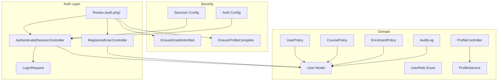
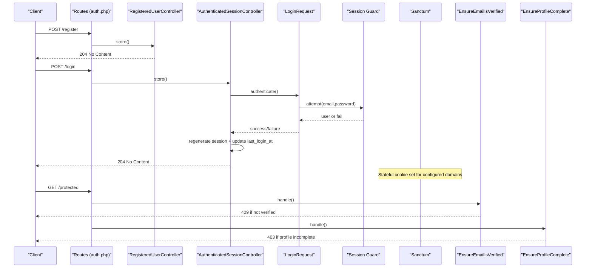
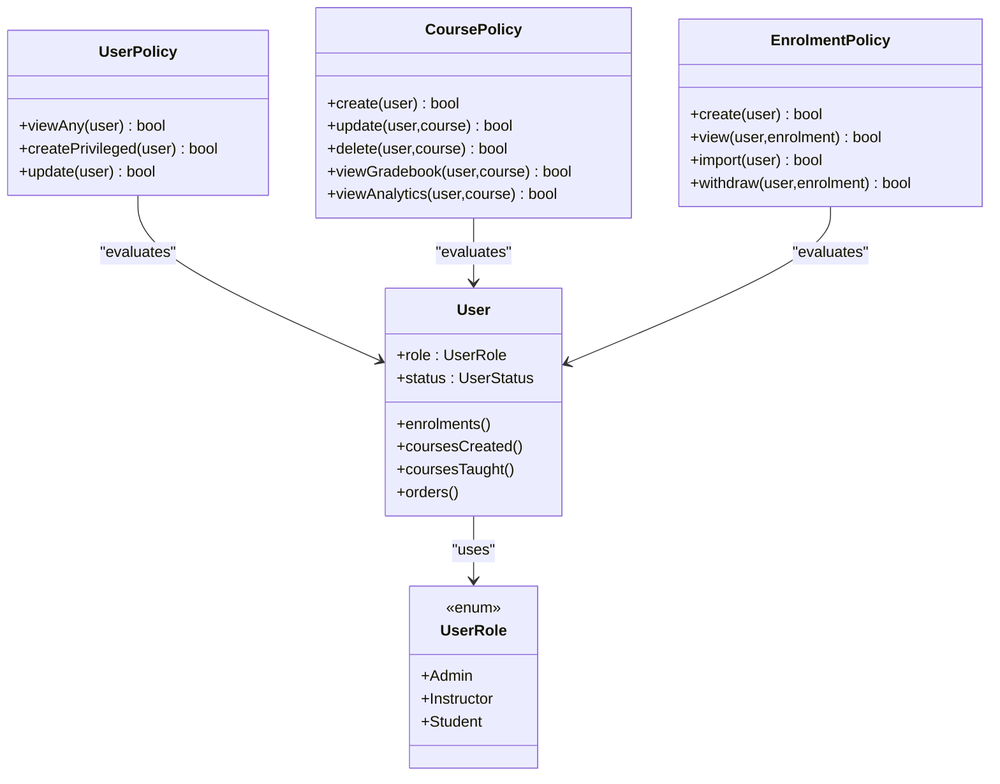
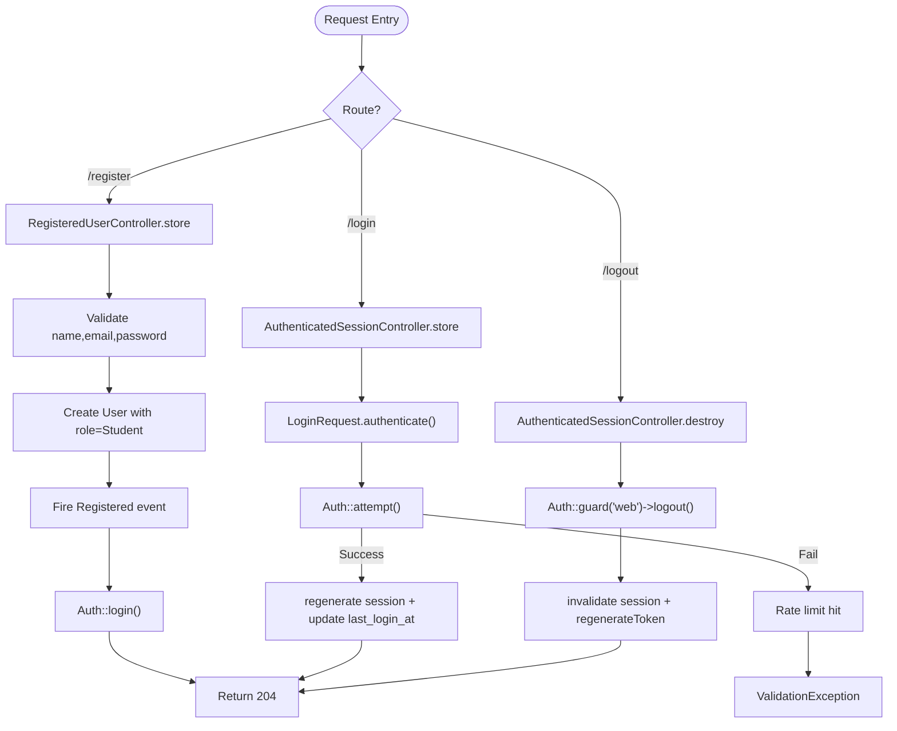
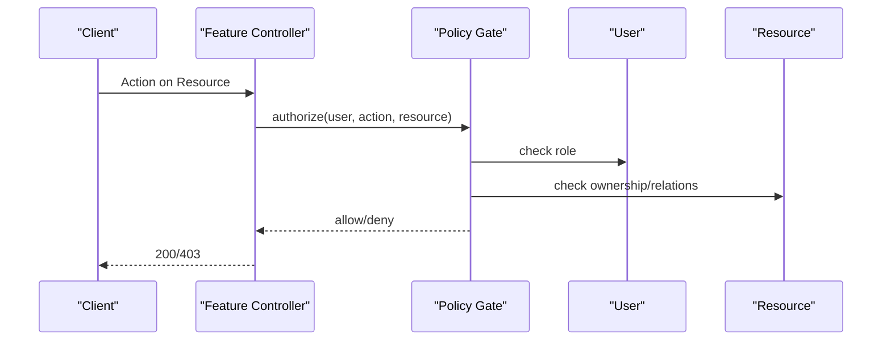
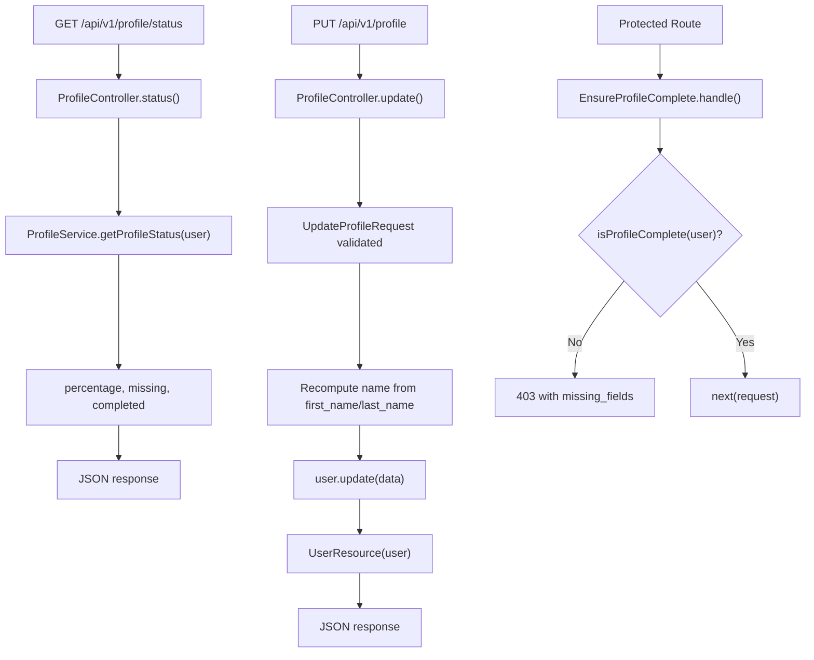
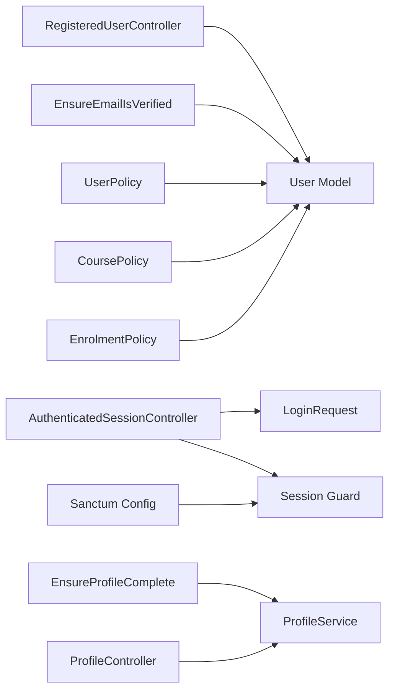

# User Management & Authentication

<cite>
**Referenced Files in This Document**
- [User.php](file://app/Models/User.php)
- [UserRole.php](file://app/Enums/UserRole.php)
- [RegisteredUserController.php](file://app/Http/Controllers/Auth/RegisteredUserController.php)
- [AuthenticatedSessionController.php](file://app/Http/Controllers/Auth/AuthenticatedSessionController.php)
- [LoginRequest.php](file://app/Http/Requests/Auth/LoginRequest.php)
- [auth.php](file://routes/auth.php)
- [sanctum.php](file://config/sanctum.php)
- [auth.php](file://config/auth.php)
- [EnsureEmailIsVerified.php](file://app/Http/Middleware/EnsureEmailIsVerified.php)
- [EnsureProfileComplete.php](file://app/Http/Middleware/EnsureProfileComplete.php)
- [ProfileController.php](file://app/Http/Controllers/Api/V1/ProfileController.php)
- [ProfileService.php](file://app/Services/Profile/ProfileService.php)
- [UserPolicy.php](file://app/Policies/UserPolicy.php)
- [CoursePolicy.php](file://app/Policies/CoursePolicy.php)
- [EnrolmentPolicy.php](file://app/Policies/EnrolmentPolicy.php)
- [AuditLog.php](file://app/Models/AuditLog.php)
</cite>

## Table of Contents
1. [Introduction](#introduction)
2. [Project Structure](#project-structure)
3. [Core Components](#core-components)
4. [Architecture Overview](#architecture-overview)
5. [Detailed Component Analysis](#detailed-component-analysis)
6. [Dependency Analysis](#dependency-analysis)
7. [Performance Considerations](#performance-considerations)
8. [Troubleshooting Guide](#troubleshooting-guide)
9. [Conclusion](#conclusion)

## Introduction
This document explains the User Management and Authentication sub-feature, focusing on roles and permissions, authentication flows with Laravel Sanctum, policy-based authorization, profile management, and integration points with course access control, enrollment validation, and audit logging. It provides concrete references to the codebase for middleware usage, policy enforcement, and registration/login flows.

## Project Structure
The feature spans models, enums, controllers, requests, middleware, policies, services, routes, and configuration:
- Models and enums define users, roles, and audit logs.
- Controllers handle registration, login, logout, and profile updates.
- Requests encapsulate validation and rate limiting for login.
- Middleware enforces email verification and profile completion.
- Policies enforce role-based and resource-scoped authorization.
- Services centralize profile completeness logic.
- Routes expose API endpoints for auth and profile operations.
- Configuration sets up guards, providers, and Sanctum behavior.

**Diagram sources**
- [auth.php:11-37](file://routes/auth.php#L11-L37)
- [RegisteredUserController.php:18-46](file://app/Http/Controllers/Auth/RegisteredUserController.php#L18-L46)
- [AuthenticatedSessionController.php:13-41](file://app/Http/Controllers/Auth/AuthenticatedSessionController.php#L13-L41)
- [LoginRequest.php:15-88](file://app/Http/Requests/Auth/LoginRequest.php#L15-L88)
- [EnsureEmailIsVerified.php:12-27](file://app/Http/Middleware/EnsureEmailIsVerified.php#L12-L27)
- [EnsureProfileComplete.php:21-57](file://app/Http/Middleware/EnsureProfileComplete.php#L21-L57)
- [sanctum.php:8-85](file://config/sanctum.php#L8-L85)
- [auth.php:18-74](file://config/auth.php#L18-L74)
- [ProfileController.php:21-70](file://app/Http/Controllers/Api/V1/ProfileController.php#L21-L70)
- [ProfileService.php:16-176](file://app/Services/Profile/ProfileService.php#L16-L176)
- [UserPolicy.php:10-29](file://app/Policies/UserPolicy.php#L10-L29)
- [CoursePolicy.php:11-49](file://app/Policies/CoursePolicy.php#L11-L49)
- [EnrolmentPolicy.php:11-43](file://app/Policies/EnrolmentPolicy.php#L11-L43)
- [AuditLog.php:12-37](file://app/Models/AuditLog.php#L12-L37)

**Section sources**
- [auth.php:11-37](file://routes/auth.php#L11-L37)
- [sanctum.php:8-85](file://config/sanctum.php#L8-L85)
- [auth.php:18-74](file://config/auth.php#L18-L74)

## Core Components
- User model with Sanctum tokens, custom password attribute, and relationships to enrolments, courses, and orders.
- UserRole enum defining Admin, Instructor, Student.
- Registration controller that creates students only and triggers email verification.
- Login/logout controllers using session guard with rate-limited login request.
- Email verification and profile completion middleware protecting sensitive routes.
- Profile controller and service for progressive profile completion.
- Policies enforcing role-based and resource-scoped authorization across users, courses, and enrolments.
- Audit log model for tracking actor-driven actions.

**Section sources**
- [User.php:19-99](file://app/Models/User.php#L19-L99)
- [UserRole.php:7-12](file://app/Enums/UserRole.php#L7-L12)
- [RegisteredUserController.php:18-46](file://app/Http/Controllers/Auth/RegisteredUserController.php#L18-L46)
- [AuthenticatedSessionController.php:13-41](file://app/Http/Controllers/Auth/AuthenticatedSessionController.php#L13-L41)
- [LoginRequest.php:15-88](file://app/Http/Requests/Auth/LoginRequest.php#L15-L88)
- [EnsureEmailIsVerified.php:12-27](file://app/Http/Middleware/EnsureEmailIsVerified.php#L12-L27)
- [EnsureProfileComplete.php:21-57](file://app/Http/Middleware/EnsureProfileComplete.php#L21-L57)
- [ProfileController.php:21-70](file://app/Http/Controllers/Api/V1/ProfileController.php#L21-L70)
- [ProfileService.php:16-176](file://app/Services/Profile/ProfileService.php#L16-L176)
- [UserPolicy.php:10-29](file://app/Policies/UserPolicy.php#L10-L29)
- [CoursePolicy.php:11-49](file://app/Policies/CoursePolicy.php#L11-L49)
- [EnrolmentPolicy.php:11-43](file://app/Policies/EnrolmentPolicy.php#L11-L43)
- [AuditLog.php:12-37](file://app/Models/AuditLog.php#L12-L37)

## Architecture Overview
Authentication uses Laravel’s session guard with Sanctum stateful cookies for SPA integration. Registration is student-only; privileged roles are invite-provisioned by admins. Login includes rate limiting and last-login tracking. Email verification and profile completion are enforced via middleware. Authorization is policy-driven per role and resource ownership.

**Diagram sources**
- [auth.php:11-37](file://routes/auth.php#L11-L37)
- [RegisteredUserController.php:18-46](file://app/Http/Controllers/Auth/RegisteredUserController.php#L18-L46)
- [AuthenticatedSessionController.php:13-41](file://app/Http/Controllers/Auth/AuthenticatedSessionController.php#L13-L41)
- [LoginRequest.php:15-88](file://app/Http/Requests/Auth/LoginRequest.php#L15-L88)
- [sanctum.php:21-26](file://config/sanctum.php#L21-L26)
- [EnsureEmailIsVerified.php:12-27](file://app/Http/Middleware/EnsureEmailIsVerified.php#L12-L27)
- [EnsureProfileComplete.php:21-57](file://app/Http/Middleware/EnsureProfileComplete.php#L21-L57)

## Detailed Component Analysis

### Roles and Permissions
- Roles: Admin, Instructor, Student defined in an enum and cast on the User model.
- Privileged roles (Instructor/Admin) are invite-provisioned; self-registration yields Student.
- Policies enforce:
  - User management: only Admin can list/create/update users.
  - Course management: Admins have full control; Instructors can manage courses they teach.
  - Enrolment: Students can create own enrolments; Admins can import/withdraw; view scoped to owner or Admin.

**Diagram sources**
- [User.php:24-55](file://app/Models/User.php#L24-L55)
- [UserRole.php:7-12](file://app/Enums/UserRole.php#L7-L12)
- [UserPolicy.php:10-29](file://app/Policies/UserPolicy.php#L10-L29)
- [CoursePolicy.php:11-49](file://app/Policies/CoursePolicy.php#L11-L49)
- [EnrolmentPolicy.php:11-43](file://app/Policies/EnrolmentPolicy.php#L11-L43)

**Section sources**
- [UserRole.php:7-12](file://app/Enums/UserRole.php#L7-L12)
- [User.php:24-55](file://app/Models/User.php#L24-L55)
- [UserPolicy.php:10-29](file://app/Policies/UserPolicy.php#L10-L29)
- [CoursePolicy.php:11-49](file://app/Policies/CoursePolicy.php#L11-L49)
- [EnrolmentPolicy.php:11-43](file://app/Policies/EnrolmentPolicy.php#L11-L43)

### Authentication Flows (Registration, Login, Logout)
- Registration: Validates input, creates a Student, fires Registered event, logs in via session, returns no content.
- Login: Validates and rate-limits credentials, attempts authentication, regenerates session, updates last login timestamp.
- Logout: Logs out web guard, invalidates session, regenerates CSRF token.
- Sanctum: Uses session guard with stateful domains configured for SPA cookie support.

**Diagram sources**
- [auth.php:11-37](file://routes/auth.php#L11-L37)
- [RegisteredUserController.php:18-46](file://app/Http/Controllers/Auth/RegisteredUserController.php#L18-L46)
- [AuthenticatedSessionController.php:13-41](file://app/Http/Controllers/Auth/AuthenticatedSessionController.php#L13-L41)
- [LoginRequest.php:15-88](file://app/Http/Requests/Auth/LoginRequest.php#L15-L88)
- [sanctum.php:21-26](file://config/sanctum.php#L21-L26)

**Section sources**
- [RegisteredUserController.php:18-46](file://app/Http/Controllers/Auth/RegisteredUserController.php#L18-L46)
- [AuthenticatedSessionController.php:13-41](file://app/Http/Controllers/Auth/AuthenticatedSessionController.php#L13-L41)
- [LoginRequest.php:15-88](file://app/Http/Requests/Auth/LoginRequest.php#L15-L88)
- [sanctum.php:21-26](file://config/sanctum.php#L21-L26)

### Authorization Policies
- UserPolicy: restricts listing, creating privileged users, and updating users to Admin.
- CoursePolicy: Admins have broad access; Instructors limited to courses they teach; delete restricted to Admin.
- EnrolmentPolicy: Students can create own enrolments; viewing scoped to owner or Admin; import restricted to Admin; withdrawal allowed for owner or Admin.

**Diagram sources**
- [UserPolicy.php:10-29](file://app/Policies/UserPolicy.php#L10-L29)
- [CoursePolicy.php:11-49](file://app/Policies/CoursePolicy.php#L11-L49)
- [EnrolmentPolicy.php:11-43](file://app/Policies/EnrolmentPolicy.php#L11-L43)

**Section sources**
- [UserPolicy.php:10-29](file://app/Policies/UserPolicy.php#L10-L29)
- [CoursePolicy.php:11-49](file://app/Policies/CoursePolicy.php#L11-L49)
- [EnrolmentPolicy.php:11-43](file://app/Policies/EnrolmentPolicy.php#L11-L43)

### Profile Management
- ProfileController exposes status and update endpoints for the authenticated user.
- ProfileService defines required fields, calculates completion percentage, identifies missing/completed fields, and checks overall completeness.
- EnsureProfileComplete middleware blocks requests when profile is incomplete, returning detailed missing fields.

**Diagram sources**
- [ProfileController.php:21-70](file://app/Http/Controllers/Api/V1/ProfileController.php#L21-L70)
- [ProfileService.php:16-176](file://app/Services/Profile/ProfileService.php#L16-L176)
- [EnsureProfileComplete.php:21-57](file://app/Http/Middleware/EnsureProfileComplete.php#L21-L57)

**Section sources**
- [ProfileController.php:21-70](file://app/Http/Controllers/Api/V1/ProfileController.php#L21-L70)
- [ProfileService.php:16-176](file://app/Services/Profile/ProfileService.php#L16-L176)
- [EnsureProfileComplete.php:21-57](file://app/Http/Middleware/EnsureProfileComplete.php#L21-L57)

### Integration with Course Access Control and Enrollment Validation
- Course access is gated by CoursePolicy: instructors can act only on courses they teach; admins have broader privileges.
- Enrollment validation is enforced by EnrolmentPolicy: students can enroll themselves; admins can bulk import and withdraw; viewing is scoped to owners or admins.
- These policies integrate with controllers to ensure only authorized actions proceed.

**Section sources**
- [CoursePolicy.php:11-49](file://app/Policies/CoursePolicy.php#L11-L49)
- [EnrolmentPolicy.php:11-43](file://app/Policies/EnrolmentPolicy.php#L11-L43)

### Audit Logging
- AuditLog model records actor-driven actions with entity type, id, and metadata.
- While specific logging calls are not shown here, the model supports associating actions to users for compliance and traceability.

**Section sources**
- [AuditLog.php:12-37](file://app/Models/AuditLog.php#L12-L37)

## Dependency Analysis
- Controllers depend on Request classes for validation and on Services for business logic.
- Middleware depends on Services for profile completeness checks.
- Policies depend on User role and resource relationships to decide access.
- Sanctum relies on session guard configuration and stateful domain settings.

**Diagram sources**
- [RegisteredUserController.php:18-46](file://app/Http/Controllers/Auth/RegisteredUserController.php#L18-L46)
- [AuthenticatedSessionController.php:13-41](file://app/Http/Controllers/Auth/AuthenticatedSessionController.php#L13-L41)
- [LoginRequest.php:15-88](file://app/Http/Requests/Auth/LoginRequest.php#L15-L88)
- [EnsureEmailIsVerified.php:12-27](file://app/Http/Middleware/EnsureEmailIsVerified.php#L12-L27)
- [EnsureProfileComplete.php:21-57](file://app/Http/Middleware/EnsureProfileComplete.php#L21-L57)
- [ProfileController.php:21-70](file://app/Http/Controllers/Api/V1/ProfileController.php#L21-L70)
- [ProfileService.php:16-176](file://app/Services/Profile/ProfileService.php#L16-L176)
- [UserPolicy.php:10-29](file://app/Policies/UserPolicy.php#L10-L29)
- [CoursePolicy.php:11-49](file://app/Policies/CoursePolicy.php#L11-L49)
- [EnrolmentPolicy.php:11-43](file://app/Policies/EnrolmentPolicy.php#L11-L43)
- [sanctum.php:21-26](file://config/sanctum.php#L21-L26)

**Section sources**
- [sanctum.php:21-26](file://config/sanctum.php#L21-L26)
- [auth.php:18-74](file://config/auth.php#L18-L74)

## Performance Considerations
- Rate limiting on login prevents brute-force attacks and protects backend resources.
- Profile completeness checks are lightweight computations over a small set of fields.
- Using session-based auth with Sanctum avoids excessive token creation overhead for SPA flows.
- Avoid heavy queries in middleware; keep checks minimal and cached where appropriate.

[No sources needed since this section provides general guidance]

## Troubleshooting Guide
- Email not verified: EnsureEmailIsVerified returns 409 with a message; verify email flow and resend notification endpoint.
- Profile incomplete: EnsureProfileComplete returns 403 with missing fields; guide users to complete required profile fields.
- Login failures: LoginRequest enforces rate limits and throws validation exceptions; check throttling and credentials.
- Unauthorized actions: Policies return 403 when roles or ownership do not match; review role assignments and resource relations.

**Section sources**
- [EnsureEmailIsVerified.php:12-27](file://app/Http/Middleware/EnsureEmailIsVerified.php#L12-L27)
- [EnsureProfileComplete.php:21-57](file://app/Http/Middleware/EnsureProfileComplete.php#L21-L57)
- [LoginRequest.php:15-88](file://app/Http/Requests/Auth/LoginRequest.php#L15-L88)
- [UserPolicy.php:10-29](file://app/Policies/UserPolicy.php#L10-L29)
- [CoursePolicy.php:11-49](file://app/Policies/CoursePolicy.php#L11-L49)
- [EnrolmentPolicy.php:11-43](file://app/Policies/EnrolmentPolicy.php#L11-L43)

## Conclusion
The system implements a robust, policy-driven authentication and authorization framework centered around Laravel Sanctum sessions. Roles are strictly enforced through policies, while middleware ensures email verification and profile completeness before accessing protected features. The design cleanly separates concerns across controllers, requests, services, and policies, enabling scalable and maintainable user management and secure access control.