# User Roles & Permissions

<cite>
**Referenced Files in This Document**
- [UserRole.php](file://app/Enums/UserRole.php)
- [User.php](file://app/Models/User.php)
- [schema.sql](file://agents/context/schema.sql)
- [api.php](file://routes/api.php)
- [UserController.php](file://app/Http/Controllers/Admin/UserController.php)
- [RegisteredUserController.php](file://app/Http/Controllers/Auth/RegisteredUserController.php)
- [AccountController.php](file://app/Http/Controllers/Api/V1/AccountController.php)
- [CoursePolicy.php](file://app/Policies/CoursePolicy.php)
- [EnrolmentPolicy.php](file://app/Policies/EnrolmentPolicy.php)
- [AssignmentPolicy.php](file://app/Policies/AssignmentPolicy.php)
- [ForumThreadPolicy.php](file://app/Policies/ForumThreadPolicy.php)
- [AnnouncementPolicy.php](file://app/Policies/AnnouncementPolicy.php)
- [ConversationService.php](file://app/Services/Communication/ConversationService.php)
- [ProtectedRoute.tsx](file://frontend/src/components/layout/ProtectedRoute.tsx)
- [AppShell.tsx](file://frontend/src/components/layout/AppShell.tsx)
- [App.tsx](file://frontend/src/App.tsx)
- [users api.ts](file://frontend/src/features/admin/users/api.ts)
</cite>

## Table of Contents
1. Introduction
2. Project Structure
3. Core Components
4. Architecture Overview
5. Detailed Component Analysis
6. Dependency Analysis
7. Performance Considerations
8. Troubleshooting Guide
9. Conclusion
10. Appendices

## Introduction
This document explains the LMS user role and permission system built around a three-tier hierarchy: student, instructor, and admin. It details how roles map to permissions, course access levels, and administrative privileges; how UI rendering and API endpoints enforce these rules; and how roles are assigned and changed over time. It also provides guidance for extending roles safely while maintaining security boundaries.

## Project Structure
The authorization model spans several layers:
- Data model: users store a single role enum value.
- Policies: fine-grained per-resource permissions (create/update/view/delete).
- Routes: public vs authenticated groups; admin-only routes.
- Controllers: enforce policies or business rules before acting.
- Frontend: route guards and dynamic navigation based on current user role.

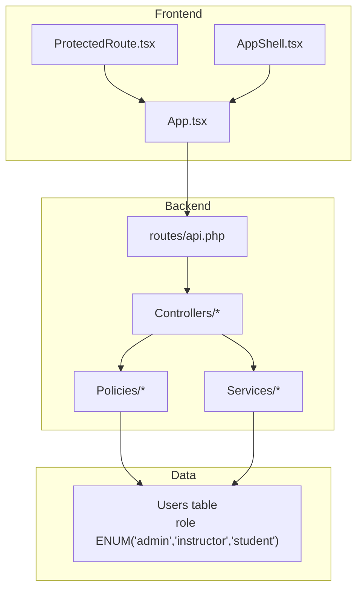

**Diagram sources**
- [ProtectedRoute.tsx:1-34](file://frontend/src/components/layout/ProtectedRoute.tsx#L1-L34)
- [AppShell.tsx:39-75](file://frontend/src/components/layout/AppShell.tsx#L39-L75)
- [App.tsx:87-190](file://frontend/src/App.tsx#L87-L190)
- [api.php:49-241](file://routes/api.php#L49-L241)
- [schema.sql:36-51](file://agents/context/schema.sql#L36-L51)

**Section sources**
- [UserRole.php:7-12](file://app/Enums/UserRole.php#L7-L12)
- [User.php:24-55](file://app/Models/User.php#L24-L55)
- [schema.sql:36-51](file://agents/context/schema.sql#L36-L51)
- [api.php:49-241](file://routes/api.php#L49-L241)

## Core Components
- Role model: A single enum defines the three roles. Users carry one role at a time.
- Policy layer: Each resource has a policy that checks the current user’s role plus contextual relationships (e.g., “taught by” or “enrolled”).
- Route scoping: Public read endpoints are separated from authenticated writes; admin-only endpoints are grouped under an authenticated block with controller-level authorizations.
- Frontend gating: Protected routes and dynamic navigation restrict UI exposure by role, while server-side policies remain the authoritative boundary.

Key responsibilities:
- Students: self-enroll, submit work, view enrolled content, communicate within courses.
- Instructors: manage their courses, assignments, evaluations, announcements, forums moderation, and grading.
- Admins: full system administration including user provisioning, reviews, payments, audit logs, and global settings.

**Section sources**
- [UserRole.php:7-12](file://app/Enums/UserRole.php#L7-L12)
- [CoursePolicy.php:13-48](file://app/Policies/CoursePolicy.php#L13-L48)
- [EnrolmentPolicy.php:13-42](file://app/Policies/EnrolmentPolicy.php#L13-L42)
- [AssignmentPolicy.php:15-42](file://app/Policies/AssignmentPolicy.php#L15-L42)
- [ForumThreadPolicy.php:19-49](file://app/Policies/ForumThreadPolicy.php#L19-L49)
- [AnnouncementPolicy.php:15-35](file://app/Policies/AnnouncementPolicy.php#L15-L35)
- [api.php:49-241](file://routes/api.php#L49-L241)

## Architecture Overview
Authorization is enforced at multiple layers:
- Frontend: UX convenience via route guards and menu visibility.
- Backend: Policies gate every write operation; controllers call authorize() or abort_if().
- Business logic: Services combine role checks with enrollment/ownership context.

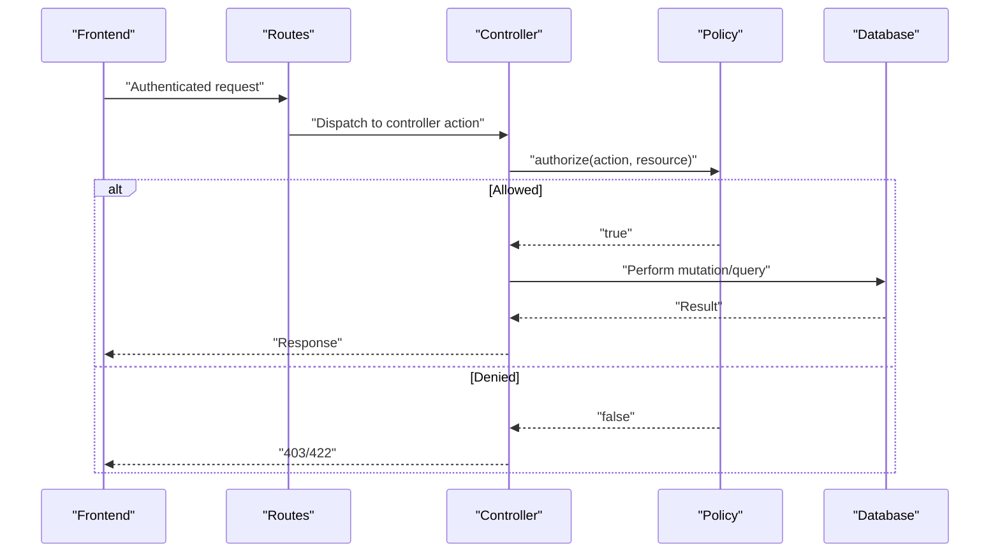

**Diagram sources**
- [api.php:49-241](file://routes/api.php#L49-L241)
- [UserController.php:32-43](file://app/Http/Controllers/Admin/UserController.php#L32-L43)
- [CoursePolicy.php:13-48](file://app/Policies/CoursePolicy.php#L13-L48)

## Detailed Component Analysis

### Role Model and User Entity
- The role is stored as an enum cast on the User model and persisted as an ENUM column in the database.
- Relationships include enrolments, courses created, and courses taught, enabling context-aware permissions.

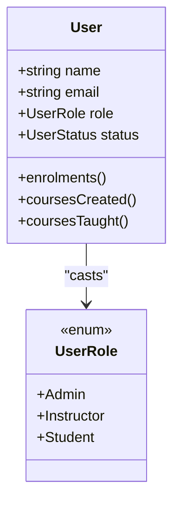

**Diagram sources**
- [User.php:24-55](file://app/Models/User.php#L24-L55)
- [UserRole.php:7-12](file://app/Enums/UserRole.php#L7-L12)
- [schema.sql:36-51](file://agents/context/schema.sql#L36-L51)

**Section sources**
- [User.php:24-55](file://app/Models/User.php#L24-L55)
- [UserRole.php:7-12](file://app/Enums/UserRole.php#L7-L12)
- [schema.sql:36-51](file://agents/context/schema.sql#L36-L51)

### Permission Policies by Domain

#### Course Management
- Create/Delete: Admin only.
- Update/Gradebook/Analytics: Admin or instructor who teaches the course.

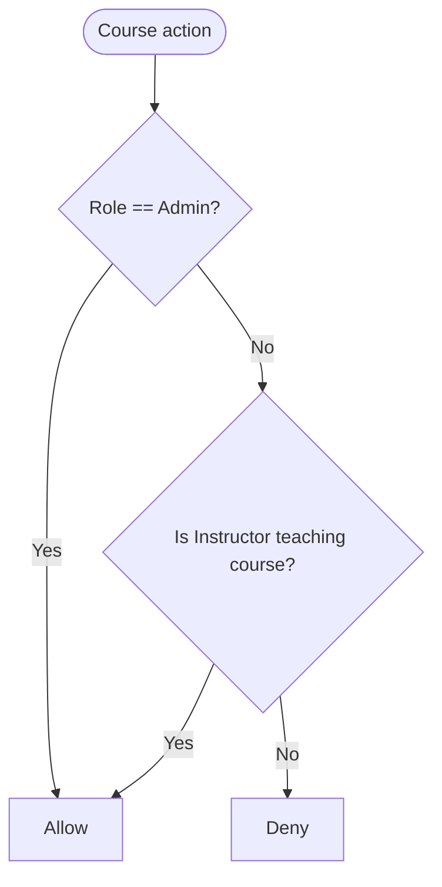

**Diagram sources**
- [CoursePolicy.php:13-48](file://app/Policies/CoursePolicy.php#L13-L48)

**Section sources**
- [CoursePolicy.php:13-48](file://app/Policies/CoursePolicy.php#L13-L48)

#### Enrolments
- Create: Student only.
- View: Admin or the enrolment owner.
- Import: Admin only.
- Withdraw: Admin or the enrolment owner.

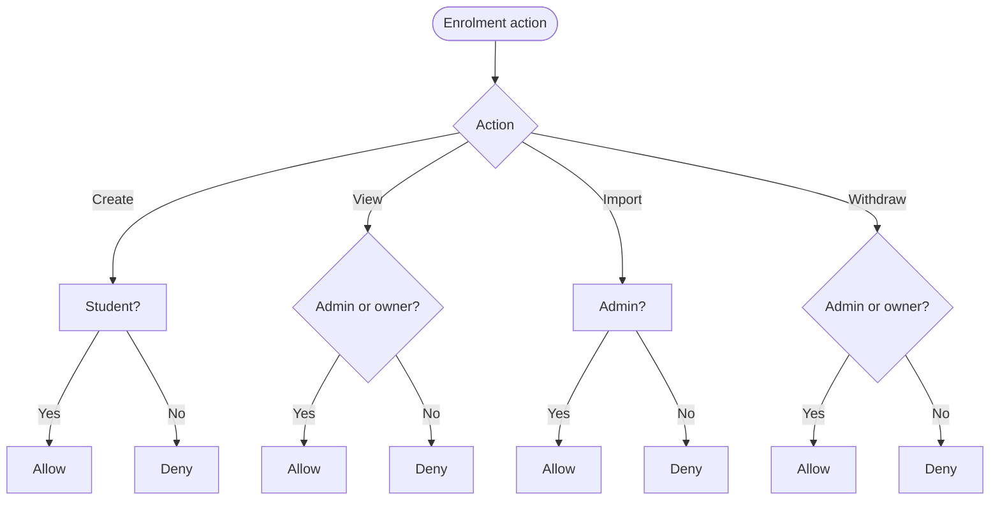

**Diagram sources**
- [EnrolmentPolicy.php:13-42](file://app/Policies/EnrolmentPolicy.php#L13-L42)

**Section sources**
- [EnrolmentPolicy.php:13-42](file://app/Policies/EnrolmentPolicy.php#L13-L42)

#### Assignments and Grading
- Manage assignment (create/update/delete) and grade submissions: Admin or instructor teaching the module’s course.

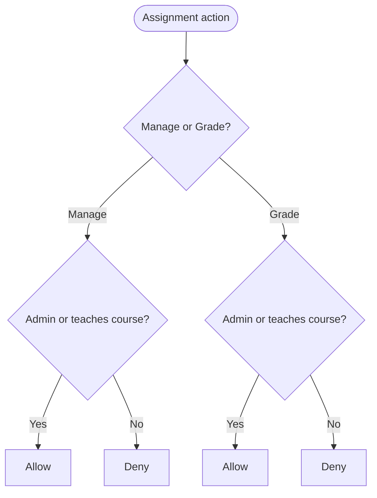

**Diagram sources**
- [AssignmentPolicy.php:15-42](file://app/Policies/AssignmentPolicy.php#L15-L42)

**Section sources**
- [AssignmentPolicy.php:15-42](file://app/Policies/AssignmentPolicy.php#L15-L42)

#### Forums and Announcements
- Forum access: Admin, instructors teaching the course, or confirmed-enrolled students.
- Moderation: Admin or course instructor.
- Announcements: Read by same audience; create/delete by admin or course instructor.

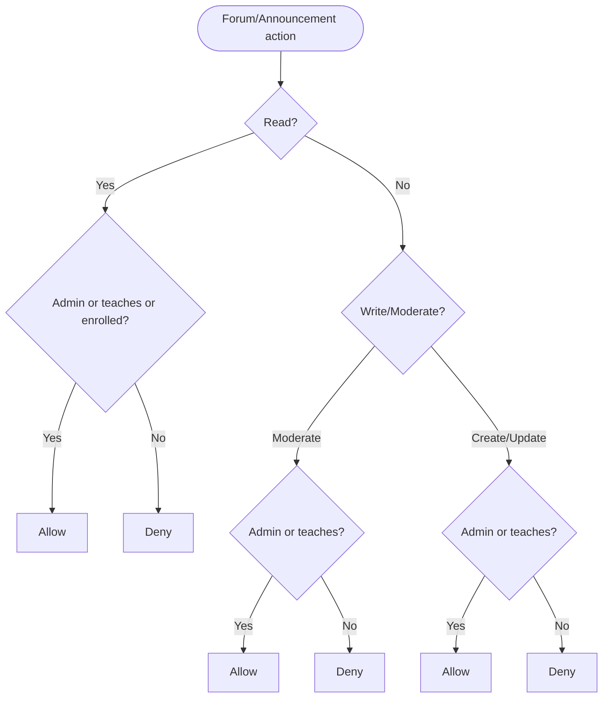

**Diagram sources**
- [ForumThreadPolicy.php:19-49](file://app/Policies/ForumThreadPolicy.php#L19-L49)
- [AnnouncementPolicy.php:15-35](file://app/Policies/AnnouncementPolicy.php#L15-L35)

**Section sources**
- [ForumThreadPolicy.php:19-49](file://app/Policies/ForumThreadPolicy.php#L19-L49)
- [AnnouncementPolicy.php:15-35](file://app/Policies/AnnouncementPolicy.php#L15-L35)

### Role Assignment Workflows

#### Self-registration (Students)
- New users register and are automatically assigned the student role.

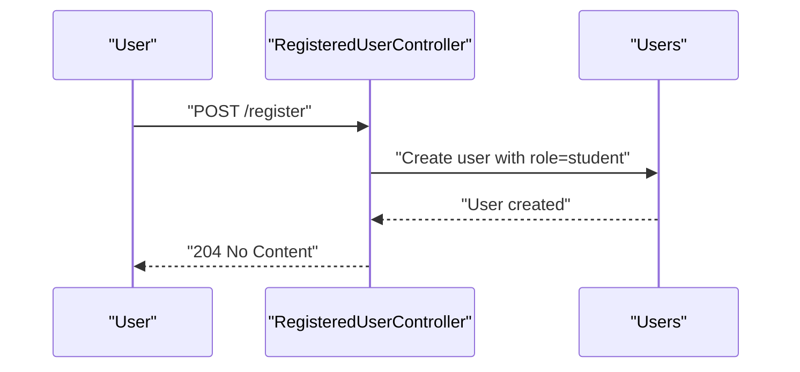

**Diagram sources**
- [RegisteredUserController.php:26-46](file://app/Http/Controllers/Auth/RegisteredUserController.php#L26-L46)

**Section sources**
- [RegisteredUserController.php:26-46](file://app/Http/Controllers/Auth/RegisteredUserController.php#L26-L46)

#### Invite Provisioning (Instructors/Admins)
- Only admins can provision privileged accounts; they receive an invite link to set a password. Role changes are audited and cannot be applied to oneself.

```mermaid
sequenceDiagram
participant A as "Admin"
participant AC as "Admin UserController"
participant DB as "Users"
A->>AC : "POST /admin/users {name,email,role}"
AC->>DB : "Create user with role=instructor|admin"
DB-->>AC : "User created"
AC-->>A : "201 Created"
Note over AC,DB : "Invite email sent; role/status changes audited"
```

**Diagram sources**
- [UserController.php:50-72](file://app/Http/Controllers/Admin/UserController.php#L50-L72)
- [UserController.php:79-106](file://app/Http/Controllers/Admin/UserController.php#L79-L106)

**Section sources**
- [UserController.php:50-72](file://app/Http/Controllers/Admin/UserController.php#L50-L72)
- [UserController.php:79-106](file://app/Http/Controllers/Admin/UserController.php#L79-L106)

### Dynamic Role Changes
- Admins update roles/status via a protected endpoint; attempts to change own role are blocked to prevent lockout. All changes are audited.

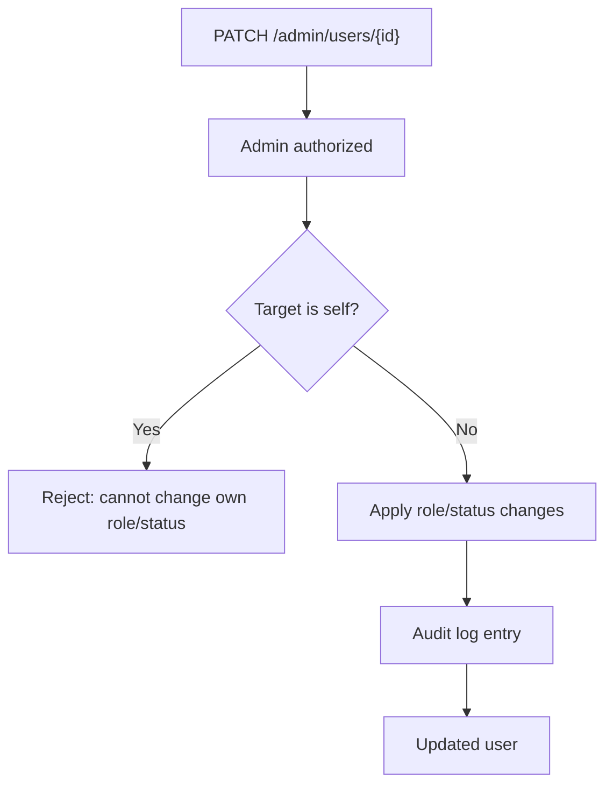

**Diagram sources**
- [UserController.php:79-106](file://app/Http/Controllers/Admin/UserController.php#L79-L106)

**Section sources**
- [UserController.php:79-106](file://app/Http/Controllers/Admin/UserController.php#L79-L106)

### Role-Based UI Rendering
- Navigation items differ by role: admin sees full admin suite; instructor sees course management and applications; student sees learning-focused navigation.
- Route guards protect pages by role; missing roles redirect to dashboard.

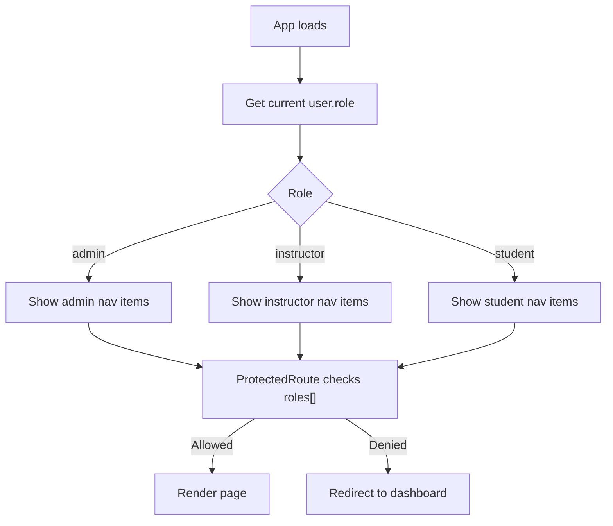

**Diagram sources**
- [AppShell.tsx:44-73](file://frontend/src/components/layout/AppShell.tsx#L44-L73)
- [ProtectedRoute.tsx:17-34](file://frontend/src/components/layout/ProtectedRoute.tsx#L17-L34)
- [App.tsx:87-190](file://frontend/src/App.tsx#L87-L190)

**Section sources**
- [AppShell.tsx:44-73](file://frontend/src/components/layout/AppShell.tsx#L44-L73)
- [ProtectedRoute.tsx:17-34](file://frontend/src/components/layout/ProtectedRoute.tsx#L17-L34)
- [App.tsx:87-190](file://frontend/src/App.tsx#L87-L190)

### API Endpoint Protection
- Public reads: catalogue, sections listing, certificate verification.
- Authenticated writes: require Sanctum auth; many actions gated by policies inside controllers.
- Admin-only endpoints: user directory, audit logs, order/payment controls.

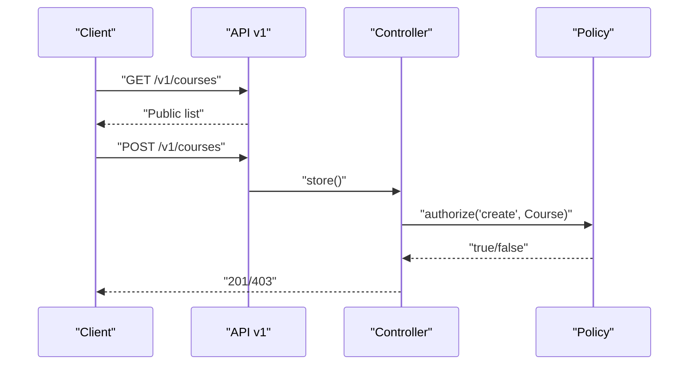

**Diagram sources**
- [api.php:49-241](file://routes/api.php#L49-L241)
- [CoursePolicy.php:13-25](file://app/Policies/CoursePolicy.php#L13-L25)

**Section sources**
- [api.php:49-241](file://routes/api.php#L49-L241)
- [CoursePolicy.php:13-25](file://app/Policies/CoursePolicy.php#L13-L25)

### Business Logic Enforcement Beyond Roles
- Messaging eligibility: conversation contactability considers admin/instructor relationships and student enrollments.
- Avatar storage paths vary by role but share the same field.

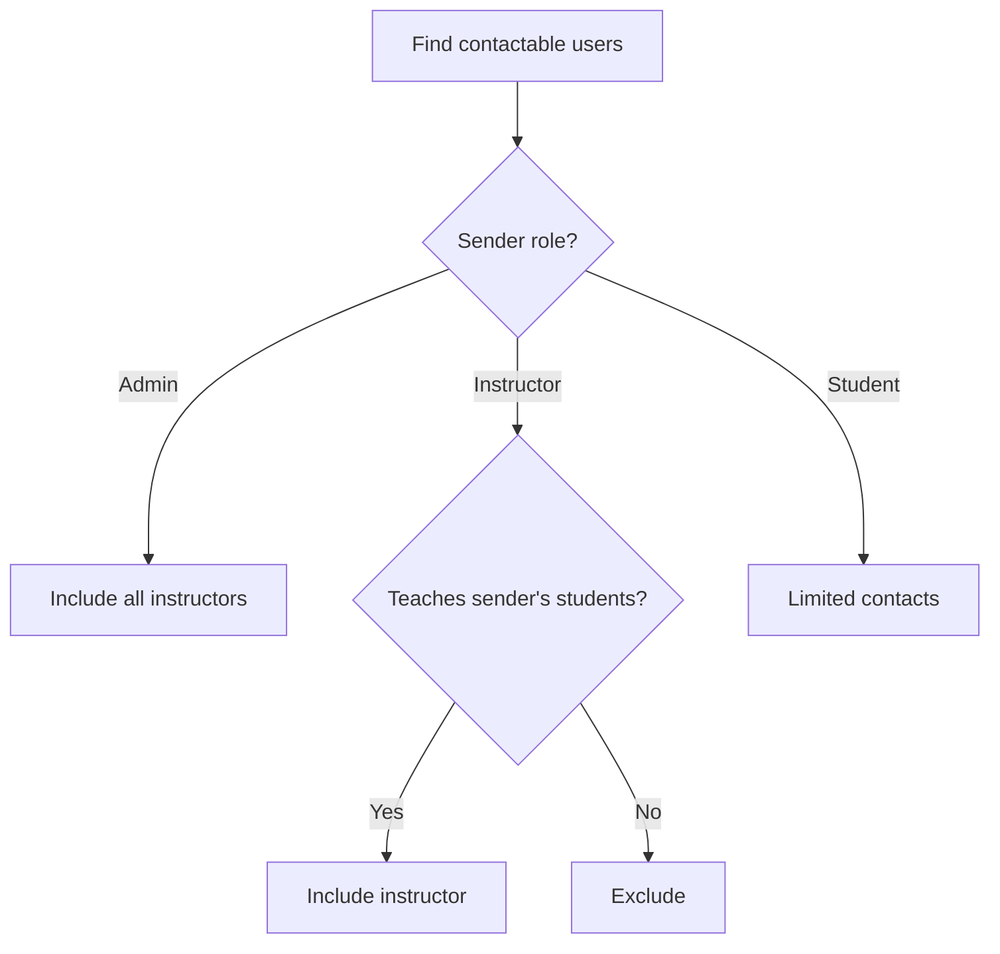

**Diagram sources**
- [ConversationService.php:144-163](file://app/Services/Communication/ConversationService.php#L144-L163)

**Section sources**
- [ConversationService.php:144-163](file://app/Services/Communication/ConversationService.php#L144-L163)
- [AccountController.php:33-64](file://app/Http/Controllers/Api/V1/AccountController.php#L33-L64)

## Dependency Analysis
- User role drives policy decisions across resources.
- Policies depend on relationships: enrolments for students, courses_taught for instructors.
- Routes group endpoints by scope; controllers delegate to policies; services add contextual checks.

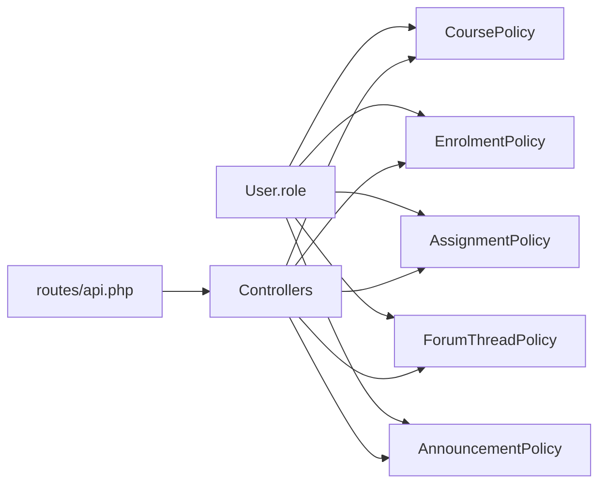

**Diagram sources**
- [UserRole.php:7-12](file://app/Enums/UserRole.php#L7-L12)
- [api.php:49-241](file://routes/api.php#L49-L241)
- [CoursePolicy.php:13-48](file://app/Policies/CoursePolicy.php#L13-L48)
- [EnrolmentPolicy.php:13-42](file://app/Policies/EnrolmentPolicy.php#L13-L42)
- [AssignmentPolicy.php:15-42](file://app/Policies/AssignmentPolicy.php#L15-L42)
- [ForumThreadPolicy.php:19-49](file://app/Policies/ForumThreadPolicy.php#L19-L49)
- [AnnouncementPolicy.php:15-35](file://app/Policies/AnnouncementPolicy.php#L15-L35)

**Section sources**
- [UserRole.php:7-12](file://app/Enums/UserRole.php#L7-L12)
- [api.php:49-241](file://routes/api.php#L49-L241)

## Performance Considerations
- Prefer policy checks early to fail fast on unauthorized requests.
- Use scoped queries in policies (e.g., check enrolments only for relevant courses).
- Cache frequent role-based lists (e.g., contactable users) when appropriate.
- Avoid N+1 queries in policy methods; eager-load relationships where needed.

[No sources needed since this section provides general guidance]

## Troubleshooting Guide
Common issues and resolutions:
- 403 Forbidden on writes: ensure the caller’s role and context satisfy the policy (e.g., instructor must teach the course).
- 422 when updating own role/status: admins cannot modify their own role/status to avoid lockout.
- Missing UI features: verify frontend ProtectedRoute roles array matches backend policy expectations.
- Unexpected messaging access: confirm enrollment status is confirmed and relationships are correct.

**Section sources**
- [UserController.php:79-82](file://app/Http/Controllers/Admin/UserController.php#L79-L82)
- [ProtectedRoute.tsx:17-34](file://frontend/src/components/layout/ProtectedRoute.tsx#L17-L34)
- [ConversationService.php:144-163](file://app/Services/Communication/ConversationService.php#L144-L163)

## Conclusion
The LMS enforces a clear three-tier role model with robust, context-aware permissions. Students interact with enrolled content; instructors manage their courses and assessments; admins oversee the platform. Security relies on server-side policies, with frontend guards improving UX. Role assignment is controlled and audited, and the design supports safe extension points for future customization.

[No sources needed since this section summarizes without analyzing specific files]

## Appendices

### Extending Roles Safely
- Add new roles to the UserRole enum and database schema consistently.
- Create or extend policies to define permissions for the new role.
- Update route guards and navigation to reflect new capabilities.
- Ensure admin workflows cover provisioning and auditing for the new role.
- Validate with tests to maintain security boundaries between roles.

[No sources needed since this section provides general guidance]

### Quick Reference: Role Capabilities
- Student
  - Self-register, enroll in courses, submit assignments, view enrolled content, participate in forums and tickets.
- Instructor
  - Manage own courses, modules, assignments, evaluations, announcements; moderate forums; grade submissions; view analytics for owned courses.
- Admin
  - Full system administration: user provisioning and updates, reviews, payments, audit logs, global settings; override paths for bulk operations.

**Section sources**
- [UserRole.php:7-12](file://app/Enums/UserRole.php#L7-L12)
- [CoursePolicy.php:13-48](file://app/Policies/CoursePolicy.php#L13-L48)
- [EnrolmentPolicy.php:13-42](file://app/Policies/EnrolmentPolicy.php#L13-L42)
- [AssignmentPolicy.php:15-42](file://app/Policies/AssignmentPolicy.php#L15-L42)
- [ForumThreadPolicy.php:19-49](file://app/Policies/ForumThreadPolicy.php#L19-L49)
- [AnnouncementPolicy.php:15-35](file://app/Policies/AnnouncementPolicy.php#L15-L35)
- [api.php:49-241](file://routes/api.php#L49-L241)
- [UserController.php:50-106](file://app/Http/Controllers/Admin/UserController.php#L50-L106)
- [RegisteredUserController.php:26-46](file://app/Http/Controllers/Auth/RegisteredUserController.php#L26-L46)
- [AppShell.tsx:44-73](file://frontend/src/components/layout/AppShell.tsx#L44-L73)
- [ProtectedRoute.tsx:17-34](file://frontend/src/components/layout/ProtectedRoute.tsx#L17-L34)
- [App.tsx:87-190](file://frontend/src/App.tsx#L87-L190)
- [users api.ts:1-26](file://frontend/src/features/admin/users/api.ts#L1-L26)